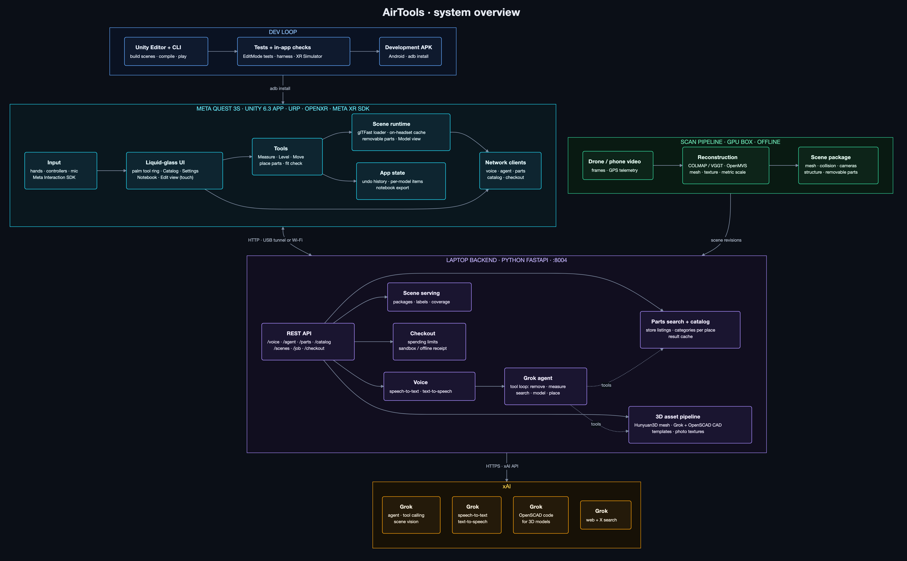
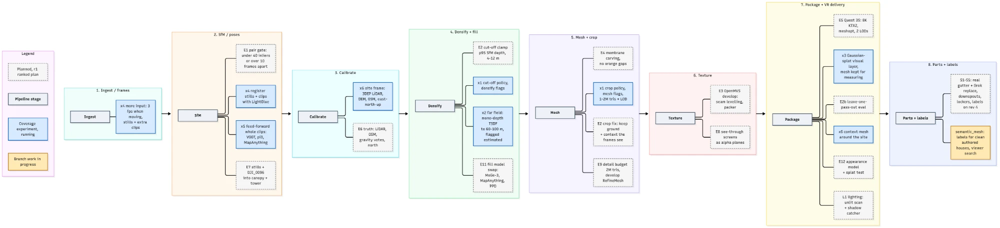

# AirTools

AirTools is a mixed-reality app for the Meta Quest 3S for measuring, fitting and buying parts inside 3D scans of real places. You scan a building or a room with a drone or a phone, then walk through it in the headset at true scale. There you can measure an opening and ask Grok for a part that fits. Grok searches real store listings, builds a 3D model of each candidate at its listed size, and places it in the scan, so you can check the fit before you buy.



## Features

- **Measuring in the scan.** Tape lengths, areas and levels on real surfaces, snapped to edges and corners, at metric scale.
- **Voice agent.** Say "replace the dishwasher with one that fits". Grok takes the old unit out, measures the gap, finds replacements that fit and puts the best one in place. It also handles simpler requests such as "show me gutters" or "undo".
- **Catalog.** Parts for what you are looking at: kitchen appliances in a kitchen, gutters and solar panels on a roof, wall units on a facade. Keyboard search updates the list as you type.
- **3D models on demand.** Every listing gets a model at its true size. Grok writes OpenSCAD code for the part and the product photo becomes its front texture. Parts that need it get an AI-generated mesh or a parametric template.
- **Edit view.** Turn, nudge and recolour a placed part with touch controls within arm's reach. Move changes only position. Every edit, including a delete, can be undone.
- **Model view.** Browse the scanned sites as tabletop models and step back into any of them at full size.
- **Checkout.** Compare sellers and pay with a hold-to-confirm gesture, within spending limits you set. Payments run in sandbox mode.

## Repository layout

| Path | Contents |
|---|---|
| `vr/` | Unity 6.3 project for Meta Quest 3S (URP, OpenXR, Meta XR SDK, glTFast) |
| `backend/server/` | FastAPI server: voice, the Grok agent, parts search, catalog, 3D asset pipeline, checkout |
| `backend/pipeline/` | Scan pipeline: drone video to a metric, textured scene package |
| `docs/` | Architecture diagram |

## Getting started

### Backend

Requires Python 3.13 and [uv](https://docs.astral.sh/uv/).

```bash
cd backend
uv sync
cp .env.example .env      # set GROK_API_KEY and any other keys you use
uv run uvicorn server.app:app --host 0.0.0.0 --port 8004
```

Scene packages are served from `SCENE_DIR` (default `./scene`), and cached results and part models from `DATA_DIR` (default `./data`). `backend/README.md` covers the API keys, provider roles, offline warm-up and tests.

### Headset app

1. Open `vr/` in Unity 6000.3.24f1 with the Android build target.
2. Rebuild the scene with **AirTools > Wire Main Scene**.
3. Build a Development APK and install it with `adb install -r <apk>`.
4. Connect the app to the backend:
   - **Over USB:** `adb reverse tcp:8004 tcp:8004`. The app finds the server on port 8004 by itself.
   - **On a shared Wi-Fi network:** launch it with the laptop's address:
     ```bash
     adb shell am start -n com.airtools.quest/com.unity3d.player.UnityPlayerGameActivity -e server http://<laptop-ip>:8004
     ```

In the Editor, Play mode runs with the Meta XR Simulator.

### Scan pipeline

Turns a drone video into a scene package: pycolmap or VGGT for camera poses, OpenMVS for dense reconstruction and texturing, then metric calibration and structure extraction. It runs on a GPU machine:

```bash
cd backend
uv sync --extra pipeline
uv run python -m pipeline.cli run flight.mp4 --site my-site --out scene/my-site
```

`pipeline.cli remote` uploads the video to a remote GPU box, runs the same command there, and copies each finished revision back.

#### Pipeline roadmap

The eight pipeline stages, from frame ingest to packaging for the Quest, and the work planned or under way at each. Solid grey boxes are the pipeline stages. Dashed boxes are planned improvements from the ranked plan. Blue boxes are coverage experiments that are running, and yellow boxes are work in progress on a branch.



## Tech stack

- **Headset:** Unity 6.3 LTS, Universal Render Pipeline, OpenXR, Meta XR SDK (Interaction SDK, MRUK), glTFast
- **Backend:** Python 3.13, FastAPI, uvicorn, uv
- **AI:** xAI Grok for the agent and tool calling, scene vision, speech, OpenSCAD code generation and web search
- **3D:** OpenSCAD (manifold backend), trimesh, manifold3d, pymeshlab, Open3D
- **Reconstruction:** COLMAP (pycolmap), VGGT, OpenMVS, MoGe-2, LIMAP, SAM 2.1
