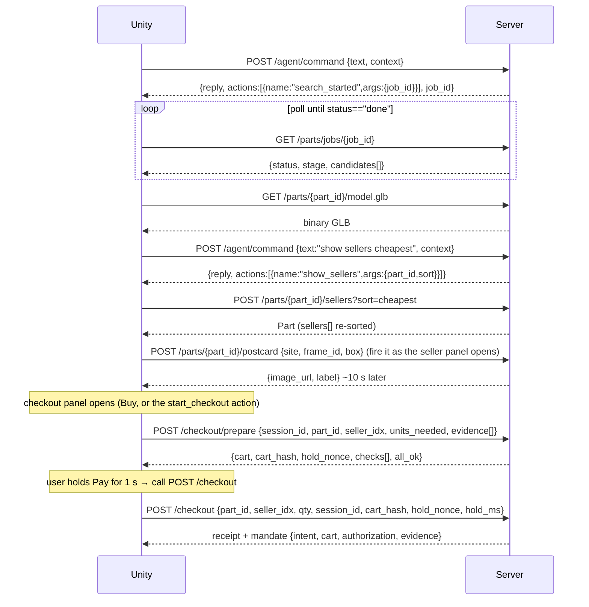
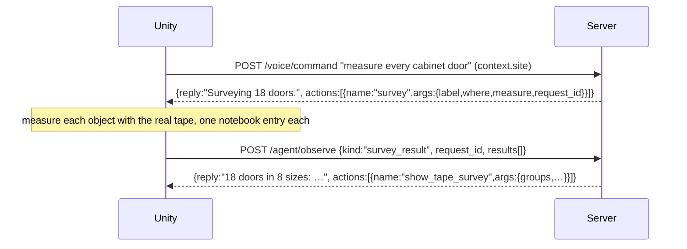
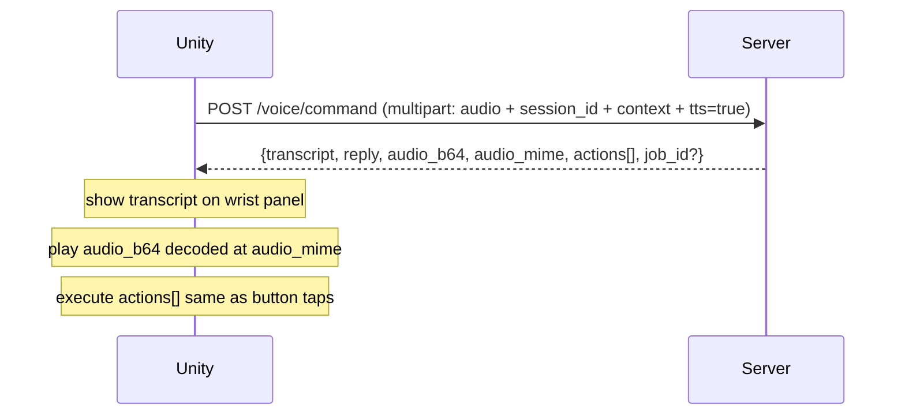
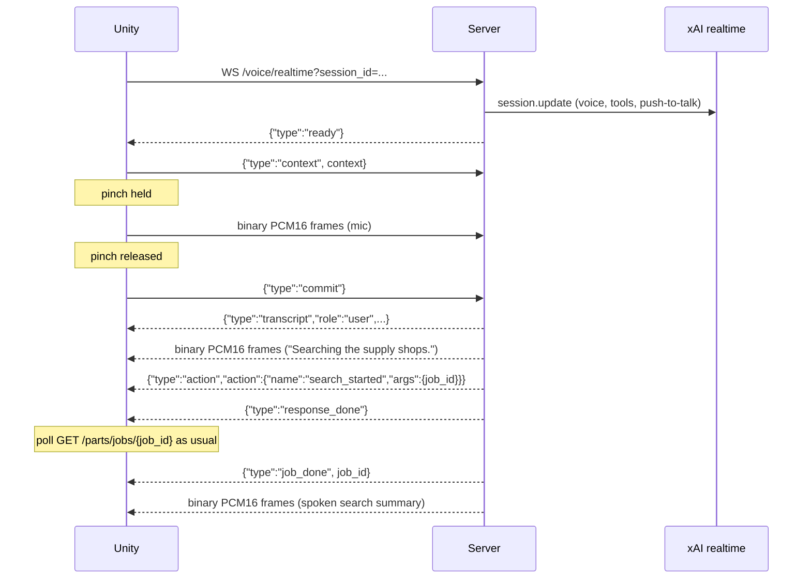

# AirTool Parts Server — HTTP API

Unity/Quest client reference (P2/P3, C#, UnityWebRequest + glTFast).

Route verification: `grep -n "@app\." server/app.py` — every route listed in section 4 is present in that file (`/debug` and `/realtime` are browser test pages, not API).

---

## 1. Base URL and LAN Setup

```
http://<laptop-ip>:8000
```

Start the server:
```
uv run uvicorn server.app:app --host 0.0.0.0 --port 8000
```

No auth. The APK never holds a key; credentials live server-side in `.env`. Headset and laptop must share Wi-Fi. Browser test console (no headset): `http://<laptop-ip>:8000/debug`; realtime voice test page: `http://<laptop-ip>:8000/realtime` (see `WS /voice/realtime`).

---

## 2. Coordinate / Units Contract for model.glb

`dims_mm` fields are **millimetres**. The GLB is exported in **metres**, glTF native axes (+Y up):

| dim | axis | direction |
|-----|------|-----------|
| `w` (width) | X | left–right |
| `h` (height) | Y | up |
| `d` (depth) | Z | out of mounting face |

Origin at the **mounting-face centre**: X/Y plane at Z=0, part extends toward +Z (`Part.mount.face = "-z"`).

### Asset tiers

`asset.status`: `"pending"` → `"ready"` (or `"failed"`). Poll `GET /parts/{id}/part.json` until ready.

| `asset.tier` | Badge | Meaning |
|---|---|---|
| `"cad"` | CAD | Manufacturer GLB/GLTF/OBJ, scaled to exact dims |
| `"llm"` | Model — exact size | LLM-chosen parametric template built at exact dims, product photo on the face it shows (the default) |
| `"scad"` | Model — exact size | Grok-written OpenSCAD model (moulded parts, made offline), exact dims, product photo |
| `"ai_mesh"` | AI mesh — exact size, approximate look | Hunyuan3D-2.1 image-to-3D (moulded parts), scaled to exact dims, product photo |
| `"proxy"` | Proxy — exact size | Box at exact dims with the product photo on one face, or a plain coloured box without a photo |

`asset.scale_residual_pct` — max per-axis deviation (%) vs uniform scale; 0 for `llm` and proxy.

### Asset modes (asset-mode)

The headset can choose how the models are made (Settings ▸ 3D models) and compare the results per part.
`asset_mode` = `"hf"` | `"llm_scad"` | `"auto"` (anything else is `"auto"`), sent in the context of
`/agent/command` and `/voice/command` (the session remembers it: its searches and the replace job use it), in the
`POST /parts/search` body, and as `?mode=` on the part/model endpoints below.

| mode | tier order | `asset.made_by` |
|---|---|---|
| `"auto"` | today's order above (`cad` → `llm` / moulded: `scad` → `ai_mesh` → `proxy`) | as above |
| `"hf"` | `ai_mesh` (Hunyuan3D-2.1 image-to-3D, every part with a photo, photo-textured) → `llm` template → `proxy` | `"hf:tencent/Hunyuan3D-2.1"` |
| `"llm_scad"` | `scad` (Grok writes OpenSCAD, role `asset_scad`, rendered by the `openscad` binary, photo-textured) → `llm` template → `proxy` | `"xai:grok-4.7 + openscad"` (the model that wrote it, from its `scad.json`) |

- **Both variants per part.** Each mode's model is kept next to `model.glb`: `model.hf.glb`, `model.scad.glb`,
  `model.auto.glb` (+ `asset.<hf|scad|auto>.json`). `model.glb` and `part.json`'s `asset` are the mode asked for last
  (clients that don't send `?mode=`). `asset.mode` says which mode made it.
- **`asset.note`** says why the preferred tier didn't make it, e.g. `"OpenSCAD isn't installed on the server: the LLM
  template instead"`, `"Hunyuan's ZeroGPU quota is spent for now: the LLM template instead"`, `"Grok is still writing the
  OpenSCAD model: the LLM template instead"`, `"No product photo for image-to-3D: ..."`. Null when it did.
- **HF results are cached aggressively.** The raw Hunyuan mesh is kept by photo hash
  (`data/cache/hunyuan/<sha1>.glb`): one Space call per photo, ever. A part's `ai_mesh` model is never rebuilt. The HF
  warm queue makes Hunyuan models for every searched (and catalog) part ahead of need, one at a time, backing off on
  a ZeroGPU quota error (5 min doubling to 1 h); an `"hf"` request that got a stand-in (quota spent) jumps the queue
  and its model is replaced once the quota allows. `HF_WARM=false` turns the queue off; never OFFLINE (a cached Hunyuan
  mesh still serves offline). `python -m server.warm --hf` pre-generates for every cached part.
- **OpenSCAD** takes about a minute per part (Grok's generate / fix / fit loop; see "CAD models" below), so an
  `"llm_scad"` request without a cached `scad.glb` starts it in the background and serves the template (noted, with
  `asset.cad.status` `"writing"`) meanwhile; the next request after it lands gets the CAD model.

#### CAD models (cad)

- **`asset.cad`** (only on `"llm_scad"` answers: `part.json?mode=llm_scad`, `POST /parts/{id}/model`, also its top-level
  `cad`; header `X-Asset-Cad` on `model.glb?mode=llm_scad`): `{status, started_at, eta_s, made_by, seconds, cost_usd,
  reason}`. `"writing"`: a run (this server's, or `warm --scad` in another process) is on it; `started_at` (epoch s)
  and `eta_s` (seconds left by the writer's typical run, floored at 10) let the headset say "Grok is writing the CAD
  model… 1 min". `"ready"`: `scad.glb` exists (`seconds`, `cost_usd` of its run); the answer's tier is `"scad"` once
  the variant is rebuilt (seconds). `"failed"`: `reason` = "OpenSCAD isn't installed on the server", "No product photo
  …", "Offline …", or "Grok's OpenSCAD model didn't build: <the OpenSCAD error>". `"none"`: nothing started yet (the
  request itself starts it). Poll every 10-15 s while `"writing"`; swap when `asset.tier == "scad"`.
- **Stale stand-ins are remade.** An `llm_scad` template stored for a reason that has passed is rebuilt on the next
  request (the endpoints wait up to 15 s for it): OpenSCAD missing then and installed now, offline then, a run lost to a
  restart, a CAD model that landed since (made by `warm --scad`), a failure by another model or over an hour old.
- **Records next to `scad.glb`:** `scad.json` (model, effort, LLM calls, fixes, seconds, `cost_usd`, tokens, the raw
  bbox error before the snap to the envelope), `scad.failed.json` (the last failure and why), `scad.writing.json`
  (the run in progress; any process). At most 2 live runs at once (a search in `llm_scad` mode queues the rest).
- **Model and speed.** `LLM_ASSET_SCAD` (default `xai:grok-4.7`) and `ASSET_SCAD_EFFORT` (default `"low"`; `""` = the
  model's own). Measured on the dishwasher, a window frame and a cabinet knob (every run compiled; bbox 0 % after
  the snap): grok-4.7 at low effort 15-157 s (median 45 s over 57 parts), ~$0.03 a part, geometry close to grok-4.7 at
  its default effort (216-400 s, $0.10-0.20; medium 178-332 s); grok-4.20 non-reasoning 9-19 s, $0.005-0.015, but
  flatter shapes (a window as a slab, a knob mounted backwards); grok-4.20 reasoning 118-180 s, $0.03-0.05. `ASSET_SCAD_FIXES` (compile-fix
  rounds; 2 for a non-reasoning model, else 1) and `ASSET_SCAD_SAMPLES` (parallel first answers, default 1) tune the loop.
- **`ASSET_SCAD_PHOTO`** (default `true`): the product photo on the CAD model's front like every other tier. `false`
  serves Grok's geometry and paint only (the CAD model as written: a cleaner generator comparison; the photo over CAD
  relief can draw a window's bars twice). Applies to variants made after the change.
- **Pre-generation:** `python -m server.warm --scad [--sites kitchen] [--scad-match window] [--scad-jobs 3]
  [--scad-parts id,...] [--no-demo-parts] [--retry-failed] [--estimate]` makes the CAD model of every catalog item that
  has a model plus the demo's key parts (the kitchen dishwashers, the window frames, the gutter hangers), 3 at a time,
  and rebuilds each part's `llm_scad` variant. Resumable (made, failed and in-progress parts are skipped); rows in
  `<DATA_DIR>/scad_warm.json`; `--estimate` prints the plan, minutes and dollars only.

`GET /parts/{id}/part.json?mode=` — the part with that mode's model (`asset.status` `"pending"` while it's being made;
the request starts it). `GET /parts/{id}/model.glb?mode=` — that mode's GLB (built first when needed, as without a mode;
`504` after 90 s), with headers `X-Asset-Tier`, `X-Asset-Made-By`, `X-Asset-Mode`. `POST /parts/{id}/model?mode=`
(`?wait_s=` ≤ 60, or a JSON body `{mode, wait_s}`) → `{part_id, mode, status: "ready"|"pending", asset, model_url,
hf_queued, scad_pending}`. `GET /assets/hf-warm` → the warm queue: `queued`, `current`, `made`, `mismatch`, `failed`,
`quota_hits`, `backoff_s`, `resume_in_s`, `recent[]`, `last_ai_mesh`, `quota_messages[]`, `hf_keys_cooling_s`.
Photo-textured GLBs carry one extra JPEG-textured primitive named `photo`.

Who made it (additive, null from older servers): `asset.made_by` — the provider:model that answered the
template call (`"groq:qwen/qwen3.8-27b"`; `"xai:grok-4.20-0309-non-reasoning"` when Groq was rate-limited and
`llm.chat` re-sent the call to xAI, or when Groq's answer was poor and the Grok retry won), `asset.template` (the
`llm` template, e.g. `"window"`), `asset.retried` (the Grok retry made it) and `asset.seconds` (start to GLB). A poor
answer is none at all, or not the template a known shape needs (a "... Vinyl Window" as a flat panel or a box); the
retry runs on role `asset_retry` (`LLM_ASSET_RETRY`, default `xai:grok-4.20-0309-non-reasoning`, `""` = off). Likewise
a search candidate whose page text the `cheap` model read without finding a complete size gets one more try on
`extract_retry` (`LLM_EXTRACT_RETRY`, same default).

---

## 3. Flows

### Text command → candidates → GLB → sellers → checkout



### Agent survey (the agent uses the headset's tape)



### Voice command (push-to-talk)



`audio_mime`: `"audio/wav"` (Groq Orpheus) or `"audio/mpeg"` (Edge TTS fallback). Voice can never pay — `start_checkout` opens the panel only; the actual charge needs the physical hold gesture.

### Realtime voice (push-to-talk, streaming)

Lower-latency alternative to `/voice/command`: one websocket per headset session, speech in and
speech out, the server runs the tools. Full protocol: `WS /voice/realtime` in section 4.



If the socket closes or sends a fatal error, fall back to `POST /voice/command`.

---

## 4. Endpoints

### `GET /health`
```json
{"ok": true, "version": "0.1.0"}
```

---

### `POST /parts/search`

Start a background search; returns after a 0.5 s fast-path wait.

**Request (`SearchRequest`):**

| field | type | notes |
|---|---|---|
| `query` | string | required |
| `measurement` | Measurement | `{label, value_m, axis}` — tape reading |
| `frame_jpg_b64` | string | base64 JPEG hint for part ID |
| `max_candidates` | int | default 3 |
| `cavity` | Cavity | optional: a removed scene part's gap, `{w_m, h_m, d_m, component_id?, label?, estimated?, measured?: {w_m, h_m, d_m}}` in real metres (the parts file's `size_m` x the scale calibration; `measured` = the headset's tape, which wins). Every candidate's `fit` is then against all three axes (width across the opening, height, depth; the tightest clearance decides, `axis` names it) and fitting ones sort first |
| `asset_mode` | string | optional (asset-mode): `"hf"` / `"llm_scad"` / `"auto"` (default) — how the candidates' models are made (section 2, "Asset modes") |
| `opening` | Opening | optional: an opening the headset taped (a window's width and height tapes), `{w_m, h_m, d_m?, label?, kind?}` in real metres. The shops are searched with its size ("window frame 59 x 47 in"), the planner is told the product goes into it, and every candidate's `fit` is against its width and height (its depth only with `d_m`): more than 3 mm over is `too_big`, more than 51 mm (2 in.) under on an axis is `too_small` (made for a smaller opening), else `fits`; the ones that fit come first, least spare first |

`Measurement.axis`: `"w"/"d"/"h"/"length"` or null.

**Response:**
```json
{"job_id": "a3f9c2e10b4d", "status": "running", "stage": "searching the supply shops", "candidates": []}
```
`candidates` populated only on instant cache hit (`status == "done"`).

---

### `GET /parts/jobs/{job_id}`

Poll until `status` is `"done"` or `"failed"`.

```json
{
  "id": "a3f9c2e10b4d", "status": "done", "stage": "done",
  "query": "gutter hanger",
  "candidates": [/* Part objects */],
  "error": null,
  "summary": "Three gutter hangers. The first fits with 4 millimetres to spare."
}
```

`summary` — spoken quartermaster line, present only when done. Errors: `404` unknown job.

---

### `GET /catalog?site=<site>&session_id=<id>` — a catalog that fits the place

What kind of place the scan is, and product categories for it, each with up to 8 parts known
locally (server/catalog.py). No `site`: the generic catalog. `404`: unknown site.

```json
{"site": "kitchen", "environment": "kitchen", "title": "Kitchen",
 "place": "kitchenette with sink and cabinets", "confidence": 1.0, "also": null,
 "generated_at": "2026-09-27T02:10:41.5+00:00", "pending": 0, "grok": "cached", "took_ms": 2.1,
 "categories": [
   {"id": "dishwashers", "title": "Dishwashers", "icon": "washing-machine", "query": "dishwasher",
    "in_scene": true, "components": ["dw1"], "extra": false, "also": false, "pending": false,
    "items": [{"part_id": "frigidaire-fdpc4221as-341c87", "name": "24 in. Front Control ... Dishwasher",
               "brand": "Frigidaire", "category": "dishwashers", "price_usd": 329.0,
               "dims_mm": {"w": 609.6, "h": 889.0, "d": 635.0},
               "image_url": "/parts/frigidaire-fdpc4221as-341c87/image.jpg",
               "model_url": "/parts/frigidaire-fdpc4221as-341c87/model.glb",
               "model_ready": true, "seller": "Home Depot"}]}],
 "signals": [{"source": "parts", "env": "kitchen", "weight": 4.5,
              "why": "base cabinet, dishwasher, fridge, range"}]}
```

| field | notes |
|---|---|
| `environment` | `kitchen`, `bathroom`, `laundry`, `garage`, `interior` (living room, bedroom, office), `gym`, `hospital` (a room), `rooftop`, `facade`, `pavilion` (canopy, shelter, courtyard, park) or `generic`; `title` is its display name |
| `place`, `confidence` | Grok's few words for what it saw; the winner's share of all votes (0-1) |
| `also` | a runner-up environment scoring at least half the winner's (a drone scan of a building is `facade` and `rooftop`): its first 2 categories follow the list with `"also": true` |
| `categories[]` | display order: what the scene shows first (`in_scene`: a parts-file component, a label or Grok named it; `components` = the parts-file ids, e.g. `["dw1"]`), then the rest of the environment's list, then `also` categories, then up to 2 site-specific ones Grok proposed (`"extra": true`, `id` starts with `x-`) |
| `icon` | a Phosphor 2.1 icon name (the app's icon font); the code points are in `server/catalog_tables.py` `ICON_CODEPOINTS` |
| `query` | the category's search; send it to `POST /parts/search` for a live search |
| `pending` | this category's background search is still running: poll `/catalog` again (every ~5 s while the top-level `pending` count is non-zero) |
| `items[]` | best first (the category's own search first, ready models first); `image_url` is `/parts/{id}/image.jpg` once the photo is local, else the remote photo; `model_url` always works (`/parts/{id}/model.glb` builds a model on demand), `model_ready` = it is built already (show a "3D" badge); `dims_mm` in millimetres; `price_usd` / `seller` from the recommended seller |
| `signals` | why: `name`, `parts`, `objects`, `labels`, `structure`, `grok` votes with their weights |

How: the scene's parts-file components, structure objects and planes (a pitched or flat roof),
the pre-labelled anchors (`/scenes/{site}/labels`) and the site name vote; one Grok vision call
on 2 thumbnails (role `catalog`, `grok-4.20-0309-non-reasoning`, ~$0.002, ~1.2 s) names the place
and may add 2 categories. It is made once per site revision, stored in
`DATA_DIR/catalog/<site>.r<rev>.json`, and never asked again; the first request for a new site
waits up to 8 s for it. A category with fewer than 3 parts has its `query` searched in the
background (one at a time; lite: no per-candidate store lookups, `CATALOG_SEARCH_N` = 4
candidates), its first 3 parts get models and every listed part its photo. OFFLINE: cached parts
only, nothing searched or built. `python -m server.warm --catalog` does all of it before a demo.

### `GET /catalog/search?q=<text>&site=<site>&limit=20` — lazy search

Every part known locally (part.json files, cached search results, catalog items), from an
in-memory index: exact, prefix (the word being typed) and typo matches (edit distance 1-2) over
name, brand, model number, category words and the queries that found it; every word must match
(else the parts matching most words). The site's categories rank first. No LLM, no web: well
under 150 ms (a few ms). Enter should run the live `POST /parts/search`.

```json
{"q": "dish", "site": "kitchen", "items": [/* the /catalog item shape */],
 "categories": ["Dishwashers"], "category_ids": ["dishwashers"], "took_ms": 0.4}
```

`categories` / `category_ids`: categories whose title or keywords match the words typed, the
site's first (at most 5). `limit`: 1-50. An empty `q` returns no items.

---

### `GET /parts/{part_id}/part.json` → `application/json`
Full `Part` object. Key fields for rendering:

| field | type | notes |
|---|---|---|
| `id` | string | slug, e.g. `"gutter-hanger-hidden-k-style"` |
| `name` | string | display name |
| `dims_mm` | `{w,d,h}` | millimetres |
| `dims_source` | string | `"home_depot"/"page"/"llm"/"title"`; `"title"` = last resort, sizes printed in the listing title (e.g. "12 in. W x 8 in. D x 3 in. H", or the one side the LLM's published dims lacked). A window or door published with its width and height only gets its jamb depth, else the standard 3 1/4 in.: `"home_depot_typical_depth"` / `"title_typical_depth"` (Home Depot's "Rough Opening Width/Height" is the hole it goes in, never its size) |
| `asset.tier` / `asset.status` | string | see section 2 |
| `asset.scale_residual_pct` | float | |
| `asset.made_by` / `asset.template` / `asset.retried` / `asset.seconds` | string / string / bool / float | who made the model and how long it took (section 2); null from older servers |
| `asset.mode` / `asset.note` | string / string | asset-mode: which mode made this model, and why its preferred tier didn't (section 2, "Asset modes"); null from older servers |
| `fit.status` | string | `"fits"/"too_big"/"too_small"/"unknown"` |
| `fit.spare_mm` | float\|null | negative = too big |
| `fit.note` | string\|null | e.g. `"exact fit"`, `"fits a 23–36 in. window opening"` |
| `fit_range_mm` | `{min,max}`\|null | published install range (e.g. Home Depot window-opening width); drives `fit` when present |
| `image_url` | string\|null | remote product photo; show it while `image.jpg` is still `404` |
| `sellers[]` | Seller[] | see Seller fields below |
| `recommended_seller` | int\|null | index into `sellers[]` |
| `finishes[]` | `{name,hex,part_id}[]` | colour variants |
| `sellers_expanded` | bool | `true` once the one-shot seller expansion ran (see `/sellers`) |
| `cached` | bool | result from disk cache |

**Seller fields:** `name`, `price_usd`, `pack_qty`, `unit_price_usd`, `shipping_usd`, `total_usd`, `eta`, `eta_days`, `rating`, `reviews`, `in_stock`, `url`, `verified`.

Errors: `400` invalid part id, `404` not found.

### `GET /parts/{part_id}/model.glb` → `model/gltf-binary`
Binary GLB in metres. Load with glTFast. Check `asset.status == "ready"` before loading. `?mode=hf|llm_scad|auto`:
that mode's model (section 2, "Asset modes").

### `GET /parts/{part_id}/image.jpg` → `image/jpeg`
Product photo, written by the asset worker. `404` until then (or if the photo couldn't be fetched): fall back to `part.image_url`.

### `POST /parts/{part_id}/postcard` — "see it installed"

A photoreal picture of this exact product installed in the user's own space: one Grok Imagine
edit (`grok-imagine-image-2.0`, `POST /v1/images/edits`) of the site view, with the part's
seller photo as a second reference image and its name + published dims in the prompt. About
$0.08 and 9–17 s per call, so fire it when the seller panel opens and it is ready by the
hold-to-pay. Direct response (no job), like `/scene/ask`.

```json
{
  "site": "kitchen", "frame_id": "0241",
  "placement": "replacing the steel sink, undermounted",
  "box": [0.23, 0.58, 0.61, 0.73]
}
```

| field | notes |
|---|---|
| `site` + `frame_id` | a scene package frame (full `file` if shipped, else the thumb), as listed in `cameras.r<rev>.json` |
| `frame_jpg_b64` | or the headset's own JPEG (max ~4 MB); wins over `site`/`frame_id` |
| `placement` | optional words, e.g. "on the fascia, left of the downspout" (200 chars max) |
| `box` | optional but **strongly recommended**: the placed part's screen-space bounds in that frame, `[x0,y0,x1,y1]` normalized 0–1, top-left origin. It sets the scale. Without it, a part that fills a gap (a sink) came out ~1.3x too wide; a part that replaces a same-size object (a fridge) was fine |

**Response:**
```json
{
  "part_id": "karran-qu-670-bl-2d781c",
  "image_url": "/parts/karran-qu-670-bl-2d781c/postcard.jpg?v=1790412901175330649",
  "before_url": "/scenes/kitchen/thumbs/0241.jpg",
  "label": "AI preview, not to scale",
  "cost_usd": 0.08, "latency_s": 10.6, "cached": false
}
```

The output keeps the input frame's framing (at ~2x resolution), so it can sit on that camera's
quad. **Always show `label`.** `before_url` is `null` for an uploaded frame. An identical request
replays from the cache (`cost_usd: 0`), also when `OFFLINE`. The server keeps the latest
postcard per part, and `POST /checkout` puts its URL on the receipt.

Errors: `400` invalid part id, no site view, unknown site/frame, bad base64 or unreadable image,
bad `box`, part has no product photo. `404` unknown part. `413` body too large. `422` blocked by
xAI moderation. `429` xAI rate limit. `502` other xAI failure. `503` `OFFLINE` and not cached.

### `GET /parts/{part_id}/postcard.jpg` → `image/jpeg`
The part's latest postcard (1280×720 for a 16:9 frame). `404` until one is made.

### `POST /parts/{part_id}/finish`

Re-renders the part in another finish ("show it in matte black"). Grok Imagine edits the product
photo into the finish, and the server puts the edited photo back on the part's own geometry. So
the variant GLB keeps the exact size and origin of `model.glb` (section 2), and the client can swap
it in place. The agent's `set_finish` action calls this for you (section 5).

**Request:** `{"finish": "matte black"}`. 1–60 characters, with at least one letter or digit.

**Response:**
```json
{
  "part_id": "delta-75641-d491ed", "finish": "matte black", "source": "imagine",
  "model_url": "/parts/delta-75641-d491ed/model-matte-black.glb",
  "image_url": "/parts/delta-75641-d491ed/finish-matte-black.jpg",
  "label": "Not a listed finish", "cost_usd": 0.07, "reason": null,
  "spoken": "Here it is in matte black. That's not a listed finish, so check the seller has it."
}
```

| field | notes |
|---|---|
| `source` | `"imagine"`: a re-textured GLB is at `model_url`. `"tint"`: no GLB, so tint `model.glb` as before (`model_url`/`image_url` null) |
| `label` | `"Not a listed finish"` when neither `part.finish` nor `finishes[]` lists it (`"black"` matches `"Matte Black"`); else null. Show it under the spec card |
| `reason` | why it's `tint`: `"cad tier"`, `"offline, finish not cached"`, `"outline moved (...)"`, an HTTP error |
| `cost_usd` | what the first render of this finish cost; the same on every cached repeat, which costs nothing |
| `spoken` | the line the agent says |

**Which parts re-texture, by `asset.tier`:**
- `llm`: the cached template plan is rebuilt with the product-colour roles in the variant's colour,
  and the variant photo goes on the same face. This needs no LLM call once the part is resolved.
- `ai_mesh`: the Hunyuan mesh from `model.glb`, repainted, and the variant photo re-projected.
- `proxy` with a photo: a new decal box in the variant's colour.
- `cad`, `scad`, or no product photo: `tint`.

**Safety net:**
- If the edit moved the product outline, the variant is rejected and the result is `tint`. The
  check compares photo masks: every bbox side must be within 2 % of the image and IoU at least
  0.85. On live edits the shift was 0.1–1.4 %.
- A finish the seller doesn't list is labelled and said aloud.

**Cost and speed:** about $0.07 and 8–13 s for the first render of a finish, then $0 and about 1–4 s
to rebuild from the cache (instant once the GLB is on disk). It works `OFFLINE` from the cache; a
cache miss returns `tint`, never an error.

Errors: `400` invalid part id, `404` unknown part, `422` empty or over-long `finish`.

### `POST /parts/{part_id}/resize` — made to size

The part's model at another size (the headset's Size & finish panel: width / height / depth steps, "Fit to
opening"), built the way its tier built `model.glb`, same contract (section 2: metres, origin at the mount-face
centre, bbox = the new size):

- `llm`: the template plan `resolve_asset` cached is built again at the new size -- frame members, sashes and panes
  keep their proportions -- with the product photo on the same face. No LLM call (the plan is a cache hit). ~0.1 s.
- `proxy`: the photo decal box at the new size. `cad` / `scad` / `ai_mesh`: `model.glb` stretched per axis about its
  origin (`source: "scaled"`).
- With `finish`: `POST /finish` first (Imagine, cached); its variant photo and colours go on the rebuilt model. A
  tint-only finish comes back with `finish_source: "tint"`: the model is in the listing's colours, tint it.

**Request:** `{"w": 1487.3, "h": 1187.3, "d": 82.55, "finish": "Bronze"}` — millimetres; `finish` optional.

**Response:**
```json
{
  "part_id": "jeld-wen-thdjw138500117-c6201e", "dims_mm": {"w": 1487.3, "d": 82.55, "h": 1187.3},
  "listed_mm": {"w": 1511.3, "d": 82.55, "h": 1206.5}, "tier": "llm", "template": "window",
  "finish": "Bronze", "finish_source": "imagine", "source": "template", "reason": null,
  "model_url": "/parts/jeld-wen-thdjw138500117-c6201e/model-size-1487x1187x83-bronze.glb",
  "seconds": 8.06, "cached": false
}
```

Each size and finish is built once (`model-size-<w>x<h>x<d>[-<finish>].glb`, whole mm, served by the
`model-{slug}.glb` route below; a repeat returns `cached: true` at once).

Errors: `400` invalid part id, `404` unknown part, `409` its `model.glb` isn't ready yet, `422` a side under 10 mm or
outside 0.5–2x the listing (a window made to measure, not a different product).

### `GET /parts/{part_id}/model-{slug}.glb` and `/parts/{part_id}/finish-{slug}.jpg`
The variant GLB (same contract as `model.glb`) and the edited product photo, at the URLs `POST
/finish` returned. `slug` is the finish lowercased with `-` between words (`matte-black`). `404`
until rendered. `POST /resize`'s models are served here too (`size-1487x1187x83[-bronze]`).

---

### `GET /scenes`

Every site under the server's scene directory (`SCENE_DIR`, default `<repo>/scene`) that has a
`scene.json`, read fresh off disk on every call — lets the app discover what's live without
hard-coding site names.

```json
[
  {"site": "strasbourg-cathedral-spire", "revision": 2, "quality": "full", "updated_at": "2026-09-24T20:17:01+00:00"}
]
```

`revision`/`quality` come straight from that site's `scene.json` (plan §1a); a package written
before revisioned publishing existed (no `revision`/`quality` field) lists as `revision: 1`,
`quality: "full"`. `updated_at` is `scene.json`'s own last-write time (ISO 8601, UTC) — the
commit point for a publish (§1a), so it's also "when this revision went live".

### `GET /scenes/{site}/{file}` — scene package files, read-only

Serves `scene/<site>/<file>` (plan §1: `scene.json`, `mesh.r<rev>.glb`, `collision.r<rev>.glb`,
`cameras.r<rev>.json`, `structure.r<rev>.json`, `parts.r<rev>.json`, `mesh.parts.r<rev>.glb`,
`cavity.r<rev>.glb`, `collision.parts.r<rev>.glb`, `thumbs/NNNN.jpg`, `path.json`); `{file}` may include `/` (e.g.
`thumbs/0001.jpg`). Content-Type by extension: `.glb` → `model/gltf-binary`, `.json` →
`application/json`, `.jpg`/`.jpeg` → `image/jpeg`.

- **`GET /scenes/{site}/scene.json`** — the only file the app polls (§1a, every ~5 s). Served
  with `Cache-Control: no-cache` and an `ETag` (content hash); send `If-None-Match` back and get
  a bodyless `304` when nothing changed instead of re-downloading it every poll.
  Its `recommended_spawn.pos` is the **eye** point (lowest mesh point + 1.6 package units, a few
  units outside the bounding box on the side the cameras shot from), so the feet go 1.6 below it;
  `look` is a point to face (the bounding-box centre). On a capture whose scale is off, that 1.6
  is off by the same factor until the scale is corrected.
- **Revision-named files** (`*.r<rev>.*`, e.g. `mesh.r2.glb`) never change content once
  published (§1a) — served with `Cache-Control: public, max-age=31536000, immutable`.
- Everything else (`thumbs/*.jpg`, `path.json`) is served as a plain static file.

Errors: `404` unknown site/file, or any path-traversal attempt (`..` segments, absolute paths, a
symlink inside `scene/` that resolves outside its site directory).

#### `structure.r<rev>.json`: the snap layer (P3 tools)

The fitted planes, edges and corners the tape/level/part tools snap to instead of the raw mesh
(research and numbers: `docs/research/p2-structure-bench.md`; full schema:
`docs/research/structure/schema.md`). Written by the full stage only (the preview has none), so
it is optional: read `scene.json`'s `structure` entry and fall back to mesh snapping when it is
`null` or missing.

```json
"structure": {"file": "structure.r1.json", "schema": "airtools.structure/1",
              "edges": 671, "corners": 594, "planes": 61, "objects": 40}
```

Same frame as `mesh.r<rev>.glb` (glTF, metres, right-handed, +Y up; apply the same
glTF-to-Unity X flip as the mesh and check it on one known corner). Top-level fields:

| Field | Item fields the tools need | Notes |
|---|---|---|
| `schema`, `frame` | | always `"airtools.structure/1"`, `"scene"` |
| `planes[]` | `id`, `normal`, `offset` (n·x + offset = 0), outline: `polygon3d`, or `polygon` whose points have **3** numbers (3D scene points; most pipeline planes), or `polygon` with **2** numbers plus `origin`/`u` (2D in u, v = normal × u; the rectangle planes) | bounded; a snap needs the hit inside the polygon. Build the 3D outline in the file's frame first, then convert to Unity |
| `edges[]` | `id`, `a`, `b` (3D endpoints), `kind` (`line` image line, `crease` plane∩plane, `boundary` plane outline), `planes` | |
| `corners[]` | `id`, `p`, `kind` (`2edge`, `rect`, `line_plane`, `3plane`), `edges`, `planes` | |
| `objects[]` | `id`, `label` (e.g. `cabinet_door`), `plane`, `corners3d` (4 points), `w_m`, `h_m`, `group` | in-plane rectangles: doors, drawers, fronts |
| `groups[]` | `id`, `kind` (`repeat`), `members` (object ids), `pitch_m`, `width_m`, `height_m` | for array placement |

Other fields (`confidence`, `src`, `rms_m`, `params`, `cost`, ...) are provenance; ignore
unknown fields. Snap recipe (measured best, R6 §7.3): corner within 2.5 cm of the pointer, else
edge within 2 cm (a corner beats an in-range edge only if d_corner ≤ d_edge + 1 cm), else plane
within 3 cm, else the collision mesh; gate each candidate by a mesh raycast so hidden corners
never win, and release at 1.5× the acquire radius (hysteresis). Brute force over the arrays is
fast enough (a kitchen has ~600 corners and ~700 edges).

#### `parts.r<rev>.json`: removable components and their cavities (remove and measure)

Written by `python -m pipeline.parts scene/<site>` after the structure layer (research and numbers:
`docs/research/p1-parts/e1-remove-dishwasher.md`). Optional: when `scene.json` has no `parts`
entry, keep using `mesh.r<rev>.glb` as one piece. `mesh.r<rev>.glb` and `collision.r<rev>.glb` are
unchanged, so older apps keep working.

```json
"parts": {"file": "parts.r1.json", "schema": "airtools.parts/1", "components": 4,
          "mesh": "mesh.parts.r1.glb", "cavities": "cavity.r1.glb",
          "collision": "collision.parts.r1.glb"}
```

- `mesh.parts.r<rev>.glb`: the same textured mesh split into nodes `part_<id>` (one per component)
  plus `background`. Hide `part_<id>` to remove the component.
- `cavity.r<rev>.glb`: one node `cavity_<id>` per component, the box left behind (floor, back,
  sides, top where the component was covered, counter patches where the cut left holes). Show
  it when you hide the part. Flat colours sampled from the neighbours, stored as linear
  `COLOR_0` (glTF), so it is always **estimated**, never observed.
- `collision.parts.r<rev>.glb`: the collision mesh split the same way (`part_<id>`, `background`).
- Node names use `_`, not `/`: three.js strips `/`, and Unity's `Transform.Find` reads it as a path.

Same frame as the mesh (metres, +Y up; apply the glTF-to-Unity X flip). Fields per
`components[]`:

| Field | Notes |
|---|---|
| `id`, `label`, `class`, `removable` | e.g. `dw1`, `dishwasher`, `appliance` |
| `label_source` | `vlm+s4` (VLM name matched a structure rectangle) or `vlm` |
| `node`, `collision_node` | node names in the split mesh and collision GLBs |
| `faces`, `bbox` (`min`, `max`), `obb` | the removed faces |
| `structure_objects` | ids of the `structure` rectangles (doors, fronts) it covers |
| `cavity.node`, `cavity.estimated` | `cavity_<id>`, always `true` |
| `cavity.size_m` (`w`, `h`, `d`), `cavity.sigma_m` | opening width, floor to underside, front to back wall. Scene metres; `sigma_m` is geometric only (the scene's scale error comes on top: see top-level `scale`) |
| `cavity.insert` | `p`: floor, front, centre of the opening; `axes`: rows r (right), up, d (out of the opening, toward the viewer). Place a replacement's front-bottom-centre at `p` |
| `cavity.box` | `min_rud`, `max_rud` in the `axes` frame |
| `cavity.bounds`, `cavity.planes` | which structure planes and edges bound each side (`observed: false` = extended behind the part) |

Top-level: `scale` (`method`, `residual_m`), `cost`, `method`. Ignore unknown fields.

### `GET /scenes/{site}/coverage` — capture coach

"What did I miss?" after a drone scan. Computed from the scene's own `cameras.r<rev>.json` and
collision mesh on every call (no cost, well under a second); only the spoken line is an LLM call
(`LLM_COACH`, default `xai:grok-4.20-0309-non-reasoning`, about $0.0004), cached by its input,
with a template fallback when `OFFLINE`, keyless or failing. Code: `server/coverage.py`.

```json
{"site": "zabel-gymnasium", "rev": 2, "cameras": "cameras.r2.json", "registered": 118, "units": "m",
 "target": {"centre": [-32.27, -27.26, 0.76], "width": 49.62, "height": 30.25},
 "mode": "exterior", "zero": "start_side",
 "ring": {"centre": [-32.27, -27.26, 0.76], "radius": 27.29,
          "zero_dir": [1.0, 0.0, -0.07], "quarter_dir": [0.07, 0.0, 1.0]},
 "sides": [{"label": "front", "bearing_deg": 0, "views": 112.0, "seen": true},
           {"label": "front-left", "bearing_deg": 45, "views": 0.0, "seen": false}, "... 8 in all"],
 "seen": 1, "aimed": 118, "pitch": {"nadir": 6, "oblique": 41, "level": 71},
 "legs": [{"pattern": "orbit", "from_deg": 22.5, "sweep_deg": 315, "sides": [1, 2, 3, 4, 5, 6, 7],
           "gimbal_pitch_deg": 30, "radius": 49.62, "altitude": 43.77,
           "radius_widths": 1.0, "altitude_widths": 0.88},
          {"pattern": "nadir_grid", "from_deg": null, "sweep_deg": null, "sides": [],
           "gimbal_pitch_deg": 90, "radius": 24.81, "altitude": 79.87,
           "radius_widths": 0.5, "altitude_widths": 1.61}],
 "verdict": "reshoot_most",
 "spoken": "You've covered 1 of 8 sides. Next, orbit from the front-left round to the front-right, 50 m out from the middle and 45 m up, camera 30 degrees down, then a straight-down grid over the roof, 80 m up.",
 "spoken_source": "grok-4.20-0309-non-reasoning"}
```

| field | meaning |
|---|---|
| `units` | `"m"` when `scene.json` has a metric scale, else `"scene"` (unscaled SfM units: use the `*_widths` fields, multiples of `target.width`) |
| `target` | what was scanned: the collision mesh sampled by area; centre of its 5–95 % XZ box at ground level (2 % of Y); `width` = that box's diagonal; `height` = 2–98 % of Y |
| `zero` | `"north"` when `scene.json.north` is set (labels `N`, `NE`, …), else `"start_side"`: 0° is the side of the first camera that sees the target, and labels read as seen from there facing the building (`front`, `front-left`, … `front-right`) |
| `ring.zero_dir`, `ring.quarter_dir` | horizontal unit vectors for 0° and 90°. **Bearings run clockwise seen from above (+Y) in the scene frame**: the direction for bearing `b` is `cos(b)·zero_dir + sin(b)·quarter_dir` |
| `sides[k]` | side `k` is centred on `k·45°` (±22.5°). `views` sums each camera's aim weight (1 when the target is on the optical axis, 0 once it leaves the field of view); nadir views (60° or more down) don't count for a side. `seen` means `views ≥ 3` |
| `pitch` | aimed cameras by gimbal pitch: `nadir` 60° or more down, `oblique` 20–60°, `level` under 20° (eave/facade height) |
| `legs[]` | `orbit`: one per run of unseen sides (merged across 0°), an arc from `from_deg` clockwise through `sweep_deg`. `nadir_grid`: when under 10 % of views are nadir; a straight-down grid over a square of half-size `radius`. `eave_pass`: when under 15 % are level; a full circle at eave height. `radius` = horizontal distance from `target.centre`, `altitude` = height above its ground, in scene units |
| `verdict` | `good` (6+ sides and no legs), `reshoot_some`, `reshoot_most` (under 4 sides), `not_applicable` |
| `spoken_source` | the model id, `"cache"` or `"template"` |

A metric scene narrower than 8 m is a room or object scan, not a flight. It returns
`mode: "interior"`, `verdict: "not_applicable"`, `legs: []`, no `ring`/`sides`, and a `note`
(also the `spoken` line) saying the coach only plans exterior drone flights. The kitchen scan
gets this.

Errors: `404` unknown site; `409` the package has no camera file or mesh yet.

---

### `POST /parts/{part_id}/sellers?sort=cheapest`

Re-rank sellers. `sort`: `"cheapest"` (default) | `"fastest"` | `"best"`.

First call per part may expand the seller list (at most 2 SerpApi calls: Google Shopping + stores for the matching listing) when the part has fewer than a few sellers; `sellers_expanded` then latches `true` and later calls only re-rank. Offline mode only uses cached seller data.

**Response:** full `Part` with `sellers[]` re-sorted, `recommended_seller` and `recommendation_reason` updated.

Errors: `400` invalid part id, `404` unknown part.

---

### `GET /parts/{part_id}/safety`

Recall and defect radar: is this part recalled, or do owners report a recurring defect? Two
sources run in parallel:
- the free **CPSC recalls API**, queried by manufacturer, then matched on the model number as a
  whole token in the record text (a model-number query returns nothing);
- one **xAI Responses call** (`grok-4.20-0309-non-reasoning`, `web_search` + `x_search` over the
  last 2 years, strict JSON schema) for recalls CPSC words differently and for owner complaints.

**Response (`SafetyReport`):**
```json
{
  "part_id": "midea-maw08u1qwt-8d6d08",
  "verdict": "recalled",
  "headline": "Recalled June 2025: risk of mold exposure (CPSC #25320)",
  "recalls": [{"source": "cpsc", "number": "25320", "title": "Midea Recalls About 1.7 Million ...",
               "date": "2025-06-05", "url": "https://www.cpsc.gov/Recalls/2025/...", "applies": "yes"}],
  "complaints": [{"theme": "Mold growth", "source": "web", "url": "https://...", "quote": "..."}],
  "spoken": "Heads up: this exact model was recalled in June 2025 for risk of mold exposure.",
  "sources": ["cpsc", "grok"],
  "checked_at": "2026-09-26T09:08:32+00:00",
  "cost_usd": 0.091
}
```

The verdict comes from fixed rules; the LLM never sets it:

| `verdict` | when |
|---|---|
| `recalled` | a CPSC record lists this model number, or Grok cites a recall that applies to this model on `cpsc.gov`, `saferproducts.gov`, `recalls.gov` or the manufacturer's own domain |
| `caution` | a same-brand CPSC recall from the last 2 years for the same kind of product (`applies: "brand"`), any other cited recall claim (e.g. a forum link), or 2+ cited complaints sharing one theme |
| `clear` | anything else |
| `unknown` | both sources failed, or `OFFLINE` with nothing cached |

- `recalls[].applies`: `"yes"` (this model), `"brand"` (same maker and product type, model not listed), `"unknown"` (a Grok recall that didn't say).
- Honesty rule: a Grok recall or complaint is kept only if its URL is in that call's own search citations; recalls Grok marks as not applying are dropped. Citation markup like `[[1]](url)` is stripped from every string.
- `headline` and `spoken` are built from templates, not model text. `spoken` is safe to hand to TTS as is.
- `cost_usd` is the xAI call's cost when it was fetched (about $0.08–0.10), also on cache hits.
- Timing: 9–18 s live, instant from cache. Both sources are cached 24 h. `OFFLINE` serves the cache whatever its age.

Errors: `400` invalid part id, `404` unknown part. A source failure is never a `5xx`: it gives
`verdict: "unknown"` (or a verdict from the source that answered, see `sources`).
### `POST /parts/{part_id}/manual`

Finds, downloads and indexes the part's install manual: one xAI Responses call with
`web_search` limited to the manufacturer's domain(s), then the first candidate URL that really is
a PDF with a text layer (one that names the model number wins). The PDF is saved next to
`part.json`, the page texts go in the cache. The server also starts this in the background when
the agent selects a candidate and after `/checkout`. Research, live results and why this uses
local retrieval instead of an xAI Collection: `docs/research/grok-ideas/f9-manuals.md`.

Body (optional): `{"domains": ["strongtie.com"], "refresh": false}`. `domains` overrides the
guess from `part.manufacturer` (max 5). `refresh` ignores a cached result.

**Response (`Manual`):**
```json
{"part_id": "midea-maw08u1qwt-8d6d08", "found": true, "title": "MAW12U1QWT-user-manual.pdf",
 "source_url": "https://www.midea.com/.../MAW12U1QWT-user-manual.pdf",
 "pdf_url": "/parts/midea-maw08u1qwt-8d6d08/manual.pdf", "pages": 44, "model_match": true,
 "domains": ["midea.com"], "tried": [], "note": "", "cost_usd": 0.052}
```

`found: false` (with `note`, e.g. `"no PDF found on hessaire.com"`) is a `200`: no manual is an
answer. `model_match: false` means the PDF never names this model (a series or sibling manual);
answers from it say "series manual" out loud. Synchronous: 10-130 s live, instant when cached
(a miss is retried after a week). Errors: `400` invalid part id, `404` unknown part, `502` xAI
failed, `503` OFFLINE and not cached.

### `POST /parts/{part_id}/manual/ask`

```json
{"question": "What size drill bit do I need for the pilot holes?"}
```

Answers from the manual (indexing it first if needed). **Response (`Answer`):**
```json
{"part_id": "midea-maw08u1qwt-8d6d08", "question": "...", "covered": true,
 "answer": "22 to 36 inches (55.8 cm to 91.4 cm).", "page": 9,
 "quote": "...double hung windows with opening widths of 22 to 36 inches (55.8cm to 91.4cm)...",
 "pdf_url": "/parts/midea-maw08u1qwt-8d6d08/manual.pdf#page=9",
 "spoken": "22 to 36 inches (55.8 cm to 91.4 cm). Page 9 of the manual.",
 "rejected": false, "offline": false, "cost_usd": 0.0075}
```

Honesty rules, enforced by the server rather than the prompt:
- `quote` is always verbatim manual text (matched ignoring case, spacing and punctuation), and
  `page` is the page where the server found it: the 1-based PDF page, which is what `#page=n`
  opens, not the number printed on the page.
- When the manual doesn't state the answer, `covered: false` and `answer` says so plainly
  ("The manual doesn't cover that, so I won't guess."), with `page`/`quote` null.
- When Grok's quote isn't in the text, the answer is dropped: `rejected: true`, `covered: false`.
- When no manual was found: `covered: false`, "I couldn't find the install manual for ...".

~1-2 s and ~$0.002-0.014 live, cached per (part, question). OFFLINE: a cached answer is returned
as-is; otherwise, with the manual cached, `offline: true` points at the best keyword-matching page
and quotes its most on-topic line (`covered: false`). Errors: `400` empty question or invalid
part id, `404` unknown part, `502` xAI failed, `503` OFFLINE with the manual not cached.

### `GET /parts/{part_id}/manual.pdf` → `application/pdf`

The PDF `POST /parts/{id}/manual` saved. `404` until then. Open `pdf_url` from an answer to land
on the cited page (`#page=n`).

---

### `POST /parts/bom`

"What else do I need?" (plan §4b.6): turns the placed parts into a bill of materials --
screws, sealant, end caps, etc., each with a seller -- so they can all go into the same cart.

```json
{"part_ids": ["gutter-hanger-hidden-k-style"], "counts": {"gutter-hanger-hidden-k-style": 8}}
```

`counts`: part id -> how many were placed (default 1 if a part id is missing from the map).
`session_id` (optional): also logs `{"type": "bom", "bom_id"}` into that notebook so the
site-walk report lists this BOM.

**Response (`Bom`):**
```json
{
  "id": "bom-a1b2c3d4e5f6",
  "part_ids": ["gutter-hanger-hidden-k-style"],
  "lines": [
    {
      "idx": 0,
      "name": "Gutter screws",
      "qty": 1,
      "reason": "fasten the hangers to the fascia",
      "seller": { "name": "Home Depot", "price_usd": 12.0, "pack_qty": 100, "unit_price_usd": 0.12, "...": "..." }
    }
  ],
  "total_usd": 12.0
}
```

`qty` counts packages as sold (one 100-pack = 1); line cost = `seller.price_usd × qty`.
`lines[].seller` is `null` when no priced listing was found for that item -- it's still shown,
just excluded from `total_usd`. An `OFFLINE` cache miss returns an empty BOM (`lines: []`,
`total_usd: 0`), not an error. Errors: `400` invalid part id, `404` unknown part.

---

### `POST /commerce/limits`

The session's purchase limits (measured mandate, brain.md S2). Only the fields present in the body
change. `source: "voice"` (the default; the agent's `set_limits` uses it) can only **tighten**:
lower the cap, move the deadline earlier, pick a seller policy; a looser ask is refused, not
applied. `source: "panel"` (the checkout panel's own controls, i.e. the user's hand) may also raise
or clear (`null`) a limit. `max_total_usd` caps the order total (part + BOM lines + shipping).
`deliver_by`: ISO date, a weekday (the next one, today included), `today` or `tomorrow`.
```json
{"session_id": "quest-1a2b3c4d5e", "max_total_usd": 40, "deliver_by": "friday",
 "seller_policy": "fastest", "source": "voice", "text": "under forty dollars, arriving by Friday"}
```
**Response:**
```json
{"intent": {"id": "int-4c1e09ab", "max_total_usd": 40.0, "deliver_by": "2026-10-02",
            "seller_policy": "fastest", "source": "voice", "text": "under forty dollars, arriving by Friday"},
 "refused": [],
 "changed": ["max_total_usd", "deliver_by", "seller_policy"]}
```
A refused voice change: `"refused": [{"field": "max_total_usd", "asked": 100.0, "kept": 40.0,
"why": "voice can only tighten a limit; change it on the panel"}]`. The intent lives in
`data/mandates/intents/`, one per session, and expires 24 h after its last change.

Errors: `400` a non-positive cap or an unreadable date; `422` an unknown `seller_policy`/`source`.

---

### `POST /checkout/prepare`

Call when the checkout panel opens, and again whenever the seller, quantity or BOM lines change.
Prices the cart on the server, runs the checks the panel shows, and issues the single-use
**hold nonce** (120 s, bound to this cart and session; a newer prepare revokes the older nonce).
Never pays.
```json
{"session_id": "quest-1a2b3c4d5e", "part_id": "gutter-hanger-hidden-k-style", "seller_idx": 0,
 "units_needed": 8, "bom_id": "bom-a1b2c3d4e5f6", "bom_lines": [0],
 "evidence": [{"notebook_id": 3, "label": "tape #3", "value_m": 4.20, "camera_id": 316,
               "photo": "/scenes/facade/thumbs/0316.jpg", "array": {"spacing_mm": 600, "count": 8}}]}
```
`units_needed` is pieces (1–5000); the server turns them into listings: `packs = ⌈units /
pack_qty⌉`, which is the `qty` to send to `/checkout`. `evidence` (≤ 20, all fields optional) is the
headset's measurement behind the quantity; it is stored with the cart and returned verbatim on
the receipt (`photo` is any path the app can show).

**Response:**
```json
{"cart": {"id": "cart-77aa01bc", "intent_id": "int-4c1e09ab",
          "lines": [{"part_id": "gutter-hanger-hidden-k-style", "seller_idx": 0, "seller": "Home Depot",
                     "units_needed": 8, "pack_qty": 1, "packs": 8, "unit_price_usd": 2.98,
                     "shipping_usd": 0.0, "line_total_usd": 23.84}],
          "bom_id": null, "bom_lines": [], "shipping_usd": 0.0, "total_usd": 23.84,
          "evidence": [{"notebook_id": 3, "label": "tape #3", "...": "..."}], "created_at": "..."},
 "cart_hash": "sha256:5b0e…9f2c",
 "hold_nonce": "hn_…",
 "nonce_expires_at": "2026-09-27T01:02:03+00:00",
 "intent": {"id": "int-4c1e09ab", "max_total_usd": 40.0, "deliver_by": "2026-10-02", "...": "..."},
 "checks": [{"id": "price_reread", "status": "ok", "ok": true, "detail": "$2.98 × 8 from the saved listing"},
            {"id": "within_limit", "status": "ok", "ok": true, "detail": "$23.84 ≤ $40"},
            {"id": "delivery", "status": "ok", "ok": true, "detail": "arrives Thu Oct 1, by Fri Oct 2"},
            {"id": "qty_evidence", "status": "ok", "ok": true, "detail": "tape #3 4.20 m ÷ 600 mm → 8 (reported by headset)"},
            {"id": "seller_verified", "status": "ok", "ok": true, "detail": "Home Depot: structured seller listing"},
            {"id": "fit", "status": "ok", "ok": true, "detail": "green, 38 mm spare"},
            {"id": "card", "status": "ok", "ok": true, "detail": "Visa test card •••• 1111, held by the server"}],
 "all_ok": true}
```
`status`: `ok` (✓), `warn` (⚠, shown, doesn't block: no ETA for a deadline, no or mismatched
evidence, a listing read by the model, fit unknown/too big/too small), `fail` (✗: over the budget
cap, arrives after the deadline; `/checkout` answers 422). `all_ok` = no `fail`. Delivery is
estimated as today + the seller's `eta_days`.

Errors: `400` bad `units_needed`/`seller_idx`, a seller without a price, more than 500 packs, bad
`bom_id`/line; `404` unknown part or BOM.

---

### `POST /checkout`

**Only call after the user's hold-to-pay gesture.**

```json
{"part_id": "gutter-hanger-hidden-k-style", "seller_idx": 0, "qty": 10, "session_id": "quest-abc123"}
```

`session_id` optional; if set the receipt is appended to that notebook (as
`{"type": "order", ...receipt}`, plus `bom_id` when one was sent).

**Hold proof (measured mandate):** send `cart_hash` and `hold_nonce` from `/checkout/prepare`,
`hold_ms` (how long the Pay button was actually held) and `session_id`, with `part_id`,
`seller_idx`, `qty` (= the prepared `packs`), `bom_id`, `bom_lines` exactly as prepared:
```json
{"part_id": "gutter-hanger-hidden-k-style", "seller_idx": 0, "qty": 8, "session_id": "quest-1a2b3c4d5e",
 "cart_hash": "sha256:5b0e…9f2c", "hold_nonce": "hn_…", "hold_ms": 1043}
```
The nonce is single-use: any attempt that gets past the `hold_ms` check consumes it, so after an
error, prepare again. The server re-reads the price (a changed price is a 409) and re-runs the
checks against the current limits. With the proof, the receipt gains a `mandate` block:
```json
"mandate": {
  "intent": {"id": "int-4c1e09ab", "max_total_usd": 40.0, "deliver_by": "2026-10-02",
             "seller_policy": null, "source": "voice", "text": "under $40, by Friday"},
  "cart": {"id": "cart-77aa01bc", "hash": "sha256:5b0e…9f2c", "total_usd": 23.84, "units_needed": 8, "packs": 8},
  "authorization": {"mode": "sandbox", "status": "AUTHORIZED", "approval_code": "831000", "hold_ms": 1043},
  "evidence": [{"notebook_id": 3, "label": "tape #3", "value_m": 4.2, "camera_id": 316,
                "photo": "/scenes/facade/thumbs/0316.jpg", "array": {"spacing_mm": 600, "count": 8}}],
  "checks": [{"id": "price_reread", "status": "ok", "ok": true, "detail": "..."}]
}
```
`intent` is `null` when no limits were set. Offline (no Cybersource keys, or the sandbox failed)
the block is the same with `"authorization": {"mode": "offline", "status": "OFFLINE_RECEIPT",
"approval_code": null, "hold_ms": 1043}`. In sandbox mode the Cybersource request also carries
`clientReferenceInformation.code = "at-" + the first 47 hex digits of the cart hash` and
`merchantDefinedInformation` 1 = intent id, 2 = the evidence (e.g. `tape#3 4.20m->8@600mm`),
3 = session id. Without a proof the request works as before (no `mandate`), unless the server
sets `REQUIRE_HOLD_PROOF=true` (default `false`, so an app build that predates the proof can
still check out).

Proof errors: `400` part of the proof missing (`hold proof required: …`) or `hold_ms < 1000`;
`409` nonce unknown / already used / expired / another session's, `cart_hash` not the prepared
one, the request no longer matches the prepared cart (qty, seller, BOM lines), or the price
changed since prepare; `422` a check fails now (e.g. the cap was lowered after prepare): body
`{"detail": {"error": "a mandate check failed", "checks": [...]}}`.

`bom_id` / `bom_lines` (both optional, plan §4b.6 "same cart"): add lines from a `Bom` returned
by `/parts/bom` or the `show_bom` action to this same checkout. `bom_lines` is a list of
`BomLine.idx` values (indices only -- the server always re-reads the price from the saved `Bom`
on disk, it never trusts a client-supplied price):
```json
{"part_id": "...", "seller_idx": 0, "qty": 10, "bom_id": "bom-a1b2c3d4e5f6", "bom_lines": [0]}
```

**Response (receipt):**
```json
{
  "status": "AUTHORIZED",        "mode": "sandbox",
  "approval_code": "831000",     "card_last4": "1111",
  "total_usd": 17.30,            "currency": "USD",
  "receipt_id": "rcpt_a1b2c3d4", "part_id": "...",
  "seller": "Home Depot",        "qty": 10,
  "unit_price_usd": 1.49,        "shipping_usd": 0.0,
  "bom_lines": [
    {"idx": 0, "name": "Gutter screws", "qty": 1, "seller": "Home Depot",
     "price_usd": 12.0, "total_usd": 12.0}
  ],
  "safety_verdict": "clear",
  "created_at": "2026-09-24T18:00:00+00:00",
  "label": "Sandbox authorization — Visa Acceptance / Cybersource test environment, no real charge"
}
```

`safety_verdict` is the part's cached `/parts/{part_id}/safety` verdict (`"unknown"` if it was
never checked). Checkout never waits on a live check, and a `recalled` part still checks out.

`total_usd` is the grand total (part + `bom_lines`); the sandbox call (when configured)
authorizes that same grand total. `bom_lines` is `[]` when no `bom_id` was sent.

`postcard_url` is present only when a postcard exists for the part (see
`POST /parts/{part_id}/postcard`), e.g. `"/parts/<id>/postcard.jpg?v=..."`. Show it on the
receipt and in the notebook entry, with the "AI preview, not to scale" label. A missing
postcard never fails a checkout.

`status` is `"AUTHORIZED"` (`mode: "sandbox"`, `approval_code` set) or `"OFFLINE_RECEIPT"`
(`mode: "offline"`, `approval_code: null`: no payment was authorized because the Cybersource keys
are missing or the sandbox call failed). Both are recorded orders — saved to disk and the
notebook — so show `label` verbatim (section 7) rather than "payment failed"; real failures are
HTTP errors, never a receipt.

`qty` counts listings as sold, not pieces: a "(50-Pack)" listing (`Seller.pack_qty` 50) at
`qty: 1` is 50 pieces. The part's line is `price_usd × qty + shipping_usd`, and the receipt's
`unit_price_usd` is that listing's `price_usd` (per pack). For 8 pieces from a 50-pack send
`qty = ⌈8 / 50⌉ = 1`.

Errors: `400` invalid part id, bad qty (1–500), bad seller_idx, seller has no price, invalid
`bom_id` format, unknown `bom_lines` index. `404` unknown part, unknown `bom_id`.

---

### `POST /notebook` / `GET /notebook/{session_id}`

Append or read notebook entries by session.

`POST` body: `{"session_id": "quest-abc123", "entries": [{"type": "note", "text": "..."}]}`  
`GET` response: `{"session_id": "...", "entries": [...]}`

**Entry types the site-walk report reads** (anything else is kept but ignored by the report):

| `type` | fields | written by |
|---|---|---|
| `note` | `text` | headset (`add_note`) |
| `measurement` | `tool` (`tape`/`level`/...), `label`, `value_m` **or** `value` + `unit` (default `m`, `°` for level/protractor/plumb, `m²` for area), `site`, `nearest_camera_id`, `quality` (`"preview"` if taken on the preview scene) | headset, per completed reading |
| `pin` | `label`, `site`, `nearest_camera_id` or `frame_id` or `thumb` (`thumbs/0101.jpg`) | headset (`scene_pin`) |
| `placement` | `part_id`, `count` | headset, after placing / `place_array` |
| `bom` | `bom_id` | server (`POST /parts/bom` with `session_id`) |
| `order` | the checkout receipt, plus `bom_id` | server (`POST /checkout` with `session_id`) |

`site` must be the scene's site name (`scene/<site>`); the first entry carrying one sets the
report's scene. The camera id picks the thumbnail `scenes/<site>/thumbs/<id>.jpg`.

Add `"share": true` to a `note` to put it in the job packet; other notes stay private.

---

### `GET /report/{session_id}` → `text/html`

The site-walk report ("take the headset off and see your report"): one printable page joining
the session's notebook, placed parts, BOMs, receipts and the scene package. Open it in any
browser; the browser's **Print → Save as PDF** gives a clean 1–2 page Letter PDF (print
stylesheet hides the buttons). Sections:

- **Summary + next steps**: written by one LLM call (role `report`, default `xai:grok-4.3`,
  override `LLM_REPORT=provider:model`; falls back to the `agent` role if it fails), cached on a
  hash of the report content, so reloading is free and a new reading or order re-writes it.
  `OFFLINE` or both providers failing gives a plain template summary. "Written by ..." names
  which one.
- **Scene & accuracy**: site, revision, quality, `scale_method` and `scale_residual_m` from
  `scene.json` as a plain sentence ("Metric scale from altitude, fit residual ±5 cm."; an
  unscaled scene says lengths are relative).
- **Measurements** (label, tool, reading in m + inches, thumbnail from `/scenes/...`,
  `preview scale` tag), **Pins** (thumbnail + label), **Notes**.
- **Parts** (placements, plus any ordered part not placed; image from `/parts/{id}/image.jpg`),
  **What else you need** (each BOM, with totals), **Orders** (every receipt's `label`
  verbatim; totals split into sandbox-authorized vs recorded offline with no payment).
- A **Share on X** intent link (`x.com/intent/tweet`, short text, no URL) and a JSON link.

Errors: `404` no notebook for that session.

### `GET /report/{session_id}.json`

The same report as JSON (`Report`): `session_id`, `generated_at`, `scene`, `notes[]`,
`measurements[]`, `pins[]`, `parts[]`, `boms[]`, `orders[]`, `totals`
(`orders_usd`, `sandbox_authorized_usd`, `offline_unpaid_usd`, `bom_usd`), `summary`,
`next_steps[]`, `summary_source`. Errors: `404`.

### `POST /report/{session_id}/narrate` → `audio/mpeg`

A ~30 s spoken recap (site, the first two summary sentences, the top two next steps) in the
quartermaster voice: xAI TTS `POST /v1/tts`, voice `XAI_VOICE` (default `rex`, same setting as
the realtime relay). Cached per text + voice, so replays are free and work `OFFLINE`. If xAI
fails it falls back to `/voice/speak`'s chain (Groq Orpheus, then edge-tts; mime may then be
`audio/wav`). Errors: `404` unknown session, `503` nothing could speak (e.g. `OFFLINE` with no
cached narration).

---

### `POST /agent/command`

```json
{
  "session_id": "quest-abc123",
  "text": "find me a K-style gutter hanger",
  "context": { /* see section 6 */ },
  "wait_s": 0
}
```

`wait_s` — seconds to wait for a background job before returning.

**Response:**
```json
{
  "reply": "Searching the supply shops.",
  "actions": [{"name": "search_started", "args": {"job_id": "a3f9c2e10b4d"}}],
  "job_id": "a3f9c2e10b4d"
}
```

Speak `reply` aloud. Execute `actions[]` (see section 5).

---

### `POST /agent/observe`

The headset reports what its own tape measured for an agent `survey` or `check_slope` action
(section 5; F10's condition survey never reports here). No LLM: the server groups sizes, writes the spoken summary or the gutter drainage
verdict, and remembers the survey for follow-ups ("which is the widest?"). Works with `OFFLINE=true`.

Survey (`kind: "survey_result"`), sent once when the sweep ends, is stopped, or can't start:
```json
{"session_id": "quest-1a2b3c4d5e", "request_id": "sv-7f3a09c1", "kind": "survey_result",
 "label": "cabinet_door", "measure": "size", "status": "done", "planned": 18,
 "results": [{"id": "o5", "label": "cabinet_door", "group": "g0", "w_m": 0.391, "h_m": 0.412,
              "area_m2": 0.161, "angles_deg": [90.1, 89.8, 90.2, 89.9], "off_plane_m": 0.004,
              "snap": ["corner", "corner", "edge", "corner"], "unverified": false,
              "notebook_id": 12, "camera_id": 316}],
 "skipped": [{"id": "o9", "reason": "corner behind scanned surface"}],
 "tts": false}
```
`status`: `done` | `aborted` (a pinch or "stop"; send what finished and `planned`) |
`no_structure` (the open scene has no structure layer). `label`/`measure` may be omitted when
`request_id` is the one from the action. Only `id` is required per result; `unverified: true`
means a corner didn't snap within 2 cm (drawn amber).

Slope (`kind: "slope_result"`): `run_m` and `fall_mm` are required (422 otherwise).
```json
{"session_id": "quest-1a2b3c4d5e", "request_id": "sl-01c2d3e4", "kind": "slope_result",
 "target": "gutter", "run_m": 4.2, "fall_mm": 0.4, "low_end": [2.10, 6.20, 0.03],
 "gravity_residual_deg": 0.0, "uncertainty_mm": 2.0, "notebook_id": 13}
```
`uncertainty_mm` defaults to `run_m × 1000 × tan(gravity_residual_deg) + 2` (the residual defaults
to the site's `scene.json`). Verdict against the gutter rule (¼ in per 10 ft = 2.083 mm/m):
`drains` if `fall − unc ≥ required`, `won't drain` if `fall + unc < required`, else `inconclusive`.

**Response** (same shape as `/agent/command`; `tts: true` adds `audio_b64`/`audio_mime`/`tts_error`
exactly like `/voice/command`):
```json
{"reply": "18 doors in 8 sizes: 6 at 26 by 28, 4 at 21 by 53, 2 at 26 by 43 centimetres and 5 more sizes on the card. Two didn't lock onto corners; they're amber.",
 "actions": [{"name": "show_tape_survey", "args": {"request_id": "sv-7f3a09c1", "label": "cabinet_door",
   "groups": [{"w_mm": 262, "h_mm": 279, "count": 6, "ids": ["o0", "o1", "o2", "o3", "o4", "o5"]}],
   "unverified": ["o9", "o11"], "skipped": [], "focus": []}}],
 "job_id": null}
```
A slope report answers with `add_note {text}` (e.g. "Gutter slope: won't drain (0.4 ± 2 mm of fall
over 4.20 m; needs 8.7 mm)") and a reply like "Flat: 0 ± 2 mm of fall over 4.20 m. It needs about
9 mm, so water will pond."

Errors: `422` unknown `kind`, a slope report without `run_m`/`fall_mm`, `run_m ≤ 0`.

---

### `POST /voice/command` (multipart/form-data)

| field | type | notes |
|---|---|---|
| `audio` | file | WAV/MP3/M4A/OGG/WebM; max 25 MB |
| `session_id` | string (form) | |
| `context` | string (form, JSON) | same shape as agent context |
| `tts` | bool (form) | default `true` |

**Response:**
```json
{
  "transcript": "show sellers cheapest first",
  "reply": "Pulling up sellers, cheapest first.",
  "audio_b64": "<base64>", "audio_mime": "audio/wav",
  "actions": [{"name": "show_sellers", "args": {"part_id": "...", "sort": "cheapest"}}],
  "job_id": null
}
```

`audio_b64`/`audio_mime` are null on TTS failure; `tts_error` explains. `audio_mime` is `audio/wav` (Groq Orpheus) or `audio/mpeg` (edge-tts fallback) — decode by mime.

Errors: `413` audio over 25 MB, `400` empty/unreadable audio or `context` not JSON, `503` STT unavailable (e.g. offline mode).

---

### `POST /voice/speak`

```json
{"text": "Three gutter hangers found."}
```

Returns raw audio bytes, Content-Type `audio/wav` or `audio/mpeg`. Errors: `503` all TTS providers failed.

---

### `POST /voice/token`

Returns an xAI ephemeral realtime token, valid 300 s:
`{"value": "xai-client-secret....", "expires_at": 1790000000}` (`expires_at` is a **unix
timestamp in seconds, an integer**). Only needed if a client talks to xAI directly; the headset
should use `WS /voice/realtime` instead, which needs no token. xAI's token endpoint cannot bind a
session config to the token, so a direct client must send its own `session.update`.
Errors: `503` if `GROK_API_KEY` is absent or xAI refuses.

---

### `WS /voice/realtime?session_id=<id>` (websocket)

Push-to-talk speech-to-speech through Grok Voice (`grok-voice-latest`), relayed by the server:
the xAI key stays on the laptop, the tools run server-side with the same session state as
`/agent/command`, and Unity receives the same action objects as `actions[]` (section 5).
`session_id` is optional (default `"default"`); use the same id as your other calls.

**Audio format, both directions:** raw PCM16, little-endian, mono, **24 kHz**, sent as binary
websocket frames with no header. Any frame size works; ~40 ms (1,920 bytes) is a good choice.

**Client → server**

| message | when |
|---|---|
| binary frame | mic audio while the pinch is held |
| `{"type":"commit"}` | pinch released: end of the user's turn. The server commits the audio and asks for one reply |
| `{"type":"cancel"}` | stop the reply in flight (barge-in). Send it when a new pinch starts while the quartermaster is talking, and stop local playback yourself |
| `{"type":"context","context":{...}}` | the section 6 context object. Send it after `ready` and whenever it changes (tape reading, selection, candidates, placed parts, frames). It is kept until the next one |
| `{"type":"text","text":"..."}` | a typed turn instead of audio (debug; billed as a text item) |
| `{"type":"frame","jpg_b64":"..."}` | a fresh camera frame (JPEG, max ~4 MB) for "check it" during install coaching, and the frame `label_view` labels ("what am I looking at?") by voice. One `frame` message serves both (F16 and F17). Send it just before the user speaks; `check_step` ignores a frame older than 10 s and asks the user to hold still |

**Server → client**

| message | meaning |
|---|---|
| binary frame | reply audio, play in order as it arrives |
| `{"type":"ready"}` | the xAI session is configured; start sending |
| `{"type":"transcript","role":"user"\|"assistant","text":"...","final":true?}` | captions. `text` is the whole utterance so far (replace, don't append). `final` may arrive more than once for the user |
| `{"type":"action","action":{"name":...,"args":{...}}}` | execute exactly like an entry of `actions[]` (section 5) |
| `{"type":"response_done"}` | one reply finished. A turn with a tool call can have two replies: a short preamble, then the answer |
| `{"type":"job_done","job_id":"...","status":"done"\|"failed"}` | the search started by `search_started` finished; the spoken summary (same text as the job's `summary`) follows as audio. Don't TTS `summary` yourself in realtime mode |
| `{"type":"error","message":"...","fatal":bool}` | `fatal:false`: a bad message or an xAI-side error, the session continues. `fatal:true`: the socket closes next; fall back to `POST /voice/command` |

Fatal errors: offline mode, `GROK_API_KEY` missing, xAI unreachable, xAI closing the session, or
the 10-minute session cap (`REALTIME_MAX_S`). Reconnect for a new session.

**Tools the quartermaster can call:** everything in section 5, plus two server-only calculators
it reads out itself (no action): `hanger_plan` (hanger count and spacing for the current tape
measurement, default 600 mm spacing) and `btu_for_room` (air-conditioner size for a room).
Voice still never pays: `start_checkout` only opens the panel. The install coach tools
(`start_coach`, `coach_step`, `check_step`) are spoken word for word: the relay sends their
`spoken` as a `force_message` instead of asking the model to answer, so manual steps are never
paraphrased.

**Cost:** about $0.08 per minute of audio (xAI's price); the server logs each session's audio
seconds, tool calls, first-audio latency and estimated cost.

---

### `POST /intel/installers`

"Who installs this near me?": local installers for a part or trade, found by one xAI Responses
call (`grok-4.20-0309-non-reasoning`) with server-side `web_search` (biased to the location) and
`x_search` (posts from the last 12 months). **Synchronous**: about 13–20 s live, instant when
cached. Set a client timeout of at least 60 s.

```json
{"query": "K-style gutter installation", "location": "Atlanta, GA"}
```

`location` is optional (default: the server's `DEFAULT_LOCATION`, `"Atlanta, GA"`). A
`"City, ST"` value also sets the search tool's city and region. Any other text (e.g.
`"near Georgia Tech, Atlanta"`) is passed to the model in the prompt, and the search is biased to
the country only.

**Response (`InstallerIntel`):**
```json
{
  "query": "K-style gutter installation",
  "location": "Atlanta, GA",
  "installers": [
    {
      "name": "K & K Gutters",
      "website": "https://knkgutters.com",
      "phone": "(404) 993-7114",
      "area": "Atlanta metro / Buford / Gwinnett",
      "evidence_urls": ["https://knkgutters.com/services/", "https://www.yelp.com/biz/k-and-k-gutters-buford-2"],
      "sentiment": "positive",
      "quote": "We offer 5, 6 and 7\" K style gutters... We form seamless gutters on site",
      "source": "web"
    }
  ],
  "summary": "Several local Atlanta companies do seamless K-style gutter installation.",
  "dropped": 0,
  "cost_usd": 0.136
}
```

| field | notes |
|---|---|
| `installers[]` | at most 5, best-evidenced first. `website`, `phone`, `area`, `quote` may be `null` |
| `evidence_urls[]` | always at least one entry. Each URL was returned by xAI's search tools during this call. **Show them as links** next to each installer |
| `sentiment` | `positive` / `mixed` / `negative` / `unknown`, taken from third-party reviews or posts |
| `quote` | short excerpt the model took from one evidence page. It is model-extracted and not checked word for word, so label it as a review snippet rather than a verified quote |
| `source` | `web` or `x` (the best evidence is an X post) |
| `summary` | one spoken sentence |
| `dropped` | installers the model listed without any evidence URL the search actually returned. They are removed, never shown |
| `cost_usd` | xAI cost of the call that filled the cache (repeat calls are free) |

**Honesty rule.** The server only returns businesses backed by evidence. An installer is kept
only if at least one of its `evidence_urls` appears in the response's own search citations
(annotations, search-hit sources and opened pages). Other URLs are stripped, and an installer
left with none is dropped. Duplicate names are merged. If anything was dropped, `summary` is
rebuilt from the kept names, because the model's own line might name a dropped business.

Cached per `(query, location)` (normalised: case and punctuation ignored) under
`data/cache/intel/`. Errors: `400` empty query, `503` offline with no cached result, `502` xAI
call failed.

---

### `POST /scene/ask`

```json
{
  "question": "What kind of gutter hanger is this?",
  "frames": [{"id": "frame-001", "jpg_b64": "<base64 JPEG>"}]
}
```

Max 3 frames (Groq vision model hard cap). Sort nearest-first; extras are silently dropped. Max ~4 MB/frame.

**Response:**
```json
{
  "answer": "That looks like a hidden K-style gutter hanger.",
  "frame_id": "frame-001",
  "box": [0.42, 0.31, 0.67, 0.58],
  "part_query": "hidden K-style gutter hanger steel white"
}
```

`box` — `[x0,y0,x1,y1]` normalized 0–1, top-left origin. Project centre onto mesh to drop a pin.  
`part_query` — pass to `find_part` to search for the identified part.  
Errors: `400` empty frames, invalid base64, frame too large. `413` request body over ~16 MB. `503` offline mode (vision needs the live model), or the model provider rate-limited us (Groq 429): the `Retry-After` header says how many seconds to wait. Same 503 + `Retry-After` from `/agent/command` and `/voice/command` when their LLM call is rate-limited.

---

### `POST /scene/labels` (multipart/form-data) — live labels

Grok names what one frame shows, with a box each (look-and-hold labels on the passthrough view;
`docs/research/grok-ideas/f16-labels.md`). One streamed `grok-4.20-0309-non-reasoning` call:
the first label is parsed about 1.25 s after the call starts (median), all of them after about 3.9 s, for
about $0.0014. Send either an image or a scan thumb:

| field | type | notes |
|---|---|---|
| `session_id` | string | the rate guard is per session (20 calls a minute) |
| `image` | file | a JPEG/PNG, max 4 MB; `frame_id` defaults to its filename |
| `site`, `frame_id` | string | instead of `image`: `scene/<site>/thumbs/<frame_id>.jpg` |
| `focus` | string, optional | e.g. `"electrical outlets and switches"`; it names switches and outlets far more reliably |

**Response:**
```json
{
  "frame_id": "pca-000812",
  "labels": [
    {"id": "l0", "name": "electrical outlet", "kind": "outlet", "detail": "white duplex receptacle",
     "source": "seen", "box": [0.125, 0.29, 0.182, 0.385], "confidence": 0.9,
     "query": "white duplex receptacle electrical outlet"}
  ],
  "spoken": "I see the electrical outlet, the light switch and the stainless steel sink. Tap one to shop for it.",
  "model": "xai:grok-4.20-0309-non-reasoning",
  "first_token_ms": 717, "first_label_ms": 1080, "latency_ms": 2801,
  "cost_usd": 0.00125, "cached": false,
  "label": "Grok's reading of the camera view. Sizes are shown only when printed on the part."
}
```

- `box` — `[x0,y0,x1,y1]` 0–1 of the frame, top-left origin (the server accepts the model's
  0–1, 0–100 or 0–1000 and converts).
- `name` — the model's words, lower-cased; show it. `kind` — one of `outlet`, `switch`,
  `breaker panel`, `range hood`, `microwave`, `dishwasher`, `refrigerator`, `range`, `faucet`,
  `sink`, `cabinet`, `countertop`, `window`, `door`, `vent`, `pipe`, `light`, or `other`; use it
  for logic (icons, rules), never `name`.
- `detail` — a size or rating appears only when `source` is `"printed_text"`; otherwise it is
  replaced by "size not visible". Labels under 0.5 confidence and bare walls/floors/ceilings are
  dropped.
- `first_token_ms`/`first_label_ms`/`latency_ms` — measured on the call that first labelled this
  frame; on a cache hit (`cached: true`, `cost_usd: 0`) they are that call's numbers. The
  response comes back whole, after the last label.
- `query` — what a tap searches for (below).
- Always show `label`.

Errors: `400` nothing sent, empty or unreadable image; `413` upload
over 4 MB; `404` unknown `site`/`frame_id`; `429` over 20 calls a minute for this session,
`{"detail": {"error", "retry_after_s"}}` plus a `Retry-After` header; `503` offline and this
frame was never labelled; `502` xAI failed.

---

### `GET /scenes/{site}/labels` — pre-labelled scan

The scan's labels as 3D anchors, made offline by `uv run python -m server.warm --labels <site>`
(every 4th thumb labelled, each box centre raycast onto the collision mesh, same-kind labels
merged across frames). `404` until that has run for the scene's current revision.

```json
{"site": "kitchen", "rev": 1, "frames": 42, "unpinned": 0, "cost_usd": 0.058,
 "label": "Grok's reading of the camera view. Sizes are shown only when printed on the part.",
 "labels": [{"id": "a18", "name": "outlet", "kind": "outlet", "detail": "white duplex", "source": "seen",
             "confidence": 0.8, "query": "white duplex outlet", "pos": [-1.58, -0.38, 0.39],
             "frames": ["0221", "0201", "0241", "0181"]}]}
```

`pos` is in the scene frame (glTF, metres, +Y up): apply the same glTF-to-Unity X flip as the
mesh. `frames` lists the thumbs that saw it, most confident first; more frames means a surer
anchor. `cost_usd` is what the last warm run spent (0 when every frame was cached).

**Unity contract (live labels).**

| When | Unity |
|---|---|
| look-and-hold (head still ~0.7 s) or a pinch, in passthrough | Grab a camera frame, keep **its camera pose**, `POST /scene/labels` with `image` + `session_id`. Don't send another until it returns; on `429` wait `retry_after_s` |
| the response | For each label, cast a ray from the **stored** pose through the box centre (Meta's `CameraToWorld` sample) and place a world-anchored billboard: `name` large, `detail` small, greyed when `confidence < 0.7`. Fade after 20 s or when the next set lands. Show `label` once per set |
| tap a label | `POST /parts/search {"query": label.query}` and handle it like any search (poll the job, show candidates) |
| `show_labels` action (agent) | The same rendering, from the pose of the frame whose `frame_id` you sent in the context |
| scanned-scene mode, on load | `GET /scenes/{site}/labels`; a billboard at each `pos` after the glTF-to-Unity X flip. `404` means no labels, not an error. A tap works the same |

---

### `POST /scene/reimagine`: "Reimagine this view"

Grok Imagine (`grok-imagine-image-2.0`) edits one capture frame of a scene package ("navy
cabinets with brass pulls"). The edit comes back pixel-aligned with the source frame (0 px shift
measured), so shown at that frame's camera it lines up with the mesh behind it. A new edit takes
~7–10 s and costs ~$0.07; a repeated `{site, frame_id, prompt}` is a free cache hit.

```json
{"site": "kitchen", "frame_id": "0481", "prompt": "navy cabinets with brass pulls", "resolution": "1k"}
```

`frame_id` is an `id` from `cameras.r<rev>.json`. `resolution`: `"1k"` (default) or `"2k"`. The
server appends "keep the camera, framing and everything else unchanged" to the prompt. Optional
`session_id`: the edit also becomes step 1 of that agent session's refine stack, so the next
"darker blue" by voice refines it (see "Refining a reimagine" under the action reference).

**Response:**
```json
{
  "id": "5671fd2bfbbe4c3854b39a80e5d311a9b4d49d8a",
  "image_url": "/scene/reimagine/5671fd2bfbbe4c3854b39a80e5d311a9b4d49d8a.jpg",
  "before_url": "/scenes/kitchen/thumbs/0481.jpg",
  "frame_id": "0481",
  "camera": {"R": [[...], [...], [...]], "t": [...], "position": [...],
             "fx": 1457.6, "fy": 1457.6, "cx": 960.0, "cy": 539.5, "w": 1920, "h": 1079},
  "label": "AI preview, not to scale",
  "cost_usd": 0.07, "latency_s": 9.2, "cached": false
}
```

- `image_url`: `GET` it for the JPEG (1280×720 at 1k from a 640×360 thumb). `before_url` is the
  source frame, for the before/after toggle.
- `camera`: that frame's entry from `cameras.r<rev>.json`. `R`, `t` are world-to-camera
  (`x_cam = R·x_world + t`, OpenCV axes: x right, y down, z forward); `position` is the camera
  centre (`-Rᵀt`); `fx, fy, cx, cy` are in pixels of the **full** `w × h` frame. The thumb and
  the edit have the same aspect, so use `w, h` with `fx, fy` as they are.
- `label`: **always show it** on or next to the image. The edit is an illustration: sizes are not
  measured, and the model may redraw small text.
- `cost_usd` and `latency_s` are `0`, and `cached` is `true`, on a cache hit.

**Placing the quad in Unity.** Work in the scene frame (the `mesh.r<rev>.glb` frame), then apply
the same glTF→Unity X flip as the mesh.

1. `right = R[0]`, `down = R[1]`, `forward = R[2]` (the rows of `R`); `up = -down`.
2. Pick a distance `d` (~1.5 m). Quad size: `width = d·w/fx`, `height = d·h/fy`.
3. Quad centre: `position + d·forward + d·((w/2 − cx)/fx)·right + d·((h/2 − cy)/fy)·down`.
4. Give the quad `forward` as its normal (it faces back at the camera) and `up` as its up; the
   image's top-left pixel goes on the `−right, +up` corner.

Seen from `position`, the quad covers exactly the frustum the photo saw, so the edit lines up with
the mesh. A pinch swaps the quad's texture between `before_url` and `image_url`.

Errors: `400` unknown site/frame or empty prompt; `422` blocked by xAI moderation (for example a
person in frame: pick another frame or reword); `429` xAI rate limit; `502` any other xAI failure;
`503` `OFFLINE` and this edit was never cached.

### `GET /scene/reimagine/{id}.jpg` → `image/jpeg`

The stored edit (`<DATA_DIR>/imagine/<id>.jpg`). `404` unknown id.

### `POST /scene/plan`: "where does it go?"

Turns a sentence into ghost geometry on the scanned scene: "LED strip under these cabinets",
"hooks under this cabinet every 10 cm", "a handle in the middle of this door", "how long is the
counter?". All geometry is computed locally over the site's `structure.r<rev>.json` (§ structure
above); one fast LLM call (role `plan`, default `xai:grok-4.20-0309-non-reasoning`, override with
`LLM_PLAN`) only picks the planner and its arguments from a text summary of the scene (ids,
labels, sizes, heights), never coordinates. About 0.7–1 s and $0.0025 per plan
(`docs/research/grok-ideas/f7-planner.md`).

```json
{"site": "kitchen", "utterance": "LED strip under these cabinets, it comes in 1 metre strips",
 "context": {"pointer": [-1.36, 0.15, -0.12], "selected_part_id": "led-strip-1m",
             "dims_mm": {"w": 128, "d": 30, "h": 20}}}
```

`context` (all optional): `pointer` is the point the user is aiming at, **in the structure
file's frame** (undo the glTF-to-Unity X flip); "this"/"that" resolve to the object nearest it.
`selected_part_id` gives the part's name, dims and spacing to the planner; `dims_mm` overrides
the dims (used by `centered_on` for the push-out and the width check).

Planners:

| `planner` | geometry | `segments` | `points` | `count` |
|---|---|---|---|---|
| `under_cabinet_runs` | wall-cabinet doors (bottom above the counter plane + 0.3 m; nested rectangles dropped), bottom edges merged per wall with a 2 cm join | one per continuous run | `[]` | strips, `ceil(total / stock_length_m)`, when the part comes in fixed lengths |
| `along_edge` | an edge, an object's bottom edge, or a plane's long axis; `hanger_plan` spacing (150 mm end inset, never wider than `spacing_mm`), or `count` items centred in equal shares | the edge | one per item | items |
| `centered_on` | an object's or plane's centre, pushed out along its normal (towards `scene.json`'s `recommended_spawn`) by half the part depth | `[]` | one | 1 |
| `measure` | an edge, an object's bottom edge, or a plane's longest horizontal extent | the span | `[]` | `null` |

**Response:**
```json
{"plan_id": "p-2ff2f84c", "planner": "under_cabinet_runs", "target_id": null,
 "segments": [{"a": [-1.413, 0.03, 1.213], "b": [-1.303, 0.01, -1.219], "length_m": 2.433}],
 "points": [], "total_m": 2.43, "count": 3, "unit": "1 m strip", "spacing_mm": null,
 "fits": null, "latency_ms": 874,
 "spoken": "One run under the wall cabinets, 2.43 metres. Three 1-metre strips, cut the last.",
 "label": "Planned from the scan; check with the tape"}
```

Coordinates are in the structure file's frame (glTF, metres, +Y up): apply the same X flip as
the mesh. `fits` is `false` when a `centered_on` part is wider than its target object.
`spacing_mm` is the actual spacing of an `along_edge` plan. Show `label` on every plan: the
scene's scale inherits the capture's calibration error (about 5 cm on the kitchen).

Errors (`detail` is a sentence safe to speak): `400` invalid site. `404` unknown site. `409` the
scene has no structure layer (the preview, or `structure: null`): "I can only plan on the full
scan." `422` the planner is `none` (the LLM's hint, e.g. "Point at the gutter."), the target id
isn't in the scan, or there are no wall cabinets. `502` the LLM reply failed the schema (nothing
is drawn). `503` offline.

### `POST /scene/flythrough` — walk-in renovation clip

A 3 s clip that starts on a real capture frame about 0.6 m behind the view the user is looking
through and lands on that view reimagined (Grok Imagine edit + `grok-imagine-video-1.5` with a
pinned first and last frame). About 50 s and $0.33 live; instant and $0 when cached.

```json
{"site": "kitchen", "frame_id": "0301", "prompt": "navy cabinets with brass pulls",
 "duration_s": 3, "resolution": "480p", "public": false}
```

`frame_id` is a `cameras.r<rev>.json` id: the clip's **last** frame. The server picks the first
frame itself (the camera facing the same way that sits closest to 0.6 m behind it along its view
axis; else the camera 30 entries earlier). `duration_s` 1–15, `resolution` `480p`/`720p`.
`public: true` also stores the clip on xAI Files and returns `share_url`, a 7-day public
`files-cdn.x.ai` link for a QR code. Cached per `{site, from, to, prompt, duration_s, resolution,
public}`.

The call edits the end frame and submits the video before it returns (about 8–9 s live, or about
1 s when that frame was already reimagined with the same prompt). Rendering then runs in the
background:

```json
{"job_id": "946e49055025", "status": "pending", "id": "a3b4a39d...", "from_frame": "0521",
 "to_frame": "0301", "poster_url": "/scene/flythrough/a3b4a39d....jpg",
 "label": "AI preview, not to scale"}
```

On a cache hit it returns `status: "done"`, `job_id: null` and the full result at once. Errors:
`400` unknown site or frame, empty prompt. `422` blocked by moderation. `429` xAI rate limit.
`502` other xAI failure. `503` `OFFLINE` and not cached.

### `GET /scene/flythrough/{job_id}`

Poll every 3 s. `status` is `pending`, `done` or `failed`.

```json
{"job_id": "946e49055025", "status": "done", "id": "a3b4a39d...",
 "video_url": "/scene/flythrough/a3b4a39d....mp4", "poster_url": "/scene/flythrough/a3b4a39d....jpg",
 "from_frame": "0521", "to_frame": "0301", "cost_usd": 0.33, "latency_s": 46.0,
 "share_url": null, "cached": false, "label": "AI preview, not to scale"}
```

`failed` (the video came back failed or expired, or did not finish in 300 s) adds `error` and
`spoken: "I couldn't render that; here's the still."`. `poster_url` (the reimagined end frame)
is still valid then, so show it as the fallback. `404` for an unknown job.

### `GET /scene/flythrough/{id}.mp4` / `GET /scene/flythrough/{id}.jpg`

The clip (H.264, 848×480 at 24 fps for 480p, about 0.5 MB for 3 s, Range requests supported) and
its poster, served from `data/imagine/` over the LAN. xAI's own video URL is temporary, so the
server downloads it the moment it's done.

**Unity.** On `flythrough_started`, poll the job and show a spinner on the reimagine quad. On
`done` (or a `show_video` action), play `video_url` with a `VideoPlayer` (URL source, looping) on
that same quad. Always show `label` ("AI preview, not to scale") over it. The clip starts at
another camera's pose, not the user's, so float the quad in front of the user rather than
registering it to the mesh.
### `POST /scene/survey` — drone condition survey

Grok vision over up to 6 of the scene's capture frames → condition findings pinned on the mesh.
Spec: `docs/research/grok-ideas/g4-round3.md` pick 1; live results:
`docs/research/grok-ideas/f10-survey.md`.

```json
{"site": "hospital", "frames": null, "model": "fast", "n": 6, "focus": "all"}
```

| field | notes |
|---|---|
| `site` | a scene under `SCENE_DIR` with `cameras.r<rev>.json` and `collision.r<rev>.glb` |
| `frames` | optional camera ids; default: picked from the cameras (roof views pitched >30° down, facade views <15°, spread over view sides) |
| `model` | `fast` = `LLM_SURVEY` (grok-4.20 non-reasoning, ~$0.01 and ~8 s for 6 frames); `careful` = `LLM_SURVEY_CAREFUL` (grok-4.7, low effort) |
| `n` | 1–6 frames |
| `focus` | `roof` / `facade` restrict the frame pick; `gutters` / `all` use both bands |

Each frame is sent at 1280 px from `survey/<id>.jpg` if the package has one, else from the
640 px `thumbs/<id>.jpg`. Returns `{survey_id, status: "running"}`, or the full body below with
`status: "done"` when the survey is cached (same site, revision, frames, model and focus: $0).

### `GET /scene/survey/{survey_id}`

```json
{
  "survey_id": "84e27743a1c9", "status": "done", "site": "hospital", "rev": 2,
  "model": "xai:grok-4.20-0309-non-reasoning",
  "frames": [{"id": "0001", "file": "survey/0001.jpg"}],
  "pins": [{"id": "f1", "p": [-0.658, -0.427, 0.048], "frame_id": "0291", "box": [0.3, 0.25, 0.8, 0.5],
            "element": "roof_covering", "severity": "severe", "confidence": 0.95,
            "issue": "extensive deterioration and plant growth", "action": "replace",
            "part_query": "flat roof replacement materials", "suspected": false,
            "also_in": ["0001", "0221", "0056", "0146"]}],
  "looked_fine": ["roof_covering (0421)"],
  "coverage_gaps": ["interior of gutters"],
  "spoken": "4 problems found, 4 pinned. Worst is the roof covering, severe: extensive deterioration and plant growth.",
  "label": "AI triage from drone frames, not an inspection",
  "cached": false, "cost_usd": 0.00967, "latency_s": 7.7
}
```

- `status`: `running`, then `done` or `failed` (with `error`). Poll every ~1.5 s.
- `pins[].p`: a point in the scene frame (the frame of `mesh.r<rev>.glb`; apply the usual
  glTF → Unity X flip). `null` when every ray missed the collision mesh: list the pin, don't
  draw it.
- `pins[].box`: `[x0,y0,x1,y1]` 0–1 in frame `frame_id` (`frames[].file` is served under
  `/scenes/{site}/`). `also_in`: frames of same-element pins merged into this one.
- `severity`: `severe` / `moderate` / `minor`. Findings Grok rated fine are listed in
  `looked_fine` and never pinned.
- Rules applied in code: confidence < 0.5 is dropped; hail/impact findings get
  `suspected: true`, `action: "inspect_closer"` and "(suspected, verify on the roof)";
  `part_query` only for `repair`/`replace` (else `null`); boxes are accepted on 0–1000 or 0–100.
- Always show `label`. `cost_usd` is this request's spend (0 on a cache hit).

Errors: `404` unknown site, frame id or `survey_id`. `409` no cameras or collision mesh
(`detail.spoken`: "I need the full scan to pin anything"). `503` offline with no cached survey.

---

### `POST /rules/check` / `GET /rules/check/{check_id}`

Rules and money check for one job at one address: permits, code editions, rebates and tax
credits (`server/rules.py`, design in `docs/research/grok-ideas/g5-round4.md` pick 1, live
results in `docs/research/grok-ideas/f13-rules.md`). A background job: ~15 s cold (two Grok
calls, ~$0.19), done at once when cached.

```json
{"part_id": "lg-knsah121b-04da2e", "bom": [], "job": null,
 "address": "225 North Ave NW, Atlanta, GA 30332", "location": null}
```

- `part_id` and/or `job` (`minisplit_install`, `water_heater_swap`, `window_ac`); the job is read
  from the part's name when omitted. A part whose kind isn't in the table gives
  `permit.required: "unknown"` and spends nothing.
- `bom`: other part ids in the cart, for the ENERGY STAR indoor/outdoor pair check.
- `address` goes to the free Census geocoder, never to xAI. Without one, `location`
  (`"City, ST"`, default `Settings.DEFAULT_LOCATION`) is used and marked `city_only`.

The POST waits 0.5 s and returns the same body as the GET: `{check_id, status: running|done|failed, ...}`.
When done:

```json
{"check_id": "…", "status": "done", "job": "minisplit_install",
 "jurisdiction": {"state": "GA", "county": "Fulton County", "place": "Atlanta city", "authority": "Atlanta city",
                  "source": "census", "confidence": "address", "matched_address": "225 NORTH AVE NW, ATLANTA, GA, 30332"},
 "permit": {"required": "yes",
            "office": {"name": "City of Atlanta Office of Buildings", "phone": null, "phone_source": null},
            "items": [{"name": "Mechanical (HVAC) Permit", "office": "…", "url": "https://www.atlantaga.gov/…",
                       "quote": "…", "quote_status": "unreadable",
                       "quote_note": "unverified (site blocks automated checks)", "fee": null}],
            "who_can_pull": {"homeowner_allowed": "unclear", "model_said": "yes", "licence": "…"},
            "inspections": ["Mechanical final", "…"], "caveats": ["…"], "dropped": 0,
            "sources_label": null, "cost_usd": 0.1134},
 "codes": [{"code": "IMC", "name": "International Mechanical Code", "applies": "prior edition with Georgia amendments",
            "next_edition": "2024 with Georgia Amendments", "effective": "2027-01-01",
            "source_url": "https://dca.georgia.gov/announcement/2025-12-09/new-codes-jan-2027"}],
 "money": {"energy_star": {"model": "KNSAH121B", "certified": true, "seer2": 20.0, "hspf2": 9.0, "cooling_btu": 11000.0,
                           "pair": {"indoor": "KNSAH121B", "outdoor": "KUSAH121B"}, "bom_has_pair": false,
                           "missing": "KUSAH121B", "source_url": "…"},
           "incentives": [{"name": "…", "provider": "Georgia Power", "program": "georgia_power_heip",
                           "amount_usd": 500, "amount_note": null, "how": "instant", "status": "active",
                           "status_source": "https://www.georgiapower.com/…/heip.html", "note": "Georgia Power customers only",
                           "url": "…", "quote": "Up to $500 Ductless Mini Split Heat Pump - Combined 2",
                           "quote_status": "verified", "quote_note": null,
                           "eligibility": "not_eligible", "eligibility_reason": "needs the whole ENERGY STAR certified pair; add the KUSAH121B",
                           "requires": {"energy_star": true, "seer2_min": null, "hspf2_min": null, "source_url": "…/HEIP_Preconditions_Requirements_2026.pdf", "basis": "…"},
                           "counted": false},
                          {"program": "fed_25c", "status": "ended", "amount_usd": null, "amount_note": "see program page", "…": "…"},
                          {"program": "ga_hear", "status": "closed", "amount_usd": null, "…": "…"}],
           "rebates_usd": 0, "dropped": 0, "research": "done", "cost_usd": 0.0764},
 "spoken": "You'll need a mechanical (HVAC) permit and an electrical permit from the City of Atlanta Office of Buildings. … Not legal advice; confirm with the permitting office.",
 "label": "Research with sources, not a permit determination or tax advice. Not legal advice; confirm with the permitting office.",
 "disclaimer": "Not legal advice; confirm with the permitting office.",
 "cost_usd": 0.1898}
```

Where each fact comes from (the model never sets a verdict field):

| field | source |
|---|---|
| `jurisdiction` | Census geocoder (`place: null` = unincorporated, the county issues permits) |
| `codes` | checked-in table from DCA's notice; the model's code claims (and caveats that mention codes) are dropped |
| `permit.items` | Grok, `web_search` limited to the office's domains; an item whose URL isn't in that call's citations is dropped (`dropped`) |
| `quote_status` | our own GET of the page: `verified`, `not_found`, or `unreadable` with `quote_note` (403 → "unverified (site blocks automated checks)", PDF, didn't load) |
| `fee`, `amount_usd` | kept only when every number in them is in a `verified` quote |
| `who_can_pull.homeowner_allowed` | the model's yes/no only when one of its permit quotes was verified, else `unclear` (`model_said` keeps its answer) |
| `office.phone` | the office table, read from the office's own site; `null` when we couldn't read it |
| incentive `status` | the program's own status page (HEAR: "not accepting new applications" → `closed`), or a fixed rule (25C: `ended` after 2025-12-31); `unknown` for programs we don't know |
| `energy_star` | ENERGY STAR open data (Socrata), exact model match |
| incentive `eligibility` | the program's requirement (`requires`: from its own page when it states one, else our table with `source_url`) against `energy_star`: `eligible`; `not_eligible` (not certified, or half a certified pair), which also sets `status: not_eligible` with `eligibility_reason`; `unverified` (ENERGY STAR lookup failed); `null` = no requirement on file |
| `rebates_usd` | sum of rows with `counted: true` (active, an amount, not `unverified` or `not_eligible`): the only figure to subtract for "after rebates" |

Always show `label`. Errors: `400` no part and no job, unknown job, bad part id; `404` unknown
part or check; `422` an address Census can't match and no `location`; `503` OFFLINE with the
address not cached. A failed source gives 200 with that section `null` (`permit`) or
`research: "unavailable"` (money: the program probes and ENERGY STAR still answer). Everything
is cached (`rules_census` forever, `rules_permit` 7 days, `rules_money`, `rules_energystar`,
`rules_page` 1 day); OFFLINE serves the cache.

---

### `POST /quote/check` (multipart/form-data) — paper-quote checker

A photo or PDF of a contractor's quote or estimate (`server/quote.py`, F20, write-up in
`docs/research/grok-ideas/f20-quote.md`). It needs F13 (`server/rules.py`) and F6
(`server/safety.py`), so it lives on `integration/grok-all` and branches off it. ~6 s live (one
`grok-4.20-0309-non-reasoning` vision call, ~$0.005), instant for a file read before.

| field | |
|---|---|
| `file` | JPEG/PNG photo, or a PDF (max 20 MB). A PDF with text is sent as text; a scanned one as its first 3 page images |
| `address` | optional street address for the permit and rebate check (Census picks the jurisdiction, as `POST /rules/check`) |
| `location` | optional `"City, ST"` when there's no address; default `Settings.DEFAULT_LOCATION` |

```json
{"quote_id": "3f155c91b5a5", "kind": "image", "cached": false,
 "contractor": {"value": "Sample Bros. Heating & Air (fake)", "source": "printed_text"},
 "lines": [{"i": 5, "description": "Wall sleeve / line hide cover", "kind": "material",
            "brand": {"value": null, "source": "inferred"}, "model_no": {"value": null, "source": "inferred"},
            "qty": {"value": 2, "source": "printed_text"}, "unit_price": {"value": 45.0, "source": "printed_text"},
            "line_total": {"value": 100.0, "source": "printed_text"}, "part_id": null, "compare": null,
            "flags": [{"code": "math_line", "severity": "warn", "line": 5,
                       "text": "Line 5: 2 × $45.00 is $90.00, but it says $100.00.", "say": "…"}]},
           {"i": 3, "description": "Midea 8,000 BTU U+ window air conditioner (bedroom)", "kind": "equipment",
            "model_no": {"value": "MAW08U1QWT", "source": "printed_text"}, "part_id": "midea-maw08u1qwt-8d6d08",
            "compare": {"part_id": "midea-maw08u1qwt-8d6d08", "seller": "Home Depot", "seller_price": 379.0,
                        "seller_url": "https://www.homedepot.com/…", "quote_price": 429.0, "spread_usd": 50.0,
                        "spread_pct": 13.2, "text": "quote $429.00 vs lowest verified seller $379.00 (Home Depot)"},
            "flags": [{"code": "recall", "severity": "warn", "line": 3,
                       "text": "The MAW08U1QWT on line 3: Recalled June 2025: risk of mold exposure (CPSC #25320)."}, "…"],
            "…": "…"}],
 "totals": {"subtotal": {"value": 5074.0, "source": "printed_text"}, "tax_rate_pct": {"…": "…"},
            "tax": {"…": "…"}, "total": {"…": "…"}, "labor": 1320.0, "permit_fee": null},
 "inferred": 0, "demoted": 0,
 "flags": ["… every flag above, plus quote-level ones with line: null (missing_permit, energy_star_pair, rebate, math_subtotal, math_total, tax_rate)"],
 "job": "minisplit_install",
 "rules": {"check_id": "bdb90020f73b", "permit_required": "yes", "label": "Research with sources, …"},
 "rules_note": null,
 "spoken": "I read 7 lines. Line 5: 2 × $45.00 is $90.00, but it says $100.00. No permit line, but Atlanta requires permits for this job; ask the permit office. Line 3: this exact model was recalled in June 2025 for risk of mold exposure. Georgia Power may have a rebate of up to $500. The 3 units I could price come to $3,319.00 here; verified sellers list them from $1,626.00.",
 "label": "AI reading of the quote: check it against the paper. …",
 "cost_usd": 0.0049}
```

How each part is decided (the model only transcribes):

| part | rule |
|---|---|
| read | every value is `{value, source: printed_text \| inferred}`; only `printed_text` counts as read. For a text PDF, a "printed" number that isn't in the PDF's own text is demoted to `inferred` (`demoted` counts them). `inferred` counts the inferred values the model filled in |
| arithmetic (`math_line`, `math_subtotal`, `math_total`, `tax_rate`) | in code, and only when every value the check uses is printed: an inferred value is never flagged as wrong. Tax passes if it matches the printed rate on the subtotal or on the equipment and materials; with no printed rate, it must be 0–12 % of the subtotal |
| `compare` / `price_spread` | equipment lines matched by model number to our cached parts (`DATA_DIR/parts`); at most one live parts search per quote, for the first unmatched model, and only an exact model match counts. The lowest *verified* seller only. A spread, never a claim of overcharging |
| `missing_permit`, `rebate`, `energy_star_pair` | F13's check (`rules.start`, cached per jurisdiction and job) for the job read from the line descriptions. Missing permit = F13 says `required: "yes"` and no line has kind `permit`. Active incentives are `rebate` (info). `energy_star_pair` when the quote has one half of the certified indoor/outdoor pair |
| `recall` | F6's `merge()` over CPSC (by model number) plus F6's Grok result only if it's already cached: a quote never starts F6's $0.10 search. `recalled` is `warn`, `caution` is `info` |

`severity`: `warn` (a question worth asking) or `info`. `say` is the shorter spoken form.
`rules_note` says why the F13 part is missing (`"still running: GET /rules/check/<id>"` after
30 s, `"couldn't place the address"`, offline, or no rules for this kind of job); the rest of the
check still answers. Always show `label`, and `rules.label` next to permit/rebate flags.

Errors: `400` not an image or a PDF; `413` over 20 MB; `503` OFFLINE and this exact file was never
read (a byte-identical file replays from the `quote_read` cache, keyed by its sha256); `502` the
read failed or came back off-schema.

---

### `POST /packet/{session_id}` — job packet PDF + public link

A 4-page PDF (cover, homeowner, contractor, sources) built from the session notebook, hosted on
an xAI Files public URL. Body optional: `{"days": 7, "public": true}` (`days` 1–30).

```json
{
  "packet_id": "f7b741f8bc5847cf",
  "session_id": "demo-kitchen",
  "pages": 4,
  "local_url": "/packet/f7b741f8bc5847cf.pdf",
  "url": "https://files-cdn.x.ai/<token>/file_<uuid>.pdf",
  "file_id": "file_<uuid>",
  "expires_at": "2026-10-03T10:32:16+00:00",
  "public": true,
  "label": "Public link: anyone with it can open this until 2026-10-03. Say 'take the packet down' to revoke it.",
  "sections": ["postcard", "rules", "safety", "survey"],
  "summary_sources": {"homeowner": "xai:grok-4.20-0309-non-reasoning", "contractor": "template"},
  "cost_usd": 0.0013
}
```

- `url` is public and unauthenticated until `expires_at` or a revoke. Show `label`.
- `sections`: what other features already know, read through their own getters, never
  fetched: `safety` (F6 `safety.peek` per part, from the CPSC + Grok cache), `survey`
  (F10, the newest finished survey of the notebook's site), `rules` (F13, the newest
  finished rules check for one of the parts or their job kind: permit line + incentives,
  and active rebates come off the cover total) and `postcard` (F5, the cover image).
  Survey and rules results live in the in-memory jobs table, so run them (from cache,
  instant) after a server restart. Absent data is skipped.
- `summary_sources`: a summary that states a number not in the facts is replaced by a
  template, per audience.
- Notebook `note` entries appear only with `"share": true`.
- OFFLINE (or `public: false`): 200 with `public: false`, `url: null`, and the LAN copy only.
- Errors: `404` no notebook for that session; `502` xAI Files failed (`detail` is the record,
  with `local_url` still usable).

### `GET /packet/{packet_id}.pdf` → `application/pdf`

The LAN copy. It stays after a revoke. `404` for an unknown id.

### `DELETE /packet/{packet_id}`

Revokes the public URL, then deletes the xAI file (the CDN link 404s at once). Returns the
record with `public: false`, `url: null`, `revoked_at`. Errors: `404` unknown id; `503` OFFLINE
with a live link; `502` xAI failed.

### `GET /booth` → `text/html` — booth wall screen

The booth TV page: dark, big type, reloads every 5 s. The six newest shared cards with the
designer's name and caption, and three local leaderboards (top 3 each): fastest scan to cart,
most parts placed, biggest rebate found. An entry with no value isn't ranked; a tie goes to the
earlier entry. All user text is HTML-escaped. `GET /booth.json` returns
`{entries (newest first), leaderboard, x_needs}` for other screens.

### `POST /booth/{session_id}/share` — put a design on the wall

Body `{"consent": true, "name": "Maya"}`. `consent` must be `true` (the user asked for the
wall), else `403` and nothing is stored; `name` defaults to `Judge <n>`. Built from the job
packet's data (F14's `gather`: F4's report plus the safety and rules extras), so the session
needs a notebook (`404` otherwise). Re-sharing a session replaces its entry.

```json
{
  "entry_id": "c2397ba782a6",
  "card_url": "/booth/cards/c2397ba782a6.jpg",
  "caption": "Hospital-BG: 2x 12,000 BTU 20 SEER2 Mini Splits Only $496 After $500 Rebates!",
  "caption_source": "grok-4.20-0309-non-reasoning",
  "entry": {"name": "Team Ducts", "site": "hospital-bg", "part": "...", "parts_placed": 2,
            "total_usd": 996.0, "rebates_usd": 500.0, "after_rebates_usd": 496.0,
            "safety_verdict": "unknown", "seconds_to_cart": 174, "created_at": "...", "...": "..."},
  "x": {"ready": false, "error": "X not configured",
        "needs": ["X_CLIENT_ID", "X_CLIENT_SECRET", "X_REFRESH_TOKEN"]}
}
```

- `caption`: one `LLM_BOOTH` line (default `xai:grok-4.20-0309-non-reasoning`, ~$0.0003),
  cached by its facts. A line over 90 characters, with a link or @mention, or with any number
  not in the facts is replaced by a template (`caption_source: "template"`).
- The card (`GET /booth/cards/{entry_id}.jpg`, 1200×675) shows the F5 postcard or a scan thumb,
  never the passthrough camera. No QR code (no QR library installed).
- `seconds_to_cart`: from the session's first notebook entry with a `ts` (or `created_at`) to
  its first order. Log `{"type": "scan_loaded", "ts": "<ISO time>"}` when the scan opens, or
  the entry isn't ranked on that board.
- With X configured, `x` is `{ready: true, preview_text, confirm_token, expires_in_s: 300}`.
  `preview_text` has no URL (X bills $0.20 for a post with one, $0.015 without) and no
  @mention, and ends in `#AirTool`.

### `POST /booth/x/confirm` — post a card to X

Body `{"confirm_token": "<from the share>"}`, sent by the headset's hold-to-post gesture only;
no voice command posts. Refreshes the OAuth 2.0 token, uploads the card (initialize, append,
finalize) and posts `preview_text` with it. Returns `{tweet_id, url}`. Errors: `503` X not
configured (`detail` names the env vars) or OFFLINE; `409` token expired (5 min), already used,
or the entry was removed; `502` an X error, with X's `title`.

### `GET /booth/x/login` and `GET /booth/x/callback`

The one-time OAuth 2.0 PKCE login, done in a browser logged in as the booth's X account. `login`
redirects to X (`503` without `X_CLIENT_ID`/`X_CLIENT_SECRET`); X redirects back to `callback`
(register `http://localhost:8000/booth/x/callback`), which saves the refresh token to
`DATA_DIR/booth/x_token.json`. The server never serves or logs the token.

### `DELETE /booth/{entry_id}`

Takes an entry off the wall. Returns `{removed, tweet_id}`; an X post of it stays up (delete it
on x.com). `404` unknown id.

---

### `POST /job/run` / `GET /job/run/{run_id}?after=n`: "do the whole job"

One command runs the Grok features as a fixed chain (`server/runjob.py`, write-up in
`docs/research/grok-ideas/f15-whole-job.md`). The steps:

1. `survey`: the condition survey of `site` (only when there's a site and no `goal`); its worst
   pin with a `part_query` becomes the need;
2. `part`: a parts search for the need (`goal`, or the pin's query); the top candidate becomes
   the session's selection and a `placement` notebook entry (`source: "run_job"`);
3. `safety`, `rules`, `postcard`: in parallel (a part with no rules job kind skips `rules`; the
   postcard uses `context.frame_id`/`frame_jpg_b64`, else the pin's frame and box);
4. `packet`: the job packet (public link unless OFFLINE);
5. `checkout`: a `start_checkout` action, i.e. the hold-to-pay panel. **It never pays.** A
   `recalled` part ends the run here with status `stopped`.

A step that fails, times out (45 s; 90 s for `part`) or has nothing to work on is `skipped` with
a spoken note, and the chain goes on.

Body: `{"session_id": "quest-abc", "site": "hospital", "goal": null, "context": {...}}` (the
agent context; `site` also comes from `context.site`). Returns `{"run_id", "steps": [names]}` at
once. Errors: `400` neither a site nor a goal, or a bad site; `409` a run is already going for
this session.

`GET /job/run/{run_id}?after=n` returns the actions from index `n` on:

```json
{
  "run_id": "3f2a9c1b7d4e",
  "status": "running",
  "steps": [{"i": 0, "name": "survey", "status": "done", "spoken": "4 problems found...",
             "seconds": 8.1, "cost_usd": 0.0097}, {"i": 1, "name": "part", "status": "pending"}],
  "actions": [{"name": "job_step", "args": {"i": 0, "name": "survey", "status": "done", ...}},
              {"name": "survey_started", "args": {...}}, {"name": "show_survey", "args": {...}}],
  "next": 4
}
```

Poll every second or so with `after=next` until `status` is `done` or `stopped`. `404` unknown
run. Runs live in memory. `cost_usd` per step is what the step's module reports (a cached
answer can still report the cost it had when fetched).

#### The same poll, kind `replace`: one sentence, the whole replace (`server/replace_job.py`)

"Replace the dishwasher with a new one that fits" (the `replace_component` agent tool, or the
fast-path phrasings below) runs on the same run table: its `job_started` carries
`{run_id, steps, kind: "replace", title: "Replace the dishwasher"}` and the steps are `remove`,
`measure`, `scale`, `search`, `pick`, `model`, `place`, each followed by its own actions:

1. `remove`: `remove_component {component_id}` (the part named, a synonym -- "stove" is the range --
   or, for "replace this", the part `context.pointer` is on or within 15 cm of);
2. `measure`: `measure_cavity {component_id}`;
3. `scale`: `scale_gap {component_id, axis, real_m}` only when the scale isn't calibrated
   (`context.scale` 1.0 and no `context.scale_source`) and the gap is implausible for its kind; it
   scales from the kind's standard opening (34.5 in dishwasher opening height, 30 in range, 30/33/36
   in fridge, 34.5 in base cabinet; the standard that leaves the other axes plausible) and says so.
   Otherwise `skipped` ("The scale's already set (×1.63); kept it.");
4. `search`: `search_started {job_id}` once the gap-fitted search is done (150 s cap; `job_step`
   lines with `status: "running"` report progress meanwhile; the plain kind is searched too when a
   named search is slow or empty, and once more for the gap's size -- "30 inch fridge" -- when
   nothing that came back fits);
5. `pick`: the first that fits (the search's order), else the tightest (`tight`: at most 5 mm
   over); within the purchase limit when one fits under it. Nothing fits or is tight: `stopped`,
   with how far off the closest is (and how to set the scale when it isn't set);
6. `model`: the pick's GLB is built or awaited (a proxy box gets one more try at a generated
   model); the next two candidates' GLBs are built before `job_done`;
7. `place`: `place_part {part_id, model_url, name, component_id, fits, clearance_mm, cycle}`.

`job_done` adds `{kind: "replace", spoken, summary, part_id, component_id, fits, models_ready}`;
`spoken` is the line to say ("Put a Whirlpool WDP540HAMW in the dishwasher gap, an exact fit. Say
next one to see the other two."), `summary` the chip ("Whirlpool WDP540HAMW in the dishwasher gap
· an exact fit", or "Stopped: ..."). `total_usd` is the pick's price. The follow-ups ("next one",
"option 2", "undo", "put it back") work on the state the run leaves. Fast-path phrasings (the
part must be a removable part of `context.site`): "replace / swap out / change out / upgrade the
X (with / for ...)", "the X is broken, ... new / replace ...", "take out the X and put in a new
one", "remove the X. find a Y that fits" (sentences split like "and"), "get / put a new X in
here", "get a counter-depth fridge in here". A "find a new X that fits" with X's gap already open
stays the step flow's search.
### `POST /coach/start` — install coach

"Teach me to install this": step-by-step coaching for a part or a template job, each step
checked on a headset frame (`server/coach.py`, `docs/research/grok-ideas/f17-coach.md`).

Body: `{"session_id": "s1", "part_id": "midea-maw08u1qwt-8d6d08"}` or `{"session_id": "s1",
"job": "faucet_swap"}` (`job`: `window_ac`, `gutter_hanger`, `led_strip`, `faucet_swap`).

- Steps come from the part's F9 manual when it is already indexed: one Grok call (~9 s, ~$0.01,
  once per part and manual, then cached) writes up to 8 steps, and only steps whose `quote` is
  in the PDF text are kept, with `page` where it was found. Otherwise from the template whose
  pattern matches the part name (or `job`). With both, `job` wins when the part isn't that job.
- A job F13 marks licensed-trade-only (a mini-split: refrigerant lines and a new 240 V
  circuit), or one whose finished rules check says a homeowner can't pull the permit, is
  refused.

```json
{
  "coach_id": "6fbf9576115f",
  "i": 0,
  "status": "active",
  "spoken": "Let's install the Midea MAW08U1QWT: 8 steps from its manual. Step 1 of 8: ...",
  "actions": [{"name": "coach_started", "args": {...}}, {"name": "coach_step", "args": {...}}],
  "job": "window_ac",
  "source": "manual",
  "steps": [{"i": 4, "say": "... drilling 1/8” pilot holes ...", "page": 13,
             "quote": "D. Check the level again and ...", "tool": "drill",
             "checks": [{"id": "c1", "question": "Are the cotter pins installed in the main support pins?",
                         "expect": "yes", "look_at": null}]}]
}
```

Speak `spoken` as is. Errors: `400` neither `part_id` nor `job`, or an unknown `job`; `404`
unknown part, or no steps (`detail.spoken`: "I don't have steps for this one..."); `409`
licensed trade only (`detail.spoken`: "I won't coach this one: ... I can find who installs it
near you.").

### `POST /coach/{coach_id}/check`

Body: `{"frame": {"id": "pca-000812", "jpg_b64": "<base64 JPEG>"}, "drill_px": [0.4, 0.3]}`.
`drill_px` is the drill point in the frame (0–1), only used on drill steps; default the frame
centre (the crosshair).

One fast vision call (`LLM_COACH_VISION`, ~1–1.5 s, ~$0.001) answers each check `yes`, `no` or
`cant_see`; code decides the verdict:

| `verdict` | when | what happens |
|---|---|---|
| `passed` | every answer equals `expect` | the step is marked checked by camera; `spoken` says "Looks right." plus the next step (or the summary after the last one) |
| `not_yet` | an answer contradicts `expect` | `spoken` "Not yet: <evidence>." |
| `look` | otherwise any `cant_see` | `spoken` "I can't see that from here." plus where to look |
| `stop` | drill step, and `drill_px` is in the column straight above (or on) an outlet or switch the call saw, within two plate widths sideways | `spoken` "Stop: that spot is straight above an outlet..." plus the stud/wire finder line, and a `coach_stop` action |
| `offline` | `OFFLINE` and this frame was never checked | `spoken` "I can't check it offline. Say 'I did it' when it's done." |
| `no_checks` | the step has no visual checks | `spoken` asks for "I did it" |

A drill step with no hazard always adds "I can't see inside the wall: check the spot with a
stud and wire finder first." Returns `{coach_id, i, status, spoken, actions, verdict, results,
cost_usd}`; `results[]` are the checks with `answer`, `evidence`, `box` (0–1 or null) and `ok`.
The same frame is never billed twice (cached by frame hash and questions). Errors: `400` bad
base64, not a JPEG, over 4 MB, or `drill_px` outside 0–1; `404` unknown coach; `502` the call
failed or answered off-schema (`detail.spoken` asks for "I did it").

### `POST /coach/{coach_id}/advance` / `GET /coach/{coach_id}`

`advance` body: `{"move": "next" | "back" | "repeat"}` (default `next`). `next` is "I did it":
the user's word always wins, and a step not checked by camera gets a notebook `note` saying so.
After the last step `status` is `done`, a `coach_done` action counts checked and overridden
steps, and a summary note goes into the notebook (the report and packet show notes).

`GET` returns the saved state (`steps`, `i`, `done`: step index to `camera` or `said`) plus
`spoken`/`actions` for the current step, for a reconnecting headset. State lives in
`data/coach/<coach_id>.json`, so it survives a server restart; the agent finds the session's
running coach there too.

---

## 5. Action Reference

| `name` | args | what Unity does |
|---|---|---|
| `search_started` | `{job_id}` | Begin polling `GET /parts/jobs/{job_id}` |
| `select_candidate` | `{index}` | Highlight candidate at 0-based index |
| `set_finish` | `{name, model_url?, label?}` | With `model_url`: reload the part's GLB from it in place, keeping the placed transform (same size and origin). Without it: tint as before, matching `name` against `part.finishes[]`. Show `label` under the spec card when present. The server renders it (`POST /parts/{id}/finish`, 20 s cap), so an old client that reads only `name` still works |
| `place_array` | `{spacing_mm}` | Repeat part along last tape line at interval |
| `show_sellers` | `{part_id, sort}` | Fetch sellers and open the sellers panel |
| `start_checkout` | `{seller_index}` | Open hold-to-pay panel — do NOT call `/checkout` yet. Index into the selected part's `sellers[]`: the one named in the command ("buy it from Home Depot"), else the cheapest/fastest if asked, else `recommended_seller`. "buy/purchase/order it", "check out", "pay for it" never start a search. On a part whose cached safety verdict is `recalled`, the reply speaks the recall first (once per part per session); the panel still opens |
| `equip_tool` | `{tool}` | Swap hand tool: `tape`/`level`/`protractor`/`plumb`/`area`/`notebook`/`part` |
| `add_note` | `{text}` | Append text to wrist notebook |
| `scene_pin` | `{frame_id, box, label}` | Project box centre onto mesh, drop a pin; `label` is the vision answer to show on it |
| `show_bom` | `{bom_id, lines, total_usd}` | Open the "what else do I need?" panel; `lines[]` are `BomLine` objects, ready to render without a second call |
| `show_reimagined` | `{image_url, frame_id, camera, label, step, can_undo, drift}` | Show the AI edit on a quad at `camera`'s pose ~1.5 m out (recipe under `POST /scene/reimagine`); a pinch toggles before (the `thumb` of `frame_id`) and after; always show `label`. `step` is the refine stack depth: 1 = the reimagine, 2+ = refinements, 0 = the original frame again (`image_url` is then the thumb). Show an "undo" hint when `can_undo`. `drift` (median /255 change outside the first edit, null on steps 0-1) is for debugging; no need to show it |
| `show_installers` | `{installers, summary}` | Open the "who installs this near me?" panel; `installers[]` are the `/intel/installers` objects. Show each one's `evidence_urls` as links. The agent tool `find_installer(trade, location)` produces it; `location` comes from the tool call, else `context.location`, else the server default. The call blocks the command for ~15 s unless cached |
| `show_report` | `{url}` | "Send me the report": `url` is relative (`/report/<session_id>`); prefix the server base URL and open it (Quest browser, or show it as a QR code for a laptop/phone) |
| `show_postcard` | `{part_id, image_url, before_url, label}` | Show the "see it installed" picture (a panel, or a quad on the frame's camera). Always show `label`. Comes from the `see_it_installed` tool ("show me what it'll look like") |
| `show_safety` | `{part_id, verdict, headline}` | `recalled`: a red "RECALLED" pill on the spec card and the seller panel, with `headline` underneath. `caution`: the same, in amber. `clear`/`unknown`: nothing. Tapping the pill opens `recalls[0].url` from `GET /parts/{part_id}/safety` in the browser. The agent tool `check_safety(part_id?)` produces it (fast path: "is this recalled?", "is it safe?"); it defaults to `selected_part_id` and speaks `spoken` |
| `show_plan` | `{plan_id, segments, points, label}` | From `plan_placement` (`POST /scene/plan`). Draw each segment `{a, b, length_m}` as a dashed 1 cm line with `length_m` floating at its midpoint, and a 30 % alpha ghost of the selected part on each point; show `label`. Same glTF-to-Unity X flip as the structure layer. A pinch on "Place" sends "place them" as a normal command. Ignore it when no scene is loaded |
| `flythrough_started` | `{job_id}` | Poll `GET /scene/flythrough/{job_id}` every 3 s, spinner on the reimagine quad |
| `show_video` | `{video_url, poster_url, label, share_url?}` | Play `video_url` looping on the reimagine quad with `label` always visible. Comes at once for a cached clip, or first in `actions[]` of the next command after a render finishes |
| `show_manual_answer` | `{part_id, answer, page, quote, pdf_url}` | From the `ask_manual` tool ("what drill bit for the anchors?"). Show `answer`, plus `quote` in quotation marks and "p. `page`" when they're not null; a "Open manual" button opens `pdf_url` (already ends in `#page=n` when `page` is set) in the Quest browser. `page: null` = not covered, no manual found, or offline with no match -- show `answer` only. The reply is spoken as usual |
| `survey_started` | `{survey_id}` | Show a spinner. If no `show_survey` follows in the same reply, poll `GET /scene/survey/{survey_id}` and speak its `spoken` |
| `show_survey` | `{survey_id, pins, label}` | A sphere pin at each non-null `pins[].p` (X flip as for the mesh), coloured by `severity` (severe red, moderate amber, minor yellow); a gaze label "`issue` · `confidence` %"; a pinch sends `"find a fix for pin <id>"` as a normal `/agent/command`; always show `label`. Ignore it when no scene is loaded |
| `show_coverage` | the `GET /scenes/{site}/coverage` body | Draw the capture coach ring and legs, see below |
| `rules_started` | `{check_id}` | A rules check is running (`check_rules` tool, or any "permit / inspection / rebate / tax credit / incentive" command); optionally poll `GET /rules/check/{check_id}` |
| `show_rules` | the `GET /rules/check/{id}` body | Two tabs on the spec card. Permit pill: `yes` amber, `no` green, else grey; item rows `name · office` with an "unverified quote" tag when `quote_status != "verified"`. Money rows `name · amount_usd or "see page" · status` (`active` green, `ended`/`closed`/`not_eligible` grey; show `eligibility_reason` under a `not_eligible` or `unverified` row). `energy_star.missing` → warning row "Rebate needs the outdoor unit KUSAH121B" with a button that sends "find KUSAH121B". Always show `label` (it carries "Not legal advice; confirm with the permitting office"). Arrives in the same reply when the check lands within 20 s, else leading the next command's actions |
| `show_packet` | `{url, qr_png_url, expires_at, public, packet_id, label}` | Draw a QR of `url` on a panel with `expires_at` and `label`. `qr_png_url` is `null` (no server-side QR). `public: false` means `url` is the LAN path (`/packet/<id>.pdf`, prefix the server base URL) |
| `packet_revoked` | `{packet_id}` | Remove the QR panel; the link is dead |
| `job_started` | `{run_id, steps, kind?, title?}` | "Do the whole job" (`run_job` tool, or "do the whole job" / "handle it" / "take care of it"): a progress rail with one dot per step name; poll `GET /job/run/{run_id}?after=n`. `kind: "replace"` (the `replace_component` tool, "replace the dishwasher ..."): head the rail with `title` |
| `job_step` | `{i, name, status, spoken, seconds, cost_usd}` | That dot turns green (`done`), grey (`skipped`) or red (`stopped`); speak or caption `spoken`. The step's own actions (`show_survey`, `select_candidate`, `show_safety`, `show_rules`, `show_postcard`, `show_packet`, `start_checkout`) follow it and are handled as usual |
| `job_done` | `{run_id, status, total_usd, after_rebates_usd, packet_url, cost_usd}` (+ `kind, spoken, summary, part_id, component_id, fits, models_ready` for a replace) | A summary chip (`summary` when sent); the rail fades. Say `spoken` aloud when sent |
| `measure_edges` | `{label, request_id, what, segments: [{a, b}]}` | A measuring request ("measure the length of the top roof from end to end", "how tall is the tower platform?") on a scan whose structure layer has planes but no such labelled objects: tape each segment `a` → `b` with the real tape (the endpoints are in the structure file's frame, glTF like `pointer`: flip X for Unity; snap each to the scan), one notebook entry each titled `label` ("Top roof length"). `what`: `length` / `width` / `height`. The number the user hears is the tape's |
| `undo_edit` | `{}` | "Undo" while a replace flow is live (a gap open): the headset's own Undo (the last edit off: the model put in the gap, a swap, the scale, the tapes) |
| `show_model` | `{site}` | "Show me the gym model" / "open the hospital scan": Model view with that site on the table (`site` is a `GET /scenes` id, or `built-in` for the app's facade) |
| `show_labels` | `{frame_id, labels}` | From `label_view` ("what am I looking at?", "label this"). `labels[]` as in `POST /scene/labels`; render them from the pose of the frame `frame_id` names (its box centres are 0–1 of that frame). A tap on one sends `POST /parts/search {"query": label.query}`. Speak `reply`; it lists the names verbatim |
| `coach_started` | `{coach_id, job, label, source, steps: [{i, say, page}], label_note}` | A progress rail with one dot per step; show `label_note`. From `start_coach` ("teach me to install this", "walk me through it") or `POST /coach/start` |
| `coach_step` | `{coach_id, i, of, say, page, quote, pdf_url, tool, checks}` | A caption card with `say`; when `page` is set, "Manual p. `page`", `quote` in quotation marks and an "Open manual" button for `pdf_url`. `checks` (questions) as grey chips. `tool: "drill"`: send a fresh frame and the crosshair as `drill_px` with "check it" |
| `coach_check` | `{coach_id, i, frame_id, verdict, results, spoken}` | Chips turn green (`ok`), amber (`not_yet`) or blue (`cant_see`); draw each `results[].box` on the frame's pose |
| `coach_stop` | `{coach_id, i, kind, box, drill_px}` | A red card over the drill point and a red box on the outlet/switch; the rail pauses until "next" |
| `coach_done` | `{coach_id, checked, overridden}` | A summary: steps checked by camera vs on the user's word |
| `show_share_preview` | `{entry_id, card_url, caption, x_ready, preview_text, confirm_token}` | From `share_design` ("add it to the wall", "put it on the wall as Maya", "share my design", "post it"; the tool runs only on such a phrase). Show the card and caption: "Added to the booth wall". When `x_ready`: show `preview_text` and a hold-to-post ring that sends `POST /booth/x/confirm {confirm_token}` (valid 5 min, one use); then show a QR of the returned `url`. Never post without the hold |
| `show_quote_check` | the `POST /quote/check` body | From `check_quote` ("check this quote", "look over this estimate"), which reads `context.frame_jpg_b64` (else `frames[0]`). A panel with one row per `lines[]`: printed values plain, inferred ones grey with "~"; each row's `flags` as chips (`warn` red, `info` grey) and `compare.text` as a link to `compare.seller_url`. Quote-level flags (`line: null`) under the table. Always show `label` |
| `survey` | `{label, where, measure, request_id}` | Measure every structure-layer object with that `label` (`cabinet_door`/`drawer`/`panel`/`appliance`/`window`/`door`/`any`) with the real tape, one notebook entry each; `where`: `all`/`visible`/`upper`/`lower`/`left`/`right`/`nearest`; `measure`: `size`/`width`/`height`. Report with `POST /agent/observe` (`survey_result`, same `request_id`) |
| `check_slope` | `{target, request_id, edge_ids}` | Tape the `target` (`gutter`/`sill`/`ledge`/`nearest_edge`) end to end and report `slope_result` to `/agent/observe`. `edge_ids`: for a gutter, the structure layer's long, high, near-horizontal edges, best first (may be `[]`) |
| `show_tape_survey` | `{request_id, label, groups, unverified, skipped, focus}` | The tape survey's card (not F10's `show_survey` pins): `groups[]` `{w_mm, h_mm, count, ids}` most common first; amber for `unverified` ids; highlight `focus` ids (the answer to "which is the widest?") |
| `stop_survey` | `{}` | Abort a running tape survey (completed entries stay), then report `status: "aborted"`; nothing running = do nothing |
| `show_limits` | `{intent_id, max_total_usd, deliver_by, seller_policy, refused}` | Wrist limits chip, e.g. `≤ $40 · by Fri · fastest` (nulls = no limit). `refused[]` non-empty = voice tried to loosen a limit; the reply says to use the panel |
| `remove_component` | `{component_id}` | Measure and replace ("remove / take out the dishwasher"): hide `part_<id>` in the visual and collision meshes and show `cavity_<id>` (see `parts.r<rev>.json`). One undoable edit. The reply says the gap's size from the file ("about 60 by 82 by 58 centimetres, estimated") |
| `restore_component` | `{component_id}` | "Put it back": the part back in, its cavity hidden, and any model standing in its gap removed |
| `measure_cavity` | `{component_id}` | "Measure it / the gap": tape the removed part's cavity with the real tape (height, depth, then width), one notebook entry each; the next command's context carries them in `cavity.measured` |
| `place_part` | `{part_id, model_url, name, component_id, fits, clearance_mm, cycle, pose?}` | "Put it in there" (and "option 2" while the gap is empty): load the GLB and stand it in `component_id`'s gap, front-bottom-centre on `cavity.insert.p`, facing out along `insert.axes` (or at `pose`, glTF frame: position (-x, y, z), rotation (x, -y, -z, w) in Unity). One model per gap: a new `place_part` for the same gap replaces the one there. `fits` = `fits` / `tight` (at most 5 mm over on one axis) / `too_big` against the gap's three axes, `clearance_mm` = `{w, h, d}` (gap − part, negative = over), `cycle` = `{index, count}` into `candidate_ids` |
| `cycle_model` | `{index, part_id, component_id, cycle}` | "Next one" / "previous one" / "option 2" once a model stands in the gap: the placement editor puts candidate `index` (into `candidate_ids`) where the current model stands (its adjusted pose), one undo step |
| `scale_gap` | `{component_id, axis, real_m}` | "The opening is 34 and a half inches tall": set the scene's scale so the headset's tape of the gap on `axis` (`w`/`h`/`d`) reads `real_m`; the next context's `scale` and `cavity` carry it. Say the assumption on screen |

Measuring requests never get the condition survey (`server/structure_measure.py`). "Measure …",
"how long / tall / wide / high / deep / big is …", "the length / height / width … of …" run on the
fast path as the `measure` tool (also offered to the LLM; an LLM `survey_condition` for such words
is re-routed to it). It answers with B1's `survey {label, where, measure}` when the thing names
structure-layer objects the scene has ("how wide is the window" in the kitchen: `where: nearest`;
"the windows": `all`); else `measure_edges` from the planes (roof / top / canopy / platform: the
highest large near-level plane, its length or width through its centre, its height straight down
to the lowest; wall / facade: the largest near-vertical plane; building / tower: ground to top;
"this" with `pointer`: the plane it's on); else `equip_tool {tool: "tape", label}` and "Measure's
ready: pinch one end of the roof, then the other." Damage / problems / condition / inspect / "what's
wrong" phrasings stay the condition survey.

Spoken numbers are normalised first: Whisper's "34 1⁄2" (U+2044 FRACTION SLASH), "34½", ¼ ¾ and
number words before a unit ("thirty-four and a half inches", "twelve hundred dollars") read as
digits. A provider failure (every Groq key limited and no fallback, xAI down) answers `{reply:
"The assistant's busy; try again in a moment.", actions: []}`, not a 500.

Measure and replace runs on the fast path (no LLM) when the scene state makes the phrase unambiguous: a removable component by that name in the site's parts file ("remove the dishwasher"); a gap open (`context.removed` non-empty, else the server's memory of its own `remove_component`) for "measure it", "the opening is 34 and a half inches tall" (`scale_gap`; a later phrase in the same reply uses the corrected size), "find a dishwasher that fits" (`find_part` with `SearchRequest.cavity`) and "put it back"; and candidates (`candidate_ids`, else the last search's) for "put it in there" (the first candidate that fits, else the one that overruns least), "next / previous one" (from `selected_part_id`'s position) and "option N". Up to four such phrases joined by "and" / "then" / commas run in order in one reply ("take out the dishwasher and measure the gap"). A running install coach keeps "next" / "back", and a reimagine on screen keeps "remove ..." / "swap ...".

"Place them" after a plan (fast path, no LLM): a plan with points returns `place_array`
`{spacing_mm, plan_id}` (place ghosts at that plan's points) and records `count` of the selected
part as placed; a plan without points (an LED run) goes straight to the `show_bom` path with that
count. Offered to the LLM only when `context.site` is set; with a site set, "every 60 cm" is
routed through the LLM (plan or `place_array`) instead of the tape fast path.

Coach commands: "teach me to install this" / "walk me through it" / "how do I install this"
start a coach (fast path; the job comes from the words, else the selected part). While one runs,
these whole utterances are fast paths too: "check it" / "check my work" / "done" (`check_step`,
on `frame_jpg_b64` or `frames[0]`; no frame: "Hold still and look at it"), "next" / "skip" /
"I did it" (`coach_step` next), "back" / "go back" / "step back" / "back up", "repeat that".
They work offline.

Refining a reimagine (F18): after a `show_reimagined` (the `reimagine_view` tool, or `POST
/scene/reimagine` with `session_id`), the session keeps a stack of edits. Fast paths (no LLM,
so they also replay rehearsed steps `OFFLINE`), only while that stack exists and no older fast
path matched: short edits starting with darker / lighter / brighter / warmer / cooler / add /
remove / swap / replace / paint (optionally after "no," "now," "make it", "a bit") run
`refine_reimagine` with the whole sentence; "undo" / "go back" pops a step; "start over" / "back
to the original" returns to the original frame (step 0). Longer refinements go to the LLM, which
is offered `refine_reimagine(prompt)` only while a stack exists. Every answer is a
`show_reimagined`. Each refinement edits the latest image with the original frame as image 2
(~$0.08, ~12 s); when the result drifts outside the first edit's region by more than 12/255
(median), the server retries once from the original with all steps merged and keeps the
steadier image. A `walk_in_preview` right after a reimagine step lands on that exact image (no
new edit) and needs no `site`/`frame_id` in the context.

Fast-path priority when several could apply: the stateless phrases first (packet, "do the whole
job", a bare "stop", the tape survey, the condition survey, equip a tool, "buy it" / "check out",
array, report, postcard, safety, rules, "show it in <finish>", capture coach, labels, "teach me",
gutter slope), then "place them" after a plan, then the install coach's words while a coach runs,
then the reimagine stack's words while a picture is on screen, then "which is the widest?" while
a tape survey is stored. Before all of them, spoken purchase limits ("under $40", "arriving by
Friday") are cut out of the command (not a rules or quote one) and set. So with both a coach and a reimagine live, "back" / "go back" is the
coach's previous step and "undo" pops the picture; "show it in matte black" is a finish, and
"send it to my contractor" a packet, even mid-refine.
`docs/integration-grok-features.md` has the full table.

Survey commands: "survey the roof" (or `gutters` / `facade`; "carefully" picks the careful
model) runs the `survey_condition` tool on `context.site`. "find a fix for pin f1" runs
`find_part` with that pin's `part_query` and returns `search_started` plus an `add_note` with
`{text, pin_id, frame_id}`; a pin without a query (e.g. "inspect closer") gets only the note.

"Survey" with a structure-object noun is the tape instead: "measure / survey / size up every
cabinet door" (or door(s), drawer(s), window(s), panel(s), appliance(s)) sends `survey`, and the
headset measures and reports to `POST /agent/observe`. The thing surveyed decides: roof,
gutter(s), facade, building, or a condition word ("survey the windows for damage", "...
condition", "cracks", "rot", "rust", "leaks") stays on `survey_condition`. A bare "stop" /
"cancel the survey" is `stop_survey`.

### `show_coverage` (capture coach)

Sent by the `coach_capture` tool ("what did I miss?", "which sides did I get?", "scan
coverage", "show coverage"), which needs
`context.site`. `args` is exactly the `GET /scenes/{site}/coverage` body. Ignore it when no
scene is loaded or `args.site` isn't the loaded one. Compute every point below in the scene frame
(glTF, metres or scene units, +Y up), then **apply the same glTF→Unity X flip as the mesh
(`x → -x`) to it**. The flip mirrors the ring, so clockwise-from-above in the scene reads
counter-clockwise in Unity; computing first and flipping last keeps it right. Check it once:
the green wedge must sit on the side the flight's cameras are on.

- `dir(b) = cos(b)·ring.zero_dir + sin(b)·ring.quarter_dir`;
  `p(b, r, y) = ring.centre + r·dir(b) + (0, y, 0)` (`ring.centre` is at ground level).
- **Ring:** 8 flat wedges on the ground between `0.7 × ring.radius` and `ring.radius`, wedge `k`
  from `sides[k].bearing_deg − 22.5` to `+ 22.5`; green when `sides[k].seen`, else red; label it
  `sides[k].label`.
- **Legs:** `orbit` and `eave_pass`: a dashed arc through `p(from_deg + t, radius, altitude)` for
  `t` in `0…sweep_deg`, with a small drone icon tilted down by `gimbal_pitch_deg`. `nadir_grid`: a
  dashed square of half-size `radius` around `ring.centre` at `altitude`.
- **Caption:** `spoken` (it is also the agent's `reply`).
- `mode: "interior"`: no ring; show `note` as the caption.

---

## 6. Context Object

Send with every `/agent/command` and `/voice/command`, and as a `{"type":"context"}` message on `WS /voice/realtime`.

```json
{
  "measurement": {"label": "gutter run", "value_m": 3.66, "axis": "length"},
  "selected_part_id": "gutter-hanger-hidden-k-style",
  "candidate_ids": ["gutter-hanger-hidden-k-style", "gutter-hanger-spike-ferrule"],
  "frames": [{"id": "frame-001", "jpg_b64": "<base64>"}],
  "frame_jpg_b64": "<base64 JPEG>",
  "tool": "tape",
  "placed": [{"part_id": "gutter-hanger-hidden-k-style", "count": 8}],
  "site": "kitchen",
  "frame_id": "0481",
  "placed_box": [0.23, 0.58, 0.61, 0.73],
  "placement": "replacing the steel sink",
  "pointer": [-1.36, 0.15, -0.12],
  "survey_id": "84e27743a1c9",
  "address": "225 North Ave NW, Atlanta, GA 30332",
  "location": "Atlanta, GA",
  "scale": 1.0,
  "asset_mode": "hf"
}
```

| field | when to send |
|---|---|
| `measurement` | whenever a tape reading is active (search fit constraint) |
| `selected_part_id` | after user selects a candidate; needed for `show_sellers`, `start_checkout`, `ask_manual` |
| `candidate_ids` | after each search; needed for `select_candidate` to resolve correctly |
| `frames` | for scene questions or any voice command that might ask about the view |
| `frame_jpg_b64` | single JPEG hint for `find_part`; also the frame `label_view` labels (else the first of `frames`), the frame `check_step` checks during install coaching, and for "check this quote" the frame with the quote in it (`check_quote` is only offered when there is one) |
| `drill_px` | `[x, y]` (0–1) drill point in `frame_jpg_b64`, for `check_step` on a drill step; default the frame centre |
| `tool` | informational; agent does not act on it |
| `pointer` | aimed point in the structure file's frame; "this"/"that" for `plan_placement` |
| `placed` | parts actually placed in the scene with their count (e.g. after `place_array`); needed for `what_else` ("what else do I need?"). Falls back to `selected_part_id` x1 if omitted. |
| `site` | the loaded scene package's site. With `frame_id` (or `frames`) it enables `reimagine_view` ("what would navy cabinets look like?"); `see_it_installed` also uses it when there is no `frame_jpg_b64` or `frames`; on its own it enables `plan_placement` (`show_plan`). Also needed for `survey_condition` ("survey the roof"); and for `coach_capture` ("what did I miss?"). The tape `survey` uses it to count objects ("Surveying 18 doors."), map "doors" to `cabinet_door` in a kitchen, refuse a label the scene lacks, and suggest gutter `edge_ids` for `check_slope`; without it the survey still goes to the headset |
| `frame_id` | the `cameras.r<rev>.json` id of the capture frame nearest the user's view (the same nearest-frame pick as `frames`); falls back to `frames[0].id` for `reimagine_view`. `walk_in_preview` ("walk me into it with navy cabinets") needs `site` + `frame_id` and is not offered without them. Also echoed in `show_labels` (`label_view` labels `frame_jpg_b64`, so send that frame's id) so you can find its camera pose |
| `location` | optional free text such as `"Atlanta, GA"`, used by `find_installer` when the user doesn't name a place, and by `check_rules` when there's no `address`. Defaults to the server's `DEFAULT_LOCATION` |
| `address` | the job's street address, for `check_rules` (Census picks the permitting jurisdiction) |
| `placed_box` | the selected part's screen-space box `[x0,y0,x1,y1]` (0–1) in the frame being sent; gives `see_it_installed` the right scale |
| `placement` | optional words for where the part goes, used when the spoken command doesn't say |
| `survey_id` | the survey whose pins are on screen, for "find a fix for pin f1"; defaults to the session's last survey |
| `scale` | the headset's scale correction (1.0 = none); multiplies the structure sizes the agent sees |
| `removed` | the scene parts taken out, oldest first (`[]` when none; sent whenever the loaded package has parts). The last one is "the gap" for measure and replace |
| `cavity` | that gap: `{component_id, label, w_m, h_m, d_m, estimated, measured?}` (the `Cavity` of `POST /parts/search`) |
| `opening` | the opening the headset taped last (a window's width and height tapes): `{w_m, h_m, d_m?, label}` (the `Opening` of `POST /parts/search`). `find_part` passes it on; it lasts while the headset keeps sending it |
| `asset_mode` | asset-mode: `"hf"` / `"llm_scad"` / `"auto"`, the headset's Settings ▸ 3D models. The session keeps the last one sent; its searches (`find_part`, `find_in_gap`, the replace job) make their candidates' models that way (section 2, "Asset modes") |

Session state is in-memory; it resets on server restart. Keep `session_id` consistent across all calls.

---

## 7. Checkout Honesty Labels

Always display `receipt.label` verbatim in purchase confirmation UI.

| `mode` | `status` | `label` |
|---|---|---|
| `"sandbox"` | `"AUTHORIZED"` | `"Sandbox authorization — Visa Acceptance / Cybersource test environment, no real charge"` |
| `"offline"` (keys missing) | `"OFFLINE_RECEIPT"` | `"Offline receipt — no payment was authorized (sandbox not configured)"` |
| `"offline"` (sandbox failed) | `"OFFLINE_RECEIPT"` | `"Offline receipt — no payment was authorized (sandbox authorization failed)"` |

Offline mode activates automatically when Cybersource keys are absent or the sandbox call fails. Receipt is still persisted to disk and the notebook.

---

## 8. Known Limits

| limit | detail |
|---|---|
| Groq token budget | ~8K tokens/min (free tier); agent keeps last 8 messages |
| SerpApi quota | Cache everything; demo parts are pre-cached |
| Vision frames | Max 3 per `/scene/ask` (Groq vision hard cap) |
| Vision output | 400 tokens per call (Groq free tier: 1000 output tokens/min for the vision model, so ~2 asks/min); over the limit → `503` + `Retry-After` |
| Audio upload | Max 25 MB (Groq free tier) |
| Search latency | ~5–30 s live, instant on cache hit |
| Safety check | 9–18 s and ~$0.09 live per part (xAI), instant for 24 h after. The agent starts it in the background on `select_candidate` and `show_sellers`, so it's usually cached by the time anyone asks |
| AI mesh | ~15–20 s per part, sequential (anonymous HF ZeroGPU semaphore); GLB may be pending when candidates first arrive |
| Text input | Agent truncates commands at 500 characters |
| Limits fast path | Any command may carry "under/below/less than/no more than/up to/at most/max/budget of $N" or "N dollars/bucks" (a cap on the order total; "$N each/apiece/per …" is left alone) and "arriving/delivered/here by|before <weekday/tomorrow/today/YYYY-MM-DD>". They become `set_limits` + `show_limits`; the rest of the command is then routed as usual ("Find hangers, under $40, arriving by Friday." → limits, then the search). Not in a rules or quote command: "any rebates up to $500?" and "check this quote, is it under $2000?" talk about money, not a purchase limit |
| Tape survey fast path | "measure/survey/size up" + every/all (the)/each/the + optional upper/lower/left/right/top/bottom/nearest + cabinet door(s)/door(s)/drawer(s)/window(s)/panel(s)/appliance(s); "the" + one = nearest; "I can see"/"in view" = visible; width/wide, height/tall = that side only. A condition word (condition/damage/cracks/rot/rust/leaks) leaves it to F10's `survey_condition`. Gutter/sill/ledge + slope/drain/fall/pitch → `check_slope` (not with find/get/need/buy; after the Grok matchers, so "survey the gutter slope" is F10's and "show me the report on the gutter slope" is `make_report`). A bare "stop"/"cancel" → `stop_survey`. Other phrasings go to the LLM, which has the same tools |
| AI mesh quota | Anonymous HF ZeroGPU quota is per-IP (~minutes/day). Once exhausted, the server stops trying and serves proxy boxes until restart; set `HF_TOKEN` for more quota |
| Realtime voice | `WS /voice/realtime`: ~$0.08/audio minute, 10-minute session cap (`REALTIME_MAX_S`), push-to-talk only; not available offline |
| Reimagine | ~7–10 s and ~$0.07 per new edit. Input is the 640 px thumb (packages ship no full frames). Not to scale. The agent call blocks for the edit, so play a filler line on the headset while waiting |
| Postcard | ~$0.08 and 9–17 s per `POST /parts/{id}/postcard` (Grok Imagine). An illustration, not to scale; small text (signs, labels) gets re-drawn |
| Walk-in clip | ~50 s and $0.33 per new 3 s 480p clip (edit $0.07 + video $0.26); pre-render demo clips, `OFFLINE` replays only cached ones |
| Install manuals | Found for 3 of 5 parts tried live; some manufacturer sites have no text PDF for the model, and a found PDF can be a sibling/series manual (`model_match: false`). The first `ask_manual` on an unindexed part replies "Fetching the manual now; ask me again in a minute" and indexes in the background |
| Finish variants | First render of a finish ~$0.07 and 8–13 s (xAI Imagine); the agent waits 20 s at most, then tints and the render finishes and caches in the background |
| Offline mode | `OFFLINE=true`: frames labelled before (including every warmed scan thumb) still get labels; search/sellers/TTS served from disk cache only (`uv run python -m server.warm` pre-fills); cache misses return empty results, `503` from `/scene/ask` and `/voice/command` |
| Installer intel | ~13–20 s and ~$0.10–0.14 per new `(query, location)`; X posts rarely add local businesses (web results carry it); offline only cached lookups work |
| Install coach | Each check ~1–1.5 s and ~$0.001 (`grok-4.20` non-reasoning); writing a manual's steps ~9 s and ~$0.01 once per part. Checks are hints: a `passed` is Grok's reading of one frame, and the outlet boxes came back 5–8 % of the frame off (the stop rule's two-plate margin absorbs that); it can't see inside the wall. Manual-written checks can ask about things a photo can't judge (a measured width); those just come back `cant_see` |
| Booth wall | Caption ~$0.0003 and under 1.5 s per new share (cached by facts); the number check reads digits only, so a claim in words ("installed") isn't caught. X post $0.015 per post, only after the hold-to-post confirm, and only with `X_CLIENT_ID`, `X_CLIENT_SECRET` and a refresh token |
| Condition survey | Region-level boxes, not element-level: triage, not an inspection. Offline it serves only surveys already run online (run the demo survey once to warm it). B1's building scenes are unscaled (`scale_method: none`), so there the same-element merge radius is 15 % of the collision mesh's bbox diagonal instead of 1.5 m |
| Live labels | 20 calls a minute per `session_id` (about $0.03/min at most); first label ~1.25 s, all ~3.9 s (medians). A frame already labelled (same bytes and focus) is free and instant |
| Quote checker | ~6 s and ~$0.005 per new quote file (G6 guessed ~$0.001: a quote is ~700 output tokens, not 250). Printed tables read well; handwriting and phone photos at an angle are untested. Offline only files read before replay. The one live parts search per quote can add ~10–30 s the first time |
