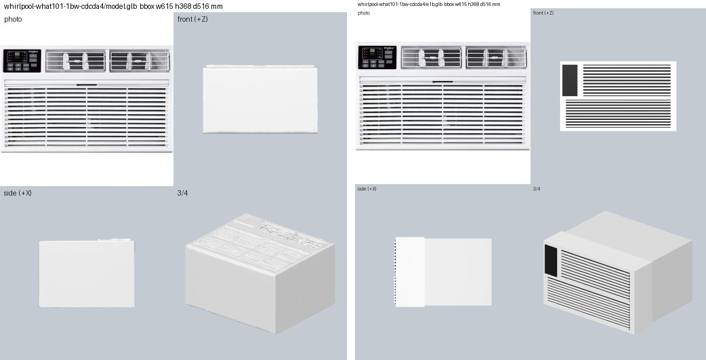
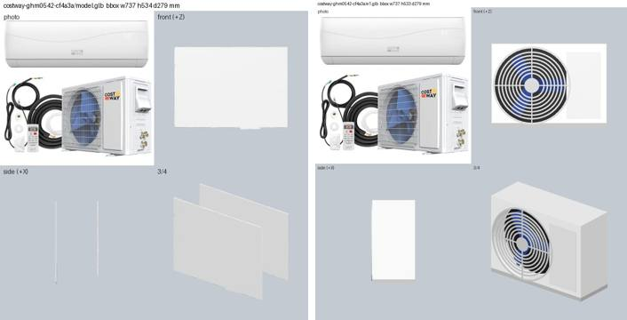
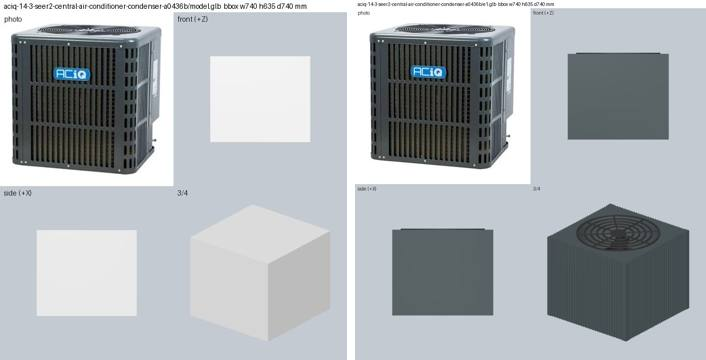
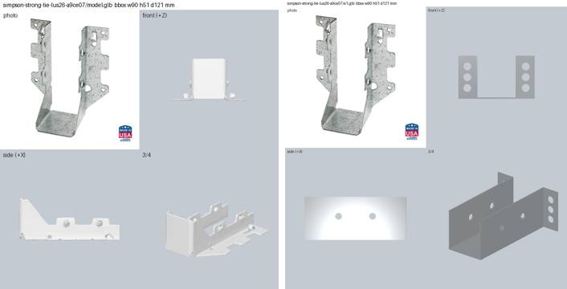

# E1: parametric templates, LLM fills the parameters

Bench row E1/E1b in `../p4-llm-assets-bench.md`. Session 2026-09-26, laptop, Groq only.

**Idea.** Both surveys say a 27B model can't be trusted to write CAD code but can recognise a
part and fill in parameters. So the geometry comes from hand-written generators that are
exact-size and contract-correct by construction, and the LLM only picks a template and fills
its parameters and colours.

**Code.**
- `server/experiments/assets_llm/templates.py`: 10 generators in trimesh, with manifold3d for
  the booleans (holes, the sink cavity, the fan recess): `box`, `box_appliance`, `tall_box`,
  `cylinder_tank`, `joist_hanger`, `strap_hanger`, `sink`, `fixture` (shower head or faucet),
  `flat_panel`, `fan_unit` (fan on the front or on top).
  - Each template has a small spec: fractions of the dims, counts, enums, front-face regions and
    sRGB hex colours per role. Values are validated and clipped.
  - `catalogue()` prints the spec compactly for the prompt, about 2K tokens for all 10.
  - `build()` returns a Scene in the contract frame at exactly W×H×D, one primitive per colour
    role.
  - Colours are converted from sRGB to linear for `baseColorFactor`, so the `_paint` bug is not
    repeated.
  - Self-check (`python -m ...templates`) builds 22 variants. It asserts exact dims after a GLB
    round trip, origin at the mount-face centre, that each generator fills its box on its own
    (the final per-axis fit stays within 3 %), and the validation logic.
- `server/experiments/assets_llm/e1_run.py`: the runner, with the commands in its docstring.
  Every LLM call goes through `llm.chat`, and the JSON answers are cached per part, so a rerun
  costs no tokens. Outputs are in `work/assets-llm/e1/<id>/`.

**Methods** (rows in `work/assets-llm/results.jsonl`):

| method | LLM input | output |
|---|---|---|
| e1 | Qwen 3.8-27B vision: 512 px photo + name + material + dims + catalogue | `{template, params, colors, front_face_note}` |
| e1b | Qwen vision: photo + a 2-view render (front, 3/4) + a checklist (template? features? proportions? colours?) | param/colour patch, or a template switch |
| e1-text | gpt-oss-120b, text only: a 3–5 line description I wrote from the photo | same JSON as e1 |
| e1b-num | gpt-oss-120b: bbox error per axis, pieces, IoU, CLIP, proxy scores | param/colour patch |

A patch is kept unless IoU drops by more than 0.05 or CLIP by more than 0.03. Both rows are
reported either way.

Why e1-text and e1b-num exist: halfway through the run, Groq's 200K tokens/day cap on the Qwen
vision model ran out (it is shared with E2 and E3). Those two variants were added as a
text-only fallback. Once more keys arrived, the vision variants ran on all 12 parts, so the
text rows are an extra comparison for 6 parts, not a substitute.

## Results

All 12 parts: **12/12 valid, bbox error 0.00 %, 0 floating pieces.**
- Meshes are 12–9.7K triangles (mean 1.8K) and 1–177 KB (mean 34 KB). Hunyuan's are 20K
  triangles and 352 KB.
- Pieces count separate primitives, which are not unioned; nothing floats.
- The first run had 3 detached fan blades. The fix was a hub that overlaps the blade roots.

| subset | method | IoU | CLIP |
|---|---|---|---|
| all 12 | exact-size grey proxy | 0.68 | 0.42 |
| all 12 | **e1** | 0.65 | **0.61** |
| all 12 | e1b | 0.67 | 0.58 |
| all 12 | e1 + e1b, the patch kept by the gate | 0.66 | 0.61 |
| 8 Hunyuan parts | Hunyuan3D-2.1 | 0.66 | 0.60 |
| 8 Hunyuan parts | e1 | 0.59 | 0.60 |
| 8 Hunyuan parts | proxy | 0.64 | 0.41 |
| 6 text parts | e1 / e1b | 0.77 / 0.77 | 0.57 / 0.57 |
| 6 text parts | e1-text / e1b-num | 0.77 / 0.77 | 0.54 / 0.54 |

Per part, IoU/CLIP and my verdict from the contact sheets (✓ better, = same, ✗ worse):

| part | Hunyuan | proxy | e1 | e1b | vs Hunyuan | vs proxy | why |
|---|---|---|---|---|---|---|---|
| joist hanger | .28/.66 | .32/.42 | .27/.66 | .32/.42 (switched to box, reverted) | ✓ | ✓ | clean U with flanges and nail holes; Hunyuan is a crumpled plate |
| gutter hanger, alu | .62/.77 | .54/.53 | .34/.66 | .37/.67 | ✗ | ✓ | straight strap, box hook and screw read as a hanger; Hunyuan got the curved clip |
| gutter hanger, vinyl | .46/.83 | .40/.51 | .25/.68 | .31/.69 (brace added) | ✗ | ✓ | bracket + brace is plausible; the moulded curves are missing |
| condenser pad | – | .60/.63 | .60/.68 | = | – | ✓ | right black colour; no top grid texture |
| AC condenser | – | .91/.31 | .92/.49 | = | – | ✓ | louvred coil sides, top fan grille, dark cabinet; front reads flat at this scale |
| water heater | .84/.70 | .82/.51 | .84/.71 | .84/.66 (reverted) | = | ✓ | right grey, cap, pipes; element covers are flat plates; Hunyuan is white |
| sink | .67/.47 | .70/.35 | .73/.46 | .74/.47 | ✓ | ✓ | clean hollow bowl, thin flange; no dark exterior (one colour role) |
| shower head | – | .76/.26 | .77/.64 | .77/.63 | – | ✓ | round face, nozzle rings, ball joint, arm; too white for chrome |
| solar panel | – | .82/.59 | .82/.74 | .82/.72 | – | ✓ | black frame and cell grid |
| wall AC | .80/.42 | .81/.28 | .81/.56 | .81/.55 | ✓ | ✓ | control panel and grilles on the front; e1b fixed the layout (full-width intake below); Hunyuan's grille faces up |
| fridge | .94/.54 | .90/.34 | .90/.47 | .90/.49 | ✓ | ✓ | stainless 4-door layout, handles, toe kick; Hunyuan is white |
| mini-split | .64/.37 | .61/.33 | .61/.58 | .61/.55 | ✓ | ✓ | box with a round fan grille and blue blades + service panel; Hunyuan is 2 flat plates. e1b's white grille is worse but passed the gate |

Visual tally: vs Hunyuan (8), **5 better, 1 same, 2 worse** (the two gutter hangers). vs proxy
(12), **12 better**.

The metrics say "tie with Hunyuan" while the sheets say "mostly better". The reasons:
- IoU rewards a filled outline, so on the fridge Hunyuan's white blob scores 0.94.
- CLIP barely separates a correct layout from a wrong one. Hunyuan's wall AC scores 0.42
  against 0.56 for ours, even though its grille faces up.

## Cost per asset

- **e1.** One Qwen call: 3.6K tokens in (the catalogue is ~2K, the 512 px photo most of the
  rest) and 205 out on average. Latency is 1.2–2 s when Groq is idle, 25–40 s when busy.
  Build + render take under 1 s.
  - Paid-tier price: about $0.004 per asset.
  - Free tier: about 50 assets/day per key within the 200K tokens/day cap.
  - Zero compile failures and zero invalid JSON (0 retries in 12 calls).
- **e1b.** Adds one call with 2 images: +2.9K in and +120 out, so ~6.5K per asset in total.
- **e1-text / e1b-num (gpt-oss-120b).** 2.4K in, but 550–2300 out, because the reasoning
  tokens count. That is several times the output of Qwen.
- **Ledger totals for E1:** about 85K Qwen tokens and 31K gpt-oss tokens.

## What works, what doesn't

- **Works.** Box-like appliances (wall AC, fridge, condenser, mini-split), cylinders, panels,
  the sink bowl, the shower head. Qwen's template choice was right on 12/12. Parameters
  (layout, counts, regions, colours) were mostly sensible, and the geometry is always valid
  and exact.
- **Weak.** Organic or curved small parts: the two gutter hangers (a bent strip, a moulded clip)
  and chrome. The templates are too blocky there, and Hunyuan wins. More template vocabulary
  would help: a swept strip along a 2D polyline, and a metallic/env-lit material.
- **Dims issue.** The joist hanger's published dims are swapped (h 51 mm). The template
  respects them, so it looks squat.

## Did the critique pass help?

A little, and only with the keep gate.
- **e1b (vision critique).** Mean IoU went +0.013 and CLIP −0.026. The gate kept 10/12.
  - It is good at spotting missing features: the wall-AC layout, the vinyl hanger's brace, the
    sink's flange.
  - It is bad at colour: it made the mini-split grille white, which is worse, and it switched
    the water heater's colours.
  - It sometimes proposes a wrong template: the joist hanger became a box and was reverted.
  - The CLIP gate lets through changes that make the sheet look worse (the mini-split).
- **e1b-num (numbers only to gpt-oss).** No gain: the gate kept 5/8, with IoU and CLIP flat.
  The numbers don't say *what* is wrong, so the model guesses.
- **e1-text vs e1.** Same IoU, CLIP −0.03. A human-written description plus a text model is a
  workable fallback when vision is capped, but the sink (the whole body painted dark) and the
  fridge (invisible handles) came out worse than with vision.
