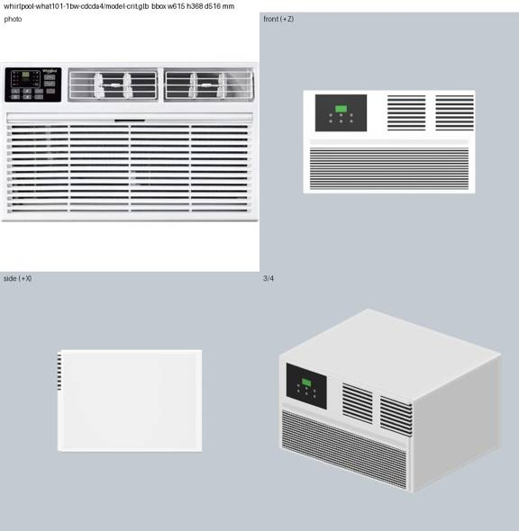
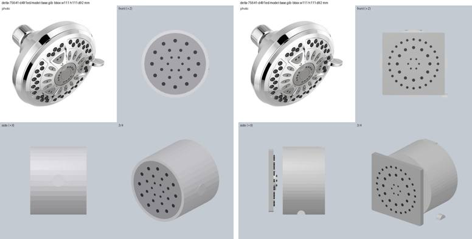
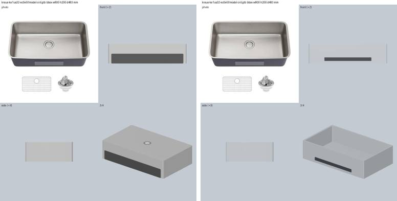
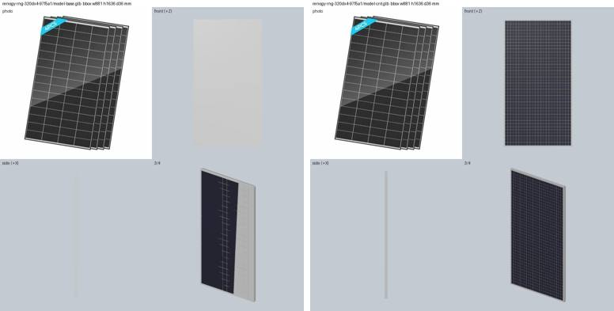

# E2: LLM-written OpenSCAD vs CadQuery against a frame-safe helper library

Row E2 of `docs/research/p4-llm-assets-bench.md`. Run 2026-09-26 on the laptop.

Question: Qwen can already write CadQuery that compiles (R3), but it got the coordinate frame
wrong on 2 of 3 parts. Does a small helper library fix that? The library pins the part's
envelope to the published dims and exposes relative, per-face helpers instead of raw
coordinates. The loop around it has compile-error retries, bbox feedback and one render
critique. Is OpenSCAD safer than CadQuery for a Qwen-class model?

Code (committed): `server/experiments/assets_llm/e2_lib.scad`, `e2_cq.py` (the same API in
CadQuery, plus its runner) and `e2_run.py` (the loop). Outputs are under
`work/assets-llm/e2/<lang>/<part>/` (gitignored): every LLM reply, the code, both GLBs and both
contact sheets, and `log.json`. Result rows are in `work/assets-llm/results.jsonl`, methods
`e2-*`.

## 1. Summary

- **The library solved the frame problem.** Across 15 Qwen part × language runs, every model
  came out the right way up with its front on +Z. Once the envelope clip was applied, every
  bbox was within 1 % (`bbox_err_clip`), and 15/15 final GLBs pass `score.py`'s bbox and origin
  checks. Two needed a ≤1 % per-axis rescale. Frame failures like R3's (half the wall AC behind
  the wall, panels as shelves) did not recur.
- **Compile errors did not matter for Qwen.** Both languages compiled on the first try in all
  39 Qwen builds (0 retries). R1's 99.5 % vs 47 % OpenSCAD/CadQuery validity gap did not show
  up, because the library hides the part of CadQuery that breaks (workplanes, local axes). The
  gpt-oss fallback (below) did hit syntax errors: 3/3 before a prompt rule was added, then 1 of
  8 builds in OpenSCAD and 5 of 7 in CadQuery.
- **OpenSCAD beat CadQuery on quality, not on validity.** On the 6 parts run in both languages,
  the kept versions tie on IoU (0.725 vs 0.724), but OpenSCAD scores higher on CLIP (0.600 vs
  0.542) and has far fewer loose pieces. OpenSCAD had 1 piece on 5 of 6 parts. CadQuery had
  2–27 pieces on 4 of 6 parts, because Qwen mixes up the per-face (a, b) coordinate order more
  often in Python. Condenser: a louvre sheet floats beside the body. Shower head: a square face
  plate stands off a cylinder.
- **Against the baselines.** On the same parts, OpenSCAD (9 parts, kept version) scores IoU
  0.742 / CLIP 0.591, against 0.739 / 0.479 for Hunyuan or proxy. Its CLIP is higher on 7/9
  parts. It clearly beats Hunyuan on the wall AC (front grilles on the front, where Hunyuan put
  them on top) and a proxy box on the shower head, condenser and solar panel. It loses on the
  fridge (Hunyuan IoU 0.94 vs 0.90, and the photo has a store sticker) and on the sink, where
  every E2 variant came out a solid block (§4).
- **The render critique helps a little in OpenSCAD and not at all in CadQuery.** Paired ΔCLIP
  is +0.024 in OpenSCAD (n 8; +0.11 on the wall AC, −0.02 at worst) and −0.014 in CadQuery
  (n 6; −0.125 on the shower head). IoU is unchanged (it is capped by the fixed envelope).
  Most critique bullets are really **code review**: paint order hiding the grille bars, `hole()`
  outside a `difference()`, fittings buried inside the cap. Some are hallucinated: "the body is
  a flat slab" about a correct cylinder, "orientation wrong" about a correct shower head. The
  critique version was kept on 5/8 OpenSCAD parts and 3/6 CadQuery parts.
- **Cost per asset (Qwen, full loop).** 2.6–2.8 calls, about 7.3–7.6K input and 2.5K output
  tokens, a median of about 10 s of model time (up to 90 s when the call was retried under
  Groq rate limits). On Groq's free tier the real limit is the 200K tokens/day cap
  on qwen: one full asset uses about 10K, so one key covers about 20 assets a day. Build time
  is about 1 s per colour for OpenSCAD and about 10 s per build for CadQuery (import cost).

## 2. What was built

**Frame (both languages).** mm. X runs across, −W/2..W/2. Y is up, 0..H. Z is depth, 0..D, with
Z=0 at the mounting/back face and Z=D at the front. `W, H, D` are injected (OpenSCAD `-D`
flags, CadQuery globals). The harness maps (x, y, z) to (x, y − H/2, z)/1000, which is the
`docs/api.md` §2 contract. No rotation is involved, so the model's "front" is the renderer's
front.

**API** (about 20 lines in the prompt, the same names in both languages):
- `paint(hex)`
- `box(x0..z1, r, ax)`
- `cyl(axis, r, a0, a1, c, r2)`
- per-face features, each placed by face name plus a centre and size in that face's two
  world axes: `panel`, `disc`, `hole`, `grille`, `vent` and `handle`

Every feature is an axis-aligned box or cylinder that fills the outer t mm of the envelope at
its face, so the model never writes a rotation or a workplane.

**Harness rules** (`e2_run.assemble`):
1. One mesh per paint colour. OpenSCAD runs once per colour with `ONLY=<hex>`. CadQuery
   exports one STL per `paint()`.
2. Later paints win where they overlap: each colour is booleaned against the later ones with
   manifold3d. This is how a flush coloured panel works without z-fighting.
3. Everything is clipped to the W×H×D envelope. This is the "envelope is fixed" guarantee,
   and why `bbox_err_pct` (raw, before the clip) can be large while the GLB is valid.
4. If the bbox after the clip is within 5 % on every axis, it is mapped onto the exact
   envelope, and the row is noted `rescaled`.

**Loop per part and language:**
1. One Qwen vision call: photo + name + dims + API → code.
2. Build. On error, send the error text back (for OpenSCAD with the offending source line),
   at most 2 retries.
3. If the raw bbox is more than 2 % off, send the per-axis numbers back once, and keep the
   result only if it improved.
4. One critique call: the photo, a 2-view render (front + 3/4), a fixed 5-point checklist and
   the current code → revised code.
5. Score both versions with `score.py` and keep the better one (valid first, then IoU + CLIP).
   Both are reported.

`max_tokens` is 1800 for Qwen and 2500 for gpt-oss. Temperature is 0.2.

## 3. Results

IoU / CLIP per variant. The **bold** value is the version kept for that language and model.
Baselines are from `r3-toolchain.md` §5. "–" means not run.

| part | baseline (tier) | scad | scad-crit | cq | cq-crit | scad-txt | scad-txt-num | cq-txt | cq-txt-num |
|---|---|---|---|---|---|---|---|---|---|
| simpson (joist hanger) | 0.28 / 0.66 (Hunyuan) | **0.28 / 0.72** | – ¹ | **0.27 / 0.64** | 0.27 / 0.62 | – | – | – | – |
| kraus (sink) | 0.67 / 0.47 (Hunyuan) | 0.71 / 0.36 | **0.71 / 0.42** | 0.71 / 0.43 | **0.71 / 0.44** | **0.69 / 0.40** | 0.69 / 0.37 | 0.69 / 0.37 | **0.69 / 0.37** |
| rheem (water heater) | 0.84 / 0.70 (Hunyuan) | 0.84 / 0.70 | **0.84 / 0.71** | 0.84 / 0.71 | **0.84 / 0.74** | – | – | – | – |
| delta (shower head) | 0.76 / 0.26 (proxy) | **0.81 / 0.61** | 0.81 / 0.60 | **0.81 / 0.53** | 0.82 / 0.41 | – | – | fail ² | – |
| whirlpool (wall AC) | 0.80 / 0.42 (Hunyuan) | 0.81 / 0.52 | **0.81 / 0.62** | **0.81 / 0.43** | 0.76 / 0.43 | **0.81 / 0.42** | 0.81 / 0.41 | – | – |
| aciq (condenser) | 0.91 / 0.29 (proxy) | 0.91 / 0.48 | **0.91 / 0.51** | 0.91 / 0.45 | **0.91 / 0.48** | 0.91 / 0.39 | **0.93 / 0.46** | – | – |
| samsung (fridge) | 0.94 / 0.54 (Hunyuan) | **0.90 / 0.47** | 0.90 / 0.47 | – | – | – | – | – | – |
| renogy (solar panel) | 0.82 / 0.60 (proxy) | 0.82 / 0.73 | **0.82 / 0.75** | – | – | – | – | – | – |
| costway (mini-split) | 0.64 / 0.36 (Hunyuan) | **0.61 / 0.50** | 0.61 / 0.47 | – | – | – | – | – | – |

¹ The critique was skipped because Qwen's daily cap was hit mid-run.
² 3 CadQuery builds failed (gpt-oss).

Means over the kept versions, with the baseline on the same parts:

| method | model | parts | valid | IoU | CLIP | baseline IoU / CLIP | CLIP > baseline | calls | in / out tokens |
|---|---|---|---|---|---|---|---|---|---|
| e2-scad (+crit) | qwen3.8-27b + photo | 9 | 9/9 | 0.742 | **0.591** | 0.739 / 0.479 | 7/9 | 2.6 | 7.3K / 2.5K |
| e2-cq (+crit) | qwen3.8-27b + photo | 6 | 6/6 | 0.724 | 0.542 | 0.709 / 0.467 | 4/6 | 2.8 | 7.6K / 2.5K |
| e2-scad-txt (+num) | gpt-oss-120b + text | 3 | 3/3 | 0.811 | 0.427 | 0.793 / 0.393 | 1/3 | 2.7 | 3.6K / 5.4K |
| e2-cq-txt (+num) | gpt-oss-120b + text | 2 | 1/2 | 0.691 | 0.370 | 0.672 / 0.469 | 0/1 | 3.5 | 4.7K / 6.5K |

Geometry, Qwen runs. "First-pass raw err" is the worst axis before the bbox feedback and
before the clip. Most of it is features poking out of the envelope (the fan grille above the
condenser top, a louvre sheet beside it, fittings above the tank), not a wrong frame:

| part | scad first-pass raw err % | pieces scad / crit | cq first-pass raw err % | pieces cq / crit |
|---|---|---|---|---|
| simpson | 0.0 | 1 / – | 0.0 | 1 / 1 |
| kraus | 0.0 | 10 / 4 | 50.0 | 2 / 2 |
| rheem | 3.2 | 1 / 1 | 3.9 | 1 / 1 |
| delta | 16.3 | 1 / 1 | 14.5 | 3 / 2 |
| whirlpool | 3.0 | 1 / 1 | 50.0 | 3 / 2 |
| aciq | 38.9 | 1 / 1 | 50.0 | 21 / 27 |
| samsung | 0.0 | 1 / 1 | | |
| renogy | 2.8 | 16 / 1 | | |
| costway | 0.4 | 1 / 1 | | |

- **Bbox feedback.** It fixed 3 of 9 cases (rheem in both languages 3–4 % → 0–0.6 %, delta
  OpenSCAD 16 % → 0 %, kraus CadQuery 50 % → 0 %). In the other 6 it was not better, and the
  clip does the work instead.
- **Triangles.** 0.4K–34K (dense slat and cell grids at the top end), 8–590 KB per GLB,
  against 20K / 352 KB for Hunyuan. OpenSCAD cylinders use `$fn=40`.

**Models used.** All `e2-scad`, `e2-cq` and `-crit` rows are `qwen/qwen3.8-27b` with the
photo. All `-txt` and `-txt-num` rows are `openai/gpt-oss-120b`. The row's `model` field says
which.

The text path was added when Groq's 200K tokens/day cap on qwen ran out mid-run, before the
lead added more keys. For that path I, the E2 agent, wrote a 3–5 line description of each
photo (`e2_run.DESCRIPTIONS`), and the critique is replaced by numeric feedback (per-axis bbox
error, pieces, IoU, CLIP), since gpt-oss has no vision. The first text run hit 3/3 OpenSCAD
syntax errors: gpt-oss writes `b = paint(...) box(...)`, as if modules returned values. That run
is kept as `e2-scad-txt-v1`. I then added one prompt rule (no object variables; colours are
strings) and the offending source line to the error text, and after that it compiled. The
numeric-feedback pass is the one variant that moves IoU: the condenser went 0.905 → 0.929 by
removing an overhang. Otherwise it changes almost nothing (ΔCLIP +0.016, n 3), which makes
sense: numbers don't tell the model which feature is wrong.

## 4. Visual verdicts (every contact sheet looked at)

- **whirlpool (wall AC).** OpenSCAD after the critique is the best asset in this run. It has
  the control panel top-left, two louvred outlets and a full-width slatted intake, all on the
  front face. Hunyuan's version faces its grille up and a proxy box is blank. CadQuery got the
  frame right but drew the outlets as black blocks, and its critique version added a stray
  wall (a notch).
  
- **delta (shower head).** OpenSCAD is a round chrome head with a nozzle field on the +Z face,
  and much better than a proxy box (CLIP 0.61 vs 0.26). CadQuery's face plate is square and
  floats in front of the cylinder, and its critique version removed the nozzles.
  
- **kraus (sink).** Only CadQuery produced an open bowl (the cavity cut through the top).
  Every OpenSCAD and gpt-oss version is a solid slab: the bowl's `difference()` stops 5 mm
  below the top face (`y1=H-5`), so it is a sealed void. The critique even named "the sink
  rendered as a solid block" and still did not fix it. IoU is fine and CLIP is below Hunyuan's.
  An `open_top` helper, or a "cut through the face" `pocket`, would fix it.
  
- **rheem (water heater).** Both languages give a clean grey cylinder with two access panels,
  a badge strip and a brass drain, on par with or above Hunyuan (CLIP 0.71–0.74 vs 0.70).
  Panels are box features on a round body, so their edges stand slightly proud of the curve.
- **renogy (solar panel).** The base version had 16 loose pieces (holes painted as discs) and
  only a partial cell grid. The critique caught `hole()` used outside a `difference()`, and the
  crit version is one piece with a full dark cell grid and a silver frame (CLIP 0.75 vs proxy
  0.60).
  
- **aciq (condenser).** It is a dark box with a logo and a fan on top (blades, not a round
  grille), and CLIP beats the proxy (0.51 vs 0.29). The louvres are mostly lost: in OpenSCAD
  the side vents became invisible slots. In CadQuery one louvre sheet sits outside the body as
  a separate piece (27 pieces). The gpt-oss text version has a clean round fan grille but no
  louvres.
- **samsung (fridge).** A clean French-door fridge with two drawers and handles, a good
  asset. It scores below Hunyuan on IoU and CLIP because the photo carries a store sticker and
  labels.
- **costway (mini-split).** The photo shows the indoor unit, but the dims are the outdoor
  unit's. Qwen modelled a wall-mounted indoor unit squeezed into outdoor-unit dims. CLIP
  beats Hunyuan (0.50 vs 0.36), but it is the wrong object. This is a data problem, not a
  model problem.
- **simpson (joist hanger).** A plausible U channel with flanges (OpenSCAD adds holes and
  tabs). It follows the published dims, which R3 flagged as swapped, so it can't look like the
  photo. CLIP 0.72 vs Hunyuan 0.66.

**Qwen could not do, or did badly:**
- the hollow sink bowl in OpenSCAD
- the condenser's louvred sides
- the mini-split (a data problem)
- the joist hanger's real shape (a dims problem, and bent sheet metal with stepped flanges is
  beyond these primitives)

The first two are Grok candidates for E4. Try the sink with the proposed `pocket` helper
first, because the failure there is one off-by-5-mm cut, not model capacity.

## 5. Caveats

- Qwen ran OpenSCAD on 9 of 12 parts and CadQuery on 6. The run stopped at E2's 150K-token
  qwen budget; the two amerimax gutter hangers and the slab were not run. gpt-oss ran 5 part ×
  language rows (52K-token budget, reasoning tokens counted).
- One sample per cell at temperature 0.2. Differences of ±0.03 CLIP are noise.
- Rows have `wall_s`, but it includes long waits on the shared Groq lock and 429s (up to
  15 min), so use `llm_s` for model time.
- The simpson OpenSCAD row has no critique, because the qwen quota ran out mid-run. Its base
  was scored afterwards without new calls.
- Library ceiling: every feature is an axis-aligned box or cylinder. There is no fillet on
  panels in OpenSCAD beyond the hull corners, no curved panel conforming to a cylinder, and no
  sheet-metal bends or lofts.
