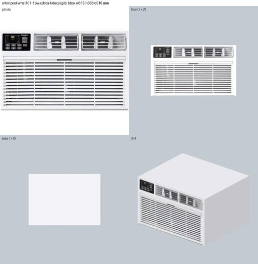
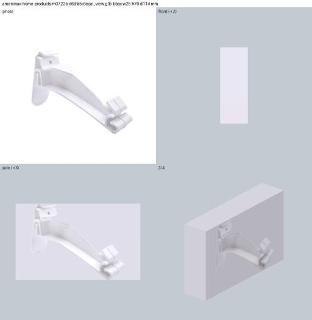
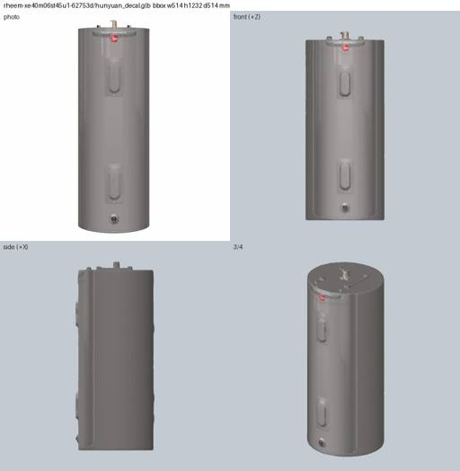
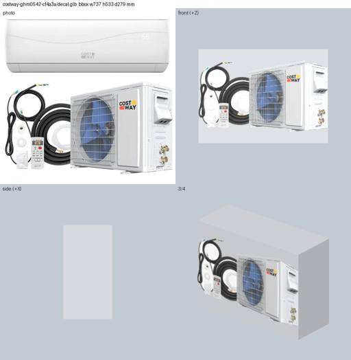

# E3: product photo projected onto the exact-size proxy (and onto any contract GLB)

Row E3 of `docs/research/p4-llm-assets-bench.md`, run 2026-09-26 on the 12-part test set. No LLM
geometry: the cropped product photo goes on one face of the exact-size box, and every other face
gets the product's edge colour. An optional Groq vision call picks the face the photo shows.

Code: `server/experiments/assets_llm/decal.py` (`decal_proxy`, `project_photo`, `textured_glb`,
`detect_view`, `aspect_guess`, `--selfcheck`) and the runner `e3_run.py`. Outputs are in
`work/assets-llm/e3/<part>/` and the rows are in `work/assets-llm/results.jsonl` (methods
`e3-decal`, `e3-decal-view`, `e3-hunyuan-decal`).

```bash
uv run --with scipy python -m server.experiments.assets_llm.decal data/parts/<id> out.glb [--face right] [--mesh model.glb]
uv run --with pyrender --with scipy --with open_clip_torch --index https://download.pytorch.org/whl/cpu \
    python -m server.experiments.assets_llm.e3_run [ids...] [--mesh-demo ids...]
```

## 1. Production colour fix

`_paint` in `server/assets.py` wrote sRGB hex straight into glTF's linear `baseColorFactor`, so
every proxy and `ai_mesh` colour rendered washed out. `_hex_to_rgba` now converts sRGB to linear
(`#CCCCCC` gives 0.604, not 0.8). A focused test was added and the existing round-trip test was
updated. The full suite passes (592 tests) and ruff is clean. Commit `3e31a93`.

## 2. How the decal is built

- **Background removal:** reuses `score.photo_mask`. It flood-fills the border colour from the
  edges, keeps the largest blob and fills holes. All 12 photos are catalogue shots on a plain
  background, and white-on-white parts (vinyl hanger, wall AC) survive. So no rembg or GrabCut
  was needed; rembg u2netp is the upgrade for lifestyle photos. The crop is the mask's bbox, and
  background pixels inside it are repainted with the edge colour.
- **Edge colour:** the median of product pixels in a band 1–3 % in from the outline (skipping the
  anti-aliased rim). An earlier version sampled the rim itself and gave the black condenser light
  grey sides.
- **Texture:** the crop is fitted into the face aspect without stretching, padded with the edge
  colour. A 16 px solid strip is added on the right, and non-photo triangles sample it. The result
  is one JPEG, at most 1024 px on its longest side, with one material and one primitive.
- **Projection:** planar, along the chosen face's normal, onto triangles facing it
  (normal·axis ≥ 0.3). A left or right (profile) photo also goes, mirrored, on the opposite side.
  `mesh.merge_vertices()` then re-shares corners with equal UVs (60K to 10K vertices on a
  Hunyuan mesh). There is no occlusion test, so hidden inner triangles facing the same way also
  get the photo.
- **Test harness gotcha:** pyrender pins PyOpenGL 3.1.0, whose `glGenTextures` wrapper fails
  on Python 3.13. R3 never rendered a texture, so it never hit this. `e3_run` patches in the raw
  GL entry points.

## 3. Results

IoU is the best-view silhouette IoU and CLIP is ViT-B/32 image similarity, both from `score.py`.
The Hunyuan column comes from R3's baseline scores. The grey proxy was re-scored with the colour
fix. A box's IoU is the same with or without the decal, so it is listed once, in the grey proxy
column.

| part | Hunyuan IoU / CLIP | grey proxy IoU / CLIP | e3-decal CLIP | e3-decal-view CLIP (face) | e3 GLB KB |
|---|---|---|---|---|---|
| simpson LUS26 hanger | 0.28 / 0.66 | 0.32 / 0.42 | 0.53 | – (front) | 37 |
| amerimax 21812 alu hanger | 0.62 / 0.77 | 0.54 / 0.53 | 0.60 | **0.74** (right) | 34 / 10 |
| amerimax M0722B vinyl hanger | 0.46 / 0.83 | 0.40 / 0.51 | 0.57 | **0.92** (right) | 13 / 23 |
| cambridge condenser pad | – | 0.60 / 0.62 | 0.65 | 0.68 (top) | 5 / 50 |
| aciq condenser | – | 0.91 / 0.31 | 0.67 | – | 95 |
| rheem water heater | 0.84 / 0.70 | 0.82 / 0.51 | 0.74 | – | 27 |
| kraus sink | 0.67 / 0.47 | 0.70 / 0.35 | 0.64 | – (said front, truth top) | 16 |
| delta shower head | – | 0.76 / 0.26 | 0.81 | – | 110 |
| renogy panel (4-pack photo) | – | 0.82 / 0.59 | 0.69 | – | 97 |
| whirlpool wall AC | 0.80 / 0.42 | 0.81 / 0.28 | 0.78 | – | 103 |
| samsung fridge | 0.94 / 0.54 | 0.90 / 0.34 | 0.71 | – | 50 |
| costway mini-split (cluttered) | 0.64 / 0.36 | 0.61 / 0.33 | 0.67 | – | 89 |

Means over the 12 parts:
- grey proxy CLIP 0.42
- e3-decal CLIP 0.67
- decal with the view call applied CLIP 0.72
- box IoU 0.68

Means over the 8 parts that have a Hunyuan mesh:

| method | CLIP | IoU |
|---|---|---|
| Hunyuan | 0.60 | 0.66 |
| grey proxy | 0.41 | – |
| e3-decal | 0.66 | 0.64 |
| e3-decal + view | 0.72 | 0.64 |

All 15 decal GLBs are valid: bbox error 0 %, origin at the mount face, 1 piece, 12 triangles.
They are 5–110 KB (median 37 KB), against about 350 KB for a Hunyuan mesh. A build takes under
1 s on CPU and needs no Space quota.

**Photo on Hunyuan geometry** (`e3-hunyuan-decal`, task 4; all valid, 460–560 KB):

| part | Hunyuan CLIP | box decal CLIP | Hunyuan + photo CLIP |
|---|---|---|---|
| rheem | 0.70 | 0.74 | **0.89** |
| samsung | 0.54 | 0.71 | 0.70 |
| whirlpool | 0.42 | 0.78 | 0.68 |

The whirlpool mesh still has its grille on top (the `normalize_mesh` orientation bug), and the
relief facing +Z picks up photo streaks.






## 4. Front-face detection (one Groq call per part)

`detect_view` sends one `qwen/qwen3.8-27b` request with a 512 px photo, the name, the dims and
the mount surface, in JSON mode with max_tokens 200. It asks for
`{"face", "rotate_cw", "why"}` and costs about 1,460 input and 33 output tokens. Latency was
0.6–21 s; the long waits were E1/E2 using the shared quota. Ground truth below is my own reading
of each photo.

| prompt | face correct | rotation correct | misses |
|---|---|---|---|
| v1 (face + rotation) | 11/12 | 9/12 | vinyl hanger "front, rotate 90"; alu hanger and shower head: a spurious 90° |
| v2 (adds what a side or top view looks like; "catalogue photos are upright, rotate_cw 0 unless lying on its side") | 11/12 | 12/12 | sink "front" (it is a top-down view into the bowl) |
| no-LLM `aspect_guess` (crop aspect vs face aspects) | 9/12 | – | joist hanger and condenser guessed "top", alu hanger "front" |

`e3_run` uses the v2 answers; the v1 answers are kept in `view_v1.json`.

- **Where it helps:** it matters exactly where the photo is not a front view. Moving the photo
  to the side lifts the two gutter hangers' CLIP by 0.14 and 0.35.
- **Where CLIP misleads:** CLIP under-rewards top-face decals, because the scorer's seven views
  sit at a low elevation. The v1 "top" sink decal looks clearly better (`decal_view_v1.jpg`) but
  scores 0.51 against 0.64 for the front decal.
- **Joist hanger:** "front" is right, but `part.json` has h and d swapped (R3). So the photo
  lands small on a 90 x 51 face.

## 5. Verdict

For a VR preview, the photo-textured proxy beats Hunyuan on recognisability. CLIP is 0.66–0.72
against 0.60 on the same 8 parts, and on the contact sheets the fridge, wall AC, shower head and
water heater read as the product at a glance, while Hunyuan's are grey blobs. It is about 10x
smaller, instant, free, and it can never be mis-oriented.

It loses on silhouette wherever the product is not box-like. The water heater, sink and hangers
are visibly boxes from the 3/4 view.

Failure modes, all from the photo:
- cluttered kit photos (costway: hoses and remote on the unit)
- multi-pack photos (renogy: 4 tilted panels)
- 3/4 perspective photos flattened onto one face (condenser, pad)
- wrong dims (simpson)

Recommendations:
1. **Make the decal the default `proxy` tier now.** It costs one Groq call for the face, or
   none if you always use "front", which is right 8/12 here, and replaces a grey box that
   scores 0.42.
2. Keep generated geometry for non-box shapes and texture it with `textured_glb`. The best score
   in the whole run was the water heater, Hunyuan cylinder + photo, at CLIP 0.89. This needs
   geometry that is correctly oriented (E1/E2, or a fixed `normalize_mesh`).
