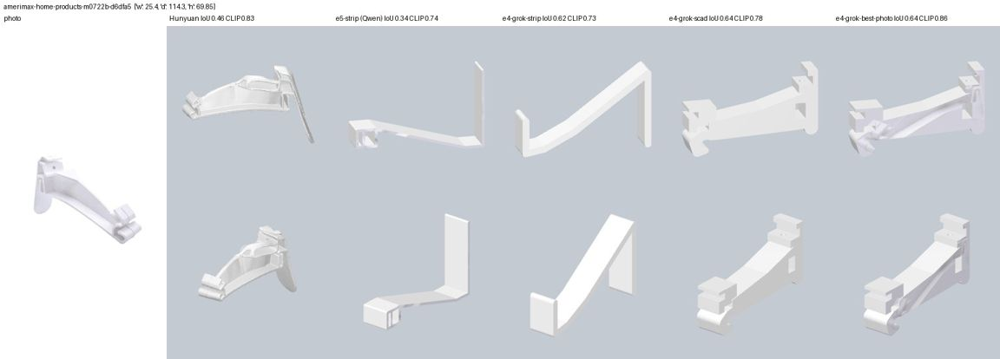
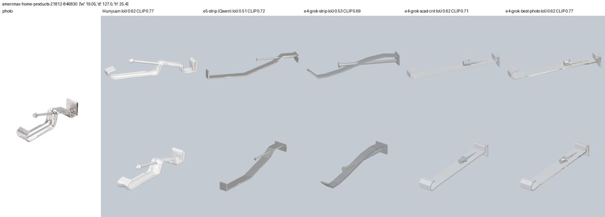

# E4: grok-4.7 on the two gutter hangers

Bench row E4 in `../p4-llm-assets-bench.md`. Session 2026-09-26, laptop, no Groq calls.

**Why.** In E1, E2 and E5, every Groq approach lost to Hunyuan3D on exactly two parts, both thin
moulded gutter hangers:

- **Aluminium hidden hanger with screw** (`amerimax-home-products-21812-846830`, 19×25×127 mm).
  Best Groq result: E5's Qwen `bent_strip`, IoU 0.51 against Hunyuan's 0.62.
- **Vinyl hanger** (`amerimax-home-products-m0722b-d6dfa5`, 25×70×114 mm). Best Groq result:
  IoU 0.34 against Hunyuan's 0.46, with the arm sloping the wrong way.

The user's rule is to use Grok only where Groq has been shown not to be strong enough. These two
parts are the one such case. The cap was 12 Grok calls.

**Code.** `server/experiments/assets_llm/e4_run.py`. Outputs go to
`work/assets-llm/e4/<id>/`, and the gallery to `work/assets-llm/e4/<id>.jpg`.

```bash
uv run --with manifold3d --with rtree --with pyrender --with scipy --with open_clip_torch \
    --index https://download.pytorch.org/whl/cpu \
    python -m server.experiments.assets_llm.e4_run [cat|strip|scad|photo|gallery ...]
```

- **Logging.** Every call goes through `llm.chat(provider="xai", reason=...)`, which logs to
  `work/assets-llm/calls.jsonl` under the tag `e4/...`.
- **Cap.** The runner counts each call in `work/assets-llm/e4/grok_calls.json` *before* making
  it, and refuses to make a call past 12.
- **Key check.** The key was checked first with the free `GET /v1/models`. `grok-4.7` was
  listed there with `image` input.

## 1. What was run

| step | input | Grok calls |
|---|---|---|
| `cat` | the exact E5 prompt Qwen got (whole E1 catalogue, finishes, 512 px photo) | 2 (+2 assumed SDK retries) |
| `strip` | the same prompt with only the `bent_strip` entry ("Use bent_strip.") | 2 |
| `scad` | E2's OpenSCAD helper-library loop (below) | 3 (alu) + 2 (vinyl) |
| `photo` | E5's photo projection (photo mode, E3's cached face) on the best Grok geometry | 0 |

**The E2 loop, as run with Grok:**

- A generation call. If the generated code doesn't compile, one fix call; at most one per part.
- One bbox-feedback call if the bbox error is over 2 %. Grok's bbox error was 0.0 % every
  time, so this call was never needed.
- One critique call, with the photo and a 2-view render.
- The keep-better gate then keeps whichever of base or critique scores higher on IoU + CLIP.

**Two prompt additions to E2's prompt:**

- **Sloped strips.** Build a sloped segment as `hull()` of two thin boxes or `cyl("x")`. The
  library is axis-aligned, and `hull()` was already allowed.
- **Top-level variables.** "Top-level variables must not use W, H or D."
  - The harness appends the library *after* the model code. A top-level `hw = W/2;` therefore
    sees no `W`. I checked this with `build_scad`.
  - Grok's first alu answer hit this and used up that part's one fix call.
  - Qwen never wrote top-level variables in E2. This is a harness quirk, not a Grok error.

## 2. Results

IoU and CLIP come from `score.py`. All E4 rows are valid, with 0.00 % bbox error. The Hunyuan
numbers are from `baseline_scores.jsonl`, and the Qwen numbers are E5's `e5-strip`.

| part | method | IoU | CLIP | pieces / floating | KB |
|---|---|---|---|---|---|
| alu | Hunyuan | 0.62 | 0.77 | 1 / 0 | 352 |
| alu | Qwen e5-strip (E5 best) | 0.51 | 0.72 | – | 36 |
| alu | e4-grok-cat (Grok picked `strap_hanger`) | 0.40 | 0.64 | 7 / 0 | 5 |
| alu | e4-grok-strip | 0.53 | 0.69 | 18 / 0 | 14 |
| alu | e4-grok-scad (base) | 0.45 | 0.69 | 1 / 0 | 43 |
| alu | e4-grok-scad-crit (kept) | 0.62 | 0.71 | 2 / 1 (screw) | 40 |
| alu | **e4-grok-best-photo** (scad-crit + photo) | **0.62** | **0.77** | 3 / 0 | 74 |
| vinyl | Hunyuan | 0.46 | 0.83 | 1 / 0 | 352 |
| vinyl | Qwen e5-strip (E5 best) | 0.34 | 0.74 | – | 38 |
| vinyl | e4-grok-cat (Grok picked `strap_hanger`) | 0.31 | 0.69 | 5 / 0 | 2 |
| vinyl | e4-grok-strip | 0.62 | 0.73 | 15 / 0 | 10 |
| vinyl | e4-grok-scad (base, kept) | 0.64 | 0.78 | 1 / 0 | 20 |
| vinyl | e4-grok-scad-crit | 0.63 | 0.79 | 1 / 0 | 23 |
| vinyl | **e4-grok-best-photo** (scad + photo) | **0.64** | **0.87** | 1 / 0 | 42 |

Two things to know when reading the pieces column:

- The `bent_strip` rows show many pieces but none floating. The template is built from
  overlapping boxes and cylinders; E5's strips are the same.
- On the alu scad-crit row, E2's piece count calls the screw floating. The E5 counter, which
  allows 0.5 mm of contact, sees it touching (0 floating in the photo row).




**My visual verdicts, from the gallery sheets:**

- **Vinyl: Grok wins.**
  - `e4-grok-scad` is the first LLM result that reads as this product. It has a tall back plate
    with a screw hole and a top clip, a tapered web falling to the front, and the front gutter
    clip with its split tabs.
  - Hunyuan's version is organic, but its back plate is a bent, slanted fin.
  - `e4-grok-strip` fixes Qwen's reversed slope: the tall back falls to a front hook. It is
    still a plain strip, though.
  - Adding the photo streaks the sides a little, but it reaches the best CLIP on this part
    (0.87, against Hunyuan's 0.83).
- **Alu: Hunyuan still wins visually. The metrics are tied.**
  - Grok's scad-crit is a straight sloped strap: a rolled front lip, a back clip and a screw
    with a head.
  - It is missing the Z-step, which is the main feature of this hanger. Grok's `bent_strip`
    draws the step as a smooth S, much like Qwen's.
  - Hunyuan has the step and the rounded clips.
  - Grok + photo ties Hunyuan on both metrics (0.62 / 0.77).
- **With the full catalogue, Grok chose the generic `strap_hanger` for both parts.** Qwen had
  chosen `bent_strip` unprompted. The catalogue call was worse than Qwen on both parts, so
  Grok's model strength does not help in template selection here.

## 3. Grok calls, tokens and time

| | value |
|---|---|
| calls counted against the cap | **11 / 12**: 9 answered, plus 2 assumed SDK retries on the first call |
| input tokens (answered calls) | 28.7K (about +8.6K if the 2 retries were billed) |
| visible output tokens | 3.5K |
| reasoning tokens | **156K** over the 7 calls where they were logged (13–33K per call); not logged for the 2 `cat` calls |
| latency per call | 83–523 s, median 284 s |
| per asset, as run | strip: 1 call, about 2.2K in, 0.2K out, 14K reasoning, about 205 s. scad loop: 2–3 calls, 5–9K in, 1–1.6K out, 51–69K reasoning, 5.5–17 min |

- **The first call took 523 s.** At that point `llm.py` ran Grok with a 180 s timeout plus the
  OpenAI SDK's 2 silent retries. That call was therefore probably 3 requests, and I counted it
  as 3.
- **Later calls ran with no SDK retries.** `e4_run` patched them locally; the lead then fixed
  `llm.py` in `6db28a5` (600 s timeout, `max_retries=0`).
- **Reasoning tokens.** `llm.chat` logs only `completion_tokens`, and on xAI that count excludes
  reasoning. `e4_run` wraps `Completions.create` to record `reasoning_tokens` in each ledger
  record and results row (`grok_reasoning`). Reasoning is about 98 % of the billed output.
- **Latency is too slow for an on-request `ai_mesh` part.** A request can't wait 3–17 minutes.
  Hunyuan takes 15–20 s, and Qwen E5 takes about 2 s.

## 4. Verdict

- **Grok justifies itself on the vinyl hanger.** Its OpenSCAD model beats Hunyuan visually and
  on IoU (0.64 vs 0.46). With the photo projected on, it also beats Hunyuan on CLIP (0.87 vs
  0.83).
  - Grok did what Qwen could not: it read a moulded part's structure (back plate, web, clip)
    and wrote working CSG for it on the first try.
  - Filling `bent_strip` alone also fixed the slope (IoU 0.62).
- **It does not justify itself on the alu hanger.** It ties Hunyuan on the metrics but loses
  the Z-step. For bent sheet metal, Qwen's `bent_strip` is already close, in about 1 % of the
  time.
- **For this class of part (small moulded or bent hangers and clips):**
  - Grok + E2 OpenSCAD + E5 photo gives Hunyuan-level or better assets in 40 KB.
  - It costs 2–3 calls and about 60K reasoning tokens per part, and takes 5–17 minutes. That
    fits an **offline, precompute-once** job for catalogue parts: run it once per SKU and cache
    the GLB.
  - It does not fit a live request. There, keep Hunyuan (or E5 Qwen) and queue the Grok build in
    the background.
- **Don't give Grok the template catalogue for these parts.** It picks the generic
  `strap_hanger`. Give it the OpenSCAD library, which is the only path where its extra
  strength showed up.
- **Skip the critique call** unless the base is clearly wrong. On vinyl it gained CLIP +0.01
  and lost IoU −0.01. On alu it fixed a flat base (IoU 0.45 → 0.62), and that 206 s call was
  the useful one.
- **One Grok call is left unspent**, saved for demos.
