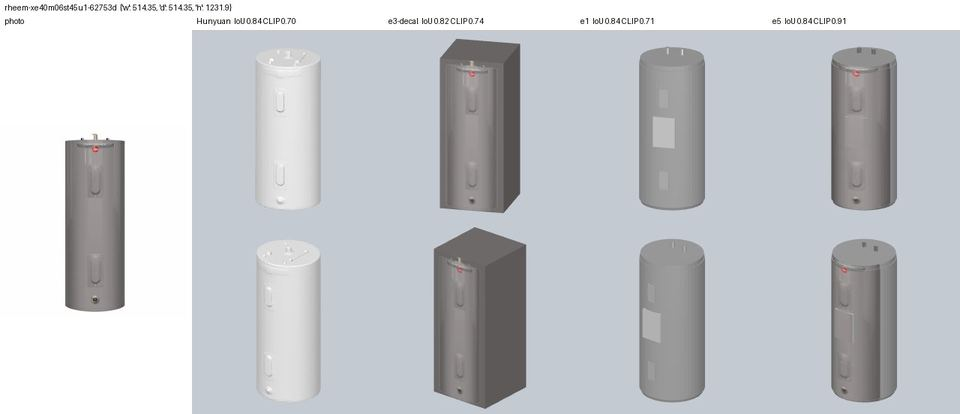
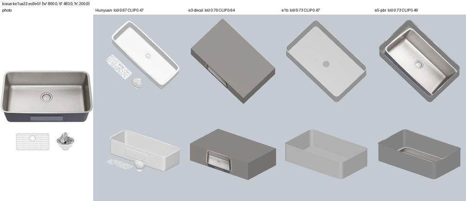
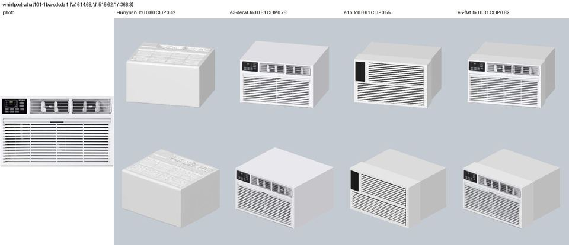
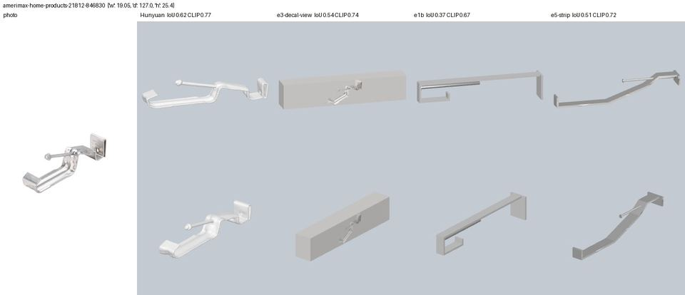

# E5: template geometry + projected product photo

Bench row E5 in `../p4-llm-assets-bench.md`. Session 2026-09-26, laptop, Groq only (no Grok).

**Hypothesis.** E1 gets the shape right and E3 gets the look right. Combining them should beat
both, and Hunyuan, for a VR preview, at 1–2 Groq calls per asset. The combination is E1's
template geometry, with the product photo projected onto the face the photo shows and the
template colours everywhere else.

**Code.**
- `server/experiments/assets_llm/e5_run.py` is the runner. Its commands are in the docstring.
  Outputs go to `work/assets-llm/e5/<id>/`, and the gallery to `work/assets-llm/e5/gallery/`
  and `gallery.html`.
- `templates.py` gains the `bent_strip` template, per-role `finishes` (PBR), and a longer
  self-check (25 variants).

```bash
uv run --with manifold3d --with rtree --with pyrender --with scipy --with open_clip_torch \
    --index https://download.pytorch.org/whl/cpu \
    python -m server.experiments.assets_llm.e5_run [ids...] [--rerun] [--gallery]
```

## 1. How the combination is built

1. **Geometry.** E1's best variant is rebuilt from its cached answers: `e1b` where the keep
   gate kept it, otherwise `e1`. Colour changes from the critique pass go through the colour
   gate (§3c).
2. **Face.** The face comes from E3's cached view call; no new calls. There is one template
   prior: for `sink`, a "front" answer becomes "top", because catalogue sink photos look into
   the bowl. The v2 view call got exactly this one wrong (E3 §4).
3. **Projection.**
   - The cropped photo (`decal.cut_product`, background repainted with the edge colour) is
     stretched over the geometry's bbox on that face. It is not letterboxed: the template
     fills the product outline, so the photo's product bbox maps onto it.
   - It goes on every triangle whose normal·axis is at least 0.35 **and** that can see the
     camera: a ray from the triangle centre or from one of its 3 corners must escape the part.
     Without that test, the condenser's side louvres and the fan-guard rings picked up photo
     streaks.
   - Every other triangle keeps its template role material.
   - Result: one JPEG (≤1024 px, q80) on one extra `photo` primitive.
4. **Side (profile) photos.** These go on both sides with one world mapping. Whether the
   photo runs back→front or front→back is decided without an LLM, by the silhouette IoU of the
   geometry's side view against the photo mask, both ways round.
5. **Photo mode (`e5-flat`).** Where the photo already shows the front relief, the template
   drops it: slats and control strip on `box_appliance`, nozzles and centre disc on `fixture`.
   The photo and the geometry otherwise draw the same pattern twice, offset.
6. **Skipped.** A normal-weighted fade from photo to template colour. It needs a baked
   texture. The hard 0.35 cut looks fine on the 48-segment cylinder.

## 2. Results

IoU and CLIP from `score.py`. E3 is the decal box on the view-call face. E1 is `e1b` where
kept, otherwise `e1`. "E5 final" is the variant production would run: `e5-strip` for the
hangers, `e5-flat` for front photos of templates with photo-mode relief, `e5-pbr` for metal
parts. All 36 E5-era rows (e5 ×12, e5-strip/-flat/-pbr, e1-strip/-pbr, e1b-cgate) are valid,
with bbox error 0.00 % and 0 floating pieces.

My verdicts come from the gallery sheets (photo side + 3/4): ✓ E5 better, = same, ✗ worse.

| part | Hunyuan | E3 box | E1 | e5 | E5 final | KB | vs Hy | vs E1 | vs E3 | why |
|---|---|---|---|---|---|---|---|---|---|---|
| joist hanger | .28/.66 | .32/.53 | .27/.66 | .27/.70 | .27/.69 pbr | 76 | ✓ | = | ✓ | clean U; the photo adds hole texture on the flanges; Hunyuan is a crumpled plate |
| gutter hanger, alu | .62/.77 | .54/.74 | .37/.67 | .37/.68 | **.51/.72** strip | 36 | ✗ | ✓ | ✓ | stepped strap, both clips, screw; Hunyuan still has the rounded clips |
| gutter hanger, vinyl | .46/.83 | .40/.92 | .31/.69 | .31/.75 | .34/.74 strip | 38 | ✗ | = | = | back plate and front clip right, arm slope reversed; E3 is a box that carries the photo |
| condenser pad | – | .60/.68 | .60/.68 | .60/.74 | = | 40 | – | ✓ | = | 3/4 photo lies skewed on the top, as in E3; dark sides from E1 |
| AC condenser | – | .91/.67 | .92/.49 | .92/.70 | = | 119 | – | ✓ | ✓ | photo front (logo, coil) + fan guard on top + louvred sides |
| water heater | .84/.70 | .82/.74 | .84/.71 | **.84/.91** | = | 39 | ✓ | ✓ | ✓ | best of the run: reads as the product from every side |
| sink | .67/.47 | .70/.64 | .74/.47 | .74/.47 | .74/.49 pbr, top | 23 | ✓ | ✓ | ✓ | real bowl with the photo inside; CLIP under-rewards top faces (E3 §4) |
| shower head | – | .76/.81 | .77/.63 | .77/.70 | **.77/.76** flat | 102 | – | ✓ | ✓ | round chrome head with the photo face; e5 (not flat) doubled the nozzles |
| solar panel | – | .82/.69 | .82/.72 | .82/.76 | = | 180 | – | ✗ | = | the 4-pack photo lies tilted over the cell grid; E1's clean grid looks better |
| wall AC | .80/.42 | .81/.78 | .81/.55 | .81/.70 | **.81/.82** flat | 96 | ✓ | ✓ | ✓ | photo front on E1's stepped sleeve; e5 (not flat) shows dark gaps between the slats |
| fridge | .94/.54 | .90/.71 | .90/.49 | .90/.74 | .90/.74 pbr | 44 | ✓ | ✓ | = | almost the E3 look; handles in relief; store stickers come with the photo |
| mini-split | .64/.37 | .61/.67 | .61/.55 | .61/.62 | = | 194 | ✓ | ✗ | = | kit photo (hoses, remote) smeared over the fan; E1 is cleaner |

Means (IoU / CLIP):

| subset | Hunyuan | E3 box | E1 | e5 | E5 final |
|---|---|---|---|---|---|
| all 12 | – | 0.68 / 0.72 | 0.66 / 0.61 | 0.66 / 0.71 | 0.68 / 0.72 |
| 8 Hunyuan parts | 0.66 / 0.60 | 0.64 / 0.72 | 0.60 / 0.60 | 0.60 / 0.70 | 0.63 / 0.72 |

Visual tally for E5 final:

| compared with | better | same | worse | notes |
|---|---|---|---|---|
| Hunyuan (8 parts) | 6 | 0 | 2 | the losses are the two gutter hangers |
| E1 (12 parts) | 8 | 2 | 2 | the losses are the two bad photos |
| E3 decal box (12 parts) | 7 | 5 | 0 | |

The metrics don't separate E5 from E3:
- CLIP takes the best of seven low-elevation views, and a box's front view *is* the photo.
- IoU rewards filled boxes.

The difference is in the 3/4 view: a cylinder, a bowl, a round head and a stepped sleeve,
where E3 shows a box.






**Size and time.**
- **File size.** E5 final is 23–194 KB, mean 82 KB. Hunyuan is 352 KB. The largest plain e5
  (the shower head, 9.7K triangles of nozzles) is 299 KB; in photo mode it drops to 102 KB.
  Texture size is capped by the source crop (for example 312–792 px).
- **CPU time.** 0.01–0.4 s to build the template, plus 0.6–1.6 s for the projection with the
  ray test.

**Cost per asset.**
- **E5 as run.** The E1 generation call (3.6K in / ~205 out) plus E3's view call (1.5K / 33),
  plus the critique where kept. Mean 2.8 calls, 7.6K in / 340 out.
- **Without the critique pass.** 2 calls, about 5.1K in / 240 out, about $0.005.

## 3. The E1 fixes

**(a) `bent_strip`.** A side-view polyline of `[z, y]` fractions, swept as a strip of
thickness t:
- one box per segment, and an X-cylinder of radius t/2 at every point, so bends are rounded;
- an optional second polyline (a brace), a wider back plate, and a screw along Z;
- the polyline is normalised and inset by t/2, so the strip fills W×H×D exactly (fit scale 1.0).

Qwen got the new catalogue (plus a finishes line) in one generation call per hanger: 4.05K in,
about 300 out. It chose `bent_strip` unprompted both times.

| part | E1 IoU / CLIP | e1-strip IoU / CLIP | result |
|---|---|---|---|
| alu hanger | 0.37 / 0.67 | **0.51 / 0.70** | right: a stepped Z strap with a clip at each end and a screw |
| vinyl hanger | 0.31 / 0.69 | 0.34 / 0.69 | the arm rises from the bottom instead of falling from the top |

Hunyuan still wins on both, because the parts are moulded and rounded. The template closes
most of the gap on bent sheet metal, not on mouldings.

**(b) PBR finishes.**
- `build(..., finishes={role: name})` maps chrome, stainless, brushed, galvanized, painted,
  plastic, rubber and glass to metallic/roughness values.
- Metallic is capped at 0.8. A metal's albedo is lifted to a mean of at least 0.5 linear.
  Both are because a viewer with no environment map renders full metal almost black: pyrender
  here, and a Quest passthrough scene without a reflection probe.
- The finish comes from one small call (photo, role list, listing material): about 1.4K in,
  17–45 out. The answers were sensible: galvanized; stainless; chrome with rubber nozzles;
  stainless with plastic handles.
- **Metrics.** CLIP e1 → e1-pbr: joist hanger +0.02, sink +0.03, fridge +0.01, shower head
  −0.05 (chrome renders darker without an environment). Inside E5 the effect is ±0.02, because
  the photo covers the front.
- **Renders.** Galvanized and stainless read as lighter satin metal. Chrome reads as grey
  with highlights: sensible, not mirror-like.
- **Not checked.** The Unity/glTFast render on Quest.

**(c) Colour gate on critique patches.**
- A critique colour change is kept only if the photo contradicts the old colour (under 5 % of
  product pixels within RGB distance 48) and supports the new one better.
- **Outcome.** It dropped 5 of 6 changes: shower-head face lighter, solar cells, fridge door
  darker, mini-split grille white, recess. It let one wrong change through: the mini-split's
  blue blades turned white, because white is everywhere in that kit photo.
- **Effect.** CLIP moved by −0.02 to +0.02 (`e1b-cgate` rows). It is worth having as a guard,
  and under E5 it hardly matters, since the photo sets the front colours.

**Qwen tokens spent in E5:** 6 calls, 14.5K tokens in total (budget 40K).

## 4. Failure modes

- **Bad photos, as in E3.**
  - A kit photo (mini-split).
  - A tilted 4-pack (solar panel).
  - A 3/4 perspective flattened onto one face (pad top, condenser front).

  Since E5 puts the photo on geometry, a bad photo now hurts *more* than on E1's clean
  template. Photo quality should decide whether to project at all: a single product and
  roughly one face visible.
- **Profile flip.** The silhouette IoU is low on thin strips (0.13 on the alu hanger), so the
  back→front direction there is close to a coin toss. At gallery scale a wrong flip on these
  near-uniform strips is not visible, so I could not check it.
- **Sink.** It needed the template prior. The view call said "front".

## 5. Verdict and recommendation for `ai_mesh`

- **Hypothesis.** Holds visually, not on the metrics. E5 beats Hunyuan on 6/8 parts, E1 on
  8/12 and the E3 box on 7/12, and never loses to the E3 box. It is 4x smaller than Hunyuan,
  about 1 s of CPU, and needs no Space quota.
- **The `ai_mesh` tier should become E5:**
  - **One Qwen call.** Fold the view question ("which face does the photo show") and the
    finishes into the E1 generation prompt.
  - **Build and project.** Build the template, then project the photo in photo mode, with the
    ray test and the sink/bowl prior.
  - **Drop the critique pass.** The photo sets the front colours, and photo mode makes the
    front-relief layout moot.
  - **Photo check.** Project only when the photo shows one product (one main blob, no kit).
    Otherwise ship the plain template.
- **Keep Hunyuan (plus photo, E3 §3) only as a fallback** for moulded or organic small parts
  where no template fits (clips, vinyl hangers), and only once `normalize_mesh` orientation is
  fixed.
- **Keep the E3 decal box as the instant `proxy` tier.**
