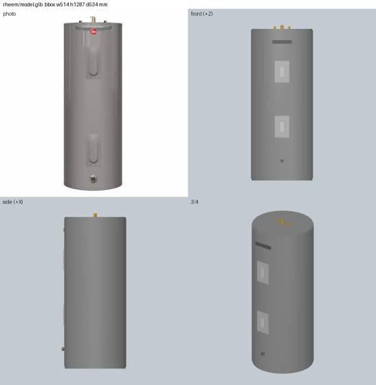
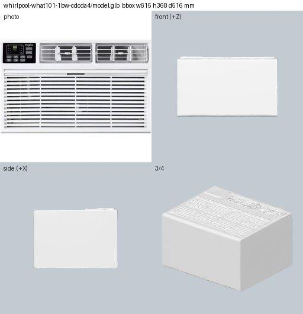

# R3: toolchain probe, renderer, scoring harness and test set for LLM-built part assets

Session 2026-09-25/26, laptop only (Fedora, 16 cores, 15 GB RAM, Intel Iris Xe iGPU, no NVIDIA).
Question: can an LLM write code in a sandbox that builds `model.glb` per part (docs/api.md §2:
metres, +Y up, X = w, Y = h, Z = d out of the mounting face, origin at the mounting-face centre),
with render feedback? This note covers the ground to run that on: which code backend, how to render
feedback images, how to score a result, and a first Groq call. Paper and practitioner surveys are in
`r1-academic.md` and `r2-practitioners.md`.

Code (committed): `server/experiments/assets_llm/`, with `render.py`, `score.py`, `cq_to_glb.py`
and `groq_smoke.py`. None of it is a project dependency. Everything else (venvs, test set JSON,
smoke outputs) is in `work/assets-llm/` (gitignored).

## 0. Summary

- **Backend: CadQuery.** It has the most LLM training exposure and a full B-rep kernel (fillet,
  shell, loft, sweep), which sinks, hangers and rounded appliances need. The cost is a 1.7 GB env
  and a 5–9 s import. Export it through our own path (`cq_to_glb.py`: STL per colour, then
  trimesh, then GLB) and don't use `Assembly.export`, which leaves the model in millimetres.
  build123d and OpenSCAD are workable second choices. bpy works but is fragile. Plain trimesh +
  manifold3d is the fast fallback.
- **Renderer: pyrender over EGL.** A 2x2 sheet (photo | front / side | 3/4) takes 0.15 s on the
  iGPU and 0.3 s on Mesa llvmpipe (no GPU), after a 2 s import. The photo sits on the sheet, so one
  image per request covers both the photo and the renders (Groq's vision model takes at most 3).
- **Groq `qwen/qwen3.8-27b`.** It answers fast: 3.7–6 s per call, 1.3–2.5K output tokens. All 3
  generated scripts compiled and exported. The water heater came out close (bbox within 4.5 %,
  silhouette IoU 0.87, CLIP 0.79, beating the Hunyuan baseline's 0.84 / 0.70). The wall AC and
  the joist hanger failed on **frame and axis mistakes**, not on CadQuery syntax. The free tier
  also enforces an **undocumented ~1000 output-tokens-per-minute limit**: the third call inside
  about 2 minutes got a 429. In practice that allows about one generation per minute.
- **Scoring works on CPU.** The checks are load, watertight, bbox vs dims, origin, triangle count,
  file size, best-view silhouette IoU against the photo and CLIP ViT-B/32 similarity. A part
  takes 0.7 s without CLIP and 2–4 s with it, after a 12 s CLIP load. Baselines are in §5.
- **Hunyuan baseline problems found on the way.** They affect the current pipeline:
  (a) the 24-rotation search in `normalize_mesh` picks an orientation by aspect ratio alone, so the
  wall AC's grille faces up and the joist hanger lies on its side;
  (b) a cluttered photo (mini-split plus accessories) gives two flat plates;
  (c) `_paint` writes sRGB hex values straight into `baseColorFactor`, which glTF defines as
  linear, so every colour renders washed out (`#CCCCCC` shows as about `#E7E7E7`).

## 1. Test set (12 parts)

The list is in `work/assets-llm/testset.json`. Each entry has the id, name, category, dims_mm,
mount, colour/material/finish, photo path, image_url, tier and the baseline GLB path. Every part
has `data/parts/<id>/image.jpg`. Of the 12, 8 have a Hunyuan `ai_mesh` baseline and 4 are proxy
boxes. The cache has no faucet or standalone fan; the closest stand-ins are the shower head and
the condenser or mini-split outdoor unit.

| id | category | dims w x h x d mm | tier | note |
|---|---|---|---|---|
| `simpson-strong-tie-lus26-a9ce07` | bracket, bent sheet metal | 90 x 51 x 121 | ai_mesh | **dims look swapped** (a real LUS26 is about 121 mm tall) |
| `amerimax-home-products-21812-846830` | hanger, thin strip + screw | 19 x 25 x 127 | ai_mesh | |
| `amerimax-home-products-m0722b-d6dfa5` | hanger, moulded plastic | 25 x 70 x 114 | ai_mesh | white on white photo |
| `cambridge-203094-45fe23` | slab | 914 x 76 x 914 | proxy | easy sanity case |
| `aciq-14-3-seer2-central-air-conditioner-condenser-a0436b` | box + fan grille | 740 x 635 x 740 | proxy | |
| `rheem-xe40m06st45u1-62753d` | cylinder | 514 x 1232 x 514 | ai_mesh | electric water heater |
| `kraus-ke1us32-ec0e5f` | sink, hollow bowl | 800 x 200 x 483 | ai_mesh | photo includes the grid and strainer |
| `delta-75641-d491ed` | round fixture | 111 x 111 x 92 | proxy | chrome shower head |
| `renogy-rng-320dx4-97f5a1` | panel | 881 x 1636 x 36 | proxy | photo shows a 4-pack |
| `whirlpool-what101-1bw-cdcda4` | box appliance + grilles | 615 x 368 x 516 | ai_mesh | through-wall AC |
| `samsung-rf70f29mer-f13bd2` | tall box appliance | 908 x 1778 x 870 | ai_mesh | store sticker on the photo |
| `costway-ghm0542-cf4a3a` | fan unit, cluttered photo | 737 x 533 x 279 | ai_mesh | photo has indoor + outdoor units + kit; dims are the outdoor unit |

## 2. Code backends

Hello world: an L-bracket (100 x 60 x 4 plate with two holes, a 100 x 4 x 50 upright) plus a red
knob, in two colours, exported to GLB. Each backend has a venv under `work/assets-llm/envs/`,
Python 3.13 (uv-managed). Import times are warm, from 3 runs.

| backend | install | env size | import | build + export | GLB export | colours | verdict |
|---|---|---|---|---|---|---|---|
| **CadQuery 2.8.0** (OCP 7.9.3) | `uv pip install cadquery`, 35 s | 1.7 GB (vtk 638 MB, casadi 261 MB, llvmlite 172 MB, OCP 263 MB) | 5.3–9.2 s | 0.29 s | native `Assembly.export("x.glb")`: NORMAL, Z-up converted to Y-up, **but units stay mm** (bbox ±50 "m"); one primitive per B-rep face; watertight after merging by position | per-part materials, `baseColorFactor` converted sRGB to linear | **Primary.** Most LLM exposure, full B-rep. Export with our own STL-per-colour path |
| **build123d 0.13.0** (OCP 8.0) | `uv pip install build123d`, 22 s | 824 MB | 7.2–9.3 s | 0.12 s | `export_gltf`: metres, Y-up, NORMAL + TEXCOORD | only with `Compound(children=[...])`; `Compound([a, b])` **drops colours silently** | Second choice. Same kernel, lighter, but less LLM familiarity and API churn between versions |
| **bpy 5.2.2 LTS** wheel | needs Python ==3.13 (uv fetches it); 383 MB wheel; 49 s | 961 MB | 2.0 s | 0.5–1.5 s | Khronos exporter: metres, Y-up, NORMAL + UV | Principled BSDF to PBR. **Gotcha:** a boolean modifier adds its operand's empty material slot, so a later `materials.append` lands in slot 2 and the body exports with no material. Call `materials.clear()` first | Works, and it can render too, but the ops API depends on context (active object, mode). Later option for organic or bevelled shapes. Portable Blender not needed |
| **OpenSCAD nightly 2026.09.23** AppImage | `curl` 81 MB to `work/assets-llm/tools/`, runs without sudo (FUSE present; otherwise use `--appimage-extract`) | 81 MB | 0.7 s startup | 0.9–1.0 s (`--backend=manifold`) | no GLB: stl/off/3mf/wrl; mm, Z-up; convert with trimesh | `color()` survives only in 3MF (per-triangle `basematerials`), and trimesh's 3MF loader drops it, so we need a ~15-line XML parser | Viable, fast, well known to LLMs. Weaker vocabulary: no fillet, shell or loft, only hull, minkowski and rotate_extrude |
| **trimesh 5.1 + manifold3d 3.5.4** | `uv pip install trimesh manifold3d`, 1 s (trimesh is already a project dep) | 192 MB | 1.9 s | 0.04 s | metres as given, no axis conversion; watertight booleans; no NORMAL written by default (viewers shade flat) | per-mesh `PBRMaterial` | Fastest and dependency-free, but primitives only (box, cylinder, sphere, extrude, revolve) and all transforms by matrix. Good fallback or "proxy+" tier |

**Frame contract for LLM code** (in `cq_to_glb.py` and the prompt): write in the usual CAD frame:
mm, Z up, product front facing -Y (CadQuery's "front" plane), back or mounting face on Y=0,
product in `-d <= Y <= 0`, `-w/2 <= X <= w/2`, `0 <= Z <= h`. The script ends with
`parts = [(shape, "#RRGGBB"), ...]`. `cq_to_glb` maps `(x, y, z) -> (x, z - h/2, -y) / 1000`.
That is the standard Z-up to Y-up rotation (det +1, so nothing is mirrored) plus the
mounting-face-centre origin. The offset uses the declared h rather than the bbox, so a model with
the wrong size stays wrong and the scorer reports it. Hex colours are converted to linear.

## 3. Renderer

`server/experiments/assets_llm/render.py`: pyrender 0.1.45, `PYOPENGL_PLATFORM=egl`, flat shading
(CAD output has hard edges), and one orthographic scale shared by all views (the bounding-sphere
radius), so sizes compare directly across panels. The sheet is 2x2: product photo | front (camera
on +Z) / side (+X) | 3/4 (from +X+Y+Z), on a blue-grey background (white appliances and chrome
both stand out from it). A header line shows the bbox in mm. `render_views()` also returns depth
masks for scoring.

| device | per sheet (768 x 786 px) | first sheet (makes the GL context) |
|---|---|---|
| Iris Xe via Mesa EGL (default) | 0.14–0.15 s | 0.32 s |
| Mesa llvmpipe (`EGL_DEVICE_ID=1`, CPU only) | 0.26–0.31 s | 0.75 s |

Import takes 2.1 s. Alternatives not taken:
- Blender Eevee also needs EGL, and bpy adds scene setup cost.
- Cycles on the CPU takes seconds per view.
- trimesh + pyglet needs a display.
- A numpy rasteriser would be more code to maintain.

pyrender pins PyOpenGL 3.1.0, which works with EGL on Python 3.13, so
`uv run --with pyrender` is enough.

```bash
uv run --with pyrender python -m server.experiments.assets_llm.render \
    data/parts/<id>/model.glb out.jpg --photo data/parts/<id>/image.jpg
```

## 4. Groq smoke test

**Model facts.** From `GET /openai/v1/models/qwen/qwen3.8-27b`, 2026-09-26:
- context 131,072 tokens, max completion 16,384
- input text + image (≤3 images per request), output text
- `supported_features: tools, json_mode, reasoning`; no structured outputs, so no strict json_schema
- price $0.80 / $4.00 per million tokens in/out on paid tiers

**Rate limits.** The free-tier headers say 8,000 tokens/min (TPM) and 1,000 requests/day. On top
of that, the third request inside about 2 minutes got
`429 ... output tokens per minute (OTPM): Limit 1000, Requested 1351`. The limit is not in the
headers, and the request passed after a 75 s wait. Budget **about one code generation per
minute**. A render-feedback loop with 3–5 rounds therefore takes about 3–5 min per part on the
free tier.

**Prompt.** `groq_smoke.py`: one user message with the photo (768 px JPEG) and text giving the
name, material, exact dims and the frame contract from §2, asking for one python block ending in
`parts = [...]`. Settings: `temperature=0.3`, `reasoning_format=parsed`. No reasoning text came
back, so the default mode answers directly and every completion token is code.

**Calls used:** 4 chat calls (3 succeeded, 1 got the OTPM 429) plus 2 free `GET /models` calls.

| part | latency | tokens in / out | compiles + exports | bbox err w/h/d % | origin ok | sil IoU | CLIP | Hunyuan IoU / CLIP |
|---|---|---|---|---|---|---|---|---|
| rheem water heater | 3.7 s | 1597 / 1338 | yes, 10 parts, 1.8K tris | -0.1 / +4.5 / +3.9 | yes | **0.87** | **0.79** | 0.84 / 0.70 |
| whirlpool wall AC | 3.7 s | 1605 / 1351 | yes, 2 parts, 2.4K tris | 0 / 0 / **+70** | no (body shifted half a depth) | 0.68 | 0.32 | 0.80 / 0.42 |
| simpson LUS26 hanger | 6.0 s | 1588 / 2537 | yes, 1 part, 1K tris | **+81** / 0 / +36 | no | 0.26 | 0.67 | 0.28 / 0.66 |

Water heater (images saved as small JPEGs): `r3/groq-rheem.jpg`, shown below. It has the tank,
two access panels, the drain valve and the pipes. The pipes and bottom cap stick past h, hence
+4.5 % in height.



The failures are about geometry and frames:
- **Wall AC:** `box(W, D, H, centered=(True, False, False)).translate((0, -D/2, 0))` puts half
  the body behind the wall. Front panels drawn as `Workplane("XZ").box(w, 4, h)` get CadQuery's
  local axes wrong: on an XZ plane, the box's second size runs along world Z and the third along
  world -Y, so the "panels" come out as horizontal shelves sticking out of the front
  (`r3/groq-whirlpool.jpg`).
- **Joist hanger:** flat plates in the wrong planes (`r3/groq-simpson.jpg`). The dims are also
  suspect (§1).

Implications for the loop:
- Put the bbox numbers and the sheet into the feedback turn.
- Give the model a few frame-safe helpers in the prompt, e.g. `box_at(x0, x1, y0, y1, z0, z1)`
  and `cyl_z(cx, cy, r, z0, z1)`.
- Optionally post-normalise as `normalize_mesh` does, so dims are exact and the loop only has to
  fix shape.

## 5. Scoring harness

`server/experiments/assets_llm/score.py`. `score_part(part_dir, glb=None)` returns one JSON
object. `--glb` scores a candidate against the part's `part.json` and photo.

| field | how |
|---|---|
| `loads`, `primitives` | `trimesh.load(force="scene")`, count of non-empty triangle meshes |
| `watertight`, `watertight_frac` | per primitive, after merging vertices by position only (glTF splits vertices at normal and UV seams). Checked per primitive because touching parts share edges once concatenated |
| `bbox_mm`, `dims_err_pct`, `bbox_ok` | extents vs `[w, h, d]` on X/Y/Z; ok when every axis is within 2 % |
| `origin_off`, `origin_ok` | (x centre / w, y centre / h, z min / d); ok when every value is within 0.02 |
| `triangles`, `file_kb` | |
| `sil_iou`, `sil_view` | photo foreground: flood the border colour in from the edges, tolerance 12 (keeps white-on-white bodies), keep the largest blob (drops badges and accessories), fill holes. Render masks from 7 views (yaw 0/±30/±45/60/90 at a slight elevation). Both masks are cropped, padded to square and resized to 128²; the best IoU is kept |
| `clip_sim` | open_clip ViT-B-32 `laion2b_s34b_b79k` on CPU: max cosine between the photo and the 7 renders. Load takes 12 s warm (the first run downloads about 600 MB), then about 1–3 s per part. CPU torch wheel, env 1.1 GB total |

Timing: 0.7 s per part without CLIP, 2–4 s with it. All 12 parts take 44 s including the model
load. `--selfcheck` asserts the bbox, origin and IoU logic on a synthetic box.

**Reading the metrics.** Silhouette IoU on its own rewards boxes: the proxy condenser scores 0.91
because a box outline matches a boxy photo. CLIP separates those cases (0.29), so use both. CLIP
values only mean something relative to other candidates for the same part, with a spread of about
0.25–0.85. A mesh that `normalize_mesh` stretches to size always scores ≈0 % on dims, so dims only
tell LLM candidates apart before normalisation.

**Baselines** (current `data/parts/<id>/model.glb`, 2026-09-26):

| id | category | dims w x h x d | tier | watertight | tris | KB | max dims err % | origin ok | sil IoU (view) | CLIP |
|---|---|---|---|---|---|---|---|---|---|---|
| `simpson-strong-tie-lus26-a9ce07` | bracket | 90 x 51 x 121 | ai_mesh | yes | 20000 | 352 | 0.40 | yes | 0.28 (yaw0) | 0.66 |
| `amerimax-home-products-21812-846830` | hanger | 19 x 25 x 127 | ai_mesh | yes | 20000 | 352 | 0.78 | yes | 0.62 (yaw30) | 0.77 |
| `amerimax-home-products-m0722b-d6dfa5` | hanger (plastic) | 25 x 70 x 114 | ai_mesh | no | 20000 | 352 | 0.71 | yes | 0.46 (yaw-30) | 0.83 |
| `cambridge-203094-45fe23` | slab | 914 x 76 x 914 | proxy | yes | 12 | 1 | 0.00 | yes | 0.60 (yaw0) | 0.62 |
| `aciq-14-3-seer2-central-air-conditioner-condenser-a0436b` | box + fan | 740 x 635 x 740 | proxy | yes | 12 | 1 | 0.00 | yes | 0.91 (yaw0) | 0.29 |
| `rheem-xe40m06st45u1-62753d` | cylinder | 514 x 1232 x 514 | ai_mesh | yes | 20000 | 352 | 0.02 | yes | 0.84 (yaw60) | 0.70 |
| `kraus-ke1us32-ec0e5f` | sink | 800 x 200 x 483 | ai_mesh | no | 20000 | 350 | 0.36 | yes | 0.67 (yaw-45) | 0.47 |
| `delta-75641-d491ed` | round fixture | 111 x 111 x 92 | proxy | yes | 12 | 1 | 0.00 | yes | 0.76 (yaw60) | 0.26 |
| `renogy-rng-320dx4-97f5a1` | panel | 881 x 1636 x 36 | proxy | yes | 12 | 1 | 0.00 | yes | 0.82 (yaw0) | 0.60 |
| `whirlpool-what101-1bw-cdcda4` | box appliance | 615 x 368 x 516 | ai_mesh | no | 20000 | 352 | 0.01 | yes | 0.80 (yaw60) | 0.42 |
| `samsung-rf70f29mer-f13bd2` | tall box | 908 x 1778 x 870 | ai_mesh | no | 20000 | 352 | 0.04 | yes | 0.94 (yaw0) | 0.54 |
| `costway-ghm0542-cf4a3a` | fan unit | 737 x 533 x 279 | ai_mesh | yes | 20000 | 352 | 0.04 | yes | 0.64 (yaw-30) | 0.36 |

Means: Hunyuan (8) IoU 0.66, CLIP 0.59. Proxy (4) IoU 0.77, CLIP 0.44.

All 12 baseline sheets are in `r3/baselines.jpg`. The Hunyuan wall AC below shows the orientation
bug: the 24-rotation search matched the extents, but the grille ended up on top, and the front
(+Z) view is a blank panel.



## 6. Commands

```bash
# venvs used here (recreate):
cd work/assets-llm/envs
uv venv --python 3.13 cq && uv pip install --python cq/bin/python cadquery trimesh
uv venv --python 3.13 render && uv pip install --python render/bin/python pyrender scipy \
  && uv pip install --python render/bin/python torch --index-url https://download.pytorch.org/whl/cpu \
  && uv pip install --python render/bin/python open_clip_torch

# LLM code -> contract GLB (h in mm):
work/assets-llm/envs/cq/bin/python -m server.experiments.assets_llm.cq_to_glb code.py out.glb 1231.9
# render the feedback sheet:
uv run --with pyrender python -m server.experiments.assets_llm.render out.glb sheet.jpg \
    --photo data/parts/<id>/image.jpg
# score a candidate (drop --glb to score the cached model.glb; --no-clip skips torch):
uv run --with pyrender --with scipy --with open_clip_torch \
    --index https://download.pytorch.org/whl/cpu \
    python -m server.experiments.assets_llm.score data/parts/<id> --glb out.glb
# one Groq generation (reads GROQ_API_KEY from .env):
uv run python -m server.experiments.assets_llm.groq_smoke data/parts/<id> work/assets-llm/smoke/<id>
```
