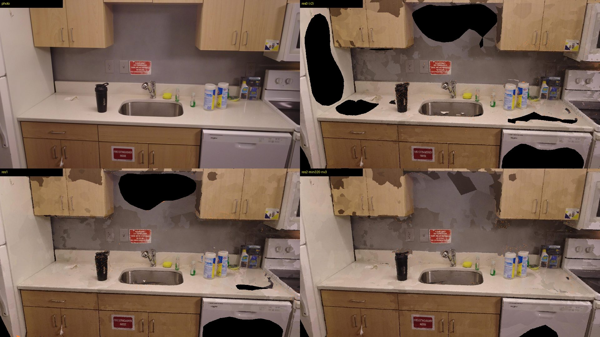
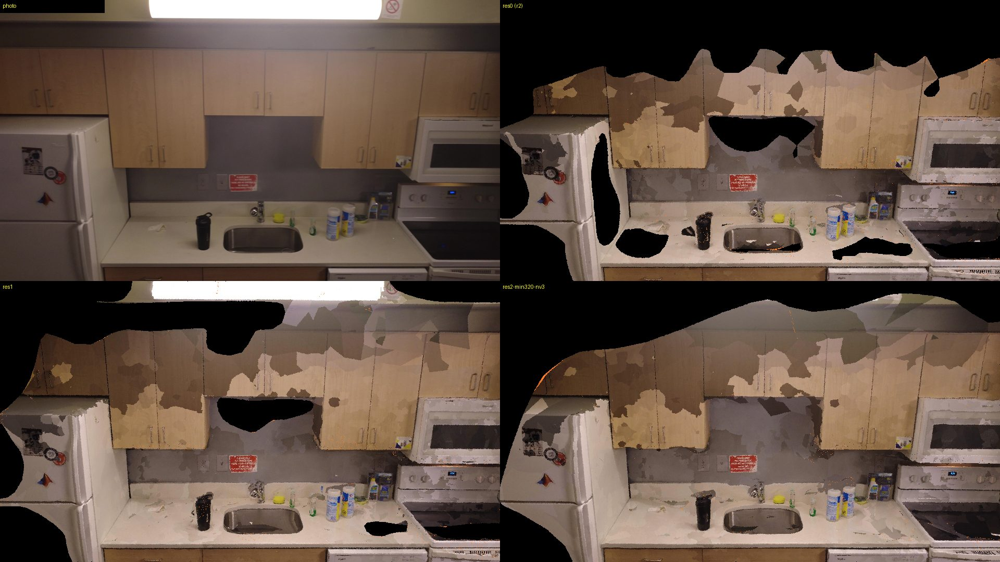

# E1: bench harness, baselines, preview scale, densify sweep (kitchen-0095)

Experiment log for the 2026-09-25 bench session. Each experiment lists the exact command, the wall
time and every metric. `docs/research/p1-recon-bench.md` §3 is the merged view.

## 1. Harness (`pipeline/experiments/bench/`)

```sh
# once: reference cameras, 59 full-res evaluation frames, reference cloud  (193 s on hfbox)
uv run --extra pipeline python -m pipeline.experiments.bench reference \
  --video data/real/DJI_0095.MP4 --frames-dir work/dji0095/frames --srt work/dji0095/telemetry.srt \
  --out /workspace/bench/ref \
  --cloud work/dji0095/mvs/scene_dense.ply --cloud-sparse work/dji0095/sfm/dense/sparse

# per candidate: a dir with scene.json (or mesh.glb + cameras.json), plus camera timestamps
uv run --extra pipeline python -m pipeline.experiments.bench score scene/bench/<run> \
  --ref /workspace/bench/ref --name <run> --out /workspace/bench/results \
  [--times frame_times.json | --id-fps 10] [--run-json runs/<run>.json] [--report work/<run>/report.json] \
  [--wall-s N] [--cached-s N]
```

Outputs `<out>/<run>.json` (all metrics plus per-frame rows), `<out>/<run>/<id>.png` side-by-sides
(photo | render | diff, every 10th eval frame) and one appended row in `<out>/results.md`.

**Design choices**

- **Evaluation frames.** The pipeline's 10 fps grid (frame *i* at *(i−1)/10* s, the same `fps=10`
  filter `extract_frames` uses) with *i* ≡ 3 (mod 15): 59 frames, one every 1.5 s from 0.2 s to
  87.2 s. None is an SfM frame of a `--fps 1/2/3` pipeline run (those use *i* ≡ 1 mod 10 or mod 5),
  so for our runs every evaluation frame is held out. Extracted once at 3840×2160 and undistorted
  to the reference pinhole.
- **Reference cameras: a dedicated reference SfM**, not frames added to the `work/dji0095` model.
  pycolmap has no one-call "register these extra images into an existing model", and a rebuilt
  database would be a different model anyway. The reference runs the pipeline's own `sfm.run_sfm`
  (sequential matching, global mapper with incremental fallback) on every 3rd 10 fps frame
  (~3.3 fps, 291 frames at 1920 px), which contains every evaluation frame by construction. It is
  made metric and +Y-up exactly as the pipeline calibrates a GPS-less clip (`up_from_cameras`,
  caption `altitude` scale).
- **Aligning a candidate.** Sim(3) Umeyama from the candidate's camera centres to the reference
  track interpolated at the same video timestamps (`calibrate.umeyama`,
  `interpolate_positions_at_times`), refit once without cameras whose residual exceeds
  max(3× median, 2 cm). The fitted scale doubles as the **scale accuracy** metric (size error vs the
  reference's caption-altitude metres). The candidate mesh is moved into the reference frame and
  rendered at each evaluation camera with `preview.render` at 960×540; PSNR/SSIM come from `qa`.
- **Reference geometry.** The r2 run's OpenMVS `scene_dense.ply` (2.4 M points, resolution level 0,
  2 fps), brought into the reference frame the same way and voxel-downsampled to 5 mm. Candidate
  surface samples (20k/m², ≤1 M) outside the cloud's bounding box +5 cm are dropped. Nearest
  neighbours by `scipy.spatial.cKDTree` (exact; OpenCV FLANN was tested and is not exact on
  planar data).
- **Bias.** The reference cloud is an OpenMVS product: OpenMVS variants (and anything sharing its
  depth-map fusion and its failure modes on dark, untextured surfaces) are favoured on Chamfer/F.
  The reference is also the densest setting in the sweep, so faster densify settings lose recall
  partly by construction. Held-out PSNR/SSIM and view coverage are the method-neutral checks.
- **Held-out breakdown.** A frame is "seen" when the candidate has a camera within half a video
  frame of it. `held_out` and `seen` aggregates are reported separately; for our pipeline runs
  every frame is held out.
- **Registration coverage.** The fraction of evaluation frames with a candidate camera within 1 s.
- **Detail.** Laplacian-variance ratio render/photo on covered pixels (mask eroded 2 px), plus
  triangles/m² and texels/m² over the aligned mesh area.
- **Quest budget.** ≤200k triangles, ≤4096 px texture, GLB ≤20 MB (our own download cap).
- **LPIPS: not computed.** No LPIPS package or CPU torch in the pipeline env; the VGGT ROCm env has
  torch but no LPIPS weights. Not worth a new dependency for this pass.

## 2. Runs

**Reference build** (`reference`, 193 s on hfbox, most of it the SfM):
- SfM: 275/291 frames registered, global mapper, one component, mean reprojection error 0.64 px
  (features 32 s, matching 17 s, mapping 127 s).
- The 16 unregistered frames are all in the last 4.5 s (t ≥ 82.7 s). There the drone has landed
  and looks down at the floor and carpet, with no overlap with the kitchen. The r2 run's 10
  missing frames (`0826`–`0871`) are the same stretch. So this is not a focal-length or low-light
  problem.
- Intrinsics: both SfMs converge to f = 1457.6 / 1458.0 px at 1920 wide (HFOV 66.7°), k = −0.002.
  The community prior of "~2170 px at 3840" (f = 1085 at 1920, HFOV 83°) is the Mini 4K's
  *diagonal* 83° FOV used as a horizontal FOV. Two independent SfMs agree to 0.03 % at 0.6 px
  reprojection, so a fixed-focal run is not worth a slot.
- **Focal prior for DJI Mini 4K 4K video: ≈ 2915 px at 3840 wide (HFOV 66.7°).** Use this for
  the future building-orbit clips.
- Evaluation frames: 55 of 59 kept. The 4 in the landing stretch are dropped from the reference,
  so every coverage number below already excludes the post-landing floor shots from its
  denominator.
- Metric scale: altitude 0.18463 m/unit, R² 0.964, residual 0.050 m. The r2 run's own fit is
  0.18468, which agrees to 0.03 %.
- Reference cloud: the r2 `scene_dense.ply`, 2.41 M points, voxel-downsampled to 192,847 points
  at 5 mm. Its Sim(3) residual to the reference track is 2.7 mm (162/164 inliers).

All runs below are on hfbox, one at a time, through a sequential job queue
(`pipeline/experiments/bench/runner.sh`), so no two timed jobs overlapped. `wall s` is the timed
command. `est total s` adds the cached stages' time from the r2 log:
- 130 s when SfM is reused (extract 11.8 + SfM 112.7 + undistort);
- ~1800 s when densify is reused too.

"Fresh" runs have no cache, so their wall time is the true end-to-end `--stages full` time.

Base command, where the listed flags vary:
`uv run --extra pipeline python -m pipeline.cli run data/real/DJI_0095.MP4 --site <run> --out scene/bench/<run> --work work/bench/<run> --stages full <flags>`
(`pipeline/experiments/bench/pipejob.sh`). Every run was scored by
`pipeline/experiments/bench/score.sh`, with `--times <work>/preview/frame_times.json` for previews
and `--id-fps 10` otherwise.

Timing marks:
- no mark: clean 16-core timing, before other agents shared the box;
- `*`: 16 cores but shared with E3/E4 jobs after 07:12, so an upper bound;
- `†`: pinned to cores 0–11 with 12 threads while E3–E6 used 12–15 (the fair-comparison setup);
- `‡`: also overlapped E2's unniced COLMAP-HIP job (08:46–09:02), so an upper bound.

`densify s` is DensifyPointCloud alone. "fresh" runs re-extract frames and redo the SfM, so their
wall time is end to end. `g-dev-*` use the OpenMVS `develop` build (`e23d25f`,
`AIRTOOLS_OPENMVS_DIR=/workspace/tools/openmvs-develop`). Raw JSON per run:
`/workspace/bench/results/<run>.json`.

| run | flags | wall s | est total s | densify s | view cov | reg cov | PSNR | SSIM | Chamfer cm | F@2cm | F@5cm | lap corr | tris | MB | align cm | size err % |
|---|---|---|---|---|---|---|---|---|---|---|---|---|---|---|---|---|
| b-r1-preview | existing r1 (VGGT 48, unscaled) | 67 | 67 |  | 0.818 | 1.00 | 18.29 | 0.645 | 4.13 | 0.358 | 0.811 | -0.04 | 37,175 | 1.2 | 1.2 | -30.3 |
| p-48 | `--stages preview --preview-frames 48 lowvram=0` | 89* | 89 |  | 0.818 | 1.00 | 18.29 | 0.645 | 4.13 | 0.358 | 0.811 | -0.04 | 37,175 | 1.2 | 1.2 | -0.8 |
| p-96-lowvram | `--stages preview --preview-frames 96 lowvram=1` | 212* | 212 |  | 0.853 | 1.00 | 18.45 | 0.630 | 4.33 | 0.268 | 0.806 | -0.01 | 39,680 | 1.4 | 1.4 | -2.4 |
| p-175-lowvram | `--stages preview --preview-frames 175 lowvram=1` | 315* | 315 |  | 0.869 | 1.00 | 18.41 | 0.627 | 4.63 | 0.236 | 0.788 | 0.00 | 39,999 | 1.5 | 1.3 | -3.0 |
| b-r2-full | existing r2 (fps 2, res 0, nv 5, crop auto) | 1972 | 1972 |  | 0.701 | 1.00 | 20.93 | 0.753 | 0.73 | 0.926 | 0.994 | 0.60 | 199,978 | 6.5 | 0.3 | +0.3 |
| b0-nocrop | `--crop none` | 86 | 1886 |  | 0.704 | 1.00 | 20.91 | 0.751 | 0.69 | 0.928 | 0.996 | 0.59 | 199,986 | 6.5 | 0.3 | +0.3 |
| d-res1 | `--crop none --resolution-level 1` | 590 | 720 | 487 | 0.779 | 1.00 | 21.30 | 0.783 | 1.28 | 0.823 | 0.953 | 0.60 | 199,988 | 6.5 | 0.3 | +0.3 |
| d-res2 | `--crop none --resolution-level 2` | 600 | 730 | 492 | 0.782 | 1.00 | 21.22 | 0.779 | 1.20 | 0.830 | 0.958 | 0.59 | 199,988 | 6.4 | 0.3 | +0.3 |
| d-res1-geo0 | `--crop none --resolution-level 1 --densify-args --geometric-iters 0` | 535* | 665 | 405 | 0.800 | 1.00 | 21.24 | 0.779 | 1.35 | 0.806 | 0.948 | 0.60 | 199,989 | 6.4 | 0.3 | +0.3 |
| d-res1-nv3 | `--crop none --resolution-level 1 --number-views 3` | 481* | 611 | 371 | 0.763 | 1.00 | 21.22 | 0.774 | 1.20 | 0.839 | 0.963 | 0.60 | 199,986 | 6.4 | 0.3 | +0.3 |
| d-res1-sub1 | `--crop none --resolution-level 1 --densify-args --sub-resolution-levels 1` | 650* | 780 | 530 | 0.765 | 1.00 | 21.10 | 0.774 | 1.09 | 0.854 | 0.970 | 0.59 | 199,987 | 6.5 | 0.3 | +0.3 |
| d-res2-min320 | `--crop none --resolution-level 2 --densify-args --min-resolution 320` | 275† | 405 | 168 | 0.781 | 1.00 | 21.15 | 0.776 | 1.42 | 0.778 | 0.946 | 0.57 | 199,994 | 6.3 | 0.3 | +0.3 |
| m-res1-fss | `--crop none --resolution-level 1 --mesh-args --free-space-support 1` | 119* | 739 |  | 0.783 | 1.00 | 21.32 | 0.782 | 1.39 | 0.805 | 0.941 | 0.60 | 199,989 | 6.5 | 0.3 | +0.3 |
| m-res1-tfn | `--crop none --resolution-level 1 --mesh-args --target-face-num 200000` | 114† | 734 |  | 0.779 | 1.00 | 21.31 | 0.782 | 1.28 | 0.823 | 0.953 | 0.59 | 199,556 | 6.5 | 0.3 | +0.3 |
| t-res1-vfi3 | `--crop none --resolution-level 1 --texture-args --virtual-face-images 3` | 64† | 704 |  | 0.779 | 1.00 | 21.00 | 0.676 | 1.28 | 0.824 | 0.953 | 0.49 | 199,988 | 8.0 | 0.3 | +0.3 |
| t-res1-tres1 | `--crop none --resolution-level 1 --texture-resolution-level 1` | 84† | 724 |  | 0.779 | 1.00 | 21.27 | 0.769 | 1.28 | 0.823 | 0.953 | 0.59 | 199,988 | 6.1 | 0.3 | +0.3 |
| t-res1-csr001 | `--crop none --resolution-level 1 --texture-args --cost-smoothness-ratio 0.01` | 101† | 741 |  | 0.779 | 1.00 | 21.28 | 0.783 | 1.28 | 0.823 | 0.953 | 0.59 | 199,988 | 6.4 | 0.3 | +0.3 |
| t-res1-seam | `--crop none --resolution-level 1 --texture-args --global-seam-leveling 1 --local-seam-leveling 1` | 97† | 737 |  | 0.779 | 1.00 | 7.03 | 0.028 | 1.28 | 0.823 | 0.953 | -0.00 | 199,988 | 7.7 | 0.3 | +0.3 |
| c12-res1 | `--crop none --resolution-level 1` | 693†‡ | 823 | 584 | 0.750 | 1.00 | 21.01 | 0.768 | 1.17 | 0.837 | 0.963 | 0.59 | 199,988 | 6.4 | 0.3 | +0.3 |
| c12-res1-nv3 | `--crop none --resolution-level 1 --number-views 3` | 493† | 623 | 383 | 0.754 | 1.00 | 21.21 | 0.778 | 1.16 | 0.838 | 0.965 | 0.61 | 199,988 | 6.4 | 0.3 | +0.3 |
| c12-res1-geo0 | `--crop none --resolution-level 1 --densify-args --geometric-iters 0` | 568†‡ | 698 | 435 | 0.782 | 1.00 | 21.15 | 0.775 | 1.25 | 0.817 | 0.956 | 0.59 | 199,981 | 6.4 | 0.3 | +0.3 |
| c12-res1-nv3-geo0 | `--crop none --resolution-level 1 --number-views 3 --densify-args --geometric-iters 0` | 436† | 566 | 298 | 0.761 | 1.00 | 21.16 | 0.771 | 1.28 | 0.808 | 0.955 | 0.59 | 199,978 | 6.3 | 0.3 | +0.3 |
| c12-res2-min320 | `--crop none --resolution-level 2 --densify-args --min-resolution 320` | 299† | 429 | 181 | 0.787 | 1.00 | 21.10 | 0.776 | 1.59 | 0.752 | 0.925 | 0.57 | 199,991 | 6.3 | 0.3 | +0.3 |
| c12-res2-min320-nv3 | `--crop none --resolution-level 2 --number-views 3 --densify-args --min-resolution 320` | 242† | 372 | 126 | 0.793 | 1.00 | 21.14 | 0.774 | 1.61 | 0.743 | 0.921 | 0.56 | 199,995 | 6.3 | 0.3 | +0.3 |
| g-dev-res1-pm | `--crop none --resolution-level 1` | 735† | 865 | 618 | 0.610 | 1.00 | 20.91 | 0.689 | 1.14 | 0.892 | 0.954 | 0.64 | 200,000 | 6.3 | 0.3 | +0.3 |
| g-dev-res1-sgm | `--crop none --resolution-level 1 --densify-args --fusion-mode -2` | 265† | 395 | 144 | 0.589 | 1.00 | 20.96 | 0.671 | 1.30 | 0.863 | 0.940 | 0.65 | 199,999 | 6.3 | 0.3 | +0.3 |
| c12-fps1-res1-nv3 | `--crop none --resolution-level 1 --number-views 3 --fps 1`, fresh | 373† | 373 | 199 | 0.828 | 1.00 | 21.06 | 0.766 | 1.88 | 0.759 | 0.911 | 0.39 | 199,999 | 6.2 | 0.6 | -1.2 |
| c12-fps2-res1-nv3 | `--crop none --resolution-level 1 --number-views 3 --fps 2`, fresh | 723† | 723 | 442 | 0.776 | 1.00 | 20.81 | 0.761 | 2.25 | 0.773 | 0.904 | 0.54 | 199,991 | 5.9 | 0.3 | -3.3 |
| c12-fps3-res1-nv3 | `--crop none --resolution-level 1 --number-views 3 --fps 3`, fresh | 1125† | 1125 | 615 | 0.817 | 1.00 | 21.35 | 0.778 | 1.53 | 0.792 | 0.928 | 0.54 | 199,982 | 6.6 | 0.4 | -0.0 |
| c12-fps4-sw2-res1-nv3 | `--crop none --resolution-level 1 --number-views 3 --fps 4 --sharpen-window 2`, fresh | 729† | 729 | 402 | 0.751 | 1.00 | 20.91 | 0.760 | 1.21 | 0.832 | 0.957 | 0.54 | 199,990 | 6.4 | 0.4 | -0.2 |

Every evaluation frame is held out for every run (`seen` n = 0), so held-out PSNR equals PSNR.

Notes:
- **Renderer changed mid-sweep, so every run was re-scored.** Commit `34cc339` (another agent,
  07:42 UTC) added frustum culling and see-through fill to `preview.render`. Before it, a mesh
  with large off-screen triangles spent the sample budget off-screen and rendered as
  salt-and-pepper speckle. I first read that speckle in r1 as a VGGT double wall; it was a
  renderer artefact. The r1 mesh and the fresh `p-48` mesh are identical up to scale, and both
  render cleanly with the fixed renderer. `rescore.sh` re-scored every earlier run, and all
  numbers in this file are post-fix.
- **Crop auto barely crops this kitchen.** r2 vs b0-nocrop: view coverage 0.701 vs 0.703. The
  goal is still the whole room, so `--crop none` stays on for the bench (0.704).
- **Resolution level 2 is the same as level 1 here.** The densify log shows identical phase times
  (photometric 5m34s, geometric 2×1m10s, fuse 16 s) and 738k vs 740k points. DensifyPointCloud's
  `--min-resolution 640` clamps both 960×540 (level 1) and 480×270 (level 2) back up to about
  640 px on the short side. A true level 2 needs `--min-resolution 320` (run `d-res2-min320`).
- **Level 1 vs level 0:** densify drops from 27m10s to 8m07s (3.35×, clean 16 cores).
  - View coverage rises from 0.704 to 0.779 because level 0 leaves holes on the dark, untextured
    backsplash, fridge side and dishwasher (figure in §4).
  - PSNR goes from 20.91 to 21.30 and SSIM from 0.751 to 0.783.
  - F@5cm is 0.953 against a level-0 reference, which is biased toward level 0.
- **Repeatability.** The same flags run twice give very different results depending on whether
  the SfM was reused. Reusing the SfM, `c12-res1-nv3` scored F@2cm 0.838 and PSNR 21.21. With a
  fresh SfM, `c12-fps2-res1-nv3` scored 0.773 and 20.81; that fresh SfM registered 175/175
  frames, where the cached one registered 165. So differences in the third digit of PSNR, or
  0.03 in F, between runs on *different* SfMs are noise. Every cached run in the table shares
  one SfM (`work/dji0095`), so those runs compare cleanly with each other.
- **Two DensifyPointCloud segfaults (exit −11), both in depth-map fusion.** One was in the first
  `c12-res1` run (v2.4.0) and one in the first `g-dev-res1-sgm` run (develop). Both passed
  unchanged on retry, which looks like a race in the fusion step. The pipeline does not retry.
- **Disk full.** hfbox's /workspace filled at 10:09, which killed `c12-fps3` mid-densify and the
  five jobs queued behind it. All of them were re-run. Bench jobs now delete their unshared
  `*.dmap` files after scoring.
- **Sharpness ratio is > 1 for every mesh**, because the renderer's nearest-texel splats alias
  even at half resolution. Compare it between runs only. `lap corr` is the more meaningful
  detail number.

## 3. Preview scale (item 1)

**Finding: the preview never had an altitude fit.** `fast.run_preview` passed `records=[]` to
`calibrate_scale`, so r1 was published in VGGT's arbitrary units with `scale_method: "none"` (see
`scene/dji0095/scene.json`: candidate `preview` = 1.0/`none`). Stage B only checked that *it* was
metric before choosing a rigid fit, so it rigid-aligned metres onto VGGT units, and the room grew
by 1/0.69 = 1.45× at the swap. The "VGGT too noisy along up" explanation in
`p1-quality-runs.md` was wrong. A second, latent bug sat behind the first: `calibrate_scale`
looked preview timestamps up by `"p0001.jpg"` while `frame_times.json` is keyed by stem, so
passing the records would have raised `KeyError`.

**Offline check** (`pipeline/experiments/bench/prev_alt.py`, the r1/r2 poses already on hfbox):

| | frames | altitude scale | residual | corr(up, H) |
|---|---|---|---|---|
| full (COLMAP) | 165 | 0.18468 m/unit | 0.050 m | 0.982 |
| preview (VGGT) | 48 | 1.42374 m/unit | 0.048 m | 0.982 |
| preview implied by full (Sim3 preview→full × full scale) | 45 | 1.43779 m/unit | | |

The VGGT preview's own altitude fit agrees with the full stage to 1.0 %, and its up vector
agrees to 0.13°. VGGT's 48-frame poses are good enough.

**Fix** (`5130840`):
- `fast.py` extracts and parses the caption (0.13 s warm) and passes the records to the shared
  `calibrate_scale`.
- `calibrate_scale` looks timestamps up by stem.
- New policy in `scale_from_caption_altitude`, for both stages: reject a fit whose R² is below 0.8.
  DJI_0095 gives R² = 0.964 on both paths.
- Stage B only runs the 2 % scale check when the preview is metric. If the preview is unscaled and
  the full revision is metric, it keeps metres and logs the size factor.
- The plan's §1a is updated to match (`39a5c93`).

**Verified on hfbox** (job `03-c-scalefix`: a copy of `work/dji0095` with every heavy step cached,
`--stages preview` then `--stages full`, 13 s + 30 s):

| | before (scene/dji0095) | after (scene/bench/c-scalefix) |
|---|---|---|
| r1 `scale_method` | none (1.0) | altitude 1.4237, R² 0.964, 48 frames |
| fitted preview-per-full scale at the swap | 0.69 (room grows 45 %) | 0.984 (1.6 %, within the 2 % check: `agrees: true`) |
| r2 `alignment_residual_m` | 0.209 | 0.097 |

### 3b. Is the altitude scale itself right? No: it is about 31 % small

The fix above makes the preview and the full revision agree with each other. It does not show
that either one is in true metres. I checked the altitude scale against two independent cues.

**MoGe-2 metric depth.** `pipeline/experiments/bench/depth_scale.py` (job `23-scale-moge`, 54 s)
takes 30 evenly spaced frames of the r2 SfM. For each frame it computes the median of
(MoGe-2 ViT-L depth ÷ SfM depth) at the SfM's own keypoints. Result: **0.2370 m/unit**
(29 frames, MAD 0.011, p10–p90 0.213–0.251). That is 1.28× the altitude scale of 0.1847.

**Standard-size objects** (`pipeline/experiments/bench/object_scale.py /workspace/bench/ref`).
The script projects the altitude-metric reference cloud into evaluation camera `0003`. It takes
the front-most (p10) depth next to each object edge and back-projects the edge pixels. I picked
the edge pixels by hand from a gridded zoom of the full-res 3840×2160 undistorted frame
(f = 2916 px).

| object (standard size) | edge px (3840 wide) | size in reference | true / reference |
|---|---|---|---|
| over-the-range microwave width, 29.9 in = 0.759 m | x 1103–2880 | 0.515 m | **1.47** |
| range cooktop front lip width, 30 in = 0.762 m | x 830–3140 | 0.518 m | **1.47** |
| Decora receptacle face width, 33.5 mm | x 1148–1207 | 23.0 mm | **1.46** |
| Decora receptacle face height, 66.8 mm | y 1030–1149 | 46.4 mm | **1.44** |

The objects are unrelated and sit at depths from 0.65 to 1.15 m, and they agree to 2 %. With
median depth instead of p10, all four ratios come out at 1.43–1.44. **The true scale is about
0.1847 × 1.45 ≈ 0.27 m/unit.** The caption altitude under-reads by about 31 %, and MoGe-2 by about 12 %. The caption says the
drone climbed 0.89 m over the flight; the objects imply about 1.3 m. My guess is that
the Mini 4K's `H` indoors comes from a smoothed or clipped barometer or ToF value. Its fit still
has R² 0.964 because the *shape* of the climb is right; only the gain is off. This is inferred
from the objects, not tape-measured. A tape measure on the microwave would settle it in 10 s.

Consequences:
- The earlier counter-height check (`p1-quality-runs.md`) only tested the absolute offset
  (camera height above an assumed 0.91 m counter vs `H` above takeoff), and to about 0.1 m.
  It rested on two guesses: which mesh peak is the counter, and that takeoff was from the floor.
  Object widths do not depend on either. The caption's odometry cue (0.1538) is even lower, so
  both caption-derived cues under-read here.
- Bench geometry is scored in *reference* units. Read "F@2cm" as F at ≈2.9 cm real. Rankings
  between runs are unaffected.
- The preview/full consistency fix stays correct, because both stages use the same cue.
- Recommendation for P1: rank a known-object/metric-depth cue above caption altitude for indoor
  clips. Either add the MoGe ratio as a second cue with a disagreement warning, or let the user
  confirm one dimension. Outdoors, GPS should dominate; this finding is indoor-only.

## 4. Densify speed and fps (item 2)

All comparisons below use the `†` runs from the §2 table: cores 0–11, 12 threads, the cached
`work/dji0095` SfM (165 frames at 2 fps) unless the run is marked fresh.





Held-out frames 0303 and 0603 (30.2 s and 60.2 s), rendered by the harness. Left to right, top to
bottom: photo, res 0 (r2), res 1, res 2 with `--min-resolution 320` and 3 views. Black is
uncovered. Level 0 leaves the largest holes, on the backsplash, the fridge side and the
dishwasher. The patchwork colour at every level comes from TextureMesh per-view exposure, with
seam leveling off (see below). It does not depend on densify level.

**DensifyPointCloud (v2.4.0)**

| change (12 cores) | densify s | est total s | view cov | PSNR / SSIM | F@2 / F@5 | verdict |
|---|---|---|---|---|---|---|
| res 1, nv 5 (`c12-res1`‡) | 584 | 823 | 0.750 | 21.01 / 0.768 | 0.837 / 0.963 | reference point |
| **res 1, nv 3** (`c12-res1-nv3`) | **383 (−34 %)** | **623** | 0.754 | 21.21 / 0.778 | 0.838 / 0.965 | **adopt**: same quality, a third less densify |
| res 1, nv 3, geometric-iters 0 | 298 (−22 % more) | 566 | 0.761 | 21.16 / 0.771 | 0.808 / 0.955 | optional: −57 s for −0.03 F@2cm |
| res 1, nv 5, geometric-iters 0 (`‡`) | 435 | 698 | 0.782 | 21.15 / 0.775 | 0.817 / 0.956 | same trade |
| res 1, sub-resolution-levels 1 (`*`, 16 cores) | 530 vs 487 | 780 | 0.765 | 21.10 / 0.774 | 0.854 / 0.970 | slower; small F gain; no |
| res 2, nv 5 (default min-resolution 640) | = res 1 | | | | | no-op: clamped back to about 640 px |
| res 2, min-resolution 320, nv 5 | 181 | 429 | 0.787 | 21.10 / 0.776 | 0.752 / 0.925 | fast option |
| **res 2, min-resolution 320, nv 3** | **126** | **372** | **0.793** | 21.14 / 0.774 | 0.743 / 0.921 | **fastest classic setting**: 5.3× the baseline, best coverage, −0.09 F@2cm |
| res 0, nv 5 (baseline r2, 16 cores, clean) | 1630 | 1886–1972 | 0.704 | 20.91 / 0.751 | 0.928 / 0.996 | geometry reference by construction |

**ReconstructMesh and TextureMesh** (res 1 dense or mesh reused, so each changes one stage):

| change | stage s | PSNR / SSIM | F@2 | verdict |
|---|---|---|---|---|
| `ReconstructMesh --free-space-support 1` | ≈ same | 21.32 / 0.782 | 0.805 (−0.02) | neutral; no |
| `ReconstructMesh --target-face-num 200000` | ≈ same | 21.31 / 0.782 | 0.823 | neutral; no |
| `TextureMesh --virtual-face-images 3` | ≈ same | 21.00 / **0.676** | | worse, 8.0 MB; reject |
| `TextureMesh --resolution-level 1` | −15 s | 21.27 / 0.769 | | small loss; no |
| `TextureMesh --cost-smoothness-ratio 0.01` | ≈ same | 21.28 / 0.783 | | neutral; the patchwork stays |
| `TextureMesh --global-seam-leveling 1 --local-seam-leveling 1` | ≈ same | **7.03 / 0.028** | | broken atlas; confirms `mvs.py`'s seam-leveling-off default |

`--cost-smoothness-ratio` and seam leveling were only settable after `6eddcdd`. Before it, extra
TextureMesh flags could not replace the pipeline's own; OpenMVS rejects a repeated option.

**OpenMVS `develop` (`e23d25f`, E2's build): SGM vs PatchMatch from the same binary, res 1, nv 5**

| | densify s | est total s | view cov | PSNR / SSIM | F@2 / F@5 |
|---|---|---|---|---|---|
| develop PatchMatch (`g-dev-res1-pm`) | 618 | 865 | 0.610 | 20.91 / 0.689 | 0.892 / 0.954 |
| develop SGM, `--fusion-mode -2` (`g-dev-res1-sgm`) | **144 (4.3×)** | 395 | 0.589 | 20.96 / 0.671 | 0.863 / 0.940 |
| v2.4.0 PatchMatch, same flags (`c12-res1`, `‡`) | 584 | 823 | 0.750 | 21.01 / 0.768 | 0.837 / 0.963 |

- The claim holds, and then some. SGM runs densify 4.3× faster than PatchMatch from the same
  binary, for F@2cm −0.03 and F@5cm −0.014.
- But the develop build's meshes cover much less of the room than v2.4.0's: 0.59–0.61 against
  0.75, with SSIM 0.67–0.69 against 0.77, at similar densify cost. So develop SGM does not beat
  v2.4.0 res 2 + min-resolution 320 + nv 3 (126 s, coverage 0.793).
- The develop GLB wraps the mesh in a Y-up node rotation, which read as 0 coverage until
  `aa82eea` (`mesh.load_openmvs_glb`).
- Not adopted. It is worth a re-test once develop's coverage gap is understood; E2's
  12-view smoke run also kept 1/23 of the points.

**Frame rate** (fresh runs: extraction, SfM and MVS, res 1, nv 3, 12 cores). Scored with
`--id-fps` = 5 × `--fps`, because the pipeline extracts on a 5× denser grid. The first scoring
used `--id-fps 10` for all of them, which mis-timed the 1, 3 and 4 fps cameras and made those
runs look broken (size error +50 %, coverage 0). They were re-scored, and the numbers below
are the corrected ones.

| `--fps` | SfM frames reg./total | SfM s | densify s | tex s | wall s | view cov | PSNR / SSIM | F@2 / F@5 | lap corr |
|---|---|---|---|---|---|---|---|---|---|
| 1 | 83 / 88 (the global mapper split off 5) | 45 | 199 | 34 | **373** | 0.828 | 21.06 / 0.766 | 0.759 / 0.911 | **0.39** |
| **2** (default) | 175 / 175 | 56 | 442 | 64 | 723 | 0.776 | 20.81 / 0.761 | 0.773 / 0.904 | 0.54 |
| 3 | 248 / 262 | 179 | 615 | 125 | 1125 | 0.817 | 21.35 / 0.778 | 0.792 / 0.928 | 0.54 |
| 4, sharpest of every 2 (`--sharpen-window 2`, so 2 fps of sharper frames) | 165 / 175 | 101 | 402 | 77 | 729 | 0.751 | 20.91 / 0.760 | **0.832 / 0.957** | 0.54 |

- All four rates build a consistent model.
- The quality differences between them are about the size of the SfM-to-SfM noise from §2 (the
  same flags gave F@2cm 0.838 on the cached SfM and 0.773 fresh). One run per rate cannot rank
  them.
- **1 fps** halves the time (373 vs 723 s) for similar coverage and PSNR. But `lap corr` drops
  from 0.54 to 0.39: fewer views per surface means blurrier texture detail. It is a speed
  option, not a default.
- **3 fps** costs 1.6× the time and is within noise on every metric.
- **Sharpest-of-2** gave the best geometry of the four, F@2cm 0.832, for the same frame count and
  time as 2 fps. That is suggestive but inside the noise band; it needs a repeat before it
  becomes a default.
- `--fps 2` stays the default.

**ALIKED + LightGlue SfM** (E2's COLMAP 4.2 build with ONNX on the CPU;
`pipeline/experiments/bench/aliked_sfm.sh`). It runs on the pipeline's 175 SfM frames at 1920 px,
sequential overlap 10, global mapper, 12 cores. The control is SIFT from the same binary.

| features | extract s | match s | map s | registered | points | reprojection px | track length |
|---|---|---|---|---|---|---|---|
| SIFT + brute force | 22 | 62 | 32 | 175 / 175 | 11,932 | 0.62 | 13.9 |
| ALIKED_N16ROT + LightGlue | 166 | 370 | 22 | 175 / 175 | 5,735 | 1.17 | 19.4 |

- ALIKED is 4.8× slower here: 558 s against 116 s, because the fetched onnxruntime is CPU-only.
- SIFT already registers every frame of this clip, so ALIKED has nothing to fix. Its longer
  tracks don't make up for twice the reprojection error.
- Not adopted. It is worth a re-test on low-light or low-texture footage where SIFT drops
  frames, or once ONNX gets a GPU execution provider.
- The pycolmap run in `work/dji0095` registered 165/175; the CLI and the fresh fps-2 run register
  all 175. That points to run-to-run variance in the global mapper, not a feature problem.

## 5. Recommended defaults

The OpenMVS path is committed as the default (`32146ca`): **`--resolution-level 1 --number-views 3`**,
with everything else unchanged (`--fps 2`, `--crop auto`, TextureMesh seam leveling off,
`--texture-resolution-level 0`).

- Evidence (§4): on the same SfM it is 3.2× faster end to end than the old res 0 / nv 5 (623 s
  vs ≈1970 s est.). It has higher held-out view coverage (0.754–0.779 vs 0.704), PSNR (21.2–21.3
  vs 20.9) and SSIM (0.778–0.783 vs 0.751). It keeps F@5cm ≥ 0.96 against a reference biased
  toward res 0.
- Fastest classic option, not the default: `--resolution-level 2 --densify-args
  "--min-resolution 320"`, which is 5.3× faster with the best coverage but −0.09 F@2cm.
- Not changed:
  - `--fps 2`. 1 fps is 2× faster but loses texture detail; 3 fps and sharpest-of-2 are
    within run-to-run noise.
  - No ReconstructMesh or TextureMesh flag beat the defaults.
- Beyond OpenMVS (§6): E5's `--densify hybrid` (MoGe-2 fill) is the best mesh measured, at the
  same wall time as the new OpenMVS default. E3's `--densify depthfusion` is the fast tier at
  about 270 s. Hybrid is now the default (`568d6f2`, §7).

**Bench notes, one line each:**
- **fps:** every rate from 1 to 3 builds a consistent model once scored on the right timestamp
  grid. 1 fps halves the time but loses texture detail (lap corr 0.54 to 0.39), and 3 fps and
  sharpest-of-2 are within SfM noise, so `--fps 2` stays.
- **SGM:** OpenMVS `develop` SGM densifies 4.3× faster than PatchMatch from the same binary, for
  −0.03 F@2cm. But the develop build covers only 0.59–0.61 of views against 0.75–0.79 for
  v2.4.0, so v2.4.0 at res 2 + min-res 320 + nv 3 is faster and better.
- **ALIKED:** ALIKED + LightGlue registers 175/175 like SIFT, but at 1.17 px against 0.62 px and
  4.8× the time on CPU ONNX, so SIFT stays.

See §6 for the idle-box numbers behind these.

## 6. Idle-box re-time (11:20–12:31 UTC)

- The lead paused every other agent. Each job ran alone under `taskset -c 0-15` with 16 threads
  (`pipeline/experiments/bench/idle_job.sh`, `cheshire_job.sh`, `pvjob.sh`).
- `idle_check.sh` logged `uptime`, the job's affinity (0-15 every time), GPU processes and the top
  CPU users before each job. It found no foreign process at any start. The log is
  `/workspace/bench/logs/idle.txt`.
- The cached-SfM runs (`*`) are charged 153 s for the SfM stage, measured on the fresh run: frame
  extraction 12 s, SfM 51 s, undistort 2 s, and 87 s of full-res frame extraction. The last one
  is not in the pipeline's timings. It shows in the `frames_full` file times: one ffmpeg `-ss`
  seek per 4K frame. `64e082a` replaced it with one decode pass (§7).
- The novel-view columns are E3's `novel_coverage.py`: each evaluation camera moved 0.6 m back or
  0.9 m right.

| run | SfM s | densify s | mesh+texture s | other s | total s | view cov | novel back/right | PSNR / SSIM | F@2cm | tris | atlas |
|---|---|---|---|---|---|---|---|---|---|---|---|
| preview, VGGT 48 (`i-preview`) | 17 (frames) | 22 (VGGT load 12 + forward 8 + TSDF 2) | 28 (TextureMesh 21 + post 7) | 7 | 74 | 0.818 | – | 18.29 / 0.645 | 0.357 | 37,175 | 4096 |
| res 0, nv 5: old default (`i-res0-base`) | 153* | 1617 | 89 | 25 | 1885 | 0.709 | 0.566 / 0.508 | 20.97 / 0.751 | 0.903 | 199,965 | 4094 |
| **res 1, nv 3: new default, fresh** (`i-best-fresh`) | 153 | 350 | 80 | 27 | 609 | 0.777 | 0.658 / 0.549 | 21.08 / 0.767 | 0.762 | 199,988 | 4096 |
| hybrid, MoGe-2 fill (E5 `56d643d`, `i-hybrid-moge2`) | 153* | 345 | 77 | 28 | 604 | 0.996 | 0.911 / 0.791 | 21.88 / 0.806 | 0.609 | 199,997 | 4096 |
| hybrid, WorldMirror fill (`i-hybrid-wm`) | 153* | 356 | 77 | 28 | 613 | 0.987 | 0.903 / 0.773 | 21.85 / 0.803 | 0.658 | 199,986 | 4096 |
| depthfusion MoGe-2 (E3, `i-df-moge2`) | 153* | 36 | 52 | 28 | 269 | 0.984 | 0.897 / 0.777 | 21.45 / 0.786 | 0.624 | 199,999 | 4096 |
| depthfusion WorldMirror (`i-df-wm`) | 153* | 47 | 62 | 28 | 290 | 0.963 | 0.860 / 0.727 | 21.49 / 0.782 | 0.701 | 200,000 | 4096 |
| Cheshire on our poses (E4, `i-cheshire`) | 153* | 104 | 94 | 1 | 352 | 0.897 | 0.733 / 0.664 | 21.07 / 0.766 | 0.566 | 183,843 | 8192 |

- **Noise.** The res 0 run reuses the reference's own SfM and flags, yet reaches only F@2cm 0.903
  against its sibling. OpenMVS run-to-run noise is therefore about 0.02–0.03 F@2cm, and a fresh
  SfM adds about 0.06.
- **Hybrid** runs its MoGe inference in parallel with DensifyPointCloud. It costs the same wall time
  as plain OpenMVS res 1 / nv 3 (604 vs 609 s) and adds +0.22 view coverage, +0.25 novel-view
  coverage, +0.8 dB PSNR and +0.04 SSIM. The fill was checked in the run record: 80,515 MoGe-2
  (63,949 WorldMirror) fill points against about 676k MVS points, 163/165 frames kept. Its
  F@2cm of 0.61 is lower only because it has surface where the OpenMVS reference has holes.
- **Depthfusion MoGe-2** is the speed option: 269 s end to end at 0.984 coverage. Its texture
  detail is lower (lap corr 0.43 vs 0.54).
- **Cheshire** took 199 s for its dense stages on an idle GPU, against E4's 690 s on the shared
  box. Its quality matches E4's (0.897, 21.07/0.766). It is over the Quest budget as packaged:
  3×4096 atlases, merged into 8192, 18 MB.
- **Old default vs new:** 1885 s vs 609 s end to end (3.1×) on the idle box, with better
  coverage and PSNR/SSIM.


## 7. New defaults, end to end (12:43–13:20 UTC)

Three changes landed after the re-time:

- **`64e082a`: one-pass full-res extraction.** The full stage's 4K frames come from one ffmpeg
  decode with a `select` filter, not one `-ss` seek per pose. `ffprobe` packet times map each
  timestamp to the frame an accurate seek returns. On hfbox this takes 11.9 s instead of 87 s
  for 175 frames, and all 175 are byte-identical to the per-seek output. A test pins the index
  mapping on the 29.97 fps grid.
- **`568d6f2`: `--densify hybrid` is the default.**
  - Without `AIRTOOLS_DEPTH_ENV`, or if the depth worker fails, it logs a warning and falls back
    to plain OpenMVS. After a worker failure it reuses the hybrid's own DensifyPointCloud pass.
  - `report.json` has a `densify` field recording the mode that ran.
  - `openmvs` and `depthfusion` can still be selected.
- **`f3b2b4e`: atlas-merge fix.** It was found by this run (details below).

**The run.** It was one fresh `--stages preview,full --crop none` run on the idle box
(`taskset -c 0-15`, 16 threads, `i-e2e-defaults`), with `densify: "hybrid"` in `report.json`.

| revision | ready at | view cov | novel back/right | PSNR / SSIM | lap corr | F@2 / F@5cm | Chamfer | size err | tris | atlas | GLB |
|---|---|---|---|---|---|---|---|---|---|---|---|
| preview (r1) | 73 s | 0.818 | – | 18.32 / 0.646 | −0.03 | 0.357 / 0.811 | 4.1 cm | −0.8 % | 37,175 | 1024×4096 | 1.2 MB |
| full (r2), as published | 626 s | 0.996 | 0.915 / 0.789 | 18.96 / 0.757 | 0.44 | 0.596 / 0.738 | 4.1 cm | −2.8 % | 199,995 | 4096² | 5.9 MB |
| full, same mesh with `f3b2b4e` | 626 s | 0.996 | 0.915 / 0.789 | **21.51 / 0.807** | 0.54 | 0.596 / 0.738 | 4.1 cm | −2.8 % | 199,995 | 4096×2047 | 5.8 MB |

**Stage times.**
- Frames: 11.8 s. SfM: 51.2 s, 175/175 registered at 0.62 px. Undistort: 2.3 s.
- Full-res extraction: now inside the 626 s.
- Hybrid densify: 366 s, of which DensifyPointCloud is 352 s. MoGe inference ran in parallel;
  the fuse step took 14 s and added 74,213 fill points to 856,801 MVS points.
- ReconstructMesh: 28 s. TextureMesh: 50 s. Post-process: 2.5 s. Thumbs and QA: 18 s.
- The SfM stage fell from 153 s (§6) to about 77 s: 65 s of timed steps plus about 12 s of
  full-res extraction.
- The 626 s total includes the preview's 73 s. It compares with 609 s for fresh OpenMVS without
  a preview and 604 s for cached-SfM hybrid (153 s charged) in §6.

**Black patches: the multi-atlas merge, not hybrid or the preview.**
- The published r2 scored 18.96 dB. Its QA renders show black blotches on the backsplash and
  cabinets.
- Checks that ruled things out:
  - The same mesh republished without the preview alignment scores the same 18.96.
  - The full-res frames are byte-identical to `i-best-fresh`.
  - The lead's view-index hypothesis does not hold. The dmap stems are COLMAP image IDs (5/5
    checked), and ranking those IDs reproduces the `scene.mvs` view order for all 175 views on
    this SfM and all 165 on `work/dji0095`. The fresh SfM's IDs are shuffled against the names,
    but the worker maps by ID, so it is still right.
- The cause:
  - TextureMesh's raw `textured.glb` has 0 faces with UVs outside [0, 1].
  - After `mesh.py`'s tight crop plus `Scene.to_geometry()`, it has 7,186.
  - trimesh 5.1's packer misplaces the second atlas for this size pair (4093×4091 +
    4071×2196): v reaches 1.037, and 20 % of that atlas's vertices sample the wrong texels.
  - The §6 runs had shorter second atlases (1104, 654 and 1487 rows) and were unaffected.
  - An independent re-run of hybrid on the same SfM (`i-e2e-rehybrid`) hit the same bug at
    17.34 dB.
- `f3b2b4e` fixes it. `_merge_atlases` pastes each cropped atlas into its own grid cell and
  remaps the UVs itself, and a test with texel-centre samples fails on trimesh's packer.
- After re-post-processing with the fix, the two hybrid runs on this SfM score 21.51/0.807 and
  21.49/0.805. That is within noise of each other and of `i-hybrid-moge2` (21.88/0.806).
- `pipeline/experiments/amd_stacks/to_bench.py` had already hit the same trimesh bug for
  AliceVision atlases.

**Size error.** The full revision's −2.8 % size error is the camera-track fit against the
reference: the preview-aligned, altitude-scaled frame. The re-run without a preview (rev 1,
altitude only) is at −11.2 %, the §3b altitude-scale bias.
