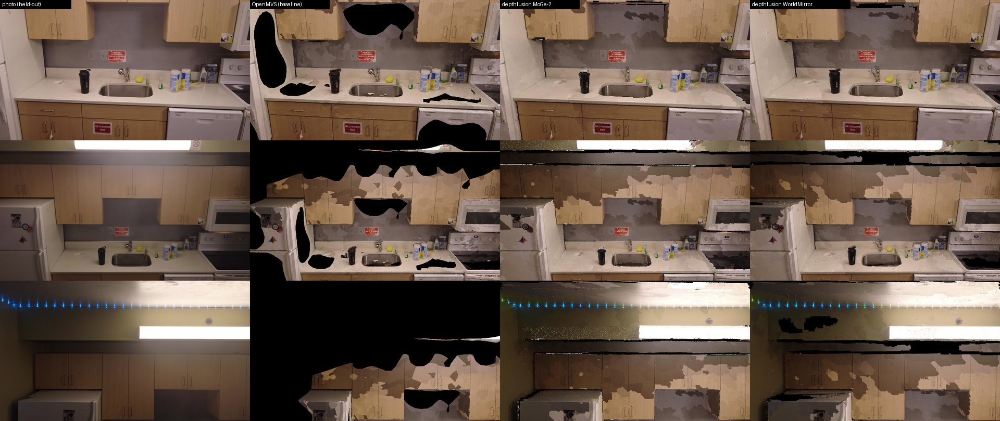

# E3: depth fusion instead of OpenMVS densify (kitchen-0095)

Experiment log for the 2026-09-25 bench session. The goal was to replace `DensifyPointCloud` +
`ReconstructMesh` (1667 s of the 2039 s kitchen run) with per-frame learned depth fused into a
TSDF, without losing coverage or detail. `docs/research/p1-recon-bench.md` holds the merged methods table.

## 0. Result

`--densify depthfusion` is in the pipeline. It fills the textureless holes that OpenMVS leaves
(fridge side, dishwasher, backsplash, cabinet undersides, ceiling) and replaces a 28-minute
stage with one that takes 1–2 minutes. `openmvs` stays the default.

| run (E1 harness, 55 held-out frames) | est. total s | view cov | novel cov back 0.6 m / right 0.9 m | PSNR | SSIM | Chamfer cm | F@2cm | F@5cm | recall@5cm | lap corr | tris |
|---|---|---|---|---|---|---|---|---|---|---|---|
| OpenMVS baseline (`b0-nocrop`, rescored) | 1886 | 0.704 | 0.556 / 0.500 | 20.91 | 0.751 | 0.69 | 0.928 | 0.996 | 0.995 | 0.59 | 200k |
| **depthfusion MoGe-2, plane, 1 cm** (default; `f-moge2-plane-1cm`) | **397** | **0.985** | **0.897 / 0.777** | 21.33 | 0.785 | 3.57 | 0.622 | 0.792 | 0.961 | 0.42 | 200k |
| depthfusion WorldMirror + COLMAP priors, plane, 1 cm (`f-worldmirror-plane-1cm`) | 428 | 0.963 | 0.860 / 0.727 | **21.69** | 0.783 | **2.96** | **0.698** | **0.834** | **0.984** | **0.51** | 200k |
| depthfusion WorldMirror, plane, 2 cm (`v-worldmirror-plane-2cm`, depth cached) | 200 (+57 s depth) | 0.952 | – | 21.60 | **0.800** | **2.87** | 0.698 | **0.840** | 0.983 | 0.49 | 50k |

- **Est. total** is E1's convention: this run's wall time plus 130 s for the reused frames and
  SfM. The OpenMVS row is E1's 1886 s estimate; the full r2 run was 2039 s.
- **Every depthfusion time here is pessimistic.** E3 was pinned to 4 cores (`taskset -c 12-15`,
  `nice 19`). E1's timed OpenMVS sweeps ran on the other 12 cores the whole time, and another
  agent's `spirula` trainer shared the GPU during the `f-` runs. The lead is scheduling an idle-box
  re-time of the final candidate.
- **Geometry is scored against the OpenMVS cloud**, so OpenMVS wins Chamfer and F by
  construction (E1 §1, "Bias"). depthfusion covers 8–9 m² of surface against the reference's 4.6 m².
  Everything the reference lacks counts against precision, which is why accuracy is 4.9–5.8 cm
  while completeness is 1.0–1.3 cm. Recall@5cm is the fair geometry number: 0.96–0.98 of the
  OpenMVS surface is reproduced within 5 cm.
- **Noise floor.** Repeats of one configuration agree to ±0.05 dB PSNR, ±0.002 SSIM and ±0.01 cm
  Chamfer (`a-`, `r-` and `f-moge2-plane-1cm`: 21.42/21.39/21.33, 0.787/0.786/0.785, 3.58/3.57/3.57)
  when the TextureMesh thread count is fixed. Between 16 and 4 TextureMesh threads, the same mesh
  moved by 0.24 dB and 0.03 SSIM.



Held-out frames 0303, 0603 and 0753 (30.2, 60.2 and 75.2 s; no method saw them). From left to
right: photo, OpenMVS, depthfusion MoGe-2, depthfusion WorldMirror. Black is uncovered.

Remaining defects, visible in the figure:
- thin dark slits along cabinet bottoms and the ceiling line, where the depth-edge and
  grazing-angle masks remove the same band in every view;
- dark patches on the glass cooktop (reflective, so the depth is wrong);
- patchy colour between texture patches, the same as OpenMVS: seam leveling is off because it is
  broken in the v2.4.0 binary (`mvs.py`).

## 1. How it works and how to run it

`pipeline/depthfusion.py` exports the undistorted COLMAP model (`sfm/dense/sparse`) to
`cameras.npz`: K, cam-from-world, and every sparse observation's pixel and camera-frame depth.
`pipeline/depthfusion_worker.py` runs in `AIRTOOLS_DEPTH_ENV` and does four things:

1. **Depth per frame, cached per model.** MoGe-2 (`Ruicheng/moge-2-vitl-normal`) runs at native
   1920×1079 with the COLMAP FoV. Its output is resized (nearest) to 960×540 for fusion.
2. **Robust fit to the SfM points seen in that frame.** The default is a scale plane plus shift,
   `z = (a + b·u + c·v)·d + t`, fitted by Huber IRLS. A frame is dropped if it has fewer than 20
   points, a median relative error above 8 %, or fewer than 50 % inliers at 5 %. That drops 2 of
   165 frames.
3. **Masks.** Depth edges (a log-depth jump above 4 % per pixel, dilated by 1 px), grazing angles
   above 80°, and depth beyond 5 m.
4. **Fusion.** An Open3D `VoxelBlockGrid` TSDF (sparse, CPU) in COLMAP units: voxel =
   `voxel_m` × units-per-metre from the pipeline's calibration, truncation 4 voxels, weight ≥ 2.
   Then marching cubes, dropping components under 500 triangles, and writing `mesh.ply`.
   - The legacy `ScalableTSDFVolume` is broken in the 0.20 wheel.
   - `UniformTSDFVolume` is dense, too big at 1 cm.

`mvs.run_mvs(densify="depthfusion")` then skips `DensifyPointCloud` and `ReconstructMesh`, and runs
the unchanged crop step and `TextureMesh -i scene.mvs -m depthfusion/mesh.ply`.

```sh
# hfbox (AIRTOOLS_DEPTH_ENV=/workspace/envs/df is exported by /workspace/env.sh)
uv run --extra pipeline python -m pipeline.cli run data/real/DJI_0095.MP4 --site kitchen \
  --out scene/x --work work/x --stages full --crop none --densify depthfusion \
  [--densify-args "--model worldmirror --voxel-m 0.02"]      # depthfusion_worker.py flags
```

Worker flags:
- `--model moge2|worldmirror|dav2-metric|dav2-rel|promptda|vggt-omega`
- `--align plane|scale|affine|global`
- `--voxel-m`, `--trunc-voxels`, `--min-weight`, `--grazing-deg`, `--edge-rel`,
  `--depth-max-m`, `--fuse-long-edge`, `--chunk` (frames per multi-view pass)

**The `/workspace/envs/df` venv** (built for this; torch is not reinstalled):
```sh
uv venv --python /usr/bin/python3.12 /workspace/envs/df
echo /opt/venv/lib/python3.12/site-packages > /workspace/envs/df/lib/python3.12/site-packages/_opt_venv.pth  # ROCm torch 2.14
VIRTUAL_ENV=/workspace/envs/df uv pip install numpy==2.5.3 pillow opencv-python-headless scipy \
  transformers==5.17.0 huggingface_hub safetensors accelerate open3d==0.20.0 trimesh \
  "utils3d_moge @ git+https://github.com/EasternJournalist/utils3d-moge.git@62f09d5"
VIRTUAL_ENV=/workspace/envs/df uv pip install --no-deps -e /workspace/MoGe einops roma jaxtyping lightning-utilities
# accelerate and roma each pull CUDA torch 2.14+cu130 as a dependency: uninstall torch and nvidia-* from
# the venv afterwards (done), or it shadows /opt/venv's ROCm torch.
```
WorldMirror: `git clone https://github.com/Tencent-Hunyuan/HunyuanWorld-Mirror /workspace/src/`
(c61300e), with weights `tencent/HunyuanWorld-Mirror` (4.8 GB, in `/workspace/.hf`). Its 3DGS head
imports `gsplat`, which is CUDA-only, so the worker stubs that import and switches the GS,
point-map and normal heads off.

## 2. Timing breakdown

Measured on hfbox with 4 cores pinned. E1's CPU sweeps ran concurrently (load 15–17 on 16 cores).

| step | OpenMVS (r2, 16 threads) | depthfusion MoGe-2 | depthfusion WorldMirror |
|---|---|---|---|
| InterfaceCOLMAP | <1 s | 0.1 s | 0.1 s |
| DensifyPointCloud | **1631 s** | – | – |
| ReconstructMesh | 36 s | – | – |
| export cameras.npz | – | 0.4–0.6 s | 0.3 s |
| depth inference, 165 frames (GPU) | – | **30.8 s** (GPU to itself, `m-moge2-scale-1cm`); 105.6 s (GPU shared with a trainer, `f-`) | **57.2 s** (4 chunks of ≤40); 60.9 s at chunk 64 |
| alignment | – | 0.4–0.6 s | 0.5 s |
| TSDF integrate (CPU, 1 cm) | – | 9.8–11.5 s | 11.1 s |
| marching cubes + cleanup | – | 0.3–0.4 s | 0.3 s |
| **densify replacement total** | **1667 s** | **43.5 s** (120.7 s when the GPU was shared) | **71.6 s** |
| TextureMesh | 58 s | 58.5 s (16 thr) – 86.5 s (4 thr) | 161 s (4 thr, contended; one run) |
| mesh post-process (pymeshlab decimate) | – | 20.7 s | 28.9 s |
| thumbs + QA | – | 21.9 s | 24.7 s |

- Model load is inside the depth time (MoGe-2 ~3 s, WorldMirror ~10 s).
- **Peak VRAM:** MoGe-2 about 3 GB (R1 §9.2). WorldMirror 10.4 GB at 40 frames per chunk and
  11.9 GB at 64 (bf16 autocast).
- **The 20 s post-process is avoidable.** TextureMesh's `--decimate` lands about 0.4 % over the
  200k target (200,849 faces), so `mesh.decimate_textured` runs pymeshlab to remove 849 faces.
  OpenMVS meshes happened to land under the target. Not fixed.
- **The DA-V2 and PromptDA inference times are CPU-bound, not GPU-bound.** DA-V2 runs the
  transformers image processor on the CPU (1.5–1.7 s/frame on 4 cores). PromptDA also builds a
  scipy `griddata` prompt per frame (4 s/frame).

## 3. Ablations

All runs at 1 cm reuse the Stage B SfM, use `--crop none`, and run the same TextureMesh tail.

**Depth model** (scale-only alignment, 1 cm):

| model | licence (weights) | depth s | median fit err | PSNR | SSIM | Chamfer | F@2cm | F@5cm | lap corr |
|---|---|---|---|---|---|---|---|---|---|
| MoGe-2 ViT-L | MIT | 31 | 0.81 % | 21.30–21.54 | 0.731–0.761 | 4.07 | 0.56 | 0.716 | 0.38–0.41 |
| DA-V2 Metric-Indoor-L | CC-BY-NC-4.0 (Large) | 282 (CPU pre-proc) | 1.50 % (159/165 kept) | 20.66 | 0.738 | 4.55 | 0.45 | 0.700 | 0.29 |
| DA-V2 relative L (affine in disparity) | CC-BY-NC-4.0 | 241 | 0.84 % (162/165 kept) | 21.30 | 0.743 | 4.76 | 0.46 | 0.668 | 0.39 |
| PromptDA ViT-L, SfM-points prompt | not checked | 669 | 1.21 % | 20.26 | 0.722 | 4.71 | 0.42 | 0.685 | 0.26 |
| **WorldMirror + COLMAP pose/K priors** | Tencent community (see below) | 57 | **0.42 %** | 21.53 | 0.780 | **2.99** | **0.69** | **0.832** | **0.50** |
| VGGT-Ω | **gated**, not checked | adapter only | – | – | – | – | – | – | – |

- **WorldMirror is the best depth source.** Its depth is consistent across views within a chunk,
  and the pose prior puts every frame in one frame. Its fit to the SfM points is twice as tight
  as MoGe-2's, and it gives the best geometry and detail.
- **Its coverage is 2 points lower than MoGe-2's** (0.963 vs 0.985) because the worker drops the
  lowest-confidence 10 % of its pixels per frame (13 % masked in total vs 3.6 % for MoGe-2).
- **PromptDA with an interpolated sparse-point prompt is worse than plain MoGe-2.** Our ~1000
  SfM points per frame are far sparser than the LiDAR it was trained with. It was not worth its
  ~4 s/frame.
- **VGGT-Ω** (`--model vggt-omega`) is written against the repo's README API: `VGGTOmega`,
  `load_and_preprocess_images(mode="max_size")`, and `depth`/`depth_conf`. It is **untested**,
  because the weights at `facebook/VGGT-Omega` are gated behind an HF access request. Put the
  checkpoint at `/workspace/models/vggt-omega/vggt_omega_1b_512.pt` or set
  `AIRTOOLS_VGGT_OMEGA_CKPT`. The repo is cloned at `/workspace/src/vggt-omega`. It takes no pose
  prior, so the per-frame fit does all the scaling.
- **WorldMirror licence:** the Tencent HunyuanWorld-Mirror Community License. It **does not
  apply in the EU, the UK or South Korea**. A product with more than 1M MAU needs a separate
  licence from Tencent. Distribution must ship the licence text and mark modified files. Fine for
  this project's research use. A shipped product needs a decision.

**Alignment** (MoGe-2, 1 cm):

| align | median fit err | PSNR | SSIM | Chamfer | F@2cm | F@5cm |
|---|---|---|---|---|---|---|
| one global scale for all frames | 0.81 % per frame, before the global override | 14.20 | 0.520 | 5.88 | 0.37 | 0.613 |
| scale per frame | 0.81 % | 21.30–21.54 | 0.731–0.761 | 4.07 | 0.56 | 0.716 |
| scale + shift per frame | 0.68 % | 20.97 | 0.777 | 3.79 | 0.60 | 0.771 |
| **scale plane + shift per frame** (default) | **0.51 %** | 21.33–21.42 | 0.785–0.787 | **3.57** | **0.62** | **0.791** |

- **A per-frame fit is essential.** MoGe-2's metric scale varies frame to frame. One global scale
  gives the multi-layer "onion-skin" surface from R1 §2.3, and costs 7 dB.
- **The low-order plane term buys another 0.5 cm Chamfer.**
- With WorldMirror, plane vs scale is 2.93 vs 2.99 cm Chamfer.

**Voxel size:**

| voxel | tris after fusion | MoGe-2 scale: PSNR / SSIM / Chamfer / F@5 | MoGe-2 plane | WorldMirror plane |
|---|---|---|---|---|
| 5 mm | 1.25 M | 21.20 / 0.735 / 4.10 / 0.684 | – | – |
| 1 cm | 280k | 21.30 / 0.731 / 4.07 / 0.716 | 21.39 / 0.786 / 3.57 / 0.791 | 21.68 / 0.783 / 2.93 / 0.836 |
| 2 cm | 62k | 21.37 / 0.789 / 3.80 / 0.778 | 21.26 / 0.785 / 3.34 / 0.803 | 21.60 / 0.800 / 2.87 / 0.840 |

- **5 mm is worse.** Mono-depth noise exceeds the voxel, so the TSDF no longer averages it out.
- **2 cm matches or beats 1 cm on every metric here,** and it roughly halves TextureMesh time.
  But it yields only 50–60k triangles, a quarter of the Quest budget, and the metrics here cannot
  see sub-2 cm shape.
- **The default stays 1 cm**, which is what the task asked for. 2 cm is the fast option
  (`--densify-args "--voxel-m 0.02"`).
- Voxel sizes are in caption-altitude metres. See §5 for why real metres may be about 1.38× larger.

## 4. QA renderer bug (fixed in `34cc339`, affects every bench score)

The first depthfusion score was PSNR 20.11 and SSIM 0.46, and renders were covered in pixel
dots. `preview.render` splats random samples per triangle under an 8M-sample budget. Two things
went wrong:

- **Off-screen triangles used up the budget.** A complete room has walls beside and behind the
  view. They took so many samples that 22 % of on-screen pixels got none.
- **Hidden surfaces leaked through.** Where the front surface happened to get no sample, the
  surface behind it showed through the gap.

The fix frustum-culls before sampling and replaces a pixel with its nearer neighbours when at
least 6 of its 8 neighbours are more than 5 % closer. On frame 0303 that cut uncovered pixels
before hole-fill from 21.6 % to 4.5 %.

Effect on scores:

| run | PSNR / SSIM, old renderer | PSNR / SSIM, fixed renderer | coverage, old → fixed |
|---|---|---|---|
| OpenMVS (`b0-nocrop`) | 20.61 / 0.733 | 20.91 / 0.751 | 0.703 → 0.704 |
| depthfusion MoGe-2, scale | 20.11 / 0.461 | 21.54 / 0.761 | 0.740 → 0.985 |

**Scores made with the old renderer understate complete meshes and must be regenerated.** That
includes E1's `results.md` rows and the preview row. `pipeline/preview.py` is already synced to
`/workspace/airtools`.

A second texture suspicion was tested and dropped:
- TextureMesh splits a depthfusion mesh across a 4096 and a 2048 atlas.
- `Scene.to_geometry()` packs those onto an 8192² canvas that is 69 % empty, which the 4096 cap
  then halves.
- A shelf packer (6144 long edge) scored 21.04 / 0.731 against 21.30 / 0.731 for the same mesh,
  and `--max-texture-size 8192` scored 18.77 / 0.448.
- At 960×540 evaluation the atlas resolution is not the limit, so the packer was not committed.

## 5. Side finding: metric depth disagrees with the caption-altitude scale

Each metric model's scale-only fit gives SfM units per metre, which is a scale cue for free:

| cue | m per SfM unit | vs altitude |
|---|---|---|
| caption altitude (Stage B, R² 0.964; VGGT preview agrees to 1 %) | 0.1847 | – |
| MoGe-2 (median over 163 frames, COLMAP FoV given) | 0.2545–0.2553 | +38 % |
| DA-V2 Metric-Indoor-L | 0.2726 | +48 % |

- **Two independent indoor metric models agree with each other to 7 %,** and both say the kitchen
  is about 40 % larger than the altitude calibration does.
- The altitude fit is internally consistent. It does not validate the barometer's absolute
  gain, and a 0.1 m-quantised barometer over a 0.9 m altitude span is a weak cue (R1 §6).
- **This is not resolved.** One tape measurement of the counter height (usually 0.91 m) or the
  dishwasher width (usually 0.60 m) settles it. It matters for the Quest's 1:1 scale.
- The worker records the cue as `scale_cue_m_per_unit` in `stats.json`. It uses the cue only
  when the pipeline has no calibrated scale.

## 6. Verified vs inferred

**Verified on hfbox:**
- the option runs end to end through `pipeline.cli run --densify depthfusion`, publishing a scene
  that the E1 harness scores;
- every number in the tables above;
- WorldMirror running on gfx1201 in pure torch under bf16, with the gsplat import stubbed;
- the renderer bug and the effect of its fix;
- the repeatability of the plane runs (3 repeats).

**Inferred or unverified:**
- **The timings on an idle box.** Every depthfusion time was measured on 4 contended cores, and
  some with a shared GPU.
- **"At least as good on detail".** Held-out PSNR and SSIM are higher. But Laplacian correlation
  (0.42 MoGe-2, 0.51 WorldMirror) is below OpenMVS's 0.59, and so is F@2cm against the OpenMVS
  cloud. Mono-depth surfaces are smoother than PatchMatch where there is texture. The reference
  is an OpenMVS product, so it cannot tell "detail lost" from "surface OpenMVS never had".
- **Whether the metric-depth scale or the altitude scale is right** (§5).
- **The VGGT-Ω adapter**, which has not been run.

## 7. Next steps

1. **Hybrid fill.** Keep PatchMatch geometry where OpenMVS has it, and fill with depthfusion
   elsewhere (Murre's idea, R1 §9.2). OpenMVS at `--resolution-level 1` or 2 (E1's sweep) plus the
   depthfusion TSDF may get the texture-area detail back at a fraction of the cost.
2. **Feed WorldMirror a depth prior.** It accepts a depth prior (`cond_flags[1]`), and the aligned
   MoGe-2 depth could go in. Also try confidence masking at 5 % instead of 10 % to win back its 2
   coverage points.
3. **Fix the two slivers of avoidable time.** Aim the TextureMesh decimate ratio about 1 % under
   the target to skip the 20 s pymeshlab pass. Move the DA-V2 preprocessing to the GPU if that
   model is ever used.
4. **Fix the edge slits.** Mask depth edges only where the frame is not the most frontal view, or
   dilate by 0 px on frames whose fit error is below 0.5 %.

## 8. Artefacts on hfbox

- Work dirs: `/workspace/airtools/work/dji0095-df/<run>/`. The shared depth cache is
  `work/dji0095-df/depth_cache/{moge2,dav2-metric,dav2-rel,worldmirror}_960x540`.
- Scenes: `/workspace/airtools/scene/dji0095-df/<run>/`.
- Scores: `/workspace/e3/results2/results.md`, one `<run>.json` per run, and side-by-sides.
- Novel coverage: `/workspace/e3/novel_coverage.jsonl`.
- Job scripts: `/workspace/e3/{dfjob,score2,precache,wmtest,queue}.sh`.
- The run records hold the exact args: `/workspace/e3/runs/*.json`.
