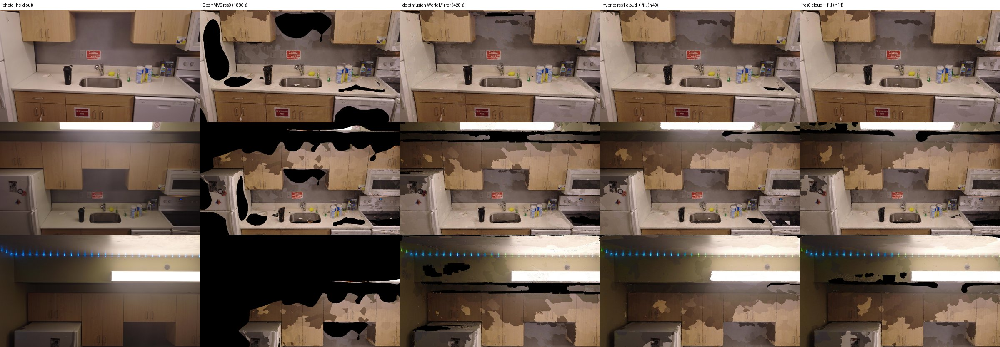
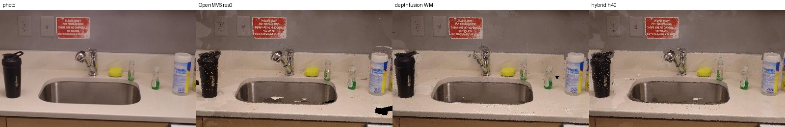

# E5: hybrid densify, OpenMVS detail plus depth-fusion coverage (kitchen-0095)

Experiment log for the 2026-09-25 bench session. The goal was to keep OpenMVS PatchMatch geometry
where it is reliable, fill the rest with E3's depth fusion, and do it in less time than the res-0
baseline. `docs/research/p1-recon-bench.md` holds the merged methods table.

## 0. Result

**`--densify hybrid` is in the pipeline** (commits `02a9338`, `28861be` and `56d643d`). The winning method is
a point-cloud union meshed by graph-cut (idea 3 below), not a blended TSDF. Hybrid runs these steps:

1. `DensifyPointCloud` at resolution level 1 with 3 views. While it runs, WorldMirror or MoGe-2
   depth inference runs on the GPU.
2. The depth-fusion worker fuses the OpenMVS depth maps with the corrected mono depth in a 1 cm
   TSDF (§1).
3. The worker adds TSDF vertices to the OpenMVS dense cloud, but only where the cloud has no point
   within 2 cm. Each added vertex carries the views whose depth maps see it.
4. `ReconstructMesh` meshes that union cloud, then `TextureMesh` runs as usual.

The result keeps OpenMVS-res-1 geometry where PatchMatch has data, and fills the holes that
OpenMVS leaves. It has the highest held-out SSIM and coverage of any run so far.

**Recommended config:** `--densify hybrid` with no `--densify-args`. That uses the MoGe-2 fill,
which scores the same as WorldMirror (§3) and is MIT-licensed. E1's 16-core re-time will give the
real total time.

| run (E1 harness, 55 held-out frames) | est. total s | view cov | novel cov back / right | PSNR | SSIM | Chamfer cm | **compl. cm** | **recall@2cm** | F@2cm | F@5cm | recall@5cm | lap corr | tris |
|---|---|---|---|---|---|---|---|---|---|---|---|---|---|
| OpenMVS res 0 (`b0-nocrop`, baseline) | 1886 | 0.704 | 0.556 / 0.500 | 20.91 | 0.751 | **0.69** | **0.57** | **0.978** | **0.928** | **0.996** | 0.995 | **0.59** | 200k |
| OpenMVS res 1 (E1 `d-res1`) | 720 | 0.779 | – | 21.30 | 0.783 | 1.28 | 0.76 | 0.951 | 0.823 | 0.953 | 0.993 | 0.60 | 200k |
| depthfusion WorldMirror (E3 `f-worldmirror-plane-1cm`) | 428 | 0.963 | 0.860 / 0.727 | 21.69 | 0.783 | 2.96 | 1.03 | 0.910 | 0.698 | 0.834 | 0.984 | 0.51 | 200k |
| **hybrid, res 1 / 3 views, WorldMirror fill** (`h40`, end to end, 4 cores) | 1396 on 4 cores; ~600 on 16 (inferred) | **0.994** | **0.907 / 0.778** | 21.92 | **0.812** | 3.17 | 0.76 | 0.951 | 0.648 | 0.795 | 0.994 | 0.56 | 200k |
| hybrid, res-1 cloud, **MoGe-2 fill** (`h46`, E1's depth maps, tail only) | – | **0.997** | **0.910 / 0.789** | 21.73 | 0.805 | 3.60 | 0.77 | 0.950 | 0.612 | 0.756 | 0.992 | 0.53 | 200k |
| union with the res-0 cloud (`h11`, quality ceiling) | 1631 s densify + 330 | 0.984 | 0.899 / 0.769 | **22.04** | 0.806 | 2.66 | **0.58** | **0.976** | 0.701 | 0.835 | **0.995** | 0.57 | 200k |

- **Read completeness and recall@2cm as the detail numbers.** Both measure the distance from the
  reference cloud to the candidate, so they only look at surface the reference has, which is where
  PatchMatch works.
  - Union reproduces the OpenMVS surface of the cloud it was given: 0.76 cm at res 1, the same as
    E1's res-1 OpenMVS mesh, and 0.58 cm at res 0, against 0.57 cm for the baseline.
  - WorldMirror depth fusion alone gets 1.03 cm.
- **Chamfer, F-score and accuracy penalise the fill.** Every square metre that OpenMVS never
  reconstructed counts as a precision error against the OpenMVS reference (E1 §1 "Bias", E3 §0).
  The union covers about 10 m² of surface against the reference's 5 m², so its F@2cm (0.65–0.70)
  is lower than OpenMVS's. That gap is the fill, not lost detail.
- **Coverage:** 0.994 of held-out pixels versus 0.704 for OpenMVS and 0.963 for WorldMirror depth
  fusion. The union also closes WorldMirror's thin slits along cabinet bottoms and the ceiling line
  (figure below): OpenMVS points span those depth edges, where the mono-depth edge mask removes
  the same band in every view (my reading of the figure; not measured separately).
- **Detail score** (Laplacian correlation): 0.56 for h40 and 0.57 for h11, against 0.59 for OpenMVS
  and 0.51 for WorldMirror.
- **Quest budget:** 200k triangles after TextureMesh's own decimate, so the 20 s pymeshlab pass
  E3 needed is gone. There are two atlas pages, 4096² plus a partial second page, the same as E3's
  depth-fusion meshes. The GLB is 5.9 MB.



Held-out frames 0303, 0603 and 0753 (no method saw them). From left to right: photo, OpenMVS
res 0, depthfusion WorldMirror, hybrid (`h40`), and the union built on the res-0 cloud (`h11`).
Black is uncovered.



Frame 0303, sink area, at the 960×540 evaluation resolution. From left to right: photo, OpenMVS
res 0, WorldMirror, hybrid. The hybrid keeps the OpenMVS shape of the tap, bottles and sign.
WorldMirror's surface is smoother, with a softer tap and bottle edges.

## 1. What was tried

The four ideas from the brief, in the order they were run.

**Ideas 1 and 2: a blended hybrid depth per frame, fused in one TSDF.** Implemented as the
worker's `--mvs-depth DIR` option.
- It reads OpenMVS `depthNNNN.dmap` files (`read_dmap`, the v2.x raw format: header, image name,
  neighbour IDs, K/R/C, then depth, normal and confidence maps).
- It resamples each one to the 960×540 fusion grid.
- It fits the mono depth to the OpenMVS depth with a Huber scale plane plus shift
  (`--mvs-correct plane`; `field` adds a Gaussian-smoothed per-pixel log-scale, which is untested
  on the bench).
- It keeps OpenMVS pixels within 3 % of the corrected mono depth (`--mvs-tol`) and takes the
  corrected mono depth everywhere else.
- `--mvs-weight k` re-integrates the OpenMVS pixels k−1 more times.

It helped, but less than the union:

| MVS source for the TSDF blend (WorldMirror fill, 1 cm) | MVS inlier px / frame | compl. cm | recall@2cm | PSNR / SSIM | view cov |
|---|---|---|---|---|---|
| none (E3 WorldMirror) | – | 1.03 | 0.910 | 21.69 / 0.783 | 0.963 |
| res 2, min-res 320, 5 views (`h01`) | 47 % | 1.04 | 0.895 | 21.53 / 0.790 | 0.962 |
| res 1, 5 views (`h06`) | 38 % | 0.88 | 0.939 | 21.57 / 0.795 | 0.961 |
| res 0 (`h05`) | 29 % | 0.84 | 0.944 | 21.82 / 0.797 | 0.962 |
| res 2 depth only, no fill (`h02`, MVS-only TSDF) | 47 % | 1.21 | 0.875 | 20.94 / 0.733 | 0.714 |

- **A res-2 PatchMatch pass is no more accurate than WorldMirror.** E1's own res-2 OpenMVS mesh
  has 1.02 cm completeness, the same as WorldMirror depth fusion. A fast, low-resolution OpenMVS
  pass therefore cannot add detail, whatever the fusion method.
- **The 1 cm TSDF caps the gain.** Even res-0 depth maps only reach 0.84 cm through it, against
  0.57 cm for OpenMVS's own Delaunay mesh. Mixing in fill from other views at equal weight blurs
  the result further.
- Idea 4 (a finer voxel where MVS exists) and higher MVS weights were queued. The runs died when
  hfbox's disk filled at 10:10; `h45` re-runs the weight-3 variant (§3).

**Idea 3: point-cloud union, then ReconstructMesh (the winner).** Implemented as the worker's
`--mvs-cloud scene_dense.ply` option.
- `read_mvs_cloud` walks OpenMVS's variable-length PLY rows, which hold xyz, rgb, normal, a view
  list and a weight list.
- A `cKDTree` query keeps the TSDF vertices that have no OpenMVS point within `--fill-dist-m`
  (default 2 cm).
- `fill_views` gives each kept vertex the OpenMVS views whose hybrid depth map agrees with it
  within 2 %.
- `write_union_cloud` appends those vertices as rows in the same layout, and `mvs.py` runs
  `ReconstructMesh -i scene.mvs -p union.ply`.
- About 60k fill points are added to 0.7–2.4M OpenMVS points. The graph-cut then meshes the fill
  together with the PatchMatch surface, with no seam between them.

| union: OpenMVS cloud (WorldMirror fill) | densify s (source) | compl. cm | recall@2cm | recall@5cm | PSNR / SSIM | view cov | lap corr |
|---|---|---|---|---|---|---|---|
| res 2, min-res 320, 3 views, 0 geometric iters (`h08`, my 4-core run) | 206 (4 cores) | 1.54 | 0.780 | 0.941 | 21.42 / 0.788 | 0.995 | 0.46 |
| res 1, 5 views, 0 geometric iters (`h12`) | 405 (E1, 12 cores) | 0.84 | 0.933 | 0.991 | 21.82 / 0.801 | 0.992 | 0.54 |
| res 1, 5 views (`h07`, view-index bug) | 487 (E1, 12 cores) | 0.76 | 0.952 | 0.993 | 21.73 / 0.807 | 0.985 | 0.55 |
| **res 1, 3 views (`h40`, pipeline end to end)** | 952 (4 cores); E1: 371 on 12 | 0.76 | 0.951 | 0.994 | 21.92 / 0.812 | 0.994 | 0.56 |
| res 0 (`h11`, view-index bug) | 1631 (r2, 16 threads) | **0.58** | **0.976** | **0.995** | **22.04** / 0.806 | 0.984 | 0.57 |

- **The union keeps whatever the OpenMVS cloud is worth.** Its completeness tracks the cloud's
  resolution: 1.54, 0.84, 0.76 and 0.58 cm.
- **Skip the geometric iterations.** Without them the cloud is noisier: 212k points with only 1 %
  of depths fused at res 2, and 0.84 cm instead of 0.76 cm at res 1. That costs more than the
  ~80 s it saves.
- **Fill model barely matters.** MoGe-2 fill equals WorldMirror fill (§3, `h46`).
- **View-index bug.** `h07`, `h08`, `h11` and `h12` ran before `28861be`. In those runs each fill
  point's view list named the next frame (0.5 s later) instead of its own. OpenMVS numbers depth
  maps by COLMAP image ID, but the cloud uses 0-based list positions. `h40` ran with the fixed
  mapping, and `h41` re-runs `h07` with it (§3). Adjacent frames see almost the same thing, so the
  effect is small.

## 2. Timing

`h40`: pipeline end to end on 4 pinned cores (`taskset -c 12-15`, `nice 19`), sharing the box with
the other agents' jobs. The SfM is cached, adding 130 s as in E1. WorldMirror depth was **not**
cached.

| step | h40 (4 cores) | notes |
|---|---|---|
| DensifyPointCloud, res 1, 3 views | 952 s | E1 measured the same flags at 371 s on 12 cores (`d-res1-nv3`); 693,908 points |
| WorldMirror depth, 165 frames | 0 s of wall | runs in a thread during DensifyPointCloud (`--depth-only` prefetch); all 165 frames were cached within the first 5 min (E3: 57 s on its own) |
| worker: align, hybrid depth, TSDF 1 cm, union | 29 s | TSDF integration 15 s, union 2 s, 62,100 fill points |
| ReconstructMesh on the union cloud | 55 s | 794k faces |
| TextureMesh (4 threads) | 189 s | E3 measured 58 s with 16 threads on a similar-size mesh |
| mesh post-process, thumbs, QA | 28 s | no pymeshlab decimate: TextureMesh lands under 200k |
| **wall / est. total** | **1266 / 1396 s** | |

**Inferred 16-core total: about 600 s.** That is 130 s SfM, ~300 s densify, 30 s worker, ~20 s
ReconstructMesh, ~60 s TextureMesh and ~30 s tail. It is roughly E1's `d-res1-nv3` (611 s) plus
the ~30 s the worker adds, a third of the 1886 s baseline. E1's idle-box re-time will measure it.
The command is in §4. E1 was asked to time it with the default MoGe-2 fill.

## 3. Fill model, fill distance, MVS weight

These runs used E1's saved res-1 (`d-res1`) or res-0 depth maps, on 4 cores, and were not timed.

| run | what changed | view cov | novel back / right | PSNR / SSIM | compl. cm | recall@2cm | lap corr | fill pts |
|---|---|---|---|---|---|---|---|---|
| `h41` | `h07` re-run with the view-index fix (WorldMirror fill, 2 cm) | 0.984 | 0.902 / 0.771 | 21.75 / 0.806 | 0.76 | 0.952 | 0.56 | 60,658 |
| `h46` | **MoGe-2 fill** instead of WorldMirror | **0.997** | **0.910 / 0.789** | 21.73 / 0.805 | 0.77 | 0.950 | 0.53 | 79,708 |
| `h47` | fill distance 1 cm instead of 2 cm | 0.986 | 0.903 / 0.773 | **21.88 / 0.810** | 0.76 | 0.952 | **0.57** | 70,750 |
| `h45` | blended TSDF from res 0, MVS weight 3 (no union) | 0.963 | 0.861 / 0.727 | 21.68 / 0.799 | 0.77 | 0.955 | 0.55 | – |

- **The view-index fix changes nothing measurable.** `h07` and `h41` agree within the noise floor
  (E3 §0: ±0.05 dB, ±0.002 SSIM).
- **MoGe-2 fill is as good as WorldMirror fill.**
  - Its coverage is higher: WorldMirror drops its lowest-confidence 10 % of pixels.
  - Its PSNR, SSIM and completeness are equal.
  - MoGe-2 is MIT-licensed, needs about 3 GB of VRAM instead of 10 GB, and its 31 s of inference
    hide behind DensifyPointCloud anyway.
  - **So the worker default (`moge2`) is the recommended hybrid config.** WorldMirror only paid
    off when it supplied all of the geometry, as in E3.
- **A 1 cm fill distance is slightly better** (+0.13 dB, +0.004 SSIM, above the noise floor). It is
  not the default yet, because E1's re-time was already running on the 2 cm code.
  `--densify-args "--fill-dist-m 0.01"` selects it.
- **An MVS weight of 3 helps the blended TSDF.** Completeness goes from 0.84 to 0.77 cm at res 0.
  It is still behind the union built on the same res-0 depth (0.58 cm), so the blended TSDF stays
  an option and not the default.
- **`h42`–`h44` are invalid and not reported.** E1's disk cleanup at about 10:10 deleted the depth
  maps in `work/bench/d-res1-nv3` and `d-res2-min320`. The worker found no matching `depth*.dmap`
  and meshed the bare OpenMVS cloud; those runs scored exactly like E1's OpenMVS meshes. Commit
  `56d643d` now makes the worker fail in that case.

## 4. How to run

```sh
# hfbox; AIRTOOLS_DEPTH_ENV and AIRTOOLS_OPENMVS_DIR come from /workspace/env.sh
uv run --extra pipeline python -m pipeline.cli run data/real/DJI_0095.MP4 --site kitchen \
  --out scene/x --work work/x --stages full --crop none \
  --densify hybrid          # MoGe-2 fill (default); --densify-args "--model worldmirror" for WM
```

- `mvs.HYBRID_MVS_ARGS` fixes the OpenMVS settings (`--resolution-level 1 --number-views 3`).
  Hybrid ignores `--resolution-level` and `--number-views`.
- `--densify-args` go to `depthfusion_worker.py`, and `--mesh-args` to `ReconstructMesh`.
- **Ablations on existing depth maps.** Use `--densify depthfusion` with
  `--densify-args "--model worldmirror --mvs-depth <dir with depth*.dmap> --mvs-cloud <dir>/scene_dense.ply"`.
  Leave out `--mvs-cloud` to get the blended TSDF (§1).
- Worker flags added: `--mvs-depth`, `--mvs-conf`, `--mvs-tol`, `--mvs-correct none|plane|field`,
  `--mvs-sigma-px`, `--mvs-weight`, `--mvs-fill`, `--mvs-cloud`, `--fill-dist-m` and
  `--depth-only`.

## 5. Verified vs inferred

**Verified on hfbox:**
- `--densify hybrid` runs end to end (`h40`) and publishes a scene that the harness scores;
- every metric in the tables;
- the DensifyPointCloud timings I ran myself on 4 cores (`r2n3g0` 206 s, `r2n3` 305 s, `h40`
  952 s);
- the dmap and cloud formats, checked against real files;
- the view-ID mapping (image `0496.jpg` has COLMAP ID 100, `depth0100.dmap` and list position 99
  in `--output-view-neighbors-file`).

**Inferred or unverified:**
- **the ~600 s 16-core total**, pending E1's re-time;
- **whether the union "loses no detail".** The metrics say it matches the OpenMVS cloud it was
  given, but the reference is an OpenMVS product. Fill surface cannot be judged for geometric
  accuracy, only for coverage and PSNR;
- **the fill-point views.** Views are assigned by depth agreement in the hybrid depth maps, and
  their weights are all 1. ReconstructMesh's `--constant-weight` default ignores weights anyway;
- **anything off this clip.** An outdoor building orbit has different failure regions.

## 6. Next steps

1. **Densify cost is now the whole budget.** Options, in order:
   - E2's HIP COLMAP PatchMatch or a CUDA OpenMVS for the depth maps. The union step only needs
     a cloud with view lists.
   - Densify only every second frame via `--view-neighbors-file` (untested). The export works;
     `work/dji0095-hy/base/nb/nb.txt`, from E1's res-1 dense scene, holds 0-based view indices.
2. **Try `ReconstructMesh --free-space-support 1` on the union.** It may clean the fill-to-MVS
   transitions.
3. **Try a 5 mm TSDF for the fill vertices only.** The fill is sparse at 1 cm, and ReconstructMesh
   interpolates it anyway, so this is low priority.

## 7. Artefacts on hfbox

- Work dirs: `/workspace/airtools/work/dji0095-hy/<run>/`.
- My 4-core DensifyPointCloud runs: `work/dji0095-hy/base/mvs-{r2n3g0,r2n3}`. The `r2n3` depth maps
  were deleted when the disk filled.
- Scenes: `/workspace/airtools/scene/dji0095-hy/<run>/`.
- Scores: `/workspace/e5/results/results.md` and `<run>.json`.
- Novel coverage: `/workspace/e5/novel_coverage.jsonl`.
- Jobs: `/workspace/e5/{hyjob,densify,queue}.sh`, `/workspace/e5/qdone/*.sh`, and run records in
  `/workspace/e5/runs/`.
- Figure scripts: `/workspace/e5/e5fig.py` and `/workspace/e5/table.py`.
