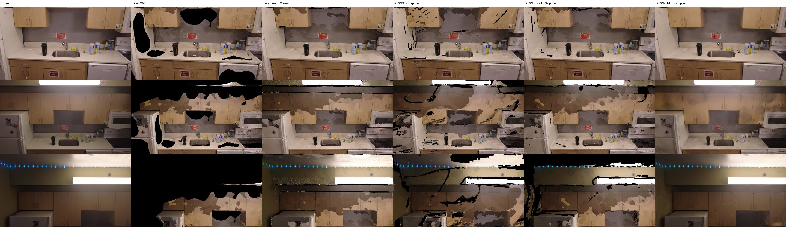

# E6: 2DGS surfels as the geometry source (kitchen-0095)

Experiment log for the 2026-09-25 bench session. **The question:** does a Gaussian-surfel route beat
our current best on the kitchen for detail and coverage, in a reasonable time? The route:
- train 2DGS with gsplat's Apache-2.0 `rasterization_2dgs` on the gfx1201 port (E2);
- render depth at every training view;
- run E3's TSDF mesh and OpenMVS TextureMesh tail on that depth.

R1 §3 and §9 #5 describe the recipe.

## 0. Result

**No. With MoGe-2 priors, 2DGS gives a usable mesh that roughly ties depthfusion MoGe-2 on
geometry. It loses on coverage and SSIM and costs about 2.5× the time. WorldMirror depthfusion
beats it on every metric.** Without priors, the 2DGS geometry is clearly worse than any
depthfusion run.

| run (E1 harness, 55 held-out frames) | est. total s | view cov | novel cov back 0.6 m / right 0.9 m | PSNR | SSIM | Chamfer cm | F@2cm | F@5cm | recall@5cm | lap corr | tris |
|---|---|---|---|---|---|---|---|---|---|---|---|
| OpenMVS baseline (`b0-nocrop`) | 1886 | 0.704 | 0.556 / 0.500 | 20.91 | 0.751 | **0.69** | **0.928** | **0.996** | 0.995 | **0.59** | 200k |
| depthfusion MoGe-2, plane, 1 cm (E3 default) | **397** | **0.985** | **0.897 / 0.777** | 21.33 | **0.785** | 3.57 | 0.622 | 0.792 | 0.961 | 0.42 | 200k |
| depthfusion WorldMirror, plane, 1 cm | 428 | 0.963 | 0.860 / 0.727 | 21.69 | 0.783 | 2.96 | 0.698 | 0.834 | 0.984 | 0.51 | 200k |
| 2DGS 3k, no priors (`smoke2-3000`) | 587 | 0.972 | 0.884 / 0.754 | 21.58 | 0.756 | 4.43 | 0.425 | 0.672 | – | 0.43 | 200k |
| 2DGS 7k snapshot of a 30k run, no priors (`base-7000`) | 762 | 0.902 | 0.782 / 0.678 | **22.32** | 0.691 | 5.27 | 0.442 | 0.662 | 0.949 | 0.45 | 200k |
| 2DGS 30k, no priors (`base-30000`) | 1822 | 0.934 | 0.823 / 0.691 | 22.18 | 0.739 | 5.59 | 0.415 | 0.642 | 0.887 | 0.44 | 200k |
| 2DGS 7k snapshot of a 30k run, + MoGe-2 priors (`prior30-failed-7000`) | 686 | 0.914 | 0.812 / 0.696 | 22.00 | 0.735 | 3.48 | 0.579 | 0.775 | **0.976** | 0.46 | 200k |
| **2DGS 15k + MoGe-2 priors** (`prior15k-15000`) | 976 | 0.938 | 0.854 / 0.733 | 21.56 | 0.751 | 3.44 | 0.600 | 0.795 | 0.955 | 0.45 | 191k |
| 2DGS 30k + MoGe-2 priors (`prior30-30000`) | 1629 | 0.939 | 0.855 / 0.736 | 21.35 | 0.751 | 3.37 | 0.581 | 0.772 | 0.936 | 0.43 | 195k |

- **Est. total** is E1's convention: 130 s of cached frames and SfM, plus the training time to that
  snapshot and the depth export, plus the tail's wall time. Prior runs also add 72 s for the MoGe-2
  priors.
- **Every time here is contended.** CPU work was pinned to 4 cores (12–15, nice 19), with E1's
  sweeps and E4/E5 jobs running on the rest. E4's `brush_app` trained on the same GPU during every
  2DGS run: `gpu_busy_percent` sat at p10/p50/p90 85/95/99 %.
- **Splat quality, for reference.** Rendered at the same 55 held-out poses (`qa.psnr`/`qa.ssim` on
  alpha > 0.5, 960×540), the splat itself scores:
  - 29.7 / 29.6 / 31.4 dB PSNR at 7k / 15k / 30k without priors, with SSIM 0.938 / 0.939 / 0.947;
  - 25.8 dB at 7k and 30.6 dB at 15k in the 15k prior run, with SSIM 0.900 / 0.947;
  - 27.8 / 28.2 / 30.6 dB at 7k / 15k / 30k in the 30k prior run, with SSIM 0.923 / 0.930 / 0.945.
  - That is 8–10 dB above any mesh. **The mesh throws away almost all of the splat's appearance
    quality.** TextureMesh re-bakes the real photos, so the texture is no better than
    depthfusion's.
- The geometry reference is OpenMVS's own cloud (E1 bias; see E3 §0). **recall@5cm is the fair
  number:** 0.955–0.976 with priors, against 0.961 for MoGe-2 depthfusion.



Held-out frames 0303, 0603 and 0753. From left to right: photo, OpenMVS, depthfusion MoGe-2,
2DGS 30k without priors, 2DGS 15k with priors, and the 2DGS splat itself (15k with priors; not a
mesh). Black is uncovered.

**What the figure shows:**
- **Without priors, the 2DGS surface is cracked on every textureless wall, cabinet face and the
  ceiling.** Photometric loss alone leaves the surfels there at inconsistent depths. The
  depth-edge mask (a 4 % log-depth jump) then removes those pixels: 21 % of pixels at 7k and 12 %
  at 30k, against 3.6 % for MoGe-2.
  - The cracks become the black slits.
  - Wrong-depth patches get textured from the wrong photo, which produces the smeared wood
    texture on the backsplash in 0603.
- **The MoGe-2 priors close most of the cracks** (7.5 % masked). They cut Chamfer from 5.3–5.6 to
  3.4–3.5 cm.
- **Holes remain along the ceiling line and above the cabinets, where depthfusion is complete.**
  That is the coverage gap (0.938 vs 0.985).
- **The splat render is near-photographic.** Only the ceiling is soft.

## 1. How it works and how to run it

Code: `pipeline/experiments/gs2d/`.

- **`train.py`** runs in `/workspace/envs/gsplat` and uses only torch and PIL.
  - Inputs: E3's `cameras.npz` and `dense/images` at 960×540 (1/2 resolution).
  - World normalised like gsplat's Parser: centred on the cameras, unit camera extent.
  - Init from the back-projected SfM observations (38.7k points after 1e-3 voxel dedupe).
  - Recipe from `simple_trainer_2dgs.py`:
    - L1 + 0.2 D-SSIM, with a Gaussian-window SSIM written here because fused-ssim is absent;
    - `DefaultStrategy` on `gradient_2dgs`, refining until min(15k, steps/2);
    - normal consistency, λ 0.05, from 7/30 of the run;
    - depth distortion, λ 0.01, from 3/30 of the run.
  - **`sh_degree 0` and no antialiasing**, per E2's caveats. Distortion ran with no NaN or Inf
    over 30k steps, but its numerics against CUDA remain unvalidated.
  - Optional DN-Splatter-style priors (`--priors`): log-L1 between the expected depth and the
    aligned MoGe-2 depth (λ 0.1), and 1 − cos between the rendered normal and the MoGe-2 normal
    (λ 0.05). Both apply from step 0 on pixels with alpha > 0.5.
  - At each `--save-at` step it writes:
    - the **median** depth per training view (alpha > 0.5, in COLMAP units) as `depth/<frame>.npz`;
    - renders at the E1 eval poses;
    - a checkpoint.
- **`priors.py`** runs in `/workspace/envs/df`.
  - MoGe-2 `vitl-normal` per frame, with E3's scale-plane fit to the SfM points (reused from
    `depthfusion_worker`).
  - Kept 163/165 frames, median fit error 0.51 %.
  - Normals are flipped to face the camera. The normal head agrees with normals computed from its
    own aligned depth at a median cos of 0.996, so the conventions match.
- **`evalsplat.py`** runs in the airtools venv.
  - `cams` maps E1's reference eval cameras into the COLMAP frame with the harness's own
    timestamp Sim(3): 162/165 inliers, 2.7 mm residual.
  - `score` scores the splat renders.
- **`job.sh`** has three steps: `prep`, `train` and `mesh`.
  - **`mesh` reuses E3's code path unchanged.** It symlinks the splat depth in as the worker's
    `moge2_960x540` depth cache, so the worker skips inference and runs its own alignment, masks,
    `VoxelBlockGrid` TSDF (1 cm), marching cubes and cleanup. Then it runs `pipeline.cli run
    --densify depthfusion`: crop none, TextureMesh (which decimates to 200k), package and QA. Then
    it runs the E1 harness score and novel coverage.
  - `--align scale` makes the per-frame fit a sanity check rather than a correction. The fitted
    scales were 1.003–1.017 (p5–p95), and the median SfM-point error of the splat depth was
    0.28–0.36 %, against 0.51 % for MoGe-2 after its plane fit.
  - **Deviation from the brief:** fusion uses E3's sparse `VoxelBlockGrid`, not Open3D's dense
    `UniformTSDFVolume`. E3 found the latter too big at 1 cm, and the brief also asked to reuse
    E3's path.

```sh
# hfbox; code copy at /workspace/e6/code; SfM cache = /workspace/airtools/work/dji0095/sfm/dense
J=/workspace/e6/code/pipeline/experiments/gs2d/job.sh
PRIORS=1 bash $J prep                     # cameras.npz, eval_cams.npz, /workspace/e6/priors (72 s)
bash $J train prior15k --steps 15000 --save-at 7000 --priors /workspace/e6/priors
bash $J mesh prior15k 15000               # -> scene/dji0095-2dgs/prior15k-15000, /workspace/e6/results
# PIN= and THREADS= override the default `taskset -c 12-15 nice -n 19` / 4 threads
```

## 2. Timing and VRAM

| step | no priors, 30k | priors, 15k | priors, 30k |
|---|---|---|---|
| MoGe-2 priors (GPU, 165 frames, incl. model load) | – | 72 s | 72 s (shared) |
| 2DGS training to 7k / 15k / 30k | 383 / 907 / 1461 s | 262 / 540 s / – | – / 559 / 1204 s |
| depth + eval export per snapshot | 10–16 s | 9–12 s | 11–12 s |
| TSDF integrate + mesh (4 cores) | 11.4 s | 17.5 s | – |
| TextureMesh (4 cores, contended) | 132–151 s | 158 s | – |
| mesh post-process + thumbs + QA | 52–60 s (pymeshlab trims TextureMesh's overshoot of the 200k target) | 24 s (191k tris, no trim needed) | – |
| Gaussians at the end | 1.07 M | 0.73 M | 1.35 M |
| peak torch VRAM | 1.23 GB | 2.25 GB (the priors live on the GPU) | 2.59 GB |

The prior 30k run's tail wall time was 212 s; its step breakdown was not pulled.

- **Speed:** about 20 it/s at 100k Gaussians, falling to about 18 it/s at 1M on the shared GPU.
- **VRAM is not a constraint.** The whole card peaked at 4.1 GB with E4's job on it.
- **The training dominates.** Even 7k iterations cost as much as the entire depthfusion run.

## 3. Ablations

- **Priors (the decisive factor).** At 7k they cut Chamfer from 5.27 to 3.48 cm and lift F@2cm
  from 0.44 to 0.58 and F@5cm from 0.66 to 0.78. This matches R1 §3.2 and the community consensus
  (R3): photometric 2DGS alone does not constrain textureless indoor surfaces.
- **More iterations do not help the mesh.**
  - Without priors, 30k is worse than 7k on Chamfer (5.59 vs 5.27) and on recall@5cm (0.89 vs
    0.95). A 3k run, which is barely densified, scored best on coverage and geometry (4.43 cm,
    0.972).
  - Longer training fits view-dependent appearance with floating surfels. That raises the splat's
    PSNR (29.7 to 31.4 dB), but the median-depth surface gets noisier.
  - With priors, 7k snapshot → 15k → 30k: Chamfer 3.48 → 3.44 → 3.37 cm, F@2cm 0.579 → 0.600
    → 0.581, recall@5cm 0.976 → 0.955 → 0.936, and view coverage 0.914 → 0.938 → 0.939.
  - Flat on geometry, a small coverage gain, and lower recall, for 2–5× the training time.
  - 15k is the best trade-off.
- **Mesh PSNR.** Without priors, 2DGS meshes have the highest held-out PSNR of all mesh methods
  (22.2–22.3), but the lowest SSIM (0.69–0.74).
  - Inferred cause: the wrong-depth patches pick the photo that happens to match in colour, so
    PSNR is fine but structure is not.
  - With priors, PSNR drops to 21.35–22.0 and SSIM rises to 0.735–0.751.
- **Caveat on the 7k snapshots.** `base-7000` and `prior30-failed-7000` are snapshots of a 30k
  schedule, with lr decay and refinement set for 30k. They are not standalone 7k runs.
- **Not run (time box):**
  - expected depth vs median depth for fusion;
  - a lighter edge mask for splat depth;
  - TSDF weight tuning;
  - prior-weight sweeps;
  - decaying the priors after densification.

## 4. Incidents

- The first prior run (`prior30`) died at its 15k checkpoint: `torch.save` hit a transiently full
  `/workspace` (90 % used; another job's writes). The same event broke one `mesh` job ("chunk was
  not expected length").
  - The 7k snapshot survived and was scored as `prior30-failed-7000`.
  - The run was re-launched as a 15k schedule (`prior15k`) and a new 30k run (`prior30`).
- **E2's empty-TSDF failure (0 vertices) did not recur.**
  - E2's 1000-step trial of the Inria `render.py` gave an empty mesh. That script's camera-radius
    heuristic set `depth_trunc` = 1.75 while the rendered depths were 7–9 units.
  - Here, fusion runs in COLMAP units, with the pipeline's calibrated 5.41 units/m (so a 1 cm
    voxel and a 4 m depth cap) and E3's own truncation.
  - The splat depth was checked against the SfM points before fusion: fitted scale 1.004 median.
  - The meshes had 191k–312k triangles.
- gsplat's port returns `surf_normals` as [H, W, 3] for one camera, not [1, H, W, 3]. The
  normal-consistency term is reshaped accordingly.

## 5. Verified vs inferred

**Verified on hfbox:**
- 2DGS trains on gfx1201 through gsplat's `rasterization_2dgs` for 30k steps, with normal
  consistency, distortion and prior losses, and no NaN;
- every number in the tables, from the E1 harness and `novel_coverage`;
- the splat's held-out PSNR/SSIM, computed with `qa.psnr`/`qa.ssim` on alpha > 0.5. The eval poses
  come through the harness's Sim(3), with a 2.7 mm residual;
- the splat depth agrees with the SfM points to 0.3 % median, so the scale is right;
- the MoGe-2 normal convention.

**Inferred:**
- **The idle-box times.** Everything ran contended, with a shared GPU and 4 shared cores. Relative
  costs should hold, because depthfusion's numbers were contended the same way.
- **Why the no-prior meshes lose SSIM** (the wrong-depth patches), and why longer training
  degrades the mesh (view-dependent floaters). Both come from the figure and the masked fractions,
  not from a direct measurement.
- **Whether 2DGS would win with a stronger recipe** (PGSR/RaDe-GS-style depth, prior decay,
  unbiased depth). That is not tested. Those methods need CUDA (R1 §3).

## 6. Verdict and next steps

- **Do not adopt 2DGS for the mesh.** Keep depthfusion; WorldMirror depthfusion is the geometry
  pick at 428 s. 2DGS with priors lands in depthfusion MoGe-2's geometry at 2.5× the cost and with
  6 points less coverage.
- **The splat itself is the strong artefact:** 30–31 dB held-out, against a 21–22 dB mesh. If the
  Quest viewer can ever show splats (R2 §5), a 15k 2DGS/3DGS run is worth about 10 dB over any
  textured mesh. As a mesh source, it is not.
- **A cheap follow-up:** initialise 2DGS from the depthfusion TSDF mesh (surfels on the fused
  surface) and train only 3–5k steps with priors. The 3k no-prior run already had the best
  2DGS coverage.
