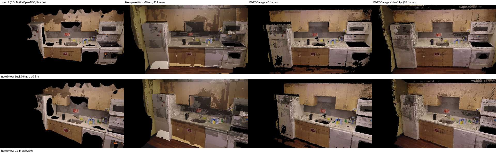
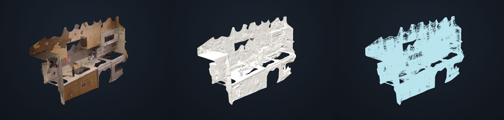

# R4: online reconstruction tools on our kitchen footage (DJI_0095)

Agent R4 wrote this on 2026-09-25 for the kitchen-0095 bench (`docs/research/p1-recon-bench.md`).

**Scope.** We ran hosted reconstruction demos on our own footage and compared their output with our
r2 mesh (COLMAP + OpenMVS, 34 min on hfbox) from identical cameras.

**Constraints.**
- No accounts, emails, passwords, payments or click-through terms.
- Uploads were a derived 1080p copy, never the 1 GB original.
- The HF token in `.env` was used for exactly **one** GPU call, and ZeroGPU refused that call
  before it ran (§4).

Screenshots are in `docs/research/bench/r4/`. Every JPEG is under 300 KB.

## 0. TL;DR

1. **VGGT-Ω (`facebook/vggt-omega`) beats our r2 mesh on coverage, anonymously, in under 90 s.**
   Its runs:
   - 40 frames: 25 s end to end.
   - The whole clip as video at 1 fps (88 frames): 82 s.

   It reconstructs the fridge, the dishwasher, the floor, the upper cabinets and the backsplash.
   Our r2 mesh has holes in all of those. On novel views it covers **75–80 %** of the image against
   our **45–47 %**. Its camera track agrees with our COLMAP track to **9–11 mm RMS** after Sim(3),
   0.4–0.5 % of the path span.

   It does not beat r2 on close-up detail or texture sharpness:
   - The output is a 1–2 M-point cloud, not a textured mesh.
   - It drops low-confidence dark and specular areas: the sink, the stove top and the oven window.
   - It has no metric scale: 1 tool unit ≈ 1.68–1.69 of our metres.
   - Held-out PSNR on views both methods cover is equal or 1–5 dB worse than r2 at 480×270.
2. **HunyuanWorld-Mirror (`tencent/HunyuanWorld-Mirror`) has the most coverage of all.**
   - It covers 97–100 % of held-out views, including the ceiling and the lights.
   - Colours are ghosted and blotchy: it fuses 40 per-frame depth meshes with no cross-frame
     blending.
   - Held-out PSNR is 2–8 dB below r2 on the views r2 covers.
   - Its GLB is 207 MB.
   - Poses agree with ours to 12 mm RMS.
3. **Not tested:**
   - **ZeroGPU quota blocked the rest.** MapAnything, Depth Anything 3 (official), MASt3R and
     InstantSplat each request 150–180 s of GPU. The anonymous daily quota had about 100 s left
     after the two runs above.
   - **The HF token did not help.** Its account showed 96 s left, because the P4 part server
     shares that quota.
   - **A CPU-hosted Depth Anything 3 mirror hung.** The 40-frame high-res run was killed after
     20 min, and a 20-frame low-res retry timed out after 90 min (§3.4).
4. **Recommendation: swap VGGT-1B for VGGT-Ω 1B-512 in our fast path.** That covers
   `pipeline/fast_worker.py` (the r1 preview) and the `pipeline/vggt.py` fallback. Also try VGGT-Ω
   depth as a depth source for the depth-fusion densify (`pipeline/depthfusion_worker.py`).
   - The model is pure PyTorch: SDPA attention and `torch.autocast` only, with no flash-attn,
     xformers or custom CUDA ops, so it should run on ROCm unchanged.
   - The only blocker is the **manually gated checkpoint**, which needs the user's HF account (§5).
   - R1 (`r1-academic.md` §0, §9 row 4) had already ranked it on paper. This is the first
     measurement on our own footage.



Novel views that no input frame saw, all rendered in our metric frame. From left to right:
- ours r2;
- WorldMirror (40 frames);
- VGGT-Ω (40 frames);
- VGGT-Ω (88 frames from video).

## 1. Comparison table

| Tool | Access | Time: upload → result | Input used / limits | Output | Coverage (held-out / novel views) | Detail | Metric scale | Verdict |
|---|---|---|---|---|---|---|---|---|
| **ours r2** (COLMAP + OpenMVS) | hfbox | 34 min (27 min of it densify) | 165 frames at 4K | textured mesh, 200k tris, 4K atlas, 6.2 MB GLB | 40–95 % / 45–47 % | **best**: sharp texture, labels readable | yes (caption altitude, 5 cm fit) | baseline |
| **VGGT-Ω** (`facebook/vggt-omega`) | anonymous ZeroGPU, API via `gradio_client` | **25 s** for 40 frames (upload 15 s + GPU and download 10 s); **82 s** for the video (88 frames: upload 43 s + 32 s + 6 s re-export) | images or video (1 fps default); resized to 512 px "balanced"; no hard frame cap (60 s default GPU slot) | GLB: point cloud (≤ max_points_k, 1–2 M) + camera cones, 15–31 MB; **no poses or intrinsics file** (recovered from the cones, §3.1) | 52–95 % / 64 % (40 frames); **79–99 % / 75–80 %** (88 frames) | medium: noisy point splats; drops sink, stove top and oven window (confidence filter) | **no** (×1.68 to our metres) | **better coverage than ours, worse detail; adopt the model locally** |
| **HunyuanWorld-Mirror** (`tencent/HunyuanWorld-Mirror`) | anonymous ZeroGPU, API | ~105 s (upload 15 s + GPU and GLB download 91 s) | images or video (1 s interval); 518×294 internal | GLB of 40 per-frame depth meshes (5.5 M verts, **207 MB**) + `camera_params.json` (c2w + K) + 3DGS PLY and RGB/depth fly-through videos (not kept, §3.2) | **97–100 % / 80–87 %** (ceiling, lights and floor too) | low: ghosted, blotchy colours from per-frame layers | no (×1.43) | most complete but ugly; a useful prior/filler, not a deliverable |
| MapAnything (`facebook/map-anything`) | anonymous ZeroGPU | blocked: "180 s requested vs 103 s left" | video or images, 1 s interval | GLB (+ predictions.npz server-side) | not run | – | yes (metric model) | needs quota |
| Depth Anything 3 (`depth-anything/depth-anything-3`, DA3NESTED-GIANT-LARGE) | anonymous ZeroGPU | blocked (anonymous 180 s > 103 s left; the token call was also refused, 96 s left) | video/images; low_res/high_res; optional 3DGS head | GLB, 3DGS video | not run | – | yes (nested metric) | needs quota |
| DA3 mirror (`John6666/depth-anything-3-mod`, DA3NESTED-GIANT-LARGE-1.1) | anonymous, but the Space runs on **cpu-basic** | 40 frames high-res: killed after 20 min; 20 frames low-res: timed out after 90 min | same as DA3 | – | – | – | – | too slow on CPU; §3.4 |
| MASt3R (`naver/MASt3R`) | anonymous ZeroGPU | not attempted: requests 180 s > quota | ≥5 images → logwin graph; 512 px; 300+300 iterations | GLB | – | – | yes (metric checkpoint) | needs quota |
| InstantSplat (`kairunwen/InstantSplat`) | anonymous ZeroGPU | not attempted: requests 150 s; DUSt3R complete graph → ~12 frames at most | same-resolution images | 3DGS PLY + video | – | – | no | low value (splat, few views) |
| VGGT (`facebook/vggt`) | anonymous ZeroGPU | `view_api` fails on this Space (500 on API info) | – | – | – | – | – | skipped: our r1 preview already runs VGGT-1B |
| π³ (`yyfz233/Pi3`) | Space **paused**; mirror `timfromhcs/Pi3` timed out | – | – | – | – | – | – | unavailable |
| StreamVGGT, VGGSfM, mini-dust3r, instant-splat (pablovela) | CONFIG_ERROR / PAUSED / RUNTIME_ERROR | – | – | – | – | – | – | unavailable |

**How the coverage and PSNR numbers were computed.** Each tool's cloud is Sim(3)-aligned to our
metric frame on timestamp-matched camera centres. We then render it from our (interpolated)
cameras at five held-out times that no tool saw (9.2, 26.4, 43.6, 60.8 and 78.0 s, midway between
the 40-frame samples) and at two novel views.

Treat the numbers as indicative:
- Point clouds are splatted as 2×2 px at 480×270. That hides point-cloud holes and blur, so it
  flatters the tools.
- Our mesh is rendered with `pipeline.preview.render`.
- PSNR is on each method's own covered pixels.

The caller's harness, at full resolution with Chamfer against the reference cloud, is the real
score.

| held-out time | ours cov / PSNR | VGGT-Ω 40f | VGGT-Ω 88f | WorldMirror |
|---|---|---|---|---|
| 9.2 s | 85 % / 21.6 | 79 % / 19.8 | 91 % / 19.5 | 96 % / 14.1 |
| 26.4 s | 95 % / 24.2 | 95 % / 20.0 | 100 % / 18.8 | 100 % / 15.7 |
| 43.6 s | 69 % / 19.5 | 94 % / 19.6 | 99 % / 18.7 | 100 % / 16.5 |
| 60.8 s | 63 % / 15.1 | 75 % / 15.0 | 85 % / 15.5 | 98 % / 19.6 |
| 78.0 s | 40 % / 13.8 | 52 % / 13.6 | 79 % / 14.8 | 97 % / 15.2 |
| novel: back 0.6 m | 45 % | 65 % | 80 % | 87 % |
| novel: 0.9 m sideways | 47 % | 64 % | 75 % | 80 % |

## 2. Our result (reference screenshots)

Screenshots are from the local viewer, `Kitchen (our Mini 4K)`, mesh.r2, in Photo | Clay | Wire:



The Clay view shows the real problem: the untextured walls, the cabinet tops and the fridge side
are open holes. These are the same regions every feed-forward tool below fills in.

## 3. Per-tool notes

### 3.1 VGGT-Ω, `facebook/vggt-omega`: the one to adopt

- **Boards:**
  - 40 frames: [r4/vggt-omega_vs_ours.jpg](r4/vggt-omega_vs_ours.jpg)
  - video, 88 frames: [r4/vggt-omega-video_vs_ours.jpg](r4/vggt-omega-video_vs_ours.jpg)

  Each board has three columns: the photo at the held-out time, ours r2, and the tool. The rows
  are the five held-out times plus two novel views.
- **API:**
  1. `/update_gallery_on_upload(video, images, fps)` → `target_dir`.
  2. `/gradio_demo(target_dir, conf_thres=50, mask_black, mask_white, show_cam, mask_sky, max_points_k)` → GLB.
  3. `/update_visualization(...)` re-exports from the server-side `predictions.npz` with no GPU.
     We used it for a second GLB at `conf_thres=25`, which is the one scored.
- **What it runs** (Space `app.py`, `vggt_omega/`):
  - `VGGTOmega()` with the `facebook/VGGT-Omega` checkpoint `vggt_omega_1b_512.pt`: 1B params,
    4.6 GB fp32.
  - `load_and_preprocess_images(..., image_resolution=512, mode="balanced")` keeps about 512²
    tokens per frame at patch 16.
  - A single forward pass under `torch.autocast(bf16)`.
  - Poses come from `encoding_to_camera(pose_enc)`.
  - The world points are depth unprojected through the predicted cameras; there is no point head.
  - It filters by confidence percentile and depth edges (`rtol=0.03`), then subsamples to
    `max_points`.
  - `@spaces.GPU()` uses the default 60 s slot, which is why it fit in our remaining anonymous
    quota and nothing else did.
- **Model** (project page vggt-omega.github.io, arXiv 2605.15195, CVPR 2026 best-paper finalist):
  - A single dense head with multi-task supervision; the high-resolution conv layers are removed.
  - Registers plus "register attention" partly replace global attention, for about 30 % of VGGT's
    training memory.
  - Trained on 15× more supervised data plus self-supervised video.
  - On 10-frame 7-Scenes it scores AUC@3° 36.4 against VGGT's 10.9 (R1 table).
- **Poses for the harness.** The GLB only has cone meshes, so `scratchpad/r4/cones.py` recovers
  poses from `visual_util.integrate_camera_into_scene`:
  - The cone apex is the camera centre.
  - Apex → base is the optical axis.
  - The 45° base diagonals plus "down ≈ GLB −Y" fix the roll.

  The recovered centres fit our COLMAP track at **9.0 mm RMS** (38/40 inliers) and **11.3 mm RMS**
  (84/88 inliers). Intrinsics are not exported, so `cameras.json` carries ours (fx 1457.6 at
  1920×1080). Treat the rotations as approximate: the centres are exact, the roll is heuristic.
- **Failure modes on our clip:**
  - It drops the black glass stove top, the sink basin and the oven window below the confidence
    percentile. They are holes, as they are in r2.
  - Surfaces are noisy speckle, not planes.
  - Colours are raw per-pixel with no multi-view blending, so the fridge looks mottled.

### 3.2 HunyuanWorld-Mirror, `tencent/HunyuanWorld-Mirror`

- **Board:** [r4/worldmirror_vs_ours.jpg](r4/worldmirror_vs_ours.jpg)
- **API:**
  1. `/update_gallery_on_file_upload(files, interval)` → `target_dir`.
  2. `/gradio_demo(target_dir, "All", show_camera, filter_sky_bg, show_mesh=True, filter_ambiguous=True)`.

  It returns a GLB, depth and normal PNGs, a **`camera_params.json`** download (per frame, 4×4
  **camera-to-world** and 3×3 K at 518×294), a 3DGS PLY, and RGB/depth render videos.
- **Frames.** The GLB is exported with `inv(E0) @ diag(1,−1,−1)` applied. E0 is the identity, so
  the scored points flip y and z back to the camera-param frame.
- **What was kept.** Our local `/tmp` quota ran out while `gradio_client` downloaded the splat PLY
  and videos. The GLB and the cameras had already arrived. The GPU quota was spent, so we did not
  re-run it.
- **Model** (arXiv 2510.10726): a VGGT-style feed-forward transformer. It accepts optional pose,
  intrinsics and depth priors and has a gsplat head.
  - The priors are interesting for us: we could feed it our COLMAP poses and intrinsics.
  - In the demo, the per-frame meshes are simply concatenated, which explains the colour ghosting.
- **Assessment.** It gives the most complete geometry of anything we ran, including the ceiling,
  the lights and the floor, but it is unusable as a textured deliverable. Its value is as a
  hole-filling or coverage prior.

### 3.3 MapAnything, DA3 (official), MASt3R, InstantSplat: blocked by ZeroGPU quota

For each Space, the upload endpoint succeeded, and then the GPU call failed with:

```
AppError('You have exceeded your ZeroGPU quota (180s requested vs. 103s left). Try again in 23:55:27.')
```

- The Spaces' source requests `duration=120`, but the error reports 180 s. We infer the
  scheduler bills 1.5× for large GPUs; this is not verified.
- Anonymous quota is per IP, per day. It had about 100 s left after the WorldMirror run, which
  used about 90 s of wall time.
- One retry of DA3 with the `.env` token hit the same wall: "180 s requested vs **96 s** left". The
  token's account is the P4 server's, so it also shares that quota.
- All four stay in the "needs quota" column. They are in the needs-account list (§4) as "HF account
  with quota".

### 3.4 DA3 on CPU (`John6666/depth-anything-3-mod`)

- **Why this mirror.** It exposes a `zerogpu_duration_s` dropdown (30/60/90/120), which looked
  like a way to fit the quota.
- **What we found.** The Space currently runs on **cpu-basic**, where the 1.4B-parameter
  DA3NESTED-GIANT is impractical. The 40-frame high-res job was still running after 20 min and
  was killed.
- **The retry also failed.** A 20-frame low-res retry uploaded in 9.5 s, then produced no result
  before our 90 min client timeout (`work/r4/da3j.stdout`). DA3 on this Space is not usable
  while it runs on CPU.

### 3.5 Not tried, or unavailable

- **SAM 3D (aidemos.meta.com).** It needs a click-through ToS acceptance, which we did not
  accept. It is also object-level and single-image, so it has low value for a room.
- **π³.** The official Space is paused and the mirror timed out.
- **StreamVGGT, VGGSfM, mini-dust3r, pablovela instant-splat.** These Spaces are in an error or
  paused state.
- **CPU Spaces** (`svjack/vggt`, `ostapient/mast3r-3dgs`). They are anonymous and free but hours
  per run, and they duplicate VGGT, which we already run.

## 4. Needs account (the user decides)

| Service | What the free tier gives | Likely value to us |
|---|---|---|
| **Hugging Face: gated access to `facebook/VGGT-Omega`** | Free. Request access on the model page; an automated review of the form ("manual" gate), no payment. | **High.** This is the only thing blocking VGGT-Ω on hfbox (§5). Needs the user's HF account, ideally the one whose token is in `.env`. |
| Hugging Face account for ZeroGPU quota (separate from the P4 token) | A free account gets a few minutes a day of ZeroGPU (more than anonymous). PRO is paid and we did not accept it. | Medium. It would finish MapAnything (metric), official DA3 (metric + 3DGS) and MASt3R online without touching the P4 quota. |
| KIRI Engine | Per `p1-cloud-world-models.md`: Basic $0/mo, 70 photos, no video. The API has 10 free credits. | Low–medium. Photogrammetry mesh; free tier too small for 165 frames. |
| World Labs Marble | Account plus credits (~$4/scene with HQ mesh, per `p1-cloud-world-models.md`) | Low. Generative; geometry may not match the room. |
| Polycam | Consumer tier with an account; API is Enterprise-only | Low. |
| Tencent Hunyuan3D / HunyuanWorld web | Login | Low. The HF Space above already covers WorldMirror anonymously. |
| Meta SAM 3D playground | No login, but needs ToS acceptance | Low (object-level). |

## 5. Recipe: VGGT-Ω on hfbox (RX 9070 XT, ROCm)

**Status.** Not yet run locally, because the weights are gated. Everything below is from the Space
source and the model card.

1. **Get the weights.** The user requests access at huggingface.co/facebook/VGGT-Omega. Then, on
   hfbox:

   ```
   hf download facebook/VGGT-Omega vggt_omega_1b_512.pt --local-dir /workspace/models/vggt-omega
   ```

   The file is 4.6 GB. Keep it under `/workspace`, as `fast_worker.py` already does for VGGT-1B.
2. **Code.**

   ```
   git clone https://github.com/facebookresearch/vggt-omega
   ```

   Install it into the existing `/workspace/envs/vggt` venv (torch 2.14+rocm7.2).
   - Requirements are only einops, safetensors, opencv, trimesh and scipy.
   - The attention is `F.scaled_dot_product_attention` under
     `torch.autocast("cuda", bf16 if is_bf16_supported else fp16)`. ROCm torch exposes the same
     `cuda` device and supports bf16 on gfx1201, so no patch is expected.
   - No xformers, flash-attn or compiled extension appears in `vggt_omega/`.
3. **Inference** (the same shape as the Space):

   ```python
   model = VGGTOmega().eval().to("cuda")
   model.load_state_dict(torch.load(ckpt, map_location="cpu"))
   imgs = load_and_preprocess_images(paths, image_resolution=512).to("cuda")
   with torch.inference_mode():
       p = model(imgs)
   E, K = encoding_to_camera(p["pose_enc"], p["images"].shape[-2:])
   ```

   `p["depth"]` and `p["depth_conf"]` are per frame. R1 estimates about 13.4 GB at 100 frames at
   624×416. At 512 on 16 GB, start with 88 frames (1 fps) as in the online run, and chunk above
   ~150.
4. **Plug into our pipeline:**
   - **(a) Preview, `pipeline/fast_worker.py`.** Swap the VGGT forward pass for VGGT-Ω and keep
     the TSDF → mesh → TextureMesh tail. We expect better poses, which should fix the preview's
     45 % scale error, and the coverage seen above.
   - **(b) `pipeline/vggt.py`.** Use VGGT-Ω as the SfM fallback. It has the same COLMAP export
     need; `encoding_to_camera` gives E and K.
   - **(c) Depth-fusion densify, `depthfusion_worker.py`.** Add `--model vggt-omega`, which gives
     multi-view-consistent depth instead of monocular MoGe-2. Align its scale to the COLMAP sparse
     points as the worker already does.
5. **Check.** Score with the bench harness. Our `work/r4/vggt-omega-video/` outputs already give
   the online baseline to beat: 88 frames, 82 s wall, 11 mm track RMS.

## 6. Outputs (for the scoring harness)

Everything is under `work/r4/` in the repo (gitignored). It is symlinked as `scratchpad/r4/out`,
because the scratchpad tmpfs quota was full.

| dir | contents |
|---|---|
| `vggt-omega/` | `recon_0.glb` (1 M points + cones), `poses.npz`, `cameras.json` (tool frame, OpenCV w2c, our K), `frame_times.json` (40 ids → video s), `points.ply`, `align.json` (Sim(3) and coverage), `log.json` (timings) |
| `vggt-omega-video/` | `recon_0.glb` (conf 50), `revis_conf25_0.glb` (conf 25, scored), same files; 88 ids `v000`–`v087` at t = k·30/29.97 s |
| `worldmirror/` | `recon_0.glb` (207 MB), `camera_params.json` (original), `cameras.json`, `frame_times.json`, `points.ply` (87 MB, un-flipped to the camera frame), `align.json`, `depth0.png`, `normal0.png` |
| `da3/`, `mapanything/`, `da3j/` | `log*.json` of the quota-blocked / CPU attempts |
| `shots/` | full-size viewer screenshots |

**Inputs.** Scratchpad `r4/in/`:
- `dji0095_1080.mp4`: 41 MB, openh264 at 4 Mb/s. The ffmpeg build has no libx264.
- `dji0095_540.mp4`.
- `f40/`: 40 JPEG frames at 1920×1080, t = 0.6 + 2.15k s.
- `f20/`.
- `frame_times_f40.json`, `frame_times_f20.json`, `frame_times_video1fps.json`.

Frame ids follow the pipeline's 10 fps grid, `id = round(10t) + 1`.

**Scripts** (scratchpad `r4/`):
- `run.py`: `gradio_client` runner with timing.
- `cones.py`: pose recovery from camera cones.
- `compare.py`: Sim(3) alignment, renders and boards.
- `export_ply.py`.
- `src/`: Space sources that were read.
- `api/`: `view_api` dumps.

**Harness caveat.** `harness.py score` renders a *textured* mesh through `preview.render`. These
tools deliver vertex-coloured points, so they need either a points path in the harness or a quick
TSDF/Poisson mesh first. `points.ply` together with `cameras.json` and `frame_times.json` is
enough for the Sim(3) and Chamfer part.
