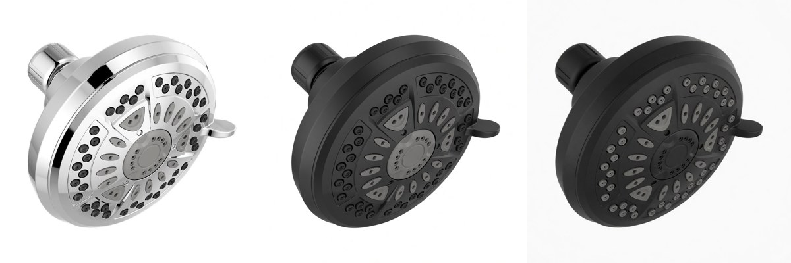
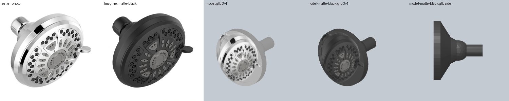
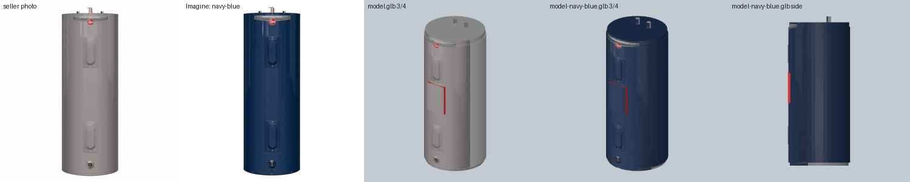
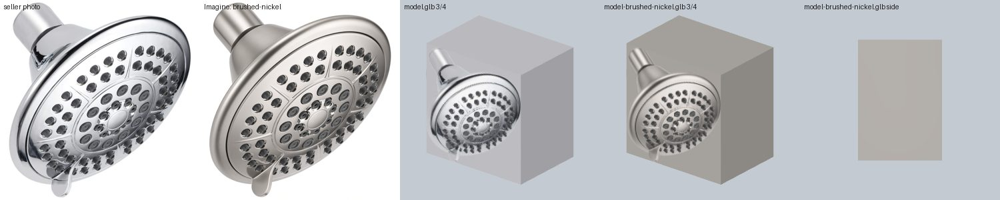
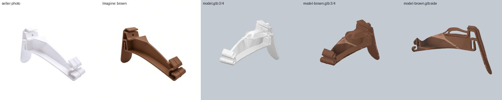
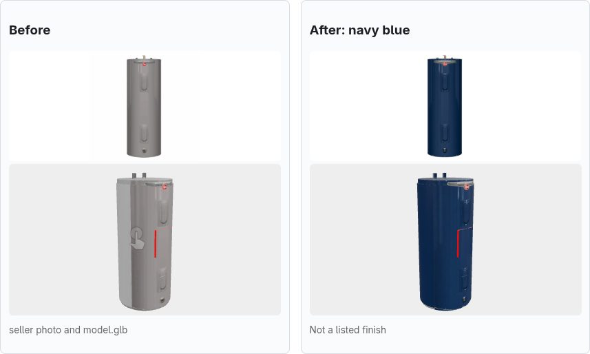

# F11: finish variants that re-texture the GLB

Feature F11, 2026-09-26, branch `feat/grok-finish-variants`. It builds G4's pick 3
([g4-round3.md](g4-round3.md) §5): "show it in matte black" should change the real asset, not tint
it.

## Bottom line

- **It works on the three tiers that carry a product photo.**
  - One `grok-imagine-image-2.0` edit turns the seller photo into the finish: **$0.070 and 7–9 s**.
  - The product outline stays put: the bbox moved 0.1–1.4 % and mask IoU was 0.89–0.99.
  - We put the edited photo back on the part's own geometry, so the variant GLB has exactly the
    size and origin of `model.glb`.
- **Spend: 5 live calls, $0.347 in total**, under the $0.50 cap: 2 calls to compare the routes, then
  3 more parts. Costs come from `usage.cost_in_usd_ticks`.
- **Repeats are free.** A second request for the same finish returns the GLB already on disk.
  - If the GLB is gone, it is rebuilt from the cached image in 1.2–1.5 s (4–4.5 s on a Hunyuan
    mesh), with `OFFLINE=true` and no network.
  - On the `llm` tier the template plan is a cache hit too, so there is no Groq call.
- **We use `/v1/images/edits`, not the Responses `image_generation` tool.** Both were equally good
  on the shower head, but the edits route kept a pure white background (the tool's came back
  off-white). It was also 1.6 s faster and its response is simpler to parse.

## 1. The two edit routes (shower head, chrome to matte black)

| Route | Model | Cost | Latency | Bbox shift | Mask IoU | Background |
|---|---|---|---|---|---|---|
| **`POST /v1/images/edits`** | `grok-imagine-image-2.0` | **$0.0700** | **7.3 s** | 0.20 % | 0.993 | pure white |
| `POST /v1/responses` + `tools: [image_generation]` | `grok-4.20-0309-non-reasoning` | $0.0674 | 8.9 s | 0.10 % | 0.997 | off-white gradient |

Both kept every spray nozzle in place.
- **Edits route.** It kept the spray face light grey, as on Delta's real matte-black heads.
- **Responses tool.** It darkened the face as well. Its rewritten prompt was ours word for word.

The mask check copes with the off-white background, because `photo_mask` floods out from the
border colour. Even so, a pure white background is the safer input for projection.

## 2. Live results

Test data:
- The four parts were copied from `data/parts` into a scratch data dir.
- The shower head and water heater were re-resolved with main's resolver. Each became `llm` tier
  after one Groq qwen call.
- The Delta RP78575 was rebuilt as main's decal-box proxy.
- The gutter hanger kept its existing Hunyuan `ai_mesh`.
- There is no faucet in `data/parts`, so the RP78575 (a chrome shower head) stood in for the
  brushed-nickel case.

| Part | Tier | Finish | Cost | Edit | First request | Rebuilt from cache | Shift | IoU | Verdict |
|---|---|---|---|---|---|---|---|---|---|
| Delta 75641 shower head | `llm` (fixture) | chrome → matte black | $0.070 | 7.3 s | ≈ 8.7 s (edit + 1.4 s build) | 1.45 s | 0.20 % | 0.993 | **Excellent.** Photo and template body both matte black; the arm is black too; same 111 × 111 × 92 mm |
| Rheem XE40 water heater | `llm` (cylinder_tank) | grey → navy blue | $0.070 | 8.7 s | 9.9 s | 1.2 s | 0.30 % | 0.988 | **Good.** Navy all round: jacket, top and panels. The copper pipes, base ring and red label stay as they were |
| Delta RP78575 shower head | `proxy` (decal box) | chrome → brushed nickel | $0.070 | 9.1 s | 10.4 s | 1.4 s | 0.20 % | 0.993 | **Good.** A convincing satin-nickel photo; the box takes the variant's edge colour |
| Amerimax M0722B vinyl hanger | `ai_mesh` (Hunyuan) | white → brown | $0.070 | 7.3 s | 13.5 s (with 1 Groq plan call and a 429 retry) | 4.0–4.5 s | 1.40 % | 0.889 | **Good.** Brown all over, with lighter patches where the photo lands on the side walls. The white-on-white original gives the weakest mask |

Every variant GLB matched its `model.glb` bbox to the millimetre. The unit tests check the same
contract: bbox equals dims, origin at the mount-face centre, and the part extends toward +Z.

In each strip below:
1. the seller photo;
2. the Imagine edit;
3. `model.glb` at 3/4 view;
4. the variant GLB at 3/4 view;
5. the variant GLB from the side.

Renders are from `server/experiments/assets_llm/render.py`, using e3_run's py3.13 pyrender texture
patch.

The `/debug` console's new "Finish variant" section shows before and after (seller photo and
`model.glb`, then the edit and the variant GLB) in `model-viewer`. Below is the water heater,
served `OFFLINE` from the cache:

## 3. How it works (`server/finish.py`)

1. **`apply(part, name)`** is the endpoint body and never raises.
   - `cad` and `scad` parts, and parts with no photo or no ready model, get `source: "tint"` at
     once, with no call.
   - Otherwise it makes one edit, cached as `cache.cached("finish", {part, finish slug, photo
     sha1})`. The cached value holds the JPEG itself, so a warm finish needs only the cache
     directory, even offline.
2. **`registered(photo, variant)`** resizes the variant to the photo's size and compares their
   `meshgen.photo_mask`s.
   - Every bbox side must be within **2 %** of the image, and the mask IoU at least **0.85**.
   - A failure gives `tint`, with `reason: "outline moved (...)"`.
   - The paid edit stays cached, so asking again doesn't pay again.
3. **`build(part, photo, variant, name)`** follows how `assets._generated` / `_box` made
   `model.glb`:
   - **`llm`:**
     - `meshgen.ask` returns the cached plan.
     - The template is built once to find the largest role.
     - That role, and any role within 24 sRGB levels of its colour, takes the variant's product
       colour, with the finish mapped by `pbr_finish` (matte → painted, nickel → brushed,
       chrome → chrome).
     - The template is rebuilt, and `meshgen.project` puts the variant on the plan's face.
   - **`ai_mesh`:** `model.glb` is flattened, repainted in the variant's colour and re-projected.
     This repeats what the resolver did with the Hunyuan mesh.
   - **`proxy`:** `meshgen.decal_box(dims, variant, aspect_guess(photo))`.
4. **Listed or not.**
   - `listed()` matches the finish name against `part.finish` and `finishes[]` by slug containment,
     so "black" matches "Matte Black".
   - An unlisted finish gets `label: "Not a listed finish"`, and the spoken reply adds "That's not
     a listed finish, so check the seller has it."
5. **Agent.**
   - `set_finish` is no longer client-only. `_set_finish` calls `apply` with a **20 s** cap.
     `asyncio.shield` lets a slow first render finish and cache after the agent stops waiting.
   - The action stays `{name}`, plus `model_url` and `label` when there's a render, so old
     clients just tint.
   - The spoken line comes from `apply`, never the model, so the "not listed" warning can't be
     dropped.
   - A new fast path, "show it in <finish>", works without the LLM, so it also works `OFFLINE`
     from the cache.

## 4. Open issues

- **White products on white backgrounds** are the weak case for the outline check. The vinyl
  hanger scored IoU 0.889 against a bar of 0.85, because the original's mask is patchy, not
  because the edit moved anything. If a white part fails, loosen `MIN_IOU` or check only the bbox
  for parts whose photo mask covers less than a set share of their bbox.
- **Choosing which template roles to recolour** is a heuristic: the largest role, plus colours
  within 24 levels of it.
  - A two-tone product whose main colour isn't the largest role will recolour the wrong part.
  - The photo face is always right, whatever this picks.
- **Dark metallic finishes render lighter than they should.** `part_templates.material` lifts
  metals to a minimum brightness (`METAL_MIN_LUM`), so an "oil-rubbed bronze" template body comes
  out lighter than the photo.
- **No pre-baking yet.**
  - G4 suggested `warm.py --finishes`, which isn't built. The first live render of a finish costs
    about $0.07 and 8–13 s.
  - Warming 5 demo parts × 2 finishes would cost about $0.70.
  - Until then, warm a finish by requesting it once online.
- **A rejected edit stays tint** for that part and finish until its `data/cache/finish/` entry is
  deleted. This is deliberate: retrying would pay again.
- **Two simultaneous first requests** for the same finish both pay. There is no in-flight dedupe.
- **The fast path only matches "show it/this/that in X".** Other phrasings ("make it black") need
  the LLM, which means online.
- **Unity** still has to implement the new `set_finish` fields: reload from `model_url` in place,
  and show `label` (`docs/api.md` §5).
- **None of the parts in the repo's `data/parts` is on the `llm` tier yet.** They were all resolved
  before that tier existed (`ai_mesh`/`proxy`). They still re-texture through their own tier, but
  they get the `llm` look only after a re-resolve.
