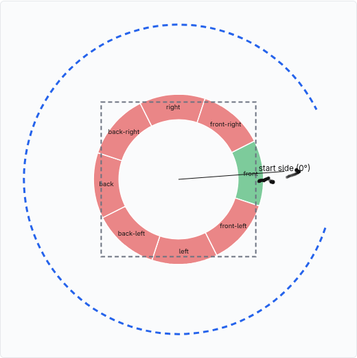

# F12: capture coach, results on the real building scenes

Feature agent F12, 2026-09-26. Builds G4 pick 2 (`g4-round3.md` §5): `server/coverage.py`,
`GET /scenes/{site}/coverage`, the agent tool `coach_capture` and the Unity action
`show_coverage` (contract in `docs/api.md`). Branch `feat/grok-capture-coach`, off `main`.

**Licence.** B1's licence notes for this footage aren't on `main` and are unverified. The ring
image below and the per-scene numbers are for internal review only.

**Bottom line.**
- The maths is local and cheap: 95 ms cold (loading the collision mesh), 3 ms warm, on Zabel's
  118 cameras.
- **Every B1 building clip covers one side, or at most three.** They are short promo-style
  shots, a rising pedestal or a short sideways track, never an orbit. Zabel's 118 cameras all sit
  on one side, as G4 found, and the coach turns the 7 empty sides into **one** orbit leg.
- Grok adds little over the template. It keeps every number but drops the side names ("You've
  covered 1 of 8 sides", not "(front)"). Nine live calls cost **$0.0037** in total, about
  $0.0004 each, 1–5 s. The template is the offline and failure path, and it reads as well.
- The kitchen is an indoor scan. It gets a clear "exterior only" answer instead of a fake orbit.

## Method (short)

Full detail in the `server/coverage.py` docstring and `docs/api.md`.
- **Target.** The collision mesh, sampled by area (20k points). Its centre is the middle of the
  5–95 % XZ box at ground level (2 % of Y); its width is that box's diagonal.
- **Views.** Each camera looks along `f = R[2]`, and its pitch is `asin(-f_y)`. Its side is the
  bearing of its horizontal offset from the centre, one of 8 sides of 45°. Its weight is 1 while
  the target's bounding sphere covers the optical axis, falling to 0 once the target leaves the
  horizontal field of view (`atan(w / 2fx)`). Nadir views (60° or more down) count only for the
  roof. A side is seen at 3 weighted views.
- **0°.** North when `scene.json.north` is set; it is null on every scene here. Otherwise 0° is
  the side of the first camera that sees the target, labelled from there facing the building:
  front, front-left, left, …
- **Legs.**
  - `orbit`: one per run of unseen sides, merged across 0°. Radius is one building width from the
    centre, camera 30° down, altitude aimed at mid-height.
  - `nadir_grid`: when under 10 % of views are nadir; one building width above the roof.
  - `eave_pass`: when under 15 % are level; at 0.8 × height, camera 10° down.
- **Units.** In metres when the scene is scaled, else in building widths. The width is the one
  size a one-sided scan still measures.
- **Room mode.** A metric scene narrower than 8 m returns `mode: "interior"` and no legs. Room
  coverage is about walls, not orbit sides, and that is a different feature, so we only say so.

## Results per scene

The copies are read-only, from hfbox `/workspace/airtools/scene/b1/*`, copied into the session
scratchpad; nothing on hfbox was changed. Mid-session another agent renamed `zabel-gymnasium` and
`hospital-bg` to `*.prefix`; we copied those as they stood. `hospital-bg`'s published revision is
the r1 preview (its r2 was not yet published).

| Scene | Rev | Cameras | Scale | Sides seen | Pitch (nadir / oblique / level) | Legs | Verdict |
|---|---|---|---|---|---|---|---|
| zabel | 2 | 118 | none | **1** (front: 112 views) | 6 / 41 / 71 | orbit 22.5°+315°, nadir grid | reshoot_most |
| zabel-gymnasium | 2 | 118 | known_dimension (50.2 m) | **1** | 6 / 41 / 71 | orbit 50 m out, 45 m up; nadir grid 80 m up | reshoot_most |
| hospital | 2 | 65 | none | 3 (front 22, front-right 34, right 9) | 0 / 65 / 0 | orbit 22.5°+225°, nadir grid, eave pass | reshoot_most |
| hospital-bg | 1 (preview) | 48 | none | 2 | 0 / 48 / 0 | orbit 22.5°+270°, nadir grid, eave pass | reshoot_most |
| goddard | 2 | 112 | none | 1 | 0 / 0 / 112 | orbit, nadir grid | reshoot_most |
| gt-campus | 2 | 44 | none | 1 | 0 / 44 / 0 | orbit, nadir grid, eave pass | reshoot_most |
| office-fisk | 2 | 89 | none | **0** | **89** / 0 / 0 | full orbit, eave pass | reshoot_most |
| strasbourg-cathedral-spire (old flat package, not B1) | 1 | 33 | none | 1 | 0 / 0 / 33 | orbit, nadir grid | reshoot_most |
| kitchen | 1 | 165 | altitude | n/a (2.6 m wide) | n/a | none | not_applicable (`interior`) |

Every camera in every scene aims at the target (`aimed` = `registered`), so the weighting never
had to drop a view on this data. The synthetic tests exercise it instead.

What each scene says, spoken (Grok, `spoken_source` = the model):
- **zabel-gymnasium** (metric): "You've covered 1 of 8 sides. Next, orbit from the front-left
  round to the front-right, 50 m out from the middle and 45 m up, camera 30 degrees down, then a
  straight-down grid over the roof, 80 m up."
- **zabel** (unscaled): "… one building width out from the middle and 0.9 building widths up …
  then a straight-down grid over the roof 1.6 building widths up."
- **office-fisk** (nadir only): "You've covered 0 of 8 sides. Next, orbit all the way round …
  then one slow eave pass all the way round at eave height 0.4 building widths up, camera 10
  degrees down." It gets no nadir leg, because the roof is already covered.
- **kitchen** (template, no LLM call): "This scan is only 3 metres across, so it looks like a room
  or an object. The capture coach only plans drone flights around a building."

The image is the `/debug` capture-coach panel. The cameras form a short vertical pedestal
(70 m of rise, 13 m sideways), so they collapse to a small cluster on the start side.

## Live Grok spend

The model is `grok-4.20-0309-non-reasoning` through the new `LLM_COACH` role, with no tools. The
input is the template draft (sides and leg phrases with their numbers), and the model is told to
say it as two sentences and add nothing.

| Calls | Total | Per call | Latency |
|---|---|---|---|
| 9 (a first prompt on zabel, then the draft prompt on each scene) | **$0.00371** | $0.00027–0.00051 | 0.8–5.3 s |

Cost comes from `usage.cost_in_usd_ticks` (1e10 = $1) and is logged per call as `coach:
cost_usd=…`. The first prompt sent the facts as JSON and got "The flight covered the front of
8.", which is worse. Sending the template draft fixed that. Grok still sometimes drops commas or
adds a line break (whitespace is normalised on return), and it drops the side names from the
first sentence.

## Demo steps

1. Link the scenes into `scene/` (gitignored), or set an absolute `SCENE_DIR`.
2. Start the server: `uv run uvicorn server.app:app --port 8000`.
3. `curl localhost:8000/scenes/zabel/coverage`
4. Open `http://localhost:8000/debug` → Capture coach → pick a site → **Check coverage**. You get
   the ring, the legs and the cameras, top down.
5. With a site picked, type "what did I miss?" in Command. That is the fast path (no agent LLM,
   works with `OFFLINE=true`), and it returns `show_coverage` and redraws the ring.
6. Pre-warm the spoken line for the booth: one GET per demo scene while online fills the
   `coach` cache. Offline, a cache miss falls back to the template.

## Open issues

- **None of B1's footage is a capture the coach would pass.** A real orbit is needed to show a
  green ring; the synthetic full-orbit test covers that for now.
- **0° is relative** ("start side"), because `north` is null everywhere. It becomes compass
  sides once the pipeline writes `north` from GPS.
- **The target box is the reconstruction, not the building.** On a one-sided scan, "width"
  includes whatever ground and trees were reconstructed, so relative distances are rough.
  Metric distances are only as good as the scale (gymnasium: one 50 m known distance).
- **The interior test is a size rule** (metric and under 8 m wide). An unscaled indoor scan
  would be treated as exterior. A real room mode (walls, floor and ceiling coverage from the
  structure planes) is not built.
- **Leg geometry is heuristic** (1 width out, 30°, 0.8 × height for eaves). It has not been
  checked against a flight, or against a legal ceiling: 120 m / 400 ft is not enforced.
- Grok's phrasing adds little. `LLM_COACH=groq:...` or template-only would do for the demo if
  xAI spend matters.
