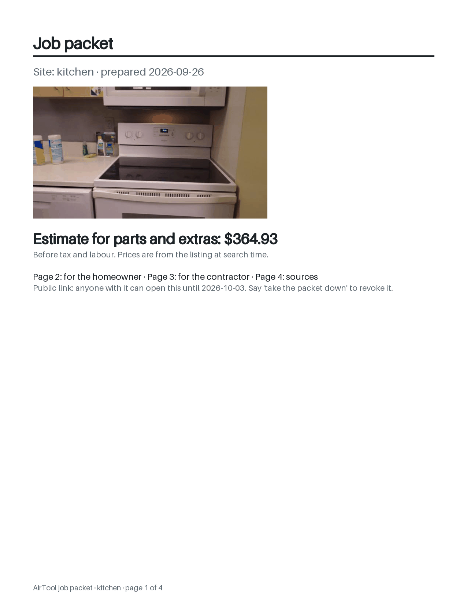
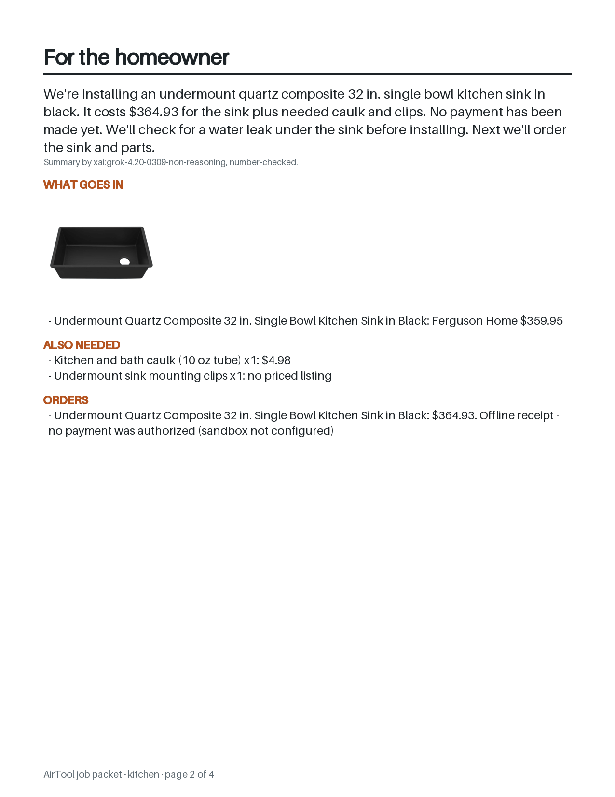
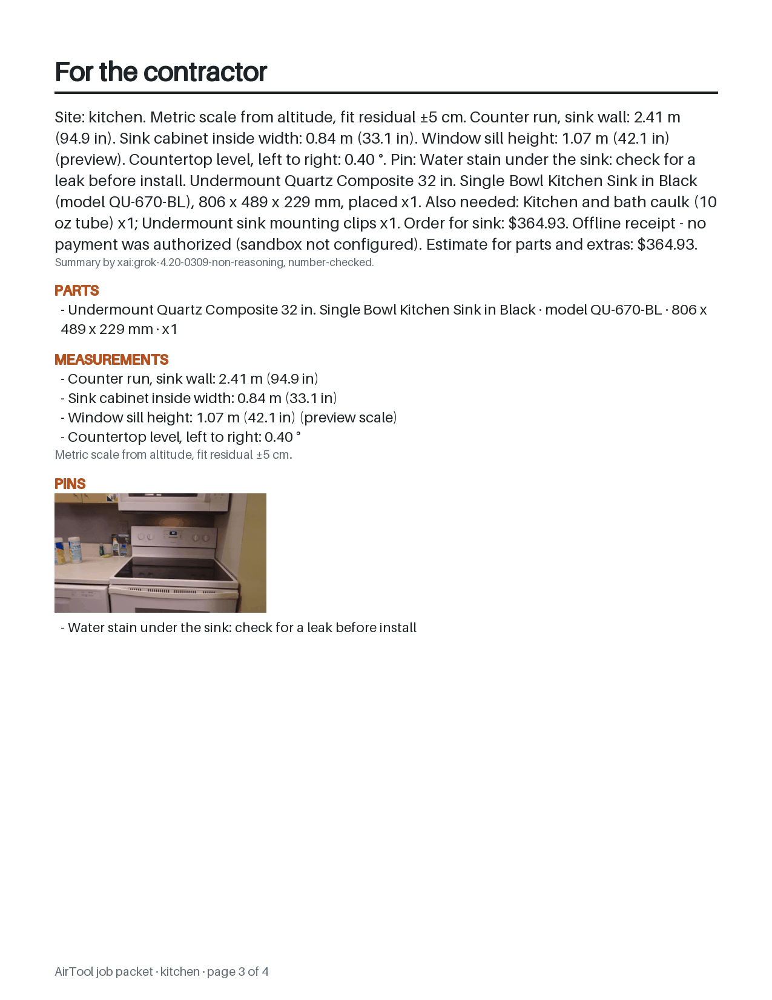
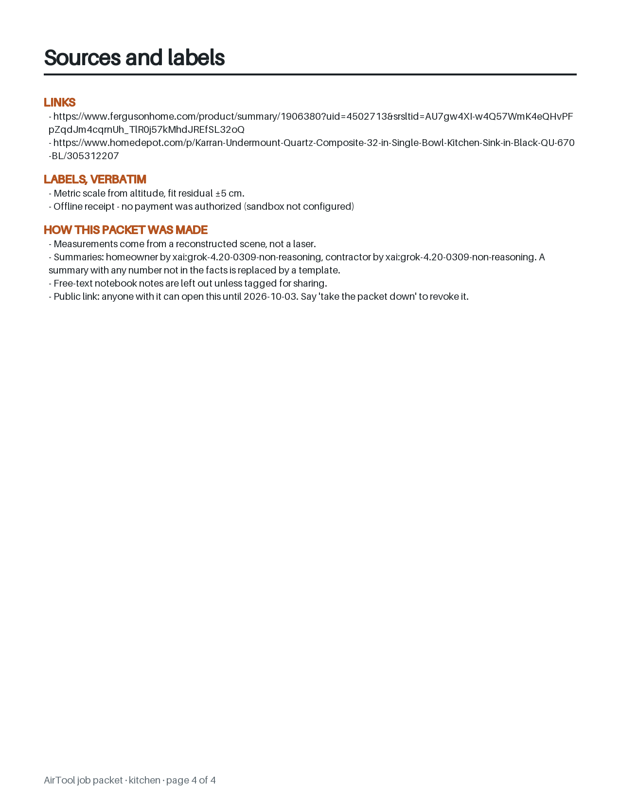
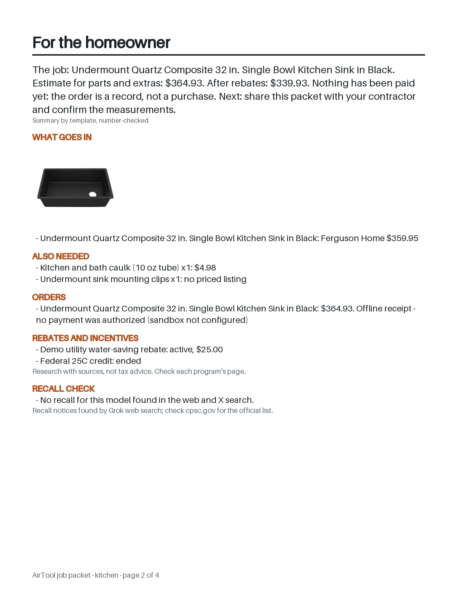
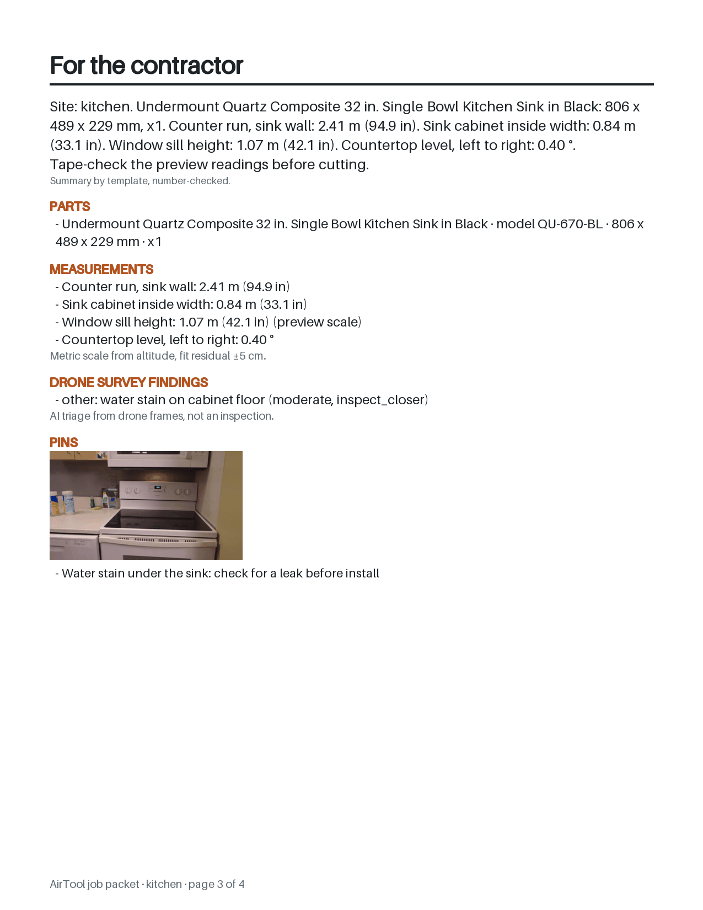

# F14: contractor/homeowner job packet

Feature agent F14, 2026-09-26, branch `feat/grok-job-packet`. Built from G5's pick 2
(`g5-round4.md` §5): a 4-page PDF on a public, revocable xAI Files link.

The live packet of the synthetic `demo-kitchen` session (F4's seed). The summaries on pages 2
and 3 were written by `grok-4.20-0309-non-reasoning` and passed the number check:

| Cover | Homeowner |
|---|---|
|  |  |
| **Contractor** | **Sources and labels** |
|  |  |

The same session with synthetic extras in the cache (a rebate, a recall search and a survey
finding; OFFLINE, so the summaries are templates). This shows the optional sections:

| Homeowner, with rebates and recall check | Contractor, with a survey finding |
|---|---|
|  |  |

## What was built

| Piece | Where | Notes |
|---|---|---|
| Facts | `server/packet.py` `gather()`, `facts()` | F4's data model (`Report`, `assemble` and its helpers), copied under the same names from `feat/grok-site-report`, since that branch isn't merged. It gives measurements, pins, parts, BOMs, and orders with their honesty labels verbatim. The packet adds model numbers, seller URLs and an estimate (parts × count + BOM). Notes appear only with `"share": true`. |
| Extras hook | `packet.EXTRAS` | `{name: (cache namespace, key field)}`: `survey` (F10, by site), `safety_grok` (F6, by part id), `rules_money` (pick 1, by part id). Plus F5's `data/parts/<id>/postcard.jpg`, which becomes the cover image. Each is read from its cache file when present and skipped when absent. Nothing is imported from those branches or fetched. |
| Summaries | `packet.blurbs()` | One `llm.responses()` call (role `packet`, default `xai:grok-4.20-0309-non-reasoning`, `LLM_PACKET` overrides) with a strict schema `{homeowner, contractor}`. The raw reply is cached by a hash of the facts. On every read, a summary with any number not in the facts, or over 120 words, is replaced by that audience's template. OFFLINE or xAI down gives both templates. `llm.responses()` is the same hunk as on the F3/F6 branches, byte for byte, so it merges cleanly. |
| PDF | `packet.render()` | PIL only, no new dependency: Letter at 150 dpi, Pillow's bundled font, saved with `save_all=True`. The pages are the cover (postcard or pin frame, estimate, after-rebates line), homeowner, contractor (models, dims, measurements, scale accuracy, pin frames, survey, shared notes) and sources (every URL, every label verbatim, how it was made). The demo PDF is about 0.5 MB. |
| Hosting | `packet.publish()`, `revoke()` | `POST /v1/files` (`purpose: assistants`), then `POST /v1/files/{id}/public-url {expires_after: days×86400}`, capped at 30 days. If public-url fails, the file is deleted. Revoke calls `/public-url/revoke`, then `DELETE /v1/files/{id}`. |
| Endpoints | `server/app.py` | `POST /packet/{session_id}`, `GET /packet/{id}.pdf` (LAN), `DELETE /packet/{id}`. Records are `data/packets/<id>.{pdf,json}` with a random 16-hex id. See `docs/api.md`. |
| Agent | `server/agent.py` | `send_packet(days?)` and `revoke_packet()`, both on the fast path ("send it to my contractor", "share the job", "give me the packet"; "take the packet down", "revoke the link"). `send_packet` returns `show_packet {url, qr_png_url: null, expires_at, public, packet_id, label}` and says "Scan the code. The link is public for 7 days, and I can take it down any time." `revoke_packet` finds the session's newest public packet on disk, so it survives a restart. |
| Debug console | `server/static/debug.html` | "Job packet" section: session, days, public toggle, make, open the LAN/public link, revoke. |
| Demo seed | `server/report_demo.py` | F4's seeder, copied byte for byte (merges cleanly). |
| Tests | `tests/test_packet.py` | 10 tests. See below. |

**QR:** there is none on the server. `segno` isn't installed, and a QR of a URL is a Unity-side
draw, so `qr_png_url` stays `null`. That is the lazier honest option the brief allowed.

## Demo steps

```bash
uv run python -m server.report_demo      # synthetic demo-kitchen session (needs data/parts/karran-qu-670-bl-2d781c)
uv run uvicorn server.app:app --host 0.0.0.0 --port 8000
curl -X POST localhost:8000/packet/demo-kitchen -H 'content-type: application/json' -d '{"days": 7}'
#  -> open "url" on a phone (public), or http://<laptop>:8000/<local_url> on the LAN
curl -X DELETE localhost:8000/packet/<packet_id>    # the public link 404s at once
```

In the headset: "send it to my contractor" gives the `show_packet` QR, and "take the packet
down" revokes it. The debug console at `/debug` does the same with buttons. With
`OFFLINE=true`, the same command builds the PDF, serves it on the LAN only and says so.

(The seeder prints "open /report/…": that's F4's route, which exists once F4 is merged.)

## Live checks and cost (cap: $0.10 Grok, 2 Files uploads)

| # | Call | Result | Cost |
|---|---|---|---|
| 1 | `POST /v1/responses`, `grok-4.20-0309-non-reasoning`, strict `json_schema`, 11 numbered facts | 200 in 5.5 s. Both summaries passed the number check (pages 2 and 3 above) | **$0.0013** (`cost_in_usd_ticks` 12,956,000) |
| 2 | Upload 1: `packet.make("demo-kitchen")`, 518 KB PDF → Files → public-url, 7 days | `make()` took 12.0 s end to end, including the Grok call. Anonymous GET **200 `application/pdf`, 518,158 bytes, `%PDF-`, 0.56 s**. File metadata: `expires_at: null`, `purpose: ""` | $0 |
| 3 | Revoke + delete upload 1 | Anonymous GET **404**; `GET /v1/files/{id}` **404** `"File not found"` | $0 |
| 4 | Upload 2: the voice path, "send it to my contractor" (summaries from cache) | `show_packet` in **2.5 s**; anonymous GET **200 `application/pdf`, 523,347 bytes, 0.31 s** | $0 |
| 5 | "take the packet down" | `packet_revoked`; anonymous GET **404**; file **404** | $0 |

The total Grok spend is **$0.0013**. Both uploads were of the synthetic demo session only, and
both were revoked and deleted, with the 404s confirmed. The key was never printed.

**What the live summaries show.**
- The contractor summary mostly copies the facts verbatim, which is why it passes. It's
  accurate but dense.
- The homeowner summary says "$364.93 for the sink plus needed caulk and clips". The clips have
  no priced listing, so $364.93 is the sink and the caulk only.
- Every number is right, but the sentence around it isn't. This is G5 call #6's lesson again: a
  numbers-only check can't catch meaning. The template (`extras-page2.png`) avoids the problem.

## Tests (10, all offline)

1. `gather`: untagged notes (including an owner's name and unit number) never reach the facts. A
   `share: true` note does. The estimate is $364.93.
2. The template summaries pass their own number check.
3. **Number hallucination:** a mocked reply "…saves $900 a year" gives the homeowner template,
   while the clean contractor reply is kept. The request is strict `json_schema` on the right
   model. A second build is a cache hit (no call).
4. `backed()` treats `1,234`, `1234` and `1234.00` as equal, and `2.4` doesn't match `2.41`.
5. **Optional sections:** with nothing cached, `sections == []`. With survey, safety, rules and a
   postcard cached, all four show up. A `severity: none` finding is dropped, the rebate line is
   in the facts, the after-rebates total is right, and the PDF still has 4 pages.
6. **Publish** (respx with the doc's shapes): the upload is multipart with the PDF bytes, and
   `days: 90` is capped to `expires_after: 2592000`. `url` is the `public_url`, and the PDF has 4
   `/Type /Page` objects.
7. **Revoke:** `DELETE` calls revoke, then delete, once each (7 days → `expires_after: 604800`).
   The record goes `public: false`, the LAN PDF stays, and an unknown id gives 404.
8. Files 500 → **502**, with `local_url` in the detail.
9. **OFFLINE:** no HTTP call at all (respx sees none), `public: false`, the LAN label, template
   summaries, `GET /packet/{id}.pdf` 200 with 4 pages, and an unknown session gives 404.
10. **Agent:** "send it to my contractor" gives `show_packet` with the public URL and a spoken
    line that says "public" and "take it down". "take the packet down" gives `packet_revoked`
    (revoke and delete called), and a second revoke says there's no public packet.

The full suite is 638 passed, 1 skipped, and `ruff check` is clean.

## Open issues

- **A numbers-only check misses meaning** (the "caulk and clips" line above). Options:
  - lead with the template on the homeowner page and treat Grok's text as an optional extra; or
  - add a check that each money figure sits next to the line it came from.
- **Extras shapes are read, not imported.** `rules_money`'s shape is taken from G5's spec, since
  the rules branch has no commits yet. `safety_grok` is F6's raw Grok reply, not its merged
  verdict (that needs CPSC too). Once those branches merge, swap the cache reads for
  `safety.peek()` and `rules`' own getter. The survey reply is triaged here with F10's two
  simplest rules only (confidence ≥ 0.5, severity not `none`).
- **Files aren't swept.** A packet nobody revokes keeps its xAI file after the link expires
  (`expires_at: null` on the file). The docs list an `expires_after` on upload. It wasn't used,
  to keep both live uploads on the verified path, so it's untested. Try it, or sweep
  `data/packets/*.json` for `expires_at` in the past.
- **Duplicated F4 code.** `Report`/`assemble` and helpers are duplicated in `packet.py` until F4
  merges. Then replace them with `from server.report import assemble`.
- **Font coverage.** Pillow's bundled font has no em dash or curly quotes; they're mapped to
  ASCII. Other missing glyphs, such as non-Latin product names, draw as boxes. The fix is to
  ship a TTF.
- **Layout.** Long lists get a "… N more" line when a page fills; nothing flows onto a fifth
  page. The demo pages are far from full.
- **No QR PNG.** Unity must draw it from `url`. Add optional `segno` if Unity can't.
- **Address/owner privacy.** The notebook carries no address or owner fields today, so the only
  privacy rule is the notes filter. When an address field lands, show the street and city only.
