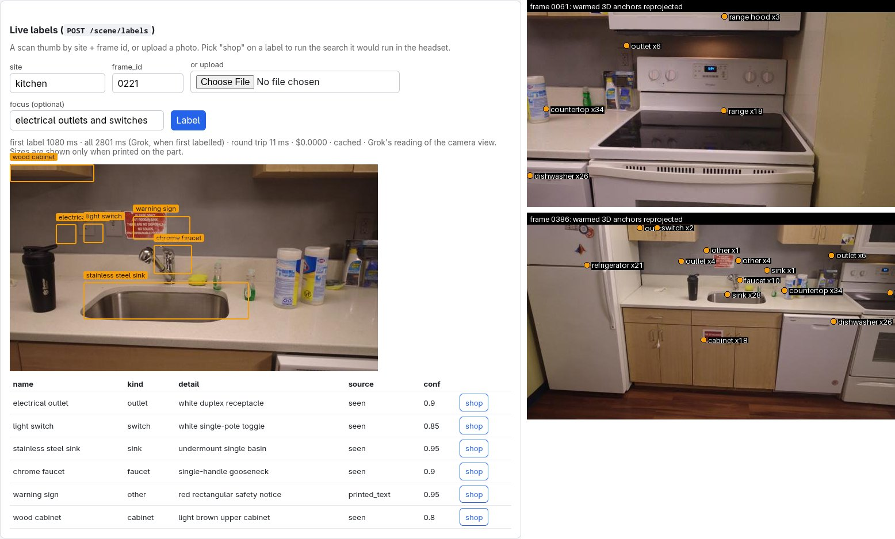

# F16: live labels

Feature agent F16, 2026-09-26. Built pick 1 of [G6](g6-round5.md) ("The three to build first"):
Grok names what the headset sees, one box and one short description per thing, and a tap turns a
label into a parts search. Branch `feat/grok-live-labels`.

**Bottom line.**
- One streamed `grok-4.20-0309-non-reasoning` call per frame. The first label is parsed at a
  **median of 1.25 s** (0.96 s at best); all six are in at a **median of 3.9 s**. Each call costs
  **$0.0013–0.0015**. That is the look-and-hold budget G6 predicted, not per-frame labels.
- The kitchen scan is pre-labelled: 42 thumbs for **$0.058**. They make **27 3D anchors** on the
  collision mesh, and every box hit the mesh. Reprojected into frames that weren't used to place
  them, the anchors land on the right range, outlet, faucet, sink and dishwasher (image below).
- G6's honesty problems didn't come back with this prompt. There are no spec examples in it, and
  across 294 labels from 49 calls there were **no sizes or ratings** at all; the code rule is
  still there for when one shows up. All 294 boxes came back in **percent**, as G6 found.
- G6's switch/outlet mix-up: with no focus, frame 0221 got the outlet right and left the switch
  out (6 labels is the cap, and the sink, faucet and sign come first). With
  `focus: "electrical outlets and switches"` it named both correctly. The boxes, though, sit
  about 5 % of the frame width to the left of the real plates.
- Total live spend: **$0.069** in 49 calls, against a $0.15 cap.

*Left: the `/debug` section on kitchen frame 0221 (focus "electrical outlets and switches"),
with the stats line from the call that first labelled it. Right: the warmed 3D anchors projected
back into frames 0061 and 0386, with the number of frames that saw each one.*

---

## 1. What was built

| Piece | Where |
|---|---|
| Streamed call, line parser, rules, cache, rate guard, 3D anchors | `server/labels.py` |
| `LLM_LABELS` role (`xai:grok-4.20-0309-non-reasoning`) | `server/llm.py`, `server/config.py` |
| `POST /scene/labels` (upload, or `site` + `frame_id`), `GET /scenes/{site}/labels` | `server/app.py` |
| Agent tool `label_view` (hidden without a frame), fast path "what am I looking at" / "label this", action `show_labels` | `server/agent.py` |
| `python -m server.warm --labels <site> [--every 4]` | `server/warm.py` |
| `/debug` section: the frame with its boxes, time to first label, a "shop" button per label | `server/static/debug.html` |
| Contract, including the Unity table and the glTF-to-Unity X flip | `docs/api.md` |
| 44 offline tests; fixture: the real 0221 reply | `tests/test_labels.py`, `tests/fixtures/labels/` |

**Flow.**
1. The frame is shrunk to a 960 px long edge (the kitchen thumbs are 640 px and go as they are)
   and sent with a prompt that asks for **one JSON object per line**: `name`, `detail`, `source`
   (`seen` or `printed_text`), a percent `box`, `confidence`. It has no example values, only
   placeholders, and one line on telling a switch from an outlet.
2. `iter_labels` splits the stream on newlines and parses each complete line as it arrives. A
   code fence, prose or a truncated last line is skipped. `first_label_ms` is when the first line
   that passes the rules lands.
3. Rules, in code, on every label:
   - drop confidence < 0.5, and bare walls, floors and ceilings;
   - a number with a unit in `detail` ("15 A", `36"`, "30-inch", "5,000 BTU", "120V") is removed
     and "size not visible" added, unless `source` is `printed_text`;
   - `kind` maps the name onto a fixed vocabulary: `outlet`, `switch`, `breaker panel`,
     `range hood`, `microwave`, `dishwasher`, `refrigerator`, `range`, `faucet`, `sink`,
     `cabinet`, `countertop`, `window`, `door`, `vent`, `pipe`, `light`, or `other`. Order
     matters: "light switch" is a switch and "over-the-range microwave" is a microwave;
   - boxes on 0–1, 0–100 or 0–1000 become 0–1, clamped, with reversed corners swapped;
   - `query` is `detail` without the size note, plus `name`, e.g. "white duplex receptacle
     electrical outlet". A tap searches for it.
4. The raw reply text and its timings are cached per `sha1(frame)` + focus + model + prompt hash.
   The rules run again on every read, so a rule change never costs a call. The same frame is
   never billed twice. OFFLINE serves every frame labelled before, including all warmed thumbs,
   and returns 503 on a miss.
5. At most 20 calls a minute per `session_id` (429 with `retry_after_s`), which caps a session
   at about $0.03 a minute. The agent's `label_view` counts against the same guard.
6. The warm labels every 4th thumb and casts rays through each box's centre and four inner
   points from the camera pose onto the collision mesh. It takes the median hit, using
   `to_pin`, copied unchanged from F10's `server/survey.py` so the two branches merge
   cleanly. Labels of the same kind merge when they're closer than 1.0 m (countertop),
   0.8 m (range, refrigerator), 0.6 m (cabinet) or 0.3 m (everything else). The most confident
   one wins, and the other frames go into `frames`. With one 0.3 m radius, the first run left 4
   countertops and 3 ranges. The result goes to `data/labels/<site>.r<rev>.json`.

---

## 2. Latency and cost (49 live calls)

All on a home connection, kitchen thumbs (640×360), `stream: true`, `temperature: 0`.
The "all" column is when the last line arrives.

| | first token | first label | all labels | cost |
|---|---|---|---|---|
| G6's measurement (#6, #7, #10) | 0.61–0.78 s | ~1.0–1.3 s (estimated) | 2.65–3.46 s | $0.0008–0.0014 |
| **This build, median of 49** | **0.72 s** | **1.25 s** | **3.89 s** | **$0.0014** |
| p10–p90 | 0.58–2.60 s | 1.09–2.61 s | 3.23–5.54 s | $0.0013–0.0015 |
| best / worst | 0.53 / 4.19 s | 0.96 / 4.94 s | 2.44 / 7.51 s | |
| 8 single calls (probes and `POST /scene/labels`) | 0.58–1.31 s | 1.05–1.39 s | 2.80–3.59 s | |
| warm, first 11 frames back to back | 1.46–4.19 s | 2.11–4.94 s | 4.84–7.51 s | |
| warm, the other 30 frames | 0.53–0.92 s | 0.96–1.61 s | 2.44–4.62 s | |

- The first label comes about **0.4–0.5 s after the first token**: one JSON line is about 40
  output tokens.
- The warm's first 11 frames were 2–4× slower than everything else, with nothing changed on our
  side. We didn't find why; it looked like a slow patch at xAI. Promise "about a second" only
  after measuring at the venue (G6's open question on hall Wi-Fi still stands).
- The response goes back whole, after the last label (below): the round trip through
  `POST /scene/labels` was 3.1–3.5 s for a new frame and **5 ms** for a cached one.
- The spend: 49 calls for $0.069. That is 5 prompt probes ($0.0069), the kitchen warm (41 new
  frames, $0.058; one was already cached from a probe) and 3 endpoint checks ($0.0043).

---

## 3. What the labels look like

- 294 labels from 49 calls, always 6 per call (the prompt's cap). The most common: countertop
  39, dishwasher 30, kitchen sink 28, upper cabinets 27, refrigerator 23, cabinet 16, faucet 13,
  electric range 13, range hood 10. The rules dropped 5 surfaces (ceiling ×3, wall, floor).
  "Skip loose items" in the prompt stopped the bottles and the shaker cup that the first 0221
  probe listed.
- `printed_text` came back 7 times, all on signs ("red and white warning"). The dishwasher's
  "white Whirlpool" was marked `seen`, although the brand is read off the door. The rule only
  cares about sizes, so nothing was lost.
- Ranges came back as "electric range", "electric stove", "white electric" every time; no gas
  guess, as in G6 #10.
- Boxes: tight on big things, and they miss small plates by about half a plate width, to the
  left, on 0221 (outlet and switch, image left). The 3D anchors average that out over views (the
  outlet anchor sits on the plate in frame 0061).
- Anchors seen in only one frame are the weak ones: a second "kitchen sink" and "range hood"
  ×1, a "no smoking sign". Four "range hood" anchors, where there is one hood, come from ceiling
  lights and the microwave being called a range hood in a few views.

---

## 4. Choices and what was left out

- **The labels aren't streamed to the client.** The repo has no SSE, NDJSON or websocket pattern
  on `main` (F1's realtime relay is on its own branch), so as the brief says, the endpoint
  returns all labels at once and reports `first_label_ms`. Streaming would mean `?stream=1` →
  a `StreamingResponse` of the lines `iter_labels` already yields: about 15 lines, once Unity
  wants it.
- **The tap is a plain search.** Unity sends `POST /parts/search {"query": label.query}`, with
  no agent turn in between. `query` is `detail` + `name`, which searches better than the name
  alone ("chrome single-handle gooseneck faucet" rather than "faucet").
- **Not built from the G6 spec:** cancelling an in-flight call when a new one comes in; the F1
  relay's `frame` uplink and `force_message` (not on `main`); the label notebook (G6 idea 5).
  The anchors file is the start of that notebook.
- `to_pin` and its mesh loader `_mesh` are copies of F10's, with the same names and code. Once
  both branches are merged, `labels.py` can import them from `survey.py` instead.

---

## 5. Open issues

- **The warm output is in this worktree's `data/`** (`data/cache/labels/`, `data/labels/
  kitchen.r1.json`), which is gitignored. Copy both folders into the demo checkout's `data/`
  (or point `DATA_DIR` at them) before the worktree goes; re-running the warm costs another
  $0.06.
- The box scale is decided per box: a 0–1000 box inside the top-left 10 % of the frame would be
  read as percent. 294 of 294 boxes were percent, so it hasn't bitten.
- The rate guard counts cache hits too, and keeps one deque per session id it has seen, with no
  eviction. That's fine for a demo box.
- The merge radii are tuned on one metric scene. B1's unscaled building scenes would need F10's
  bbox-fraction radius.
- Four "range hood" anchors, and single-frame anchors in general: a "seen in 2 or more frames"
  filter would clear most of the noise, and would need a denser warm (every 2nd thumb, $0.12)
  so real single-view things survive.
- The small-plate box offset. A second call on a crop, as G6 asked, might fix the box and the
  switch/outlet name together, for about $0.001.
