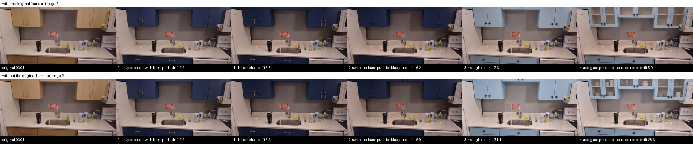

# F18: voice-refined reimagine

Feature agent F18, 2026-09-26. Builds G3 idea 4 ([g3-round2.md](g3-round2.md) §4), which G6
lists as the strongest older idea still standing ([g6-round5.md](g6-round5.md), "older ideas
still strongest"). After F2's reimagine, "darker blue", "add brass pulls" or "no, lighter" refine
the picture on screen. "Undo" steps back and "start over" returns to the original photo.

Branch `feat/grok-refine-reimagine`, cut from `integration/grok-all`, not `main`. It extends F2's
reimagine (`imagine.reimagine`, `reimagine_view`, `show_reimagined`) and hands off to F8's walk-in
clip. Those exist only on the integration branch together with the other Grok features, so this
branch merges there, not into `main` on its own.

## Headline

Sending the **original frame as image 2** with every refinement kept the chain anchored. In a
4-step chain, drift outside the edited cabinets stayed at 3.6–7.6/255. The naive chain (latest
edit only) matched it for two steps. Then "no, lighter" re-lit the whole room, and drift jumped
to **31/255** and stayed there (28.6 on the next step). Each anchored step cost $0.01 more
($0.08 against $0.07) and took about 4 s longer.

[`f18/chain-strip.jpg`](f18/chain-strip.jpg): top row with the original, bottom row without.
From the left: the original frame 0301, then steps 0–4. In the bottom row, steps 3 and 4 are
brighter overall. The walls, counter and appliances washed out, not just the cabinets.

## Drift per step (kitchen frame 0301)

"Drift" is the median absolute grey-level difference (/255) against the original frame, over
the pixels outside the edited region, measured at 160×90 (see "Drift measure" below). A fresh
edit's own noise floor is 2.2.

| Step | Instruction | With original: drift | Cost | Latency | Without: drift | Cost | Latency |
|---|---|---|---|---|---|---|---|
| 0 | navy cabinets with brass pulls (the reimagine) | 2.2 | cached | – | 2.2 | cached | – |
| 1 | darker blue | 3.6 | $0.08 | 9.5 s | 3.7 | $0.07 | 6.3 s |
| 2 | swap the brass pulls for black knobs | 6.2 | $0.08 | 12.3 s | 5.9 | $0.07 | 8.6 s |
| 3 | no, lighter | 7.6 | $0.08 | 11.9 s | **31.1** | $0.07 | 7.5 s |
| 4 | add glass panels to the upper cabinet doors | 5.9 | $0.08 | 15.2 s | **28.6** | $0.07 | 8.2 s |

- Live spend: **$0.60** in 8 edits (4 × $0.08 two-image, 4 × $0.07 one-image), read from
  `usage.cost_in_usd_ticks`. Step 0 was F8's cached edit of the same frame and prompt, so it cost
  $0 here.
- Both arms read "no, lighter" as a light blue, which is a bigger jump than a person means.
  The anchored arm changed only the doors; the naive arm also brightened the room.
- Drift doesn't only grow. Step 4 came back steadier than step 3 in both arms, because each edit
  re-renders the frame. The anchored arm's worst step (7.6) is still under a quarter of the
  naive arm's.
- The retry was off for this run (`DRIFT_MAX = inf`), so each arm is the raw chain. With the
  shipped threshold (12), naive steps 3 and 4 would each have triggered one retry. The anchored
  chain would have triggered none.
- Replays: the whole anchored chain replays through `POST /scene/reimagine` + `/agent/command`
  with `OFFLINE=true`, returning the same image ids, drift values and step numbers at $0. The
  `/debug` history strip draws it (checked in a browser: no console errors besides the favicon).

## What was built

| Piece | Where | What it does |
|---|---|---|
| `refine()` | `server/imagine.py` | Applies the newest instruction to the latest edit. It sends `images: [latest edit, original frame]` with `REFINE_PROMPT`: "Image 1 is an edited version of image 2, the original photo. Edit image 1: {X}. Change only that and keep the earlier edits. Keep everything else identical to image 2, with the same camera and framing." With an empty stack it is a plain reimagine of the frame (same prompt and cache key as F2). `with_original=False` is the naive arm, kept for this comparison. |
| `drift()` | `server/imagine.py` | The metric above. |
| Drift retry | `refine()` | Past `DRIFT_MAX` (12), it retries once from the original frame with every step merged into one prompt ("navy cabinets with brass pulls; then darker blue; then no, lighter." + the keep clause). It keeps whichever image drifted less, and `cost_usd` counts both calls. If the retry fails (offline miss, xAI error), it keeps the drifted step rather than nothing. |
| Stack | `agent.Session.reimagine` | `{site, frame_id, camera, before_url, steps: [{prompt, id, drift}]}`. Started by `reimagine_view` or by `POST /scene/reimagine` with the new optional `session_id`, which lets a headset button or `/debug` start it. |
| Tool | `refine_reimagine(prompt)` | Offered to the LLM only while a stack exists. It ends the turn like `reimagine_view`. |
| Fast paths | `_UNDO_RE`, `_START_OVER_RE`, `_REFINE_RE` in `server/agent.py` | They apply only while a stack exists **and** no older fast path matched, so "show it in darker blue" is still `set_finish`, and "is it recalled?" is still `check_safety`. "Add a note ..." stays with the LLM. Refinements go through the fast path, so rehearsed ones replay `OFFLINE` by voice. F2's reimagine itself needs the LLM or the endpoint. |
| Action | `show_reimagined` | Now `{image_url, frame_id, camera, label, step, can_undo, drift}`. Step 0 is the original frame (`image_url` = the thumb). |
| Walk-in hand-off | `walk_in_preview` + `flythrough.start(end_image_id=)` | When the tool runs right after a reimagine step (no other tool call since), the clip lands on that exact image with no new edit, and the video prompt is the merged steps. The cache key gains `end` only when set, so clips cached before F18 keep their keys. In that state the tool is offered even without `site`/`frame_id` in the context. |
| `/debug` | Reimagine section | A history strip: the original plus one tile per step with its drift, with the current step outlined. It follows undo and start over. The Reimagine button now sends `session_id`, so typing "darker blue" in Command refines it. |
| Tests | `tests/test_refine.py` (23) | Drift (region ignored, a re-lit room caught); the two-image request and prompt; the retry (merged prompt, original image, lower drift kept, cost summed); push/undo/start over; cache replay and `OFFLINE` replay plus the offline miss line; routing with a stack (11 phrases, including the older fast paths winning) and without one (hidden tool, LLM); the walk-in hand-off; `flythrough.start(end_image_id=)` skipping the edit. |

## Choices

- **Drift measure: the lazier honest version.** F5 excluded a known box. A voice refinement has
  no box, so the "edited region" is whatever the *first* edit (the reimagine) changed by more
  than 30/255, grown by 2 px at 160×90. That is the subject the user is refining ("the
  cabinets"). The median is then taken over everything else. It is honest for the spoken case
  (refining the same subject: colour, pulls, glass). Its ceiling: a refinement that adds
  something elsewhere ("and LED strips under them") counts as drift. The median absorbs that
  while it covers well under half of the outside pixels. The upgrade is a per-step region from
  segmentation, which nothing here has. The grey 160×90 thumbnail averages out JPEG noise and the
  2× upscale.
- **Image order.** The latest edit is image 1, because it is the image being edited and it sets
  the output aspect. The original is image 2, the reference to stay identical to. That matches
  the spec's "keep everything else identical to image 2".
- **Threshold 12.** It sits between the anchored chain's worst step (7.6) and the naive chain's
  failures (28–31), with margin both ways. It is a constant in `imagine.py`
  (`DRIFT_MAX`); `REGION_DIFF` is the other knob.
- **Retry keeps the lower-drift image.** A merged prompt from the original can lose an
  instruction ("no, lighter" after "darker blue" is order-dependent), so the retry has to beat
  the step to win.
- **The stack lives in the agent session.** It sits in memory next to the plan and the survey
  id, is LRU-capped with the sessions, and is lost on restart. A per-step cap wasn't added: each
  step is one spoken sentence.
- **Caching.** Every edit goes through `imagine.edit()`, which goes through
  `cache.cached("imagine", ...)`, keyed on the prompt and the input images' hashes. So a
  rehearsed chain replays for $0, and `OFFLINE` too. Drift is recomputed from the stored JPEGs
  on each step.

## Demo

1. Warm once with the network up: `/debug`, "Reimagine this view", site `kitchen`, thumb `0301`,
   prompt "navy cabinets with brass pulls", Reimagine. Then in Command: "darker blue", "swap the
   brass pulls for black knobs", "no, lighter", "add glass panels to the upper cabinet doors".
   That is about $0.39 cold and $0 afterwards.
2. On stage (`OFFLINE=true` is fine): the same button, then say the same four lines. Each one
   swaps the quad at once from the cache. The history strip grows and shows the drift.
3. "Undo" goes back to the black-knob step. "Start over" goes back to the photo.
4. Right after a refinement, "walk me into it" (LLM, online) renders the clip onto the refined
   frame. Warm that too if the demo needs it offline: the clip's cache key includes the refined
   image id.

## Open issues

- **The retry's quality was not measured live.** The $0.60 went on the with/without chain. The
  retry path is unit-tested; how well a merged prompt keeps a 4-step chain is unknown.
- **"No, lighter" overshoots** to light blue in both arms. The fast path passes the raw sentence.
  An LLM rewrite ("a slightly lighter navy") would probably do better but costs a turn. Online,
  longer sentences already go through the LLM.
- **Realtime voice (F1).** `refine_reimagine` is in `TOOLS`, so it works over
  `WS /voice/realtime`. Undo and start over are fast paths only, like `place_plan`, so by realtime
  voice use `/agent/command` for them.
- **One sample.** One frame, one chain, n=1 per step. Drift values move by a few /255 between
  runs, and the 7.6 against 31 gap is the finding, not the decimals.
- **"Right after"** means no other tool call since the reimagine step. A plain chat reply
  ("thanks!") in between doesn't clear it.
- Small text (the red sign) is redrawn on every step, as in F2.
