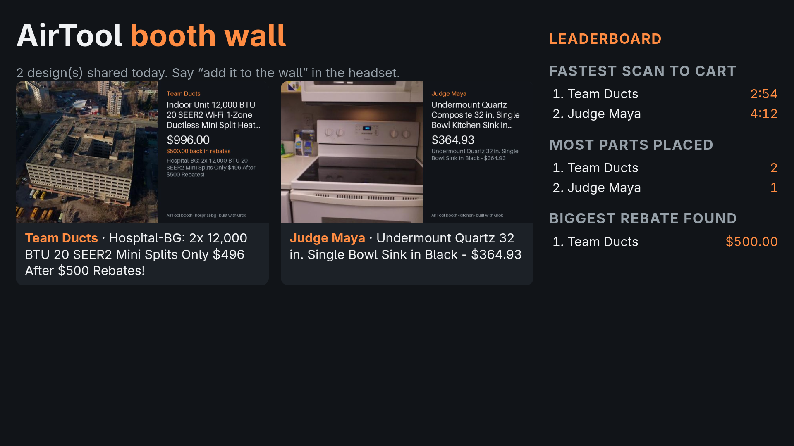

# F19: booth wall and optional X share

Feature agent F19, 2026-09-26. This is G6's pick 2 (`g6-round5.md` §6): a booth-TV gallery of
shared designs with a local leaderboard, plus an X post that is optional and only goes out after
a hold-to-post confirm.

**Branch base.** The branch is `feat/grok-booth-wall`, cut from `integration/grok-all` and not
from `main`. The wall reads each design through F14's `packet.gather()`, which wraps F4's
`report.assemble()` and adds the F6 safety and F13 rules extras. F4 and F14 only exist together
on that integration branch. Merging this into `main` on its own would need F4 and F14 first.



The screenshot shows `/booth` at 1920×1080 with two synthetic sessions:
- `demo-kitchen` is F4's `server/report_demo.py` seed, plus a `scan_loaded` timestamp;
- `demo-hospital` has two LG mini-split heads on the hospital scan, one offline order and a
  **synthetic** $500 F13 rebate in the in-process jobs table.

Both captions are live Grok lines that passed the number check. The card on its own:
[`f19/card-demo-hospital.jpg`](f19/card-demo-hospital.jpg).

## What was built

| Piece | Where | Notes |
|---|---|---|
| Wall entries | `server/booth.py` `share()` | Only with `consent=True`. Facts come from F14's `gather`. One entry per session, and a re-share replaces it. Entries are stored in `DATA_DIR/booth/entries.json`, newest first. The name defaults to `Judge <n>` |
| Leaderboard | `leaderboard()` | Local and computed, not the LLM: fastest scan to cart, most parts placed and biggest active rebate, top 3 of each. An entry with no value isn't ranked. A stable sort over oldest-first entries gives a tie to the earlier entry |
| Scan-to-cart time | `seconds_to_cart()` | Runs from the first notebook entry with a `ts` or `created_at` to the first order's `created_at`. The headset should log `{"type": "scan_loaded", "ts"}` |
| Caption | `caption()`, role `booth` (`LLM_BOOTH`) | One `grok-4.20-0309-non-reasoning` chat call, cached by model, prompt and facts. It falls back to the template when the line is over 90 characters, has any link or @mention, or has a number not in the facts (F14's `backed()`) |
| Card | `render_card()` | A 1200×675 PIL JPEG. It shows the F5 postcard, or a scan thumb through F14's `_hero`, and never the passthrough camera. It also carries the name, part, total, rebate, recall pill and caption |
| X post | `x_preview()`, `confirm()`, `x_post()` | A share hands out a one-use confirm token (5 min). Only `POST /booth/x/confirm` posts. The order is refresh token, then `media/upload/initialize`, then `append` (one chunk), then `finalize`, then `POST /2/tweets`. A rotated refresh token is saved to `DATA_DIR/booth/x_token.json` (mode 600) |
| Post text | `x_text()` | The checked caption with links and mentions stripped, plus ` #AirTool`, ≤ 240 characters. `x_post()` refuses any text that still matches `LINK_RE`, as a last guard at the paid call |
| Login | `login_url()`, `finish_login()` | The one-time PKCE (S256) flow. The refresh token goes to disk; it is never served or logged |
| Routes | `server/app.py` | `GET /booth`, `GET /booth.json`, `GET /booth/cards/{id}.jpg`, `POST /booth/{session_id}/share`, `POST /booth/x/confirm`, `GET /booth/x/login`, `GET /booth/x/callback`, `DELETE /booth/{entry_id}` |
| Agent tool | `share_design(name, phrase)` in `server/agent.py` | The fast path is "add it to / put it on the wall (as Maya)", "share my design" or "post it". The tool runs only when `phrase` matches the consent regex, which matters because the realtime relay calls tools directly. On the LLM path it is hidden unless the utterance matches. It returns `show_share_preview` and never posts |
| Debug | `/debug` "Booth wall" section | Has a consent checkbox, Share, and a 1.5 s hold-to-post button that stands in for the headset ring. It also draws the agent's `show_share_preview` |

**Choices:**
- **No QR code on the card.** `segno` isn't installed, and F14 skipped it too. Omitting it was
  the lazier honest option. The catch is that a posted card has no link back to the packet.
  Adding the QR would take `segno` (pure Python, no deps) and about 5 lines in `render_card`.
- **One Grok call per share, not two.** The X text is the same checked caption plus a hashtag.
  A second Grok "post text" call would add cost and one more thing to check.
- **The booth page is server-rendered with a meta refresh (5 s) and no JS.** Escaping happens in
  one place (`html.escape`), and the page needs no build step.

## Demo steps

```bash
uv run python -m server.report_demo                     # seeds demo-kitchen
uv run uvicorn server.app:app --host 0.0.0.0 --port 8000
open http://localhost:8000/booth                          # the TV, full screen (F11)
curl -X POST localhost:8000/booth/demo-kitchen/share \
  -H 'content-type: application/json' -d '{"consent": true, "name": "Judge Maya"}'
```

In the headset, say "add it to the wall as Maya". The `show_share_preview` action shows the
card, and the wall picks it up within 5 s. With X set up, the preview also shows the post text
and a hold ring. Holding the ring posts, and a QR of the post URL appears. In `/debug`, the
"Booth wall" section does the same, and its hold button stands in for the ring.

For the leaderboard's scan-to-cart board, log `{"type": "scan_loaded", "ts": "<ISO>"}` into
the notebook when the scan opens. Without it, that board skips the entry.

## What the user needs to do for X

Nothing X-related is in `.env` today. With the keys missing, `share` returns
`x: {ready: false, error: "X not configured", needs: [...]}`, `confirm` returns `503`, and
everything else works.

1. **Make an X developer account** on pay-per-use and add a few dollars of credit. Posts cost
   $0.015 each with media and no URL, so 100 posts is $1.50.
2. **Create a Project and an App**, then turn on User authentication settings with OAuth 2.0:
   - app type "Web App, Automated App or Bot", which is a confidential client and gets a
     client secret;
   - callback URL `http://localhost:8000/booth/x/callback`, exactly. Open the login on
     `localhost:8000` too, because the server builds the redirect from the request URL;
   - website URL: anything, for example the repo;
   - the flow asks for these scopes: `tweet.read tweet.write users.read media.write
     offline.access`.
3. **Copy the OAuth 2.0 Client ID and Client Secret** (not the API key and secret, which are
   OAuth 1.0a) into `.env`:
   ```
   X_CLIENT_ID=...
   X_CLIENT_SECRET=...
   ```
4. **Make a bot account for the booth** (for example `@AirToolDemo`), not a personal one. Turn
   on its "Automated" label in the account settings.
5. **Restart the server, then do the one-time login.** In a browser logged in to X as the bot,
   open `http://localhost:8000/booth/x/login` and approve. The callback page says "X login
   done". The refresh token is now in `data/booth/x_token.json`, which is git-ignored.
   Optionally, copy it into `.env` as `X_REFRESH_TOKEN=...` for a fresh machine. The file wins
   once it exists, because the server rewrites it after each refresh.
6. **Check it.** `GET /booth.json` should show `"x_needs": []`. Share a design, hold to post
   once from `/debug`, and delete that test post on x.com.
7. Skip the xAI credit-back link. It only pays from $200 of X spend.

Do not edit `.env.example`, which a hook blocks. Add these lines by hand, commented out:

```
# LLM_BOOTH=xai:grok-4.20-0309-non-reasoning
# X_CLIENT_ID=
# X_CLIENT_SECRET=
# X_REFRESH_TOKEN=
```

## Live checks and cost (cap: $0.05 Grok, no X calls)

Six caption calls in total cost **$0.00185**. Each one was logged by `llm.chat()` from
`usage.cost_in_usd_ticks`. There were three rounds of two, because the prompt was tightened
twice:

| Round | demo-kitchen | demo-hospital | Cost |
|---|---|---|---|
| 1 (≤ 80 chars) | "Scan to cart your $364.93 black 32 in. undermount quartz sink in just 252 seconds!" | 99 characters, so **rejected, template** | $0.00028 + $0.00034 |
| 2 (≤ 70 chars) | passed | "Get 2 hospital-bg 12,000 BTU units installed for just $496 after $500 rebates!": passed the check but says "installed" | $0.00027 + $0.00032 |
| 3 (+ "designed and priced, not installed or bought") | "Undermount Quartz 32 in. Single Bowl Sink in Black - $364.93" | "Hospital-BG: 2x 12,000 BTU 20 SEER2 Mini Splits Only $496 After $500 Rebates!" | $0.00028 + $0.00036 |

- Latency was 0.6–1.4 s per call, with 285–332 prompt tokens.
- No X call was made. There are no keys, and every X test mocks `api.x.com` with respx.

## Tests (16 in `tests/test_booth.py`, all offline)

The full suite is 868 passed and 2 skipped, and `ruff check` is clean.

| Test | Checks |
|---|---|
| `test_share_needs_consent` | No `consent` means `403` and nothing stored; unknown session `404`. Checks the `Judge 1` default, the 1200×675 card, that a re-share replaces the entry, and `DELETE` |
| `test_agent_share_needs_the_phrase_and_never_posts` | A tool call without the phrase is an error with no entry. "Add it to the wall as Maya" gives `show_share_preview` with no token when X is off. "post it" never posts |
| `test_leaderboard_maths_and_ties` | Three entries, including ties on time and on parts, and a missing rebate |
| `test_seconds_to_cart` | Naive and `Z` timestamps, no earlier stamp, a garbage stamp |
| `test_caption_with_an_unbacked_number_falls_back` | "$299" is not in the facts, so the template is used |
| `test_caption_backed_by_facts_is_used` | A backed line is used; the second share is a cache hit |
| `test_links_and_mentions_are_rejected` (×4) | `https://`, `www.`, `.com` and `@someone`: `clean()` rejects each, `x_text()` strips them, the hashtag appears once within 240 characters, and `x_post()` refuses |
| `test_missing_keys_says_x_not_configured` | `x.ready: false` with all three `needs`; `confirm` `503`, `login` `503`, `/booth` still `200` |
| `test_x_post_order_and_shapes` | The exact call order: token, initialize, append, finalize, tweets. Checks Basic auth on the refresh, the initialize JSON, the multipart `segment_index` and bytes, and a tweet body with no URL. The rotated refresh token is saved, and a reused token gets `409` |
| `test_x_error_title_passes_through` | An X `400` becomes `502` with X's `title` |
| `test_expired_confirm_token` | `409` "expired", and no X call |
| `test_login_redirects_with_pkce` | `307` to `x.com/i/oauth2/authorize` with S256 and `offline.access` |
| `test_booth_html_escapes_user_text` | A `<script>` name is escaped on `/booth` |

## Open issues

- **The X flow is untested against real X.** The shapes come from `docs.x.com` (the chunked
  upload quickstart and OAuth 2.0 PKCE, fetched today). Four things are unconfirmed:
  - that a confidential client refreshes with HTTP Basic (the docs page doesn't say);
  - that refresh tokens rotate;
  - that an image `finalize` needs no STATUS poll (`ponytail:` note in `x_post`);
  - that `append` accepts the multipart body as built.
  Run step 6 of the checklist once.
- **No QR on the card**, so a posted card doesn't lead back to the packet (see Choices).
- **The number check is digits only.** A word claim still gets through, such as round 2's
  "installed". The prompt now says the design was designed and priced, not installed, but only
  a human read catches this class.
- **Taking an entry down doesn't delete its X post.** `DELETE /booth/{id}` returns the
  `tweet_id`; delete the post on x.com. There is also no `unpost_design` voice tool (G6
  listed one).
- **Scan-to-cart depends on the headset logging `ts`.** Today's notebook entries carry no
  time, so a real session isn't ranked on that board until Unity logs `scan_loaded`.
- **The rebate board needs an F13 check in this server process.** It reads the rules job
  through F14's `extras`, which lives in the in-memory jobs table. The value is copied into the
  entry at share time, so it survives a restart.
- **Consent tokens and PKCE states are in memory.** A restart drops pending previews and
  logins. Share again, or log in again.
- **A proxy breaks the login redirect.** `request.url_for` builds the callback URL, so behind a
  proxy or on a LAN IP it won't match the registered `localhost` callback. Open the login on
  `localhost:8000`.
