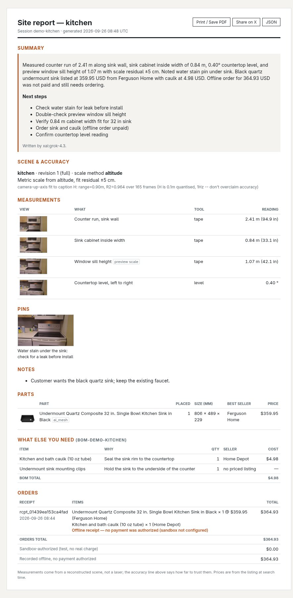
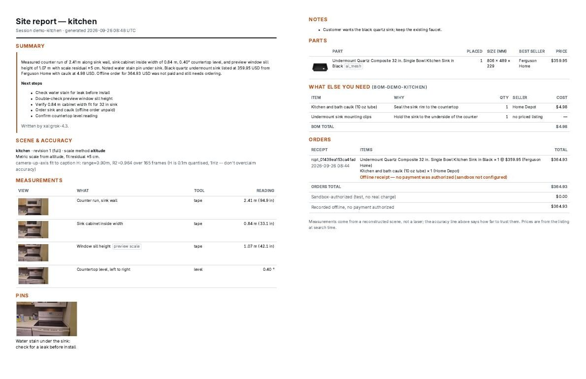

# F4: site-walk report ("take the headset off and see your report")

Feature agent F4, 2026-09-26, branch `feat/grok-site-report`. Built from G2's idea #3
(`g2-voice-agents.md` §5, pick 3).



The same page printed to a Letter PDF (browser "Save as PDF"; 2 pages):



## What was built

| Piece | Where | Notes |
|---|---|---|
| `build_report(session_id)` | `server/report.py` | Joins the session notebook (notes, tape/level readings, pins), placed parts (`data/parts`), BOMs (`data/boms`), receipts (labels verbatim) and the scene package (`scene/<site>/scene.json`: revision, quality, scale method and residual as a plain accuracy sentence). |
| Summary + next steps | `server/report.py` | One `llm.extract` call on the new role `report` (default `xai:grok-4.3`, `LLM_REPORT` overrides), falling back to the `agent` role (Groq) if xAI fails. Cached through `cache.cached("report", <sha256 of the report facts>)`. `OFFLINE` or both failing gives a template summary, which is never cached. The page shows which model wrote it. |
| `GET /report/{id}` | `server/app.py` | One HTML page with inline CSS and a print stylesheet, no new dependency. Thumbnails link to `/scenes/<site>/thumbs/<id>.jpg` and part images to `/parts/<id>/image.jpg`. Everything user-supplied is HTML-escaped. It includes a "Share on X" intent link. |
| `GET /report/{id}.json` | `server/app.py` | The same `Report` model as JSON. |
| `POST /report/{id}/narrate` | `server/report.py` | A ~28 s recap via xAI `POST /v1/tts` in `XAI_VOICE` (default `rex`, the same setting name as the realtime branch), cached in the `tts` namespace. It falls back to `voice.speak()`. |
| Agent tool `make_report` | `server/agent.py` | Returns the action `show_report {url: "/report/<session>"}`. There's a fast-path regex ("send/show/make/give/open ... report"), so it also works `OFFLINE` and costs no LLM turn. |
| Notebook links | `server/app.py` | `/parts/bom` takes an optional `session_id` and logs `{"type":"bom"}`. The `/checkout` notebook entry now carries `bom_id`. |
| Demo seed | `server/report_demo.py` | Builds a realistic `demo-kitchen` session on `scene/kitchen`: 3 tape readings (one on the preview scale), 1 level reading, 1 pin, 1 note, the Karran quartz sink placed, a 2-line BOM and a real `checkout.authorize` offline receipt. The tests reuse the same seed. |
| Tests | `tests/test_report.py` | 8 tests: assembly and totals from the seed, the unknown session, the mocked summary cached by content hash, the xAI → Groq fallback, the offline template (no LLM call), the HTML routes (label verbatim, totals, escaping, print CSS, share link, 404), narration via respx (voice `rex`, cached, length cap) and the agent → `show_report` action. |

The notebook entry shapes the report reads are now documented in `docs/api.md` (§ notebook).

## Demo steps

```bash
uv run python -m server.report_demo          # seeds session demo-kitchen in DATA_DIR
uv run uvicorn server.app:app --host 0.0.0.0 --port 8000
open http://localhost:8000/report/demo-kitchen   # Print -> Save as PDF for the PDF
curl -X POST localhost:8000/report/demo-kitchen/narrate -o recap.mp3
```

Seed options: `--session`, `--site`, `--part <id in data/parts>`. The seed replaces that
session's notebook. In the headset, say "send me the report" and Unity opens the `show_report`
URL (or shows it as a QR code).

## Live checks and cost (spend cap: 3 xAI chat + 2 TTS)

| # | Call | Result | Cost |
|---|---|---|---|
| 1 | `grok-4.3` chat, "reply ok" | 200, model id works on our key; it's a reasoning model (105 reasoning tokens for 1 output token) | $0.0003 (`cost_in_usd_ticks` 3,121,500) |
| 2 | `grok-4.3` report summary (strict `json_schema`) | 200 in 7.6 s, 918 prompt / 169 completion tokens, valid JSON on the first try. The summary is shown in the screenshot above | about $0.003 (estimate; the SDK path doesn't surface `cost_in_usd_ticks`) |
| 3 | xAI TTS, 600-char cap | 200, MP3 24 kHz, **48 s**, too long, so the cap went down to 380 chars | about $0.009 (at $15 per 1M chars) |
| 4 | xAI TTS, 341 chars | 200 in 4.0 s, **28 s** MP3; the repeat came from cache in 16 ms | about $0.005 |

Total is about **$0.02**. After the first build, reloading the report or its narration costs
nothing (cache).

## Limitations and open issues

- **Notebook shapes are a contract with P3.** The report only sees what the headset logs. The
  current Unity notebook plan (`{tool, value, points, timestamp, nearest_camera_id}`) needs
  `type: "measurement"`, `label` and `site` added. Placements need a `{"type":"placement"}`
  entry. Without them the report shows only orders.
- The agent's `what_else` tool doesn't log its BOM into the notebook (only `/parts/bom` with a
  `session_id` does), so an agent-created BOM shows up only once it rides along in a checkout.
- Grok's next steps can skip items. In the demo it didn't list the unpriced sink clips. The
  template summary always does, but the LLM one doesn't.
- The thumbnail is the nearest drone frame, not a view of the reading itself, so it shows
  roughly where the reading was taken, not what was measured.
- The measurement rows don't carry a per-reading error bar; the report states the scene's
  scale residual once. For the demo kitchen that's ±5 cm, which is the same size as the
  sink-cabinet margin, and that's why "verify the cabinet width" is a next step.
- The share text has no link, because a LAN `localhost` URL is useless on X. Public hosting
  would be needed for a real share link.
- `x.com/intent/tweet` is the long-standing web intent; not re-verified today.
