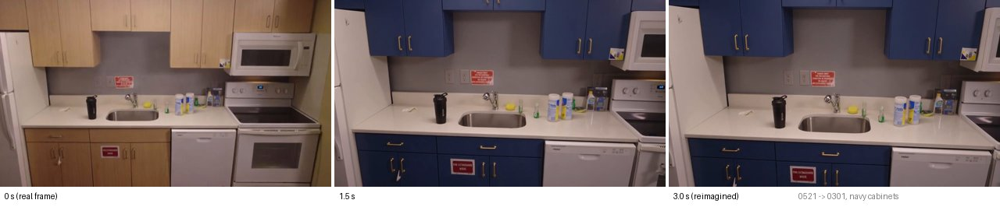
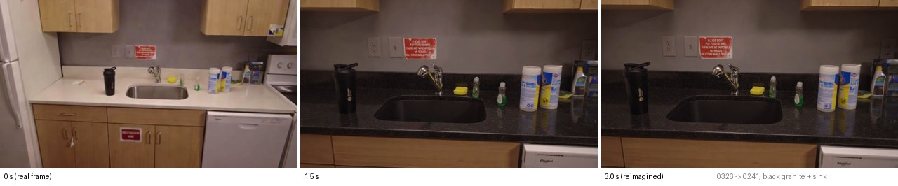
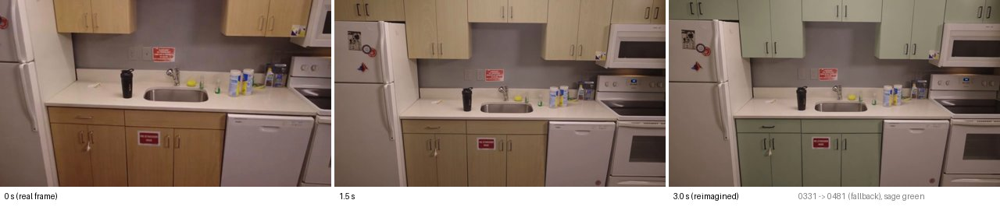

# F8: walk-in renovation clip

Build of G3 pick 2 ([g3-round2.md](g3-round2.md) §5). Branch `feat/grok-imagine-flythrough`,
2026-09-26.

A real capture frame *moves into* the renovated view. The start frame is a capture camera about
0.6 m behind the view the user is looking through. The end frame is that view reimagined with a
Grok Imagine edit. `grok-imagine-video-1.5` interpolates between the two pinned frames.

**Bottom line.** Three live clips cost **$0.99** in total, **$0.33 each**: edit $0.07 plus video
$0.26, the same as G3's call #3. Each took **46–52 s** from the POST to a playable mp4 on the LAN.
All three kept the room geometry. The recolour reads as a global cross-fade, not G3's diagonal
"paint wipe". A cached replay answers in under 0.05 s for $0, `OFFLINE` included.

## What was built

- `server/flythrough.py`:
  - `pick_frames(site, to_frame_id)` picks the start camera.
  - `start()` checks the cache and `OFFLINE`, runs the end-frame edit and submits the video
    inline, so errors reach the caller.
  - `_finish()` polls, downloads the mp4 at once and writes the cache. It runs as a
    `jobs.start_task` job.
- `server/imagine.py`: the minimal Imagine edit client, copied byte for byte from
  `feat/grok-imagine-postcard`, with the same names as F2's.
  - The end-frame edit uses F2's exact prompt (`prompt + KEEP_CLAUSE`, 1k), so a view that was
    already reimagined reuses F2's cached edit for $0.
- `jobs.start_task()`: a non-search background job in the same table, with the same eviction and
  the same `wait()`. `Job` gained a `result` dict for it.
- Routes:
  - `POST /scene/flythrough`
  - `GET /scene/flythrough/{job_id}`
  - `GET /scene/flythrough/{id}.mp4` and `{id}.jpg`, served from `data/imagine/` with Range
    support (a 206 was checked)
- Agent tool `walk_in_preview(prompt)`, offered only when the context carries `site` and
  `frame_id`.
  - Returns `flythrough_started {job_id}` and says "Rendering a walk-in; about a minute."
  - On a cache hit it returns `show_video` at once.
  - Otherwise the next `/agent/command` after the render leads with `show_video`.
- `public: true` adds `storage_options.public_url: {expires_after: 7 d}` and returns `share_url`,
  a `files-cdn.x.ai` link for a QR code. It is checked live below.
- `/debug` has a new "Walk-in renovation clip" section with a `<video>` element and the label
  overlay. A cached replay was checked in a browser: `readyState` 4, 3.04 s.
- `docs/api.md` covers the endpoints, the two actions, the `site`/`frame_id` context and the
  Unity contract. Unity plays the clip on the reimagine quad and always shows
  "AI preview, not to scale".

## Frame pick

`R` in `cameras.r<rev>.json` is world-to-camera, so row 2 is the view axis in world space. We
checked this: 100 % of mesh vertices have positive camera z. The start camera faces the same way
(cos > 0.9) and minimises |along − 0.6 m| + lateral offset. If none is within 0.3 m, the start is
the camera 30 entries earlier.

On the kitchen:

| View (end) | Start | Geometry | Move |
|---|---|---|---|
| 0301 | 0521 | 0.50 m behind, 0.08 m lateral | walk in |
| 0241 | 0326 | 0.58 m behind, 0.17 m lateral | walk in |
| 0481 | 0331 (fallback) | nothing behind 0481; 0331 is in front of it | pull back |

G3's own pair (0301 → 0481) was a pull-back for the same reason: 0481 sits about 0.48 m *behind*
0301.

## Live results

All three were 3 s, 480p, 16:9, no audio. The output was H.264 848×480 at 24 fps, 73 frames and
0.42–0.62 MB per clip. "POST" is the edit plus the submit; "total" runs from the POST to a
downloaded mp4.

| Clip | Prompt | Cost | Edit | POST | Total | Verdict |
|---|---|---|---|---|---|---|
| `navy` 0521 → 0301 | navy cabinets with brass pulls | $0.33 | 7.2 s | 7.8 s | 46.0 s | **Best.** A clean push-in. Wood fades to grey and then navy by 1.5 s, with brass pulls, and the camera settles on the edited view. The sink, bottle and microwave are stable. The red sign's text is re-hallucinated, as in G1. |
| `counter` 0326 → 0241 | black granite countertop and a matte black undermount sink | $0.33 | 8.0 s | 8.8 s | 51.9 s | **Good.** The biggest move (0.6 m in, right and down onto the sink). The counter and sink turn black by about 1 s. The edit also darkened the whole frame (lighting drift), so the clip dims as it moves in. The sink reads as undermount. |
| `sage` 0331 → 0481, `public` | sage green cabinets with matte black pulls | $0.33 | 7.9 s | 9.0 s | 52.4 s | **OK.** The fallback pair gives a pull-back, not a walk-in. The recolour starts late (about 1.7 s) and is complete by 2 s. `share_url` returned; a HEAD gave 200 `video/mp4`, 424 KB. |

Both pinned ends matched the video's first and last frames closely: a mean absolute difference of
3.1–4.0 on the 0–255 scale, which is mostly codec loss.

Stills (first, middle and last frames):

**Total live spend: $0.99** (3 edits at $0.07 and 3 videos at $0.26), under the $1.20 cap. Each
call's cost is logged from `usage.cost_in_usd_ticks` (edit in `server.imagine`, video in
`server.flythrough`). One mistaken POST went to an unrelated local server on port 8765 and cost
nothing. The mp4s live under `data/imagine/`, which is gitignored.

## Tests

`tests/test_flythrough.py`, 11 tests:
- `pick_frames`:
  - on a synthetic rig: behind, fallback earlier, fallback later, a camera facing the wrong way,
    a bad frame or site;
  - on the real kitchen, skipped when `scene/` is absent.
- The request body and the submit → pending → pending → done sequence, with the download and the
  cost.
- `public` returns `share_url`.
- A job that comes back `failed` or `expired` gives the spoken fallback and keeps the still.
- A moderation 400 returns 422.
- A bad frame returns 400; bad ids return 404.
- A cache hit makes no HTTP calls.
- `OFFLINE`: a hit returns `done`, a miss returns 503.
- The agent tool:
  - hidden without `site`/`frame_id`;
  - `flythrough_started`, then `show_video` exactly once on the next command;
  - a cached clip plays at once.

`imagine.edit` is stubbed; xAI and vidgen are mocked with respx; `POLL_S=0`.

## Open issues

- **Latency.** The edit and the submit run inside the POST (about 8–9 s live) so that moderation,
  offline and bad-frame errors come back as HTTP codes. On the agent path that delays the
  "Rendering a walk-in" line by the same amount on an uncached view. Pre-render the demo clips.
- **The fallback pair can pull back** (0481 → 0331) instead of walking in. Better options: pick
  the nearest same-facing camera *in front of* the view and reverse the clip, or pin a mid
  keyframe. The keyframes path is still untested (G3 §6).
- **Lighting drift in the edit.** The countertop edit darkened the whole frame. Adding
  "keep the lighting and exposure unchanged" to the video prompt, or to a second KEEP clause, is
  untested.
- **The moderation mapping is a guess.** A 400/403/422 whose body mentions
  moderation/safety/policy/blocked maps to 422. We haven't seen a real video moderation body.
- **Cache key and `public`.** `public` is part of the cache key, so asking for a share link on a
  clip that was already rendered costs a second $0.26.
- **No offline voice path.** Offline, `walk_in_preview` only runs through the LLM path, which is
  off. Use `POST /scene/flythrough` (the debug console or Unity) for offline replays. There is no
  `warm.py --flythrough` yet; pre-render with the same POST while online.
- **Merging.** `server/imagine.py` matches the postcard branch byte for byte. It is a strict
  subset of F2's module. Merging both branches still conflicts, as it already does between F2 and
  F5. Merging `agent.py` with F2 conflicts only around the `hidden` tool set and the
  `ends_turn` block, which both branches rewrote the same way.
