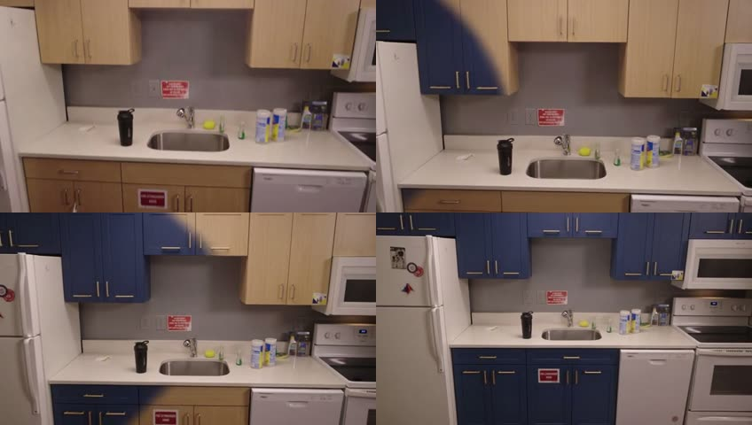

# G3: Grok round 2, fresh uses for AirTool

Research agent G3, 2026-09-26. Question: what has xAI shipped since round 1 (G1 Imagine, G2 voice and
agents), what are people building with it right now, and which new Grok uses would make AirTool
better or more memorable? Already built or on branches, so not proposed again: the realtime
Quartermaster relay (F1), "reimagine this view" (F2), installer intel (F3), the site-walk report, the
"see it installed" postcard and the clean catalogue front view.

Tags: **[V]** verified from xAI docs (fetched today as markdown) or by our own live call. **[S]**
secondary source: a blog, review, repo or post. **[I]** our inference.

**Bottom line.**
- Four live calls, **$0.53** in total, settled three things.
  1. Structured output (`json_schema`) works together with server-side `web_search` and `x_search`.
     On a real part from our cache (Midea MAW08U1QWT) it found the June 2025 CPSC mold recall in
     11.4 s for $0.116. The free CPSC recalls API confirms the same recall deterministically.
  2. `grok-imagine-video-1.5` with a pinned first frame (a real kitchen capture frame) and a pinned
     last frame (a reimagined frame from another pose) gave a clean 3 s camera pull-back in which the
     cabinets turn navy. The room geometry held throughout. It took 44.6 s and cost $0.26.
  3. Grok can reason over our structure layer, but only slowly. `grok-4.20` reasoning with the code
     interpreter got the under-cabinet run right (2.43 m, the same as our local oracle), but it took
     194 s and $0.15. The fast non-reasoning model answered in 2.6 s for $0.004 and picked the wrong
     cabinets. So geometry must stay in local Python, and Grok should only choose which planner to
     run.
- The three to build first:
  1. a **recall and defect radar** on the spec card and checkout;
  2. a **walk-in renovation clip** built from real capture frames;
  3. a **"where does it go?" planner** over the structure layer.
  All three reuse modules that exist on `main` or on the F1–F3 branches.

---

## 1. Live checks (4 calls, $0.53 total)

Probe scripts and raw responses are in the session scratchpad only, not committed. The key was never
printed.

| # | Call | Result | Cost | Time |
|---|---|---|---|---|
| 1 | `POST /v1/responses`, `grok-4.20-0309-non-reasoning`, tools `web_search` + `x_search` (`from_date` 2025-01-01), `max_turns: 3`, `text.format` = strict `json_schema` (`verdict`, `recalls[]`, `complaints[]`, `spoken`). Product: Midea MAW08U1QWT window AC (in `data/parts/`) | Valid JSON. `verdict: "avoid"`. It found the CPSC recall "Midea Recalls About 1.7 Million U and U+ Window Air Conditioners Due to Risk of Mold Exposure" (2025-06-05, correct URL, `applies_to_model: yes`), plus Wirecutter and Home Depot review quotes. Tool usage: **8 web searches** (two of them page opens: cpsc.gov and the recall site), 1 X search, **1 X post fetched**. The `spoken` string carried inline citation markup `[[1]](https://www.cpsc.gov/...)` even inside the JSON [V] | **$0.116** | 11.4 s |
| 2 | `POST /v1/responses`, `grok-4.20-0309-reasoning`, tool `code_interpreter`, strict `json_schema`. Input: the 40 `objects[]` of `scene/kitchen/structure.r1.json` (8 KB of JSON). Ask: find the wall cabinets and give the under-cabinet LED run(s) as 3D segments, the total, and how many 1 m strips | `up_axis: +Y`, uppers `o0–o7, o10`. It correctly dropped o9/o11, which `o10` overlaps. Total **2.43 m**, **3 strips**. It split the run into 5 segments at the door-height changes; our local interval union gives one continuous 2.432 m run. It made 6 code runs and pasted the JSON into the code by hand [V] | **$0.151** | **193.9 s** |
| 3 | `POST /v1/videos/generations`, `grok-imagine-video-1.5`, `image` = `scene/kitchen/thumbs/0301.jpg` (real), `last_frame` = the G1 reimagined frame 0481 (navy cabinets, a different pose), 3 s, 480p, 16:9, `generate_audio: false`. Polled `GET /v1/videos/{id}` | `done`. H.264, 848×480, 24 fps, 73 frames. The camera pulls back and to the right and lands exactly on the edited frame. The recolour sweeps across the doors as a soft "paint wipe" (the frame at 1 s shows a dark diagonal band). The fridge, sink and stove stay geometrically consistent. Frames: [`g3/reno-move-frames.jpg`](g3/reno-move-frames.jpg). The temporary URL is on `vidgen.x.ai` [V] | **$0.26** | 44.6 s (1.1 s to submit) |
| 4 | `POST /v1/responses`, `grok-4.20-0309-non-reasoning`, no tools, strict `json_schema`. Input: the same objects with the geometry precomputed locally (height band, bottom edge). Ask: which ids are upper cabinet doors | Wrong. It kept o10 **and** o9/o11 (a real overlap) and dropped o2/o3/o6/o7 as "duplicates" (they aren't). The model is fast but can't be trusted to pick geometry [V] | $0.004 | 2.6 s |



Free cross-check (not xAI): `GET https://www.saferproducts.gov/RestWebServices/Recall?format=json&Manufacturer=Midea`
returned 5 recalls including #25320, and the string `MAW08U1QWT` appears in that record's
JSON. `ProductModel=MAW08U1QWT` returned **0**: model numbers live in the free-text fields, not in
the model field. A `ProductName=window air conditioner` query also surfaced a **2026-09-17**
Friedrich KÜHL recall (fire and burn hazard) [V].

---

## 2. API facts new since round 1

| Fact | Detail | Date | Tag |
|---|---|---|---|
| **Grok 4.7** | `grok-4.7`: 500k context, text and image in, text out, no output cap. $2 / $0.50 cached / $6 per 1M tokens below 200k prompt tokens. `reasoning.effort` low/medium/high(default)/xhigh. On the Responses API it **always returns `reasoning.encrypted_content`**. "Grok 4.7 Fast" (the same model at 2× token rates) is Cursor and Grok Build only, not on the API. Also served on the US regional endpoint `us.api.x.ai` at 1.1× | 2026-09-21 | [V] [release notes](https://docs.x.ai/developers/release-notes), [MarkTechPost](https://www.marktechpost.com/2026/09/21/spacexai-releases-grok-4-7/) |
| Grok 4.7 in practice | HN: "the ultimate grandmaster of parallel tool-calls, routinely kicking off four or five at once"; complaints about token efficiency. XBOW: it prefers short atomic actions inside an orchestrator (68 correct findings vs 42 for 4.6). The New Stack: "built to work for hours. It still fails most of the time" | 2026-09-21/22 | [S] [HN](https://news.ycombinator.com/item?id=49788838), [XBOW](https://xbow.com/blog/grok-4-7-offensive-security-evaluation), [New Stack](https://thenewstack.io/grok-4-7-agent-stamina/) |
| **Grok Voice Transcribe 2.0** | `grok-voice-transcribe-2.0` on `/v1/stt`. The default is **still 1.0**, so pin 2.0 explicitly | 2026-09 | [V] release notes |
| Structured output + server tools | `text.format: json_schema` works in the **same request** as `web_search`/`x_search`/`code_interpreter` ("only available for supported Grok 4 family models"). This closes G2's open question. Caveat: citation markup `[[n]](url)` is injected **into string fields**, so strip it before TTS | doc + 2026-09-26 | [V] [structured outputs](https://docs.x.ai/developers/model-capabilities/text/structured-outputs), our calls #1/#2 |
| `max_turns` doesn't cap tool calls | With `max_turns: 3` the model still made 8 web searches: parallel calls in one turn count once. To bound cost, cap the domains and the prompt, not the turns | 2026-09-26 | [V] call #1 |
| Code interpreter | Tool type `code_interpreter` (Responses/OpenAI shape) = `code_execution` (xAI SDK). Sandboxed Python with NumPy/Pandas/SciPy/Matplotlib, **no network or file-system access**, $5 per 1k calls. The model must paste your data into its code, which costs tokens and time | doc | [V] [code execution](https://docs.x.ai/developers/tools/code-execution), call #2 |
| Video first/last frame and keyframes | On `grok-imagine-video-1.5`: `image` + `last_frame` pins both ends and interpolates. `keyframes` takes up to **4** `{image, timestamp_s}` pins strictly inside the clip, snapped to a **1/3 s grid** (two in the same slot are rejected). They combine with `reference_images`. The prompt is optional whenever a frame is pinned. The SDKs don't expose `last_frame`/`keyframes` yet; send them in the REST body. Classic `grok-imagine-video` rejects both | added 2026-07-31; first verified by us today | [V] [reference-to-video](https://docs.x.ai/developers/model-capabilities/video/reference-to-video), call #3 |
| Measured video price | 3 s at 480p billed **$0.26**, against 3 × $0.08 = $0.24 list. The $0.02 difference is probably the input-image fee [I] | 2026-09-26 | [V] call #3 |
| **Persist Imagine output** | `storage_options: {filename, public_url: true \| {expires_after}}` on any Imagine request saves the asset to Files. `data[i].file_output.public_url` (on `files-cdn.x.ai`) is **permanent** unless `expires_after` (1 h–30 d) is set. The `url` in `data[i]` stays ephemeral. Inputs can be `image_file_id` / `video_file_id` / `reference_image_file_ids` | 2026-06 (missed in G1) | [V] [persisting outputs](https://docs.x.ai/developers/model-capabilities/imagine/files/outputs) |
| WebSocket mode for Responses | One long-lived socket to `/v1/responses`. Each turn sends only new items plus `previous_response_id`. xAI measured "up to ~20% lower end-to-end latency" on tool-heavy loops. Works with `store=false` and ZDR | 2026-05 | [V] [websocket mode](https://docs.x.ai/developers/advanced-api-usage/websocket-mode) |
| Context compaction, priority | Compaction API for long agent loops; `service_tier: "priority"` at 2× token rates | 2026-05 / 2026-06 | [V] release notes |
| Web search image results | `enable_image_search` returns image hits as Markdown embeds; also `allowed_domains`/`excluded_domains` (max 5 each, mutually exclusive) and `enable_image_understanding` | 2026-05 | [V] [web search](https://docs.x.ai/developers/tools/web-search) |
| X search knobs | `allowed_x_handles` / `excluded_x_handles` (max 20), `from_date` / `to_date`, `enable_image_understanding`, `enable_video_understanding` | doc | [V] [x search](https://docs.x.ai/developers/tools/x-search) |
| Remote MCP | Tool `{type:"mcp", server_url, server_label, server_description?, allowed_tools?, authorization?, headers?}`. Streaming HTTP or SSE only. **`require_approval` and `connector_id` are not supported.** It also works inside realtime voice sessions. Cost is tokens only | doc | [V] [remote MCP](https://docs.x.ai/developers/tools/remote-mcp) |
| Client functions + server tools | Mixing them is supported: server tools run inside the request; a client function call **pauses** the request and hands it back to you, and the follow-up request (with `previous_response_id`) starts a fresh `max_turns` count | doc | [V] [advanced usage](https://docs.x.ai/developers/tools/advanced-usage) |
| Multi-agent | `grok-4.20-multi-agent`: 4 agents (`reasoning.effort` low/medium) or 16 (high/xhigh). Only the leader's tool calls and final answer come back; sub-agent state is encrypted. Built-in tools and remote MCP only (G2: no client functions). $1.25/$2.50 per 1M tokens | doc | [V] [multi-agent](https://docs.x.ai/developers/model-capabilities/text/multi-agent) |
| Tool prices (unchanged) | web_search $5 per 1k calls; x_search $5 per 1k posts and $10 per 1k profiles; code $5 per 1k; collections $2.50 per 1k; attachments $10 per 1k; `view_image` / `view_x_video` token-based | doc | [V] [pricing](https://docs.x.ai/developers/pricing) |

---

## 3. What people are building (Sept 2026)

- **Voice agents that hand work to text models.** Rexclaw (pushed 2026-09-24) runs Grok Voice
  realtime companions with lip-synced VRM avatars. Its companions:
  - hand files, images and deep research to a hidden text-mode analyst via a `delegate_task` tool,
    because "the realtime voice model lack[s]" vision;
  - drive the Grok Build CLI for local tasks;
  - swap scenes with Imagine images or looping videos;
  - attach remote MCP servers;
  - run in **WebXR VR and passthrough MR**.

  This is the only Grok-plus-XR project we found. Our relay (F1) already runs tools server-side, so
  the same delegate pattern fits it directly
  ([repo](https://github.com/Codemarchant/rexclaw)) [S].
- **Voice plus server tools plus MCP.** `rock` and `lock` (2026-09-16) are speech-to-speech agents
  with web and X search and remote MCP. They hand real work to an agent CLI and announce "when it
  lands" ([repo](https://github.com/h1ddenpr0cess20/rock)) [S].
- **Voice-directed Imagine refinement.** `cobusgreyling/grok-lab` (2026-09-25) has a `voice-imagine`
  app for iterative image edits by voice ("more menacing, tiny hat"), alongside a reference realtime
  client and voice roasts ([repo](https://github.com/cobusgreyling/grok-lab)) [S].
- **X search as the product.** GrokScope (2026-09-26) is a CLI that answers "what are developers
  saying on X right now" with clickable, recency-tagged citations. It has a `demo` mode that
  replays a recorded run with no key and no network, which is the same trick as our OFFLINE cache
  ([repo](https://github.com/Booyaka101/grokscope)) [S].
- **Multi-agent as a "deep" tier behind MCP.** ContextX (175 stars, 2026-09-09) is a free remote
  MCP server: Grok 4.3 for normal search, `grok-4.20-multi-agent` for deep search. It streams
  upstream to dodge gateway timeouts ([repo](https://github.com/KayanoLiam/ContextX)).
  `grok-critic-mcp` puts the 16-agent setup behind MCP for code review
  ([repo](https://github.com/Bondartsov/grok-critic-mcp)) [S].
- **Imagine video craft.** Prompt libraries organised by camera path and shot grammar
  ([imagineVid](https://github.com/imagineVid/awesome-grok-imagine-video-prompts-and-skills),
  [YouMind](https://github.com/YouMind-OpenLab/awesome-grok-imagine-prompts)). Replicate's and
  Scenario's guides push storyboarding with pinned keyframes over single-image animation
  ([Scenario](https://help.scenario.com/articles/5410526625-grok-imagine-video-a-guide-to-ai-motion-creation)) [S].
- **Voice builder tutorials.** The DataCamp Think Fast 2.0 walkthrough notes that tool calls fire
  "often before the end of the agent's first sentence"
  ([DataCamp](https://www.datacamp.com/tutorial/grok-voice-think-fast-2-0)). eesel's review
  (2026-08-04) lists the limits: 10 concurrent sessions per team by default, `us-east-1` only,
  120-minute sessions ([eesel](https://www.eesel.ai/blog/grok-voice-think-fast-2-review)) [S].
- **Hackathons.** At Grokathon 2026 (SF, 2026-08-13) the winners were Nova (binaries → C) and
  ThinkVoice (neural signals + Grok Voice Think Fast 2.0)
  ([basenor](https://www.basenor.com/blogs/news/xai-grokathon-2026-4-standout-moments-that-reveal-groks-range)).
  We found no Devpost entry that uses Imagine video or the structure of a 3D capture [S].
- **Gaps.** Our web search tool returned almost nothing from Reddit or X for these topics
  (r/grok, r/virtualreality, r/drones, r/HomeImprovement), so social signal here comes from GitHub,
  HN and blogs. We did not spend x_search budget on meta-research. We found **no** project that:
  - pins real capture frames as video keyframes;
  - asks Grok about a metric structure layer;
  - checks recalls before an XR purchase.

  All three are open ground [I].

---

## 4. Ideas, ranked

Scores are 1–5. **Wow** means demo wow for the judges. **Feas** means it can be built in a few hours
by one person on the server, with Unity work limited to a new action. **Fit** means it reuses our
endpoints and modules. **Score** = Wow × Feas × Fit. Costs are per use.

| Rank | Idea | Wow | Feas | Fit | Score | Cost / latency | Main risk |
|---|---|---|---|---|---|---|---|
| **1** | **Recall and defect radar** on the spec card and checkout | 4 | 5 | 5 | 100 | $0.116, ~11 s, cached per part [V] | Sparse X signal (1 post); citation markup in strings |
| **2** | **Walk-in renovation clip**: real frame → reimagined frame video | 5 | 4 | 4 | 80 | $0.26 per 3 s at 480p + $0.07 edit, ~45 s + 11 s [V] | Mid-clip "wipe" artefact; minutes of queue on a bad day |
| **3** | **"Where does it go?" planner** over the structure layer | 5 | 3 | 5 | 75 | $0.004 and 2.6 s for the intent call [V]; geometry is local | LLM geometry is wrong unless we compute it (call #4) |
| 4 | Voice-refined reimagine ("darker blue, brass pulls") | 3 | 5 | 5 | 75 | $0.07 per step, 11 s [V G1] | Drift after several chained edits |
| 5 | Demo reel generator: script + TTS + walk-in clip | 3 | 5 | 3 | 45 | ~$0.01 text + TTS $15/1M chars + clip | Overlaps the site report; a Devpost asset, not a feature |
| 6 | Multi-agent quote showdown (landed cost per seller) | 3 | 3 | 4 | 36 | tens of seconds, ~$0.10–0.50 [I] | No client functions on multi-agent; slow; SerpApi already ranks sellers |
| 7 | Install-manual Q&A from an xAI Collection per site | 3 | 3 | 4 | 36 | $2.50 per 1k searches + storage | Finding the right PDF manual per part |
| 8 | AR "ghost" install steps per placed part | 5 | 2 | 3 | 30 | ~$0.01 per step list | Mostly Unity work; invented steps |
| 9 | Ad-hoc load/fit maths through `code_interpreter` | 2 | 4 | 3 | 24 | $0.15 and 194 s on reasoning [V]; faster non-reasoning untested | Local tools (`hanger_plan`, `btu_for_room`) already cover the common cases |
| 10 | Capture coach by voice for the drone/phone pilot | 4 | 2 | 2 | 16 | $0.08/min voice | Needs coverage stats from the P1 preview; happens in the field, not at the booth |
| 11 | Expose the parts server as a remote MCP server | 2 | 3 | 2 | 12 | tokens only | Needs a public URL from the hall; F1 already runs our tools server-side |

**4. Voice-refined reimagine.** F2's `reimagine` returns an edited frame. Add a
`refine_reimagine(prompt)` tool that feeds the last edited JPEG back into `imagine.edit` with the same
"change nothing else" clause. Keep a per-session stack so "undo" pops a step. grok-lab's
`voice-imagine` shows the interaction is fun. The build is about 30 minutes on top of F2. It ties on
score with #3, but #3 wins the tie because it makes Grok use our own P1–P3 data, which nobody else
has.

**5. Demo reel generator.** One `grok-4.3` call turns the session notebook into a 40 s voice-over
script. Grok TTS reads it in the Quartermaster voice with `[pause]` tags, and ffmpeg lays it over the
walk-in clip (#2). This is a script in `tools/`, not an endpoint, because the site report already
owns the per-session summary.

**6. Multi-agent quote showdown.** Take the BOM lines from `POST /parts/bom` and have
`grok-4.20-multi-agent` (4 agents, `web_search`) compare the landed cost for the whole BOM across the
top three sellers: shipping, stock, promo codes and install add-ons. The output uses a strict
schema. We did not verify it live. Because multi-agent can't call our functions, feed it the BOM as
text. It is worth it only if SerpApi's per-part ranking visibly misses something.

**7. Install-manual Q&A.** When a part is bought, fetch its install PDF (`web_search` with
`allowed_domains` set to the manufacturer) and upload it to a per-site xAI Collection. The voice
session then gets `file_search` on that collection: "what screws does the manual want?" is answered
with a page citation. This is useful, but finding the PDFs is the risky part.

**8. AR ghost steps.** Grok writes 3–6 install steps as structured output, each tied to a structure
anchor (edge or corner id) and a translucent part pose. Unity animates them. The wow is high, but
most of the work is on P3.

**9. Code-interpreter maths.** It works (call #2), but the local deterministic tools on the F1 branch
answer the common questions in under 1 ms. Keep it only as a fallback for questions nobody modelled
("snow load on 3.66 m of gutter at 60 cm spacing"), with a "calculating…" filler line.

**10. Capture coach.** The P1 preview (about 1 minute after upload) could report the facades or
corners with too few views, and Grok Voice could tell the pilot "orbit the north-east corner again,
3 m lower". This needs coverage numbers the pipeline doesn't emit yet. Good for a Devpost story, not
for this weekend.

**11. Parts server as MCP.** It would let grok.com or any MCP client use AirTool. It isn't needed for
the demo, and it needs a public tunnel.

---

## 5. The three to build first

### Pick 1: Recall and defect radar (`server/safety.py`, `GET /parts/{part_id}/safety`, tool `check_safety`)

**Why.** A recall check turns the Visa beat into "the assistant stopped me buying a recalled AC", and
we have already seen it happen on a part in our own cache (§1). The check is two sources:
- **CPSC**: free and deterministic, so it is the evidence.
- **Grok** (`web_search` + `x_search`, strict schema): adds owner-complaint colour and catches
  recalls CPSC phrases differently.

**Module.** `server/safety.py`:
- `async def cpsc_recalls(manufacturer: str) -> list[dict]`
  - Calls `GET https://www.saferproducts.gov/RestWebServices/Recall?format=json&Manufacturer=<m>`
    through `cache.cached("cpsc", m, ..., ttl_s=86400)`.
- `def match_model(record: dict, model_no: str) -> bool`
  - A normalised substring search over the record's JSON: upper-case, spaces and dashes dropped.
  - Needed because `ProductModel=` returns nothing (§1).
- `async def grok_check(part: Part) -> dict`
  - Call: `llm.responses()` from the F3 branch, model `grok-4.20-0309-non-reasoning`, tools
    `[{"type":"web_search"},{"type":"x_search","from_date": <today − 2 y>}]`, with the call-#1 schema.
  - Cleanup: strip `\[\[\d+\]\]\([^)]*\)` from every string field.
- `async def check(part: Part) -> SafetyReport`: runs both in parallel and merges them under fixed
  rules. The LLM never sets the verdict alone.
  - `recalled`: a CPSC record matches `model_no`, **or** Grok reports a recall whose URL domain is on
    the allowlist (`cpsc.gov`, `saferproducts.gov`, `recalls.gov`, the manufacturer's domain).
  - `caution`: a CPSC brand-level recall without a model match, **or** at least 2 cited complaints
    sharing one theme.
  - `clear`: anything else.
  - `unknown`: both sources failed, or OFFLINE with no cache.
- Cache the report in `cache.cached("safety", part.id, ..., ttl_s=86400)`.

**Endpoint.** `GET /parts/{part_id}/safety` returns:

```json
{"part_id": "midea-maw08u1qwt-8d6d08", "verdict": "recalled",
 "headline": "Recalled June 2025: mold risk (CPSC #25320)",
 "recalls": [{"source": "cpsc", "number": "25320", "title": "...", "date": "2025-06-05",
              "url": "https://www.cpsc.gov/Recalls/2025/...", "applies": "yes"}],
 "complaints": [{"theme": "mold after months of use", "source": "web", "url": "...", "quote": "..."}],
 "spoken": "Heads up: this exact model was recalled in June 2025 for mold risk.",
 "checked_at": "2026-09-26T05:00:00Z", "cost_usd": 0.116}
```

Errors: `404` for an unknown part. The endpoint never returns `5xx` for a source failure; it returns
`verdict: "unknown"` instead.

**Agent and flow.**
- Tool `check_safety(part_id?)`, which defaults to `selected_part_id`, returns the action
  `show_safety {part_id, verdict, headline}` and speaks `spoken`.
- The server also starts the check in the background on `select_candidate` and `show_sellers`, so it
  is cached before the carousel opens.
- `start_checkout` on a `recalled` part still opens the panel (honesty over blocking), but the agent
  first speaks the headline once.
- Add `safety_verdict` to the `/checkout` receipt and the notebook entry.

**Unity contract.** One new action, `show_safety`, per the table below.

| Verdict | What Unity shows |
|---|---|
| `recalled` | A red "RECALLED" pill on the spec card and the seller panel, with `headline` underneath |
| `caution` | An amber pill with the same layout |
| `clear` | Nothing |
| `unknown` | Nothing |

Tapping the pill opens the first `url` in the Quest browser, the same as "open at seller".

**Cost per use.** $0.116 for the first check of a part [V], then $0 from cache for 24 h; CPSC is
free. A 30-judge demo over 5 demo parts costs about $0.60 once, pre-warmed by `warm.py`.

**Test plan.** `tests/test_safety.py`, offline, with respx:
1. A CPSC fixture (trimmed record #25320 including the string `MAW08U1QWT`) plus a Grok fixture
   gives `recalled` with `applies: yes`.
2. The same CPSC record with model `XYZ123` gives `caution`.
3. Grok claims a recall with a `reddit.com` URL and CPSC is empty: `caution`, not `recalled`.
4. The citation markup is stripped from `spoken`.
5. The second call hits the cache (no HTTP).
6. OFFLINE without cache gives `unknown` and a 200.
7. CPSC returning 500 still yields the Grok-only verdict.
8. An agent test: `check_safety` emits `show_safety`, and `start_checkout` on a recalled part speaks
   the headline.

One `-m live` test runs on MAW08U1QWT.

**What to mock.** `saferproducts.gov` and `api.x.ai/v1/responses` (respx), and the clock for
`from_date`. Build the Grok fixture from the call-#1 response shape: `web_search_call`,
`custom_tool_call`, a `message` with `output_text` JSON, and `usage.cost_in_usd_ticks`.

### Pick 2: Walk-in renovation clip (`server/flythrough.py`, `POST /scene/flythrough`, tool `walk_in_preview`)

**Why.** F2 shows a still "after" on a quad. This beat is a real capture frame that *moves* into the
renovated view, generated from our own drone/phone frames and camera poses. Call #3 shows the pinned
first and last frames hold the room geometry. No one else has capture poses to choose the frames
from.

**Module.** `server/flythrough.py`, on top of F2's `imagine.load_frame` and `imagine.edit`:
- `def pick_frames(site, to_frame_id, back_m=0.6) -> tuple[str, str]`
  - `to_frame_id` is the frame the user is looking through (as in F2).
  - The start frame is the camera in `cameras.r<rev>.json` whose `position` is about `back_m`
    behind it along its view axis. Fallback: the camera about 30 entries earlier in `cameras.r<rev>.json` (0301 is 36 entries before 0481).
  - This gives a pull-back move like 0301 → 0481.
- `async def render(site, to_frame_id, prompt, duration_s=3, resolution="480p") -> dict`. Steps:
  1. The end image is `imagine.edit([frame(to)], prompt + " Change nothing else.")`, which reuses F2's
     cache, so a frame already reimagined costs $0.
  2. `POST /v1/videos/generations` with
     `{model: "grok-imagine-video-1.5", image: {url: data-uri(start)}, last_frame: {url: data-uri(edited end)}, duration, resolution, aspect_ratio: "16:9", generate_audio: false, prompt: "Handheld camera moves smoothly from the first view to the last; the room is renovated as described: <prompt>. No people."}`.
  3. Poll `GET /v1/videos/{id}` every 5 s, with a 300 s cap.
  4. Download the mp4 at once to `data/imagine/<key>.mp4` (the URL is temporary) and cut a poster JPEG
     with ffmpeg.
- Run it as a background task in `jobs.py`'s table (the same eviction rules as search jobs). The
  cache key is `{site, from, to, prompt, duration, resolution}`.
- Add a `warm.py --flythrough` option to pre-bake the rehearsed prompts.

**Endpoints.**
- `POST /scene/flythrough {site, frame_id, prompt, duration_s?, resolution?}` returns
  `{job_id, status: "pending"}` (or `done` at once on a cache hit).
- `GET /scene/flythrough/{job_id}` returns
  `{status: pending|done|failed, video_url: "/scene/flythrough/<key>.mp4", poster_url, from_frame, to_frame, cost_usd, label: "AI preview, not to scale"}`.
- `GET /scene/flythrough/{key}.mp4` is served from `data/imagine/`.
- Optional: `?share=1` adds `storage_options.public_url: {expires_after: 604800}` to the video call and
  returns `share_url` (a `files-cdn.x.ai` link for the report's QR code).

**Agent.**
- Tool `walk_in_preview(prompt)` uses the context's `site` and `frame_id` (the same fields F2 added).
- It returns the action `flythrough_started {job_id}` and the spoken line "Rendering a walk-in; about
  a minute."
- When the job finishes, the relay (F1) or the next `/agent/command` poll pushes
  `show_video {video_url, poster_url, label}`.

**Unity contract.**
- On `flythrough_started`, poll `GET /scene/flythrough/{job_id}` every 3 s and show a spinner on the
  F2 quad.
- On `show_video`, play `video_url` with Unity `VideoPlayer` (URL source, H.264 848×480 at 24 fps,
  about 0.5 MB for 3 s) on the same quad, looping. Always show `label`.
- The clip starts at the start frame's camera, not the user's, so float it as a screen in front of
  the user rather than registering it to the mesh.

**Cost per use.** $0.26 for 3 s at 480p [V], plus $0.07 when the end frame isn't already
reimagined [V G1]: **$0.26–0.33**. 6 s at 720p is about 6 × $0.14 + $0.07 ≈ $0.91 [S price]. Latency
is about 45 s for 3 s at 480p [V], plus 11 s for the edit. Pre-bake 2–3 demo clips; run a live one
only as a bonus.

**Test plan.** `tests/test_flythrough.py`:
1. `pick_frames` on `scene/kitchen/cameras.r1.json` picks an earlier camera 0.4–0.8 m behind 0481.
2. The request body has `image` and `last_frame` data URIs, model `grok-imagine-video-1.5`, and no
   `keyframes`.
3. A poll sequence of `pending, pending, done` downloads the mp4 and writes the poster.
4. A `failed` or `expired` poll makes the job `failed` and gives a spoken fallback ("I couldn't render
   that; here's the still").
5. A moderation `400 invalid_argument` returns 422.
6. A cache hit makes no HTTP calls.
7. OFFLINE with a miss returns 503; with a hit it returns `done`.
8. `imagine.edit` is called once, with the end frame only.

**What to mock.** respx for `POST /v1/videos/generations`, `GET /v1/videos/{id}` and the `vidgen.x.ai`
download (return a 1 KB fake mp4 and monkeypatch the ffmpeg poster step), plus a
`monkeypatch.setattr(imagine, "edit", ...)` stub. No sleeps: inject the poll interval.

### Pick 3: "Where does it go?" planner (`server/plan.py`, `POST /scene/plan`, tool `plan_placement`)

**Why.** This is the beat where Grok reads *our* reconstruction. The user asks "LED strip under these
cabinets" or "hangers along this gutter every 60 cm". A ghost line or a row of ghost parts appears on
the real edges with a length and a count, and the count flows into the BOM. Call #2 shows Grok alone
can get the answer but takes 3 minutes; call #4 shows the fast model gets the geometry wrong. So the
split is: **local Python does all the geometry, and Grok only turns the sentence into a planner call.**

**Module.** `server/plan.py`, pure functions over `structure.r<rev>.json` (schema in
`docs/api.md` §structure):
- `under_cabinet_runs(s) -> list[Segment]`
  - Select `cabinet_door` objects above a height band (the counter plane plus 0.3 m; fallback: the
    upper 40 % of the object heights).
  - Drop any rectangle that overlaps finer ones in the same plane (the o10 case).
  - Take the interval union of the bottom edges along the wall axis, with a 2 cm join tolerance.
  - On the kitchen fixture this gives one run of **2.432 m**.
- `along_edge(s, edge_id, spacing_mm) -> list[Point]`
  - Calls F1's `hanger_plan(length, spacing_mm)` (150 mm end inset, never wider than `spacing_mm`)
    and maps its `positions_mm` onto the edge, so voice and plan give the same count (3.66 m at
    600 mm = 7).
- `centered_on(s, object_or_plane_id, dims_mm) -> Point`
  - The centre of the target, pushed out by half the part depth along the plane normal.
  - It adds a clearance flag when the part is wider than the object.
- `async def plan(site, utterance, context) -> Plan`
  - One `llm.responses()` call on `grok-4.20-0309-non-reasoning`, no tools, strict schema:
    `{planner: enum[under_cabinet_runs, along_edge, centered_on, none], target_id: string|null, spacing_mm: number|null, stock_length_m: number|null, spoken_intro: string}`.
  - Its input is a **summary**, not coordinates:
    - the object groups with label, count and height band;
    - the edge nearest `context.pointer` or `context.measurement`;
    - the selected part's dims.
  - Then run the chosen planner locally and compute `count = ceil(total / stock_length)` when
    `stock_length_m` is set.

**Endpoint.** `POST /scene/plan {site, utterance, context}` returns:

```json
{"plan_id": "p-7f3a", "planner": "under_cabinet_runs",
 "segments": [{"a": [-1.413, 0.03, 1.213], "b": [-1.303, 0.01, -1.219], "length_m": 2.432}],
 "points": [], "total_m": 2.43, "count": 3, "unit": "1 m strip",
 "spoken": "One run under the wall cabinets, 2.43 metres. Three 1-metre strips, cut the last.",
 "label": "Planned from the scan; check with the tape"}
```

Errors: `409` when the scene has no structure layer (the preview, or `structure: null`), with a spoken
"I can only plan on the full scan". `422` when the planner is `none`: Grok says what it needs, e.g.
"point at the gutter".

**Agent.**
- Tool `plan_placement(request)` returns the action `show_plan {plan_id, segments, points, label}`.
- A follow-up "place them" maps to the existing `place_array {spacing_mm}` (for `along_edge`) or to a
  new `add_to_bom` step that calls `POST /parts/bom` with `count`.

**Unity contract.** `show_plan`:
- Draw each segment as a dashed LineRenderer 1 cm thick. Put a ghost of the selected part prefab at
  30 % alpha on each point.
- Apply the same glTF → Unity X flip as the structure layer. Check it on one known corner, as
  `docs/api.md` says.
- A floating label at the segment's midpoint shows `length_m`.
- A pinch on "Place" sends "place them" as a normal command.
- Nothing else changes; the action is ignored when no scene is loaded.

**Cost per use.** About **$0.004 and 2–3 s** for the intent call [V call #4, the same size of prompt].
The geometry is free and runs in under 10 ms.

**Test plan.** `tests/test_plan.py`:
1. `under_cabinet_runs` on a trimmed kitchen fixture (the 40 objects plus the counter plane) gives
   one run of 2.432 ± 0.02 m, and o10 is deduplicated against o9/o11.
2. `along_edge` with a 3.66 m edge and 600 mm gives 7 points, 150 mm in from each end, matching
   `hanger_plan`.
3. `centered_on` flags a part wider than its target.
4. With a mocked Grok returning `under_cabinet_runs` and `stock_length_m: 1`, `count == 3`.
5. With a mocked Grok returning `planner: "none"`, the result is 422 with a spoken hint.
6. A missing structure layer gives 409.
7. A schema-invalid Grok reply (an unknown planner) is rejected and nothing is drawn.
8. An agent test: `plan_placement` emits `show_plan`.

Add one `-m live` test with the LED sentence on the kitchen.

**What to mock.** Only `llm.responses` (monkeypatch it to return the parsed JSON). The geometry tests
use the fixture and no network. Keep the trimmed fixture under `tests/fixtures/structure/` so tests
don't depend on `scene/`.

---

## 6. Open questions

- The keyframes path (up to 4 pins inside the clip) is untested. Pinning a **real** mid-frame could
  fight a renovation that should already be visible by then. Try `image` = real, one keyframe =
  reimagined at 40 %, `last_frame` = reimagined, to see whether the "paint wipe" becomes a cleaner
  reveal.
- Is the extra $0.02 on the 3 s clip a per-input-image fee? One more call with no `last_frame` would
  tell.
- X signal for home-improvement parts is thin: 1 post for Midea here, 1 relevant post for Atlanta
  gutters in G2. The radar's value comes from web plus CPSC; X is colour. Worth a `from_date`-only
  test on a trending product before the demo.
- `grok-4.7` (low effort) on the planner's intent call is untested. It may beat 4.20 non-reasoning at
  picking the right planner at a similar latency.
- The kitchen scale came from the altitude method (residual 5 cm, per `scene.json`), so plan lengths
  inherit that error. Show "check with the tape" on every plan.

## Sources

- xAI docs (fetched 2026-09-26 as `.md`):
  - [release notes](https://docs.x.ai/developers/release-notes)
  - [pricing](https://docs.x.ai/developers/pricing)
  - [structured outputs](https://docs.x.ai/developers/model-capabilities/text/structured-outputs)
  - [code execution](https://docs.x.ai/developers/tools/code-execution)
  - [remote MCP](https://docs.x.ai/developers/tools/remote-mcp)
  - [advanced tool usage](https://docs.x.ai/developers/tools/advanced-usage)
  - [x search](https://docs.x.ai/developers/tools/x-search)
  - [web search](https://docs.x.ai/developers/tools/web-search)
  - [multi-agent](https://docs.x.ai/developers/model-capabilities/text/multi-agent)
  - [video generation](https://docs.x.ai/developers/model-capabilities/video/generation)
  - [reference-to-video, first/last frame, keyframes](https://docs.x.ai/developers/model-capabilities/video/reference-to-video)
  - [persisting Imagine output](https://docs.x.ai/developers/model-capabilities/imagine/files/outputs)
  - [WebSocket mode](https://docs.x.ai/developers/advanced-api-usage/websocket-mode)
  - [llms.txt index](https://docs.x.ai/llms.txt)
- News and reviews:
  - [MarkTechPost on Grok 4.7](https://www.marktechpost.com/2026/09/21/spacexai-releases-grok-4-7/)
  - [HN Grok 4.7 thread](https://news.ycombinator.com/item?id=49788838)
  - [XBOW Grok 4.7 evaluation](https://xbow.com/blog/grok-4-7-offensive-security-evaluation)
  - [The New Stack](https://thenewstack.io/grok-4-7-agent-stamina/)
  - [eesel Think Fast 2.0 review](https://www.eesel.ai/blog/grok-voice-think-fast-2-review)
  - [DataCamp Think Fast 2.0 tutorial](https://www.datacamp.com/tutorial/grok-voice-think-fast-2-0)
  - [basenor on Grokathon 2026](https://www.basenor.com/blogs/news/xai-grokathon-2026-4-standout-moments-that-reveal-groks-range)
  - [Scenario video 1.5 guide](https://help.scenario.com/articles/5410526625-grok-imagine-video-a-guide-to-ai-motion-creation)
- Repos (pushed Sept 2026 unless noted):
  - [rexclaw](https://github.com/Codemarchant/rexclaw)
  - [rock](https://github.com/h1ddenpr0cess20/rock)
  - [grok-lab](https://github.com/cobusgreyling/grok-lab)
  - [GrokScope](https://github.com/Booyaka101/grokscope)
  - [ContextX](https://github.com/KayanoLiam/ContextX)
  - [grok-critic-mcp](https://github.com/Bondartsov/grok-critic-mcp)
  - [awesome-grok-imagine-video-prompts-and-skills](https://github.com/imagineVid/awesome-grok-imagine-video-prompts-and-skills)
  - [xai-cookbook](https://github.com/xai-org/xai-cookbook) (last commit 2026-04-16, the Android voice tester)
- Non-xAI data:
  - [CPSC Recalls REST API](https://www.saferproducts.gov/RestWebServices/Recall?format=json&Manufacturer=Midea)
  - [CPSC recall #25320](https://www.cpsc.gov/Recalls/2025/Midea-Recalls-About-1-7-Million-U-and-U-Window-Air-Conditioners-Due-to-Risk-of-Mold-Exposure)
