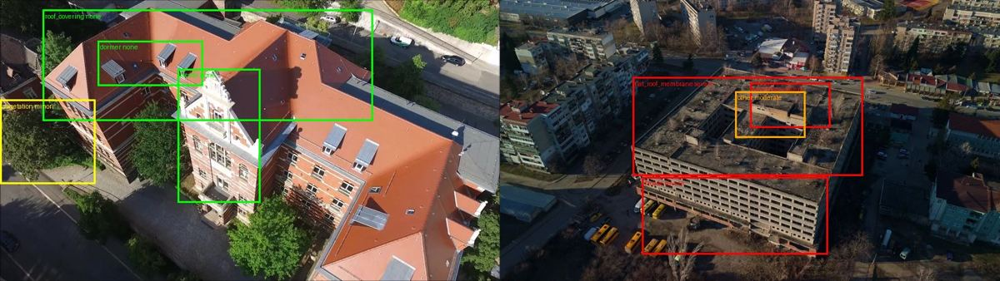
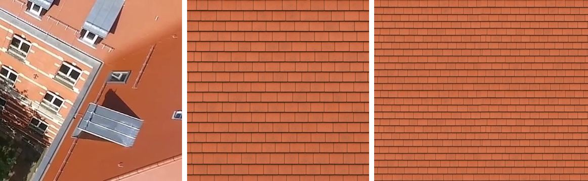
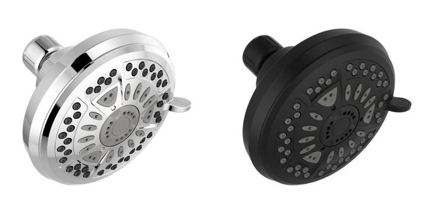

# G4: Grok round 3, capture insight, sharing and asset looks

Research agent G4, 2026-09-26. Question: which Grok uses would add the most in areas rounds 1–2 barely
touched? Those areas are:

- the capture side: drone coaching, and turning footage into condition findings and a parts list;
- sharing and handoff: X, public links, contractor and homeowner;
- xAI's newest releases;
- Imagine for asset looks: finish variants and tileable textures;
- anything a judge would remember.

Already built on branches, so not proposed again:
- the realtime voice relay (F1);
- "reimagine this view" (F2);
- installer intel (F3);
- the site-walk report (F4);
- the "see it installed" postcard (F5);
- the recall and defect radar (F6);
- the "where does it go?" planner (F7);
- the walk-in renovation video (F8).

Tags: **[V]** verified from xAI docs or by our own live call. **[S]** secondary source: a blog,
review, repo or post. **[I]** our inference. "[V sub]" means a research sub-agent fetched the page
and read it today.

**Bottom line.**
- Six live calls, **$0.309** in total, settled four things.
  1. **Grok vision can triage building condition from our own drone frames.**
     - On B1's frames it rated the red-tile school (Zabel) as fine and the derelict block
       (Hospital) as severe: failed flat roof, trees growing on the deck, weathered facade.
     - `grok-4.20-0309-non-reasoning` did it for **$0.007** in 9 s (3 frames).
     - `grok-4.7` at low effort gave tighter boxes for **$0.022** in 34 s (2 frames).
     - Boxes are region-level, not element-level. Pins on the mesh are fine; "this exact tile" is
       not.
  2. **The Responses `image_generation` server tool works**, a capability the xAI docs don't
     date. One call turned a chrome shower head photo into matte black: **$0.066, 6.8 s**. The
     silhouette bbox matched the original to 1 px, so the variant drops straight into our photo
     projection.
  3. **Imagine can turn a blurry roof crop into a crisp tile texture**, for $0.07 in 9 s. It wraps
     cleanly left to right but not top to bottom. A local crop to a whole number of tile courses
     makes it passable. The API still has no tiling flag.
  4. **A capture coach needs local maths, not Grok maths.**
     - Our own `cameras.r2.json` shows that all 118 Zabel views sit on **one side** of the
       building.
     - Grok phrased the reshoot well, for $0.002 in 2.9 s. But it listed the 7 missing sides as 7
       identical legs, so merging them into legs must stay in Python.
- A fifth call checked storm evidence: $0.141. It found a real 2026-09-19 wind report 7.8 km from
  Georgia Tech with trees through roofs. The free NOAA SPC CSV confirmed it word for word. But Grok
  also listed events 100–200 km away after being asked for 25 km, so filter distance locally.
- The three to build first:
  1. a **drone condition survey** that drops severity pins on the mesh and feeds `find_part`;
  2. a **capture coach** that tells the pilot which sides to fly next;
  3. **finish variants that re-texture the GLB**, not just tint it.

  All three reuse modules on `main` (`meshgen.project`, `cache.cached`, the scene package, the
  agent's action list), and none needs a new dependency.

---

## 1. Live checks (6 calls, $0.309 total)

The probe scripts and raw responses are in the session scratchpad only, not committed. The key was
never printed. Costs are from `usage.cost_in_usd_ticks`.

**Frames.**
- Zabel and Hospital are B1's building reconstructions on hfbox
  (`/workspace/airtools/scene/b1/*`, `work/b1/*/frames`, 1920×1080).
- The kitchen is `scene/kitchen`.
- We looked at the frames and copied them; we changed nothing.
- B1's licence notes for this footage aren't on `main`. Check them before using the images below
  outside the team.

| # | Call | Result | Cost | Time |
|---|---|---|---|---|
| 1 | `POST /v1/responses`, `grok-4.20-0309-non-reasoning`, 3 frames at 1280 px, `detail: high`, strict `json_schema`: `findings[] {frame, element enum, issue, severity none/minor/moderate/severe, confidence, box, action, part_query}`, `coverage_gaps[]`, `reshoot[] {target, how}`, `summary` | Zabel 0316 and 0421: tile roof, dormers, facade and windows all `none`. Hospital 0141: roof `severe` ("large sections missing, exposed structure, vegetation growth"), vegetation `severe`, facade `moderate`. That is correct: it is a derelict building. **Boxes came back on a 0–100 scale** although we asked for 0–1000, and they cover whole regions. It invented one `flat_roof_membrane` on Zabel, which is really metal edging. Its reshoot advice is generic ("50–80 ft oblique passes along the eaves") [V] | **$0.0071** | 9.3 s |
| 2 | Same schema, `grok-4.7`, `reasoning.effort: low`, 2 frames at 1920 px (Zabel 0491, Hospital 0141). The prompt spells out the 0–1000 scale with an example | Real 0–1000 boxes and much tighter on Hospital (roof deck, the vegetation clump, the courtyard parapet, the facade band). Zabel boxes are offset by about 5–10 % of the frame: the dormer box half misses the dormers. It flags trees overhanging the eaves as `minor`. Its coverage gaps are specific: "gutters, downspouts, eaves and tile-edge flashing are not resolved in frame 1". 1,141 reasoning tokens [V] | **$0.0225** | 34.1 s |
| 3 | `POST /v1/images/edits`, `grok-imagine-image-2.0`, input: a 400×400 crop of the Zabel roof (tiles are not resolved at that altitude). Prompt: "a seamless, tileable, square material swatch of that same roof covering, orthographic, flat lighting …" | 1024² plain clay tiles in the right colour. **Wrap seam ratio** (mean wrap-edge difference ÷ mean neighbour difference; 1.0 is invisible): **1.11 left to right, 10.3 top to bottom**. An offset-and-blend fix measured 0.87/0.71 but ghosts the tile courses visibly. Cropping to 751×882 px (a whole number of courses, found by searching for the best-matching row) gives 1.2/4.3 and looks passable when tiled 2×2 [V] | **$0.070** | 9.4 s |
| 4 | `POST /v1/responses`, `grok-4.20-0309-non-reasoning`, tools `[{"type":"image_generation"}]`. Input: our cached `delta-75641` photo (chrome shower head) plus "edit into Matte Black, change only the finish" | Output item `image_generation_call` with `result` (base64 JPEG, 1024²) and the tool's own rewritten `prompt`. `usage.server_side_tool_usage_details.image_generation_calls: 1`. The shape is identical: the silhouette bbox is (106,136)–(917,886) against (106,136)–(916,887) on the original, silhouette IoU 0.80 (the spray holes differ). The text reply was "Matte Black." [V] | **$0.0663** | 6.8 s |
| 5 | `POST /v1/responses`, `grok-4.20-0309-non-reasoning`, `web_search` (`allowed_domains`: spc.noaa.gov, weather.gov, ncei.noaa.gov, ajc.com, 11alive.com) plus `x_search` (`from_date` 2026-06-01, `to_date` 2026-09-25), `max_turns: 3`, strict schema `events[] {date, hazard, detail, place, distance_km, source, url}`. Ask: hail, wind or tornado events within 25 km of Georgia Tech | 4 events, all with SPC URLs. The one that matters: **2026-09-19, Fulton County**. Trees were down in Thomasville Heights, "a couple of trees falling on homes and causing roof damage", and a tree went through a roof on McWilliams Rd. The other 3 were 100–200 km away (Rome hail, Hephzibah hail, central-GA tornadoes), despite the 25 km ask. Tool usage: 8 web searches, 1 X search, 10 X posts fetched, **0 used**. 61k input tokens [V] | **$0.1414** | 14.3 s |
| 6 | `POST /v1/responses`, `grok-4.20-0309-non-reasoning`, no tools, 3 Zabel thumbs at `detail: low`. The input carried coverage stats computed locally from `cameras.r2.json`: view-side octants `[118,0,0,0,0,0,0,0]`, 34 frames pitched more than 35° down. Strict schema `{verdict, spoken, legs[] {side_octant, pattern enum, gimbal_pitch_deg, why}}` | `reshoot_most`. Spoken: "Coverage is only from one side with low variety in pitch and height. Need to fly all other sides and add more downward pitched shots for the roof." It then gave **7 legs, one per empty octant, all identical** (orbit, 45°). The wording is right; the leg list should be merged locally. (Our prompt said 166 frames in total, wrongly counting B1's 48 preview thumbs; the model didn't lean on it.) [V] | **$0.0019** | 2.9 s |







**Free cross-check (not xAI).**
- `GET https://www.spc.noaa.gov/climo/reports/260919_rpts.csv` has rows at 2325 and 2326 UTC, Fulton
  County, 33.70/−84.36 and 33.69/−84.36:
  - "Multiple trees reported down in the Thomasville Heights neighborhood... with a couple of trees
    falling on homes and causing roof damage";
  - "Broadcast media reported a tree fell through the roof of a home on McWilliams Road".
- The `_filtered.csv` variant has only the power-lines row, so use the unfiltered file.
- Haversine from Georgia Tech (33.776, −84.398) to 33.71/−84.37 is **7.8 km**.
- The CSV has lat/lon for every report, so a distance filter is one line [V].

**Box-centre projection (free, local).** We checked the kitchen's `cameras.r1.json` convention:
- `position == -Rᵀt` holds.
- A ray `Rᵀ K⁻¹ [u·w, v·h, 1]` from `position` hit `collision.r1.glb` for 2 of 3 test pixels, at
  1.55 m and 1.66 m.
- So a finding's box centre can become a 3D pin server-side with `trimesh`. Sample a few points
  inside the box and take the median hit, because a single centre ray can miss through a hole [V].

---

## 2. API facts new since round 2

| Fact | Detail | Date | Tag |
|---|---|---|---|
| **`image_generation` server tool** | Tool type `image_generation` on Chat and Responses (`action`: auto, generate or edit). It returns an `image_generation_call` output item with `result` (base64) and the rewritten `prompt`. It can chain with `web_search` in one request. It works on `grok-4.20-0309-non-reasoning` (our call #4); the doc example uses grok-4.7. Price per image isn't stated; our edit billed $0.066 in total, about the same as a direct `/v1/images/edits` call (G1: $0.07) | doc undated; verified 2026-09-26 | [V] [image generation tool](https://docs.x.ai/developers/tools/image-generation), call #4 |
| Vision limits | jpg/jpeg/png only, up to 20 MiB per image, "no limit" on images per request, `detail: "high"` in the examples. **No grounding or bbox feature is documented**: coordinates are whatever the prompt asks for. 4.20 non-reasoning returned 0–100 when asked briefly for 0–1000; 4.7 with an explicit example returned 0–1000 | current | [V sub] [image understanding](https://docs.x.ai/developers/model-capabilities/images/understanding), calls #1/#2 |
| Measured vision token cost | About 1.1k input tokens per 1280×720 frame (3 frames plus prompt = 3,461). About 2.4k per 1920×1080 frame on 4.7 (2 frames plus prompt = 5,957). From call #1, 4.20 non-reasoning bills about $1.25 in / $2.50 out per 1M tokens [I from our bill] | 2026-09-26 | [V] calls #1/#2 |
| `allowed_domains` doesn't bound the answer | With 5 allowed domains and "within 25 km" in the prompt, 3 of 4 events were 100–200 km away (each correctly labelled with its distance). Filter on the returned `distance_km` or on our own haversine | 2026-09-26 | [V] call #5 |
| **grok-4.6** | Sits between 4.5 and 4.7, with the same specs as 4.7: 500k context, text and image in, $2 / $0.50 / $6 per 1M tokens (double above 200k) | Aug 2026 | [V sub] [release notes](https://docs.x.ai/developers/release-notes) |
| grok-4.7 extras | Knowledge cutoff May 2026. Also served through OpenRouter, Vercel and Cloudflare | 2026-09-21 | [V sub] [grok-4.7](https://docs.x.ai/developers/grok-4-7) |
| `grok-build-0.1` | An API model: 256k context, $1 / $2 per 1M ($2 / $4 on the long-context tier) | Sep 2026 | [V sub] [models](https://docs.x.ai/developers/models) |
| **Video extension** | `POST /v1/videos/extensions {video (url, base64 or file_id), prompt, duration}`. `duration` is the added length only. The doc shows `grok-imagine-video`. Maximum length and price aren't stated | doc undated | [V sub] [video extension](https://docs.x.ai/developers/model-capabilities/video/extension) |
| Video limits | 1–15 s. 1080p only for 1.5 text-to-video and image-to-video; reference-to-video and editing are capped at 720p. `reference_audios`, `generate_audio`, up to 3 voices. $0.05/s (base), $0.08/s (1.5) | current | [V sub] [video generation](https://docs.x.ai/developers/model-capabilities/video/generation) |
| **Files public URLs** | `POST /v1/files/{id}/public-url {expires_after: 3600–2592000}`, revocable with `/public-url/revoke`. Types: PNG, JPEG, GIF, WebP, MP4, WebM, PDF (no HTML, no JSON). Up to 50 MiB. One URL per file, 1,000 active per team. Served from a CDN with no auth. This is the hosting we lacked for a real share link (F4 notes that `localhost` is useless on X) | current | [V sub] [public URLs](https://docs.x.ai/developers/files/public-urls) |
| Batch API scope | Covers chat, responses, image generation and editing, and video generation, editing and extension, including server-side tools. 50k requests or 200 MB per JSONL file, 25 MB per request, usually done within 24 h. Image and video URLs expire after 1 h. The discount isn't shown | current | [V sub] [batch API](https://docs.x.ai/developers/advanced-api-usage/batch-api) |
| Imagine REST gaps (unchanged) | No `mask`, `seed`, transparent background, tiling or upscale. The Image 2.0 launch post lists segmentation, background removal and smart resize, but those are grok.com app features and aren't in the REST schema. Tiling and alpha must be done locally | Aug 2026 | [V sub] [images REST](https://docs.x.ai/developers/rest-api-reference/inference/images), [S] [launch post](https://x.ai/news/grok-imagine-image-2) |
| `grok-imagine-image-quality` retires | 2026-11-02, after which it redirects to 2.0 at quality `low`. Don't hard-code it | Sep 2026 | [V sub] release notes |
| Voice Transcribe 2.0 date | Released 2026-09-18 (G3 had only "2026-09"). The default is still 1.0 | 2026-09-18 | [S] [releasebot](https://releasebot.io/updates/xai) |
| Grok Bot | Always-on agents with a cloud computer, memory, routines and bot-to-bot handoff, running on Cursor's cloud. Available to SuperGrok and Cursor tiers. **No developer API.** An "X connection" claim (2026-08-29) couldn't be confirmed | 2026-08-11 | [V sub] [Grok Bot](https://docs.x.ai/grok-bot/overview), [S] [Analytics Vidhya](https://www.analyticsvidhya.com/blog/2026/09/grok-bot-automation-tutorial/) |
| **X API pricing** | Pay-per-use only (the default since 2026-02-06; legacy Pro plans moved after 2026-09-01). Per call: create a post $0.015; **a post containing a URL $0.20**; a "summoned" reply $0.010; read a post $0.005; read a user $0.010. Media goes through `POST /2/media/upload` first (up to 4 photos or 1 video per post). **Linking the xAI team to the X developer account returns up to 20 % as xAI API credits** | current | [V sub] [X API pricing](https://docs.x.com/x-api/getting-started/pricing), [S] migration notice |
| Naming | The docs now say "SpaceXAI" in places | Sep 2026 | [V sub] |

We have **no X API keys** in `.env`, so nothing was posted. The xAI API still has no "post to X"
feature [V sub].

---

## 3. What people are building (Sept 2026)

**Coverage caveat.** The session's shared web-search quota ran out partway through the sub-agents'
work ("200 of 200 WebSearch calls"). So Reddit, X, HN, YouTube and Devpost were barely reached, and
`site:reddit.com` returned nothing. `x.ai/news` and `x.ai/grokathon` returned 403. WebFetch still
worked, so the entries below are pages we fetched. Treat the social signal in this round as thin.

**Capture and condition insight**
- **Vision LLMs are fine for obvious damage but bad on hail.** A roofer tested ChatGPT on roof
  photos.
  - It gets shingle style, missing or cracked shingles and moss right.
  - It fails on measurement, deck rot, ventilation and hail bruises, which "look, from a photo,
    like minor surface marks".
  - This matches our call #1/#2: Grok is good for triage, and the mesh is the measurer
    ([Gunner Roofing, 2026-08-10](https://www.gunnerroofing.com/our-work/can-chatgpt-estimate-your-roof-or-diagnose-roof-damage-from-a-photo-wh/))
    [V sub].
- **The incumbents are agent-shaped now.**
  - EagleView Horizon is an "agentic GeoAI engine" with MCP integrations and 20+ tools (storm
    damage maps, claims prioritisation), invite-only from June 2026
    ([Roofing Contractor, 2026-04-21](https://www.roofingcontractor.com/articles/102133-eagleview-horizon-new-ai-engine-for-property-intelligence-launches))
    [V sub].
  - Hover runs 3D model → estimate → homeowner proposal with e-sign in one flow
    ([2026-01-15](https://www.roofingcontractor.com/articles/101753-hover-launches-connected-visual-ai-platform))
    [V sub].
  - Our edge: the customer's own drone or phone video, VR measuring, and real parts at real
    prices.
- **Photo compliance is a real coaching need.** Contractors use apps that check in real time that
  they have captured every angle the insurer requires, because insurers' AI denies claims with
  missing evidence
  ([marketingcode, May 2026](https://www.marketingcode.com/roofing-ai-claims-storm-season-may-2026/))
  [V sub]. A "you missed the back slope" coach is the same need.
- **Test squares.** Loveland's IMGING auto-places 10×10 ft test squares from a 3D model. DroneDeploy
  ships built-in Progress, Safety and Inspection agents and a roof report
  ([IMGING](https://www.lovelandinnovations.com/imging-flight/),
  [DroneDeploy](https://help.dronedeploy.com/hc/en-us/articles/1500004861021-Roof-Report)) [S].
- **No one publishes detection accuracy.** SkyeBrowse's 2026 buyer's guide (video → measurable 3D,
  no ground control) gives no false-positive or false-negative numbers
  ([SkyeBrowse](https://www.skyebrowse.com/news/posts/roof-inspection-software)) [V sub]. A visible
  confidence per finding is a credibility edge.

**Sharing and multiplayer**
- **X API pay-per-use** (§2): a $0.01 summoned reply makes an "@AirTool, what does this gutter
  need?" bot cheap to run. A link in a post costs 13× more than a plain post [V sub].
- **Quest colocation is off the shelf.** Shared Spatial Anchors, Colocation Discovery (Bluetooth,
  anchors shared by group id) and the Multiplayer Building Blocks give two headsets the same placed
  part in the same spot
  ([Meta docs](https://developers.meta.com/horizon/documentation/unity/unity-shared-spatial-anchors/))
  [S].

**Imagine for assets**
- xAI itself promotes Imagine for game-asset prototyping
  ([blockchain.news, 2026-05-21](https://blockchain.news/ainews/grok-imagine-streamlines-game-asset-prototyping),
  quoting an @grok post) [S].
- Nobody we found gets normal or roughness maps or guaranteed tiling out of it. Our call #3 agrees:
  tiling is half-there.

**Judges**
- At the SF Grokathon (2026-08-13) the winners were Nova (1995 car ECU binary → C) and ThinkVoice
  (neural input plus Grok Voice at 0.70 s). The theme was Grok as "composable infrastructure", not a
  chatbot
  ([basenor](https://www.basenor.com/blogs/news/xai-grokathon-2026-4-standout-moments-that-reveal-groks-range))
  [V sub].
- Earlier Grokathon judging stressed production readiness and measurable impact, and one track
  winner, "Halftime", did product placement in video
  ([Grokipedia](https://grokipedia.com/page/Grokathon)) [V sub].
- **Say numbers in the demo:** "$0.007 to survey this roof, 9 seconds".

**Gaps.**
- No Aug–Sep 2026 GitHub repo matched "grok + drone" or "grok imagine texture".
- No Devpost roof or drone winner turned up.
- No benchmark measures Grok vision on shingle or gutter damage.
- The open ground from G3 is still open: Grok over a metric capture's structure.

---

## 4. Ideas, ranked

Scores and columns as in G3: **Wow** × **Feas** (a few hours, one person, server-side, Unity limited
to a new action) × **Fit** (reuses our endpoints and modules). Costs are per use.

| Rank | Idea | Wow | Feas | Fit | Score | Cost / latency | Main risk |
|---|---|---|---|---|---|---|---|
| **1** | **Drone condition survey**: Grok vision over chosen capture frames → severity pins on the mesh → `find_part` for each repair | 5 | 4 | 5 | 100 | $0.007–0.012 and 9–15 s (4.20 NR, 3–6 frames); $0.02–0.05 and 35–60 s (4.7 low) [V] | Region-level boxes; invented findings; hail can't be seen |
| **2** | **Capture coach**: coverage computed from `cameras.r<rev>.json` → merged reshoot legs → one spoken line | 4 | 5 | 4 | 80 | $0.002, 3 s [V]; the maths is local | The octant is relative to the flight, since `north` is null; in the field, not at the booth |
| **3** | **Finish variants that re-texture the GLB** (`set_finish` "show it in matte black") | 3 | 5 | 5 | 75 | $0.066–0.07 per finish, 7–11 s, cached [V] | The finish may not exist at the seller; label it |
| 4 | **Public share and X handoff**: share card PNG/PDF → xAI Files public URL → QR plus X intent, with an optional native X post | 4 | 4 | 4 | 64 | Grok text ~$0.002; X post $0.015 (media, no link) or $0.20 (link) [V sub] | No X keys yet; storage price for Files not found |
| 5 | **Storm check and claim pack**: SPC CSV (free) + Grok web/X colour + survey pins + a 10×10 test square | 4 | 4 | 3 | 48 | $0 (SPC) + $0.14 (Grok) [V] | Needs the site's lat/lon (`origin_gps` is null today); insurance claims are a sensitive domain |
| 6 | **Roof re-skin in 3D**: Imagine swatch from a capture crop, laid on the structure layer's roof planes at the true tile size | 5 | 3 | 3 | 45 | $0.07 per material, 9 s [V] | Seams (call #3); the building scenes are unscaled (`scale_method: none`) |
| 7 | **Template material library**: tileable galvanised, vinyl, stainless and brick for the llm tier's non-photo faces | 2 | 4 | 5 | 40 | 12 × $0.07 = $0.84 once [I] | Low wow; the template colours already look fine |
| 8 | **Batch survey of every frame** → a condition heat map on the mesh | 3 | 3 | 4 | 36 | ~$0.25 for 118 frames on 4.20 NR [I]; Batch API is async, ≤24 h | Duplicate findings across views need merging in 3D |
| 9 | **Two headsets, one session** (contractor and homeowner, colocated) | 5 | 2 | 3 | 30 | tokens only | Mostly Unity and colocation work; a second Quest at the booth |
| 10 | **@AirTool reply bot on X**: photo in a mention → diagnosis, part and price in the reply | 5 | 2 | 3 | 30 | $0.01 per reply + $0.005 per mention read + ~$0.003 vision [V sub prices] | X developer account, a public webhook or a poller, and moderation |
| 11 | **"Show me the other side"**: video extension of the drone clip | 4 | 2 | 2 | 16 | ~$0.08/s if 1.5 prices apply [I] | Pure hallucination of unseen geometry; `extensions` not verified on 1.5 |

**4. Public share and X handoff.**
- F4 already renders the report and has a "Share on X" intent link, but no public URL.
- The new piece is `POST /report/{id}/share`:
  - PIL draws a 1200×675 share card (hero frame or F5 postcard, BOM total, top finding, recall
    pill);
  - upload it to xAI Files and create a `public-url` with `expires_after: 604800`;
  - one fast Grok call writes the ≤240-character post text;
  - return `{card_url, intent_url, qr_png}`.
- The Quest shows the QR; the judge's phone opens the prefilled X composer.
- X shows a link card only for pages with `twitter:card` meta, and a raw CDN JPEG isn't such a
  page, so a native post via `POST /2/media/upload` + `POST /2/tweets` ($0.015, no link) looks
  better. That needs an X developer account [I].
- The contractor handoff is the same card plus a PDF of the F4 page (public URLs take PDF but not
  HTML or JSON).
- Ranked 4th only because pick 1 gives the card something worth sharing.

**5. Storm check and claim pack.**
- `GET https://www.spc.noaa.gov/climo/reports/YYMMDD_rpts.csv` for each day in a window, keeping
  rows within 25 km by haversine. This is free and deterministic, like CPSC in F6.
- One Grok call adds local news and X colour, but never sets the verdict.
- The pack puts the survey pins, the dated storm rows and a 10×10 ft test square on the
  structure-layer roof plane (IMGING-style) into F4's report.
- Label it "evidence, not an assessment". This needs `origin_gps` or a typed address.

**6. Roof re-skin.**
- Crop the roof from a capture frame and have Imagine turn it into a swatch (call #3).
- Crop the swatch to whole courses (local), then texture the structure layer's roof planes in
  Unity with world-space UVs at the product's real tile pitch.
- "Show it in slate" becomes a 3D material swap you can walk around, not a 2D edit (F2).
- The building scenes have no metric scale yet, so the tile size would be wrong until the tape
  (P2) scales the scene. Ranked below the picks for that reason.

**7. Template material library.**
- A one-off `warm --materials` job makes about 12 swatches for the materials the llm tier
  uses. They replace the flat colour on the faces the product photo doesn't cover.
- Cheap, but a small visual gain.

**8. Batch survey.** Run pick 1 over every registered frame through the Batch API overnight,
project each box to 3D and cluster the pins. The result is a heat map, not 118 separate answers.
Build it only after pick 1.

**9. Two headsets, one session.**
- Server side it is small: a `WS /session/{id}/events` fan-out of the actions already emitted,
  since sessions are already keyed by `session_id`.
- Colocation (shared spatial anchors) is the Unity bulk.
- A "contractor mode" persona could answer in trade terms. The wow is huge but the build isn't a
  few hours.

**10. @AirTool bot.**
- The flow: poll mentions, run Grok vision on the attached photo (the `/scene/ask` prompt), run
  `find_parts`, and reply with part, price and a link.
- It is cheap per reply but needs X credentials, a public poller and abuse handling. A good
  Devpost story, but risky live.

**11. "Show me the other side".** A video extension continues the real drone clip around the
building, which reads as magic but is invented geometry. Keep it for the Devpost reel with a
visible "AI guess" label, if at all.

---

## 5. The three to build first

### Pick 1: Drone condition survey (`server/survey.py`, `POST /scene/survey`, tool `survey_condition`)

**Why.**
- It turns P1 footage into insight: "Grok, survey the roof". Red and amber pins appear on the real
  building, each saying what's wrong. Pinching one runs `find_part` for the repair.
- Call #1 shows it gets the big picture right on our own frames for under a cent. Call #2 shows the
  careful model gets region boxes that are good enough for pins.
- No one else has camera poses to turn a 2D box into a 3D pin.

**Module.** `server/survey.py`:
- `def pick_frames(cams: list[dict], n: int = 6) -> list[str]`
  - Group cameras by view-side octant (see pick 2) and pitch band: roof views pitched more than
    30° down, facade views pitched less than 15°.
  - Take evenly spaced frames from each group, round robin, up to `n`.
  - Pure; shared with pick 2.
- `def frame_path(site, frame_id) -> Path`
  - Prefer a `survey/<id>.jpg` at 1280 px if the scene package has one.
  - Else use `thumbs/<id>.jpg` (640×360, served today).
  - Add a one-line pipeline change that exports `survey/` for the frames `pick_frames` chooses,
    because the 640 px thumbs lose gutter detail [I].
- `async def ask(frames, model) -> list[Finding]`
  - One `llm.responses()` call (from the F3/F6 branches; or ~20 lines of `httpx` on `main`) with
    call #1's schema.
  - Use the explicit 0–1000 box instruction from call #2.
  - `model`: `grok-4.20-0309-non-reasoning` for `fast` (default), `grok-4.7` with
    `reasoning.effort: low` for `careful`.
- `def normalise_box(box) -> list[float]`
  - Clamp to the frame and return 0–1 (as `/scene/ask` does).
  - If every value is ≤ 100, treat the box as percent (the call #1 case). Swap reversed corners.
- `def to_pin(cam, box, mesh) -> list[float] | None`
  - Cast rays `Rᵀ K⁻¹ [u·w, v·h, 1]` from `cam.position` at the box centre and 4 inner points
    (25 %/75 %) against `collision.r<rev>.glb` (`trimesh`, loaded once per revision).
  - Return the median hit, or `None`.
  - `K` is scaled from `w, h` in the camera record to the image actually sent.
- Rules, applied in code rather than by the model:
  - drop `confidence < 0.5`;
  - `severity: none` findings are listed as "looked fine" and never pinned;
  - anything about hail or impact is forced to `inspect_closer` with "suspected, verify on the
    roof";
  - `part_query` is kept only for `repair`/`replace`;
  - merge pins of the same `element` closer than 1.5 m in scene units.
- Cache: `cache.cached("survey", {site, rev, frames, model}, ...)`. The same scene gives the same
  answer and $0.

**Endpoints.**
- `POST /scene/survey {site, frames?: [ids], model?: "fast"|"careful", n?: 6}` returns
  `{survey_id, status}`. It runs on a background task in `jobs.py`'s table, since `careful` takes
  about 35–60 s; a cache hit returns `done` at once.
- `GET /scene/survey/{survey_id}` returns:

```json
{"survey_id": "s-91c2", "status": "done", "site": "hospital", "rev": 2, "model": "grok-4.20-0309-non-reasoning",
 "pins": [{"id": "f1", "p": [3.1, 12.4, -7.9], "frame_id": "0141", "box": [0.33, 0.28, 0.91, 0.62],
           "element": "flat_roof_membrane", "severity": "severe", "confidence": 0.88,
           "issue": "Flat roof covering extensively worn and patched, exposed areas",
           "action": "replace", "part_query": "commercial flat roof membrane system"}],
 "looked_fine": ["roof_covering (Zabel 0491)"],
 "coverage_gaps": ["Gutters, downspouts and tile-edge flashing not resolved"],
 "spoken": "Two severe problems: the flat roof is failing and trees are growing on it. I pinned them.",
 "label": "AI triage from drone frames, not an inspection", "cost_usd": 0.0071}
```

- Errors:
  - `404` for an unknown site;
  - `409` when the scene has no `cameras.r<rev>.json` or no collision mesh, with the spoken line
    "I need the full scan to pin anything";
  - `503` when OFFLINE and nothing is cached.
- A pin whose rays all miss keeps `p: null` and is listed but not drawn.

**Agent and flow.**
- Tool `survey_condition(focus?: "roof"|"gutters"|"facade"|"all", careful?: bool)` uses the
  context's `site`.
- Its first action is `survey_started {survey_id}` with the filler line "Looking over the
  footage…". When the survey is done it sends `show_survey {survey_id, pins, label}` and speaks
  `spoken`.
- "Find a fix for that one" (or a pinch on a pin) calls the existing `find_part` with the pin's
  `part_query` and adds a notebook entry with `{pin id, frame_id}`.
- F4's report and F6's radar can later read the survey from the cache. There's no coupling now.

**Unity contract.** One new action, `show_survey`.

| Field | Unity |
|---|---|
| `pins[].p` | A sphere pin at `p` in the scene frame, with the same glTF → Unity X flip as the mesh; check it on a known corner (`docs/api.md` §2) |
| `severity` | Colour: `severe` red, `moderate` amber, `minor` yellow |
| `issue`, `confidence` | A world-space label on gaze, e.g. "Flat roof failing · 88 %" |
| pinch | Sends "find a fix for pin f1" as a normal `/agent/command` |
| `label` | Always shown on the survey panel |

`survey_started` shows a spinner. `show_survey` is ignored when no scene is loaded.

**Cost per use.**
- `fast`: $0.007 for 3 frames at 1280 px [V], about $0.012 for 6 [I]; 9–15 s.
- `careful`: $0.022 for 2 frames at 1920 px [V], about $0.04–0.06 for 6 at 1280 [I]; 35–60 s.
- A demo scene is pre-warmed once by `warm.py --survey <site>`.

**Test plan.** `tests/test_survey.py`, offline:
1. `normalise_box` turns `[20,20,95,55]` (percent) into `[0.2,0.2,0.95,0.55]`, turns a 0–1000
   box into 0–1, and swaps reversed corners.
2. `to_pin`: a synthetic camera 5 m in front of a 10 m × 10 m plane gives the box centre's hit to
   ±1 cm; a box over empty space gives `None`.
3. The kitchen fixture camera: `position == -Rᵀt` holds, and a known pixel hits the mesh.
4. `pick_frames` on the Zabel camera fixture (118 records) returns ≤ 6 frames, including at least 1
   roof view pitched more than 30° down.
5. The rules drop `confidence 0.4`, don't pin `none`, force hail to `inspect_closer`, and strip
   `part_query` from `monitor`.
6. Two pins of the same element 0.8 m apart merge into one.
7. A mocked Grok reply (call #2's JSON, trimmed, under `tests/fixtures/survey/`) → `show_survey`
   with 3 pins for Hospital.
8. A cache hit makes no HTTP call. OFFLINE with a miss gives 503.
9. A scene without cameras gives 409.
10. An agent test: `survey_condition` emits `survey_started`, then `show_survey`. "find a fix for
    pin f1" calls `find_part` with the pin's query.

One `-m live` test runs `fast` on Hospital 0141.

**What to mock.**
- `llm.responses` (monkeypatch it to return the parsed JSON).
- The mesh and cameras come from fixtures: a synthetic plane plus the trimmed Zabel
  `cameras.r2.json`, so there's no hfbox dependency. The scene package files are small.

### Pick 2: Capture coach (`server/coverage.py`, `GET /scenes/{site}/coverage`, tool `coach_capture`)

**Why.**
- A reconstruction is only as good as its flight. Zabel's 118 cameras all look at one side, and
  nothing in the pipeline says so today.
- The coach turns the camera file we already publish into "you only flew the front; orbit the back
  at 45° and do one slow eave pass", spoken to the pilot on the phone after the ~1 min preview.
- Contractors already pay for "did I get every required angle?" apps (§3).
- Call #6 shows Grok phrases it well for $0.002. It also shows the leg list must be computed, not
  generated.

**Module.** `server/coverage.py`, pure except for one phrasing call:
- `def view_sides(cams) -> list[int]`
  - An 8-bin histogram of view-side azimuths.
  - For each camera, `f = R[2]` (the camera +Z in world). The side is `atan2(-f_z, -f_x)` in the
    scene XZ plane (glTF, +Y up), in degrees, [0, 360).
  - This is the direction from what the camera looks at back to the camera.
  - When `scene.json.north` is set, rotate so that 0° = north. Otherwise 0° is "the start side",
    the first camera's side.
- `def pitches(cams) -> list[float]`: `asin(-f_y)` in degrees, positive when looking down.
- `def legs(hist, pitch) -> list[Leg]`
  - Merge contiguous empty octants (circularly) into one `orbit` leg `{from_deg, to_deg,
    gimbal_pitch_deg: 45}`.
  - Add a `nadir_grid` leg when fewer than 10 % of frames are pitched more than 60° down.
  - Add an `eave_pass` leg when fewer than 15 % are between 20° and 40°.
  - Zabel gives **one** orbit leg over 45–360°, not seven.
- `def coverage(site) -> Coverage`
  - Returns the histogram, the pitch bands, `registered = len(cameras)`, the thumbs count excluding
    `p*` preview thumbs, `seen_ratio = nonzero octants / 8`, the legs, and a `verdict`: `good` if
    `seen_ratio ≥ 0.75` and there are no legs, else `reshoot_some` or `reshoot_most`.
- `async def spoken(cov) -> str`
  - One `grok-4.20-0309-non-reasoning` call, no tools, input = the `Coverage` JSON (no images; the
    stats carry it). Output: at most 2 sentences, no numbers that aren't in the input.
  - Cached by the coverage hash.
  - Offline or on failure, use a template: "You've covered {n} of 8 sides. Orbit {from}–{to}° at
    45°, then …".

**Endpoints.** `GET /scenes/{site}/coverage` returns:

```json
{"site": "zabel", "rev": 2, "registered": 118, "octants": [118,0,0,0,0,0,0,0], "zero_deg": "start_side",
 "pitch": {"under_15": 71, "15_to_35": 13, "over_35": 34, "over_60": 6},
 "seen_ratio": 0.125, "verdict": "reshoot_most",
 "legs": [{"pattern": "orbit", "from_deg": 45, "to_deg": 360, "gimbal_pitch_deg": 45},
          {"pattern": "nadir_grid", "gimbal_pitch_deg": 90}],
 "spoken": "You only flew the front. Orbit the rest of the building at 45 degrees, then one pass straight down over the roof."}
```

These are Zabel's real numbers from `cameras.r2.json`: 6 of 118 frames (5 %) are pitched more than 60° down, which triggers the `nadir_grid` leg. 19 frames (16 %) fall between 20° and 40°, so there is no eave pass.
- Errors: `404` for an unknown site; `409` for a preview-only scene with no cameras.
- It is cheap enough to compute on each GET, with the Grok line cached.

**Agent.**
- Tool `coach_capture()` uses the context's `site` and returns the action
  `show_coverage {site, octants, legs, spoken}`.
- On F1's realtime relay the line is spoken; on `/agent/command` it goes to TTS as usual.
- Optional: the pipeline's preview step `POST`s to a small hook so the coach speaks without being
  asked. Skip that until the phone app has a speaker path.

**Unity contract.** `show_coverage`:
- Draw a ground ring around the mesh bbox centre with 8 wedges: green when the octant has ≥ 5
  frames, else red.
- Rotate the ring so that 0° matches `zero_deg`. Apply the X flip, which mirrors azimuth
  (a → 180° − a in Unity's XZ).
- Draw each `orbit` leg as a dashed arc at `from_deg`–`to_deg`, radius = 1.5 × the bbox radius,
  with a small drone icon tilted to `gimbal_pitch_deg`.
- Show `spoken` as a caption.

**Cost per use.** $0 for the maths (under 5 ms on 118 cameras), plus $0.002 and 3 s for the
phrasing on a miss [V].

**Test plan.** `tests/test_coverage.py`:
1. Synthetic cameras on a full circle give 8 non-empty octants and `good`.
2. Cameras on one side give one merged orbit leg covering the other 315° (the circular merge
   across 0° is tested).
3. Pitch: a camera looking straight down gives 90°; a level camera gives 0.
4. The Zabel fixture gives `[118,0,…]`, `reshoot_most`, and exactly 1 orbit leg.
5. `north` set to 90° rotates the histogram by 2 octants.
6. The `p*` preview thumbs don't count.
7. A mocked Grok line is cached by hash (the second call makes no HTTP call); OFFLINE gives the
   template text.
8. An agent test: `coach_capture` emits `show_coverage`.

**What to mock.** Only `llm.responses`. The rest is fixtures (a trimmed Zabel camera file under
`tests/fixtures/coverage/`).

### Pick 3: Finish variants (`server/finish.py`, `POST /parts/{part_id}/finish`, tool `set_finish` moves server-side)

**Why.**
- `set_finish` only tints the GLB today (`_CLIENT_ONLY_TOOLS`), which looks wrong on anything
  photo-textured: a matte-black tint over a chrome photo is grey chrome.
- Call #4 shows Grok re-finishes the product photo **without moving its silhouette**. The llm
  tier's `meshgen.project()` can reuse the cached template and the same face, giving a correctly
  textured GLB per finish.
- "Show it in matte black" then changes the real asset in the headset in about 8 s, and it's
  instant once warmed.
- It is also the cleanest use of the `image_generation` tool, which is new to us.

**Module.** `server/finish.py`:
- `async def variant_photo(part, finish) -> Path`
  - One edit call gives `data/parts/<id>/finish-<slug>.jpg`.
  - Use `/v1/images/edits` with `grok-imagine-image-2.0`: plain JSON, the same cost as the tool,
    and simpler to parse.
  - Or use F2's `imagine.edit()` once F2 is merged.
  - The prompt is call #4's: "same product in {finish}; same shape, angle, background and
    lighting; change only the finish".
  - The Responses `image_generation` tool route (call #4) is the drop-in alternative when this runs
    inside a Grok turn.
- `def registered(orig, variant) -> bool`
  - Resize the variant to the original size, then compare `meshgen.photo_mask()` bboxes. Pass when
    every side is within 2 % of the image size (call #4: 1 px).
  - A variant that fails is thrown away. The `set_finish` reply then falls back to the tint and
    says so.
- `async def build(part, finish) -> Path`
  - Needs the part's cached `meshgen.ask` plan (a cache hit, $0).
  - Runs `meshgen.build(plan, dims)` → `meshgen.project(geometry, variant, face, rotate_cw)` →
    `assets.normalize_mesh`.
  - Writes `data/parts/<id>/model-<slug>.glb`.
  - Only for parts whose `asset.tier` is `llm` or the decal box (`decal_box(..., variant)`). The
    `cad`, `scad` and `ai_mesh` tiers keep the tint.
- Cache: `cache.cached("finish", {part_id, finish}, ...)` around the pair. `warm.py --finishes`
  pre-bakes `part.finishes[]` (at most 3) for the demo parts.

**Endpoints.**
- `POST /parts/{part_id}/finish {name}` returns
  `{part_id, finish, model_url: "/parts/<id>/model-<slug>.glb", image_url, source: "imagine"|"tint", label}`.
- `GET /parts/{part_id}/model-{slug}.glb` is served from the part dir (the same route style as
  `model.glb`).
- `label` is `"AI-rendered finish; check the seller lists it"` when `name` is not in
  `part.finishes[]`, and `null` when it is.
- Errors: `404` for an unknown part; `422` for an empty name. OFFLINE with a miss returns 200 with
  `source: "tint"` (never an error).

**Agent.**
- `set_finish` leaves `_CLIENT_ONLY_TOOLS`. The server calls `finish.build` with a 20 s cap and
  returns the action `set_finish {name, model_url?, label?}`.
- With no `model_url`, Unity behaves as today (tint). The action is backward compatible.
- The spoken line is "Here it is in matte black" or "I've tinted it; I couldn't render that
  finish".

**Unity contract.** `set_finish`, with 2 new optional fields:
- `model_url`: reload the GLB from it in place, keeping the placed transform, since the size and
  origin are identical.
- `label`: show it under the spec card.
- Without them, keep the current tint path.

**Cost per use.** $0.066–0.07 and 7–11 s for the first render of a finish [V calls #4 and G1];
$0 and about 1 s of CPU for the re-projection on later calls. Warming 5 demo parts × 2 finishes
costs about $0.70.

**Test plan.** `tests/test_finish.py`:
1. `registered` passes for call #4's pair (fixture JPEGs at 256 px) and fails for the same variant
   shifted 10 %.
2. With a mocked edit returning the fixture variant, `build` writes `model-matte-black.glb`, which
   has the same bbox as `model.glb` to 1 mm and a photo primitive.
3. Second call: no HTTP.
4. OFFLINE with a miss gives `source: "tint"`.
5. A `cad`-tier part gives `source: "tint"` with no edit call.
6. A finish not in `finishes[]` carries the label.
7. An agent test: "show it in matte black" returns `set_finish` with `model_url`, and the old
   client-only path still works when `finish.build` raises.

**What to mock.** respx for `POST /v1/images/edits` (return the fixture variant as `b64_json`).
`meshgen.ask` is a cache hit from a fixture plan. No network.

---

## 6. Open questions

- **Frame resolution for the survey.** The scene package serves 640×360 thumbs. Calls #1/#2 used
  1280–1920 px frames from hfbox, and at 640 px gutters are a few pixels wide. Do we add a `survey/`
  folder of about 12 frames at 1280 px to the package (≈ 2 MB), or send the full frames from the
  pipeline box? Also untested: 4.20 on the same 640 px thumbs.
- **Does 4.20 non-reasoning keep the 0–1000 scale with call #2's explicit instruction?** Call #1
  used the short wording, so its 0–100 answer may be a prompt artefact rather than a model trait.
  One $0.007 call would tell. `normalise_box` handles both anyway.
- **Scale for the buildings.** B1's scenes are `scale_method: none`, so pins are in unscaled
  units. The 1.5 m merge radius (pick 1), test squares (#5) and tile pitch (#6) all need metric
  scale: from the P2 tape, GPS altitude, or a known door height.
- **The Imagine seam.** Is a 2-image edit ("make image 1 tile seamlessly; image 2 is its
  half-offset") better than the local period crop? It costs one $0.08 call to find out.
- **X.** Should the team open an X developer account? $0.015 per native media post would make the
  share (#4) and the bot (#10) real. Linking it to the xAI team returns up to 20 % as xAI credit.
- **Storm-check scope.** SPC only covers the US; NOAA's Storm Events database is the slower,
  fuller record. Insurance claim language is sensitive: keep it to "evidence".

## Sources

- Our live calls (this doc §1) and the free NOAA SPC report
  [260919_rpts.csv](https://www.spc.noaa.gov/climo/reports/260919_rpts.csv).
- xAI docs (fetched 2026-09-26; `.md` URLs now 404, the plain URLs work):
  - [release notes](https://docs.x.ai/developers/release-notes)
  - [models](https://docs.x.ai/developers/models)
  - [grok-4.7](https://docs.x.ai/developers/grok-4-7)
  - [image understanding](https://docs.x.ai/developers/model-capabilities/images/understanding)
  - [image generation tool](https://docs.x.ai/developers/tools/image-generation)
  - [images REST](https://docs.x.ai/developers/rest-api-reference/inference/images)
  - [video generation](https://docs.x.ai/developers/model-capabilities/video/generation)
  - [video extension](https://docs.x.ai/developers/model-capabilities/video/extension)
  - [public URLs](https://docs.x.ai/developers/files/public-urls)
  - [batch API](https://docs.x.ai/developers/advanced-api-usage/batch-api)
  - [Grok Bot](https://docs.x.ai/grok-bot/overview)
- X: [X API pricing](https://docs.x.com/x-api/getting-started/pricing).
- News, blogs and vendors:
  - [Gunner Roofing on ChatGPT roof diagnosis](https://www.gunnerroofing.com/our-work/can-chatgpt-estimate-your-roof-or-diagnose-roof-damage-from-a-photo-wh/)
  - [EagleView Horizon](https://www.roofingcontractor.com/articles/102133-eagleview-horizon-new-ai-engine-for-property-intelligence-launches)
  - [Hover connected platform](https://www.roofingcontractor.com/articles/101753-hover-launches-connected-visual-ai-platform)
  - [roofing AI claims, May 2026](https://www.marketingcode.com/roofing-ai-claims-storm-season-may-2026/)
  - [IMGING](https://www.lovelandinnovations.com/imging-flight/)
  - [DroneDeploy roof report](https://help.dronedeploy.com/hc/en-us/articles/1500004861021-Roof-Report)
  - [SkyeBrowse guide](https://www.skyebrowse.com/news/posts/roof-inspection-software)
  - [RAPID, arXiv 2606.21819](https://arxiv.org/abs/2606.21819) (VLM disaster triage: 0.92 on
    type, ≤ 0.63 on severity)
  - [Meta shared spatial anchors](https://developers.meta.com/horizon/documentation/unity/unity-shared-spatial-anchors/)
  - [Grok Imagine Image 2.0 launch](https://x.ai/news/grok-imagine-image-2)
  - [Imagine for game assets](https://blockchain.news/ainews/grok-imagine-streamlines-game-asset-prototyping)
  - [Grok Bot tutorial](https://www.analyticsvidhya.com/blog/2026/09/grok-bot-automation-tutorial/)
  - [releasebot xAI updates](https://releasebot.io/updates/xai)
  - [basenor on Grokathon 2026](https://www.basenor.com/blogs/news/xai-grokathon-2026-4-standout-moments-that-reveal-groks-range)
  - [Grokipedia: Grokathon](https://grokipedia.com/page/Grokathon)
