# P1 buildings bench: real drone footage of building exteriors

Session B1, 2026-09-26. The kitchen bench (`p1-recon-bench.md`) tuned the pipeline on one indoor
clip. This bench runs the same default pipeline on public drone footage of real buildings, to find
demo footage and to see what breaks outdoors. All runs are on hfbox (RX 9070 XT, 16 cores pinned
with `taskset -c 0-15`, 30 GB RAM). Videos live in `/workspace/airtools/data/buildings/` on
hfbox only and are not committed.

## 1. Candidates

No usable openly licensed drone clip of a Georgia Tech or Atlanta building turned up. Wikimedia
Commons has one Atlanta clip (Mercedes-Benz Stadium, construction-era) and Pexels has one Georgia
Tech flyover. Neither has a single clean building. The ranking below is for the demo: one mid-rise
building, a clean measurable exterior, an orbit or arc, and a licence we can show on stage.

| # | Building, city | Clip | Motion | Licence, author, source | Published / estimated dimension | Verdict |
|---|---|---|---|---|---|---|
| 1 | Zabel-Gymnasium Haus Schiller, Gera, DE | 89 s, 1080p25 (used 4–63 s) | rise over the front facade, then top-down; a half arc | CC BY 3.0, "zabelgymnasium" (YouTube) via [Commons](https://commons.wikimedia.org/wiki/File:Haus_Schiller_-_Zabelgymnasium_Gera_-_Drohnenflug.webm) | OSM way 95991511: south-wing west face 10.96 m, west frontage 53.44 m, 4 levels | **Demo pick.** Brick, windows, gutters, dormers, hipped roof. |
| 2 | Abandoned hospital, Bulgaria | 32 s, 4K60 | a quarter orbit | Pexels licence, Dimitar Germanov, [Pexels 19676452](https://www.pexels.com/video/19676452/) | none published; 9–10 storeys, facade ≈116 m at 3.3 m/storey (±10 %) | **Second.** A big slab around a courtyard, flat roof, regular windows. |
| 3 | NASA Goddard Building 21 (NE corner, library), Greenbelt MD | 214 s, 4K60 (used 25–81 s) | crane and arc moves, backlit | Public domain, NASA SVS (F. Reddy, S. Wiessinger, C. Vitale-Reddy), [Commons](https://commons.wikimedia.org/wiki/File:Aerial_Views_of_Goddard-_Buildings_21_and_11_(SVS14483_-_Goddard_Bldg21CornerSunset_clips_11132023_4k60_25mbps).webm) | OSM footprint only | Dropped: the up vector came out 15–20° off (§4). |
| 4 | Georgia Tech campus (Tech Green, Howey, Clough Commons) | 21.7 s, 4K30 | slow flyover | Pexels licence, James Scales, [Pexels 29823306](https://www.pexels.com/video/29823306/) | none | Dropped: no single building; the crop lands on the lawn (§4). |
| 5 | Office block | 44 s, 4K30 | slow slide along one facade | Pexels licence, Tom Fisk, [Pexels 4665000](https://www.pexels.com/video/4665000/) | none | Dropped: one facade only; the crop keeps a thin strip. |
| 6 | St James' Church, Seacroft, Leeds | 94 s, 1080p | full orbit, high altitude | CC0, dean woodward, Wikimedia Commons | none | Not run: the building is small in frame. |
| 7 | Bahá'í House of Worship, Wilmette IL | 58 s, 1080p | arc | CC BY 3.0, Kurt Elster, Wikimedia Commons | not looked up | Not run: a dome has no planes or corners to snap to. |
| 8 | Low abandoned buildings | 80 s, 4K60 | orbit | Pexels licence, [Pexels 19443617](https://www.pexels.com/video/19443617/) | none | Not run: a good backup orbit, but ruins. |
| 9 | Mid-rise office and parking lot | 21 s, 4K30 | pass | Pexels licence, CAPTKHO kho, [Pexels 5233757](https://www.pexels.com/video/5233757/) | none | Not run: short. |
| 10 | Mercedes-Benz Stadium, Atlanta | fly-over | far | CC BY 3.0, Atlanta Falcons, Wikimedia Commons | not looked up | Not run: construction footage, far, too big. |

Also looked at and rejected: NASA Marshall (a montage of short cuts), Bhimganj High School
(CC BY 4.0, a straight pull-back), Church Del and Church Tiefencastel (CC BY-SA 4.0, spires) and
Ford Rouge Center (CC BY 3.0, far flyover).

Attribution to show with the demo: *"Haus Schiller – Zabelgymnasium Gera – Drohnenflug" by
zabelgymnasium, CC BY 3.0, via Wikimedia Commons* and *"Drone Orbit Over Old Abandoned Hospital
in the City" by Dimitar Germanov, Pexels*.

## 2. Method

- **Input:** `zabel-4-63.mp4` (the 4–63 s span of the Commons webm, re-encoded to H.264, §4.1) and
  `hospital.mp4` (the Pexels 4K file as downloaded).
- **Command:** the default pipeline, `python -m pipeline.cli run <video> --site <s> --out <o>
  --work <w> --known-distance-json <kd.json>`: preview (VGGT, 48 frames), then the full stage
  (global SfM, hybrid densify, ReconstructMesh, auto-crop, TextureMesh, QA) with the structure
  layer on. The fast tier adds `--densify depthfusion`.
- **Scale:** a known-distance JSON made from the SfM tracks (§4.3). Zabel is tied to the OSM
  footprint; the hospital to an estimated storey height, so it is only approximately metric.
- **Pass 1** ran every candidate unscaled with plain OpenMVS to triage. **Pass 2** is the numbers
  below, run after all five fixes in §4, one run at a time on an otherwise idle CPU set.
- **QA** is the pipeline's own: PSNR / SSIM / coverage of the textured mesh rendered at the SfM
  cameras; "held-out" are frames the mesh never saw. Structure quality is measured here as each
  edge's midpoint distance to the published mesh (trimesh), against the kitchen as a baseline.

## 3. Results

### Pass 1 (triage: unscaled, plain OpenMVS)

| Site | Wall | Registered | PSNR / SSIM | Coverage | Outcome |
|---|---|---|---|---|---|
| zabel | 744 s | 118/118 (reproj 0.44 px) | 15.47 / 0.499 | 0.613 | good; carried on |
| hospital | 462 s | 65/65 | 16.76 / 0.321 | 0.35 | usable; carried on |
| goddard | 539 s | 112/112 | 24.7 / – | 0.525 | tilted up vector (§4.9) |
| gt-campus | 354 s | 44/44 | – | – | crop on the lawn (§4.10) |
| office-fisk | 506 s | 89/89 | – | – | a thin facade strip (§4.10) |

### Pass 2 (metric, default hybrid, structure on), and the depthfusion fast tier

Times are seconds on hfbox. "Mesh ready" is the wall time minus the structure layer's addition,
that is when the textured full mesh exists; the package publishes at "wall".

| | Zabel hybrid | Zabel depthfusion | Hospital hybrid | Hospital depthfusion | Kitchen hybrid (ref.) |
|---|---|---|---|---|---|
| Preview ready | 42.7 | 41.2 | 41.7 | 58.6 | 73 |
| SfM (global) | 273 | 274 | 132 | 121 | |
| Densify | 427 (MVS 318 + fill 106) | 79 | 291 (MVS 180 + fill 111) | 62 | |
| ReconstructMesh | 323 | – | 155 | – | |
| Crop + texture | 59 | 112 | 41 | 117 | |
| Structure, added after texture | 90 | 672 | 1 | 193 | |
| **Mesh ready** | **1153** | **534** | **698** | **388** | |
| **Wall** | **1242** | **1206** | **699** | **581** | 626 |
| Registered | 118/118 | 118/118 | 65/65 | 65/65 | |
| PSNR / SSIM | 14.83 / 0.413 | 14.22 / 0.315 | 17.70 / 0.368 | 16.83 / 0.299 | 21.5 / 0.807 |
| Held-out PSNR / SSIM | 14.67 / 0.403 | 13.99 / 0.299 | – (65 frames, none held out) | – | |
| Coverage | **0.769** | 0.681 | **0.640** | 0.629 | 0.996 |
| Mesh | 200k tris, 4K atlas, 8.2 MB | 195k, 4K, 9.0 MB | 200k, 4K, 7.1 MB | 199k, 4K, 7.9 MB | 200k, 4K |
| Bounding box (m) | 98.6 × 38.1 × 78.6 | 93.3 × 37.7 × 79.2 | 294 × 58 × 288 | 291 × 55 × 288 | |
| Scale (m per SfM unit) | 5.716 | 5.716 | 19.95 | 19.95 | |

Hybrid beats pass 1's plain OpenMVS on coverage (Zabel 0.61 to 0.77, hospital 0.35 to 0.64) at
a small PSNR cost, and beats depthfusion on every QA number. Both sites registered every frame
with a 0.41–0.45 px reprojection error. Every pass-2 package passes `validate_package`.

The depthfusion fast tier has its mesh ready in under half the time (534 s against 1153 s on
Zabel), but it does not publish sooner: without ReconstructMesh's 5 minutes the mesh finishes
while LIMAP is still running, so the structure layer's wait (407 s) moves onto the critical
path. On depthfusion's mono-depth planes, S4 also got 731 planes to fuse (261 s).

### Structure layer on exteriors

| | Zabel hybrid | Zabel depthfusion | Hospital hybrid | Kitchen (ref.) |
|---|---|---|---|---|
| Steps run | all five | all five | all five; 0 planes survived | all five |
| Background total | 583 s (LIMAP 386) | 672 s (LIMAP 340, S4 261) | 317 s (LIMAP 186) | |
| LIMAP lines | 2343, median 2.6 m | 2362, median 2.6 m | 1795, median 11 m | 481, median 8 cm |
| Line midpoint to mesh, median | 0.28 m (46 % within 25 cm) | 0.33 m (41 %) | 0.69 m (25 %) | 3 mm (100 %) |
| Planes | 190 | 731 | 0 | 61 |
| Corners, median to mesh | 85, 0.37 m | 74, 0.25 m | 6, 1.9 m | 594, 3 mm |
| S4 rectangles | 2 objects | 98 objects (median side 8 cm) | 0 | 40 |

The layer runs to completion on buildings now, but it is much weaker than indoors. LIMAP lines
trace the roof ridges, eaves, storey bands and window columns, yet a third of them sit more than
half a metre off the mesh, and many float in the air around the building (screenshots below).
Part of that is the mesh: 200k triangles over a 100 m site gives ~0.3 m triangles. On the
hospital, PxwPlanar found 387 per-frame planes (48 with MVS support) and 14 clusters, but none
survived the lift, so there are no creases and almost no corners. S4's rectangle search is
tuned for cabinets (4 cm–1.2 m sides, kitchen labels): on the depthfusion Zabel run it labelled
98 bits of brickwork as panels, drawers and cabinet doors. The viewer scales its snap radii 10x
for these sites (25 cm corner, 20 cm edge).

| Zabel, source frame | Zabel hybrid | Zabel depthfusion |
|---|---|---|
| 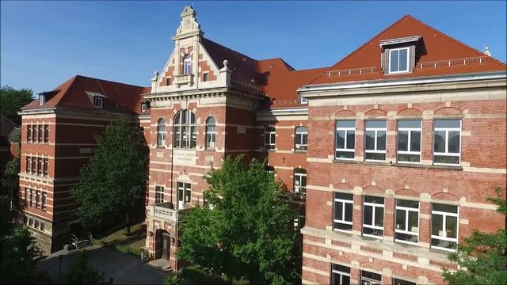 | 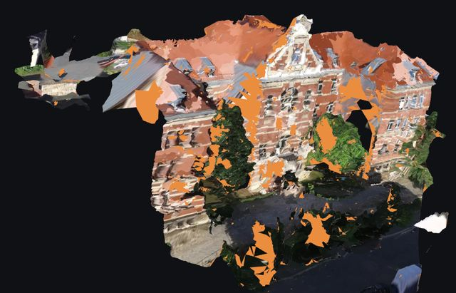 | 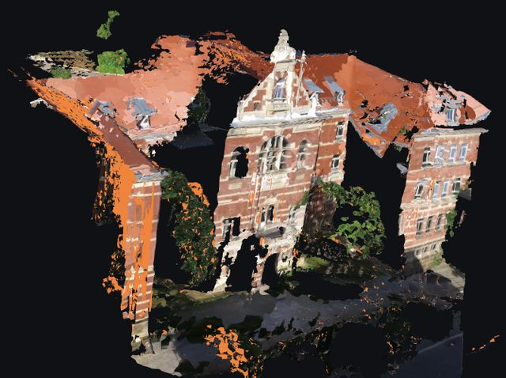 |

| Zabel hybrid, structure edges on a ghosted mesh | Hospital hybrid | Hospital, structure edges |
|---|---|---|
| 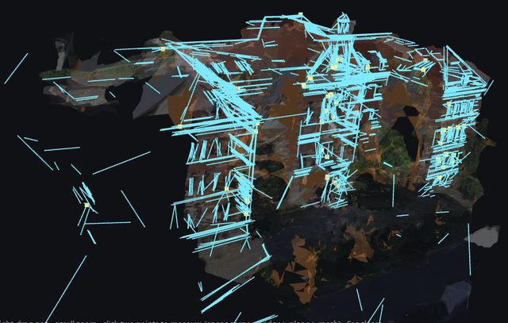 | 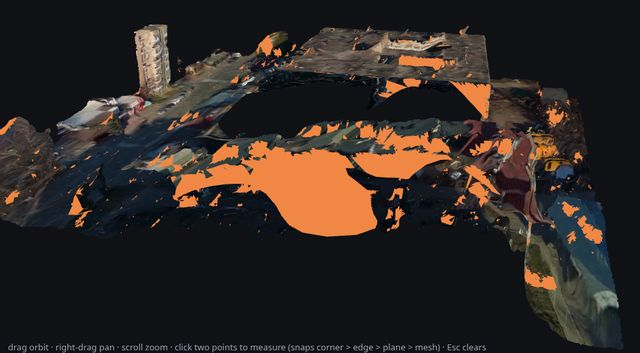 | 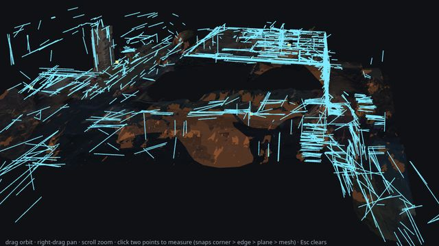 |

The orange patches are faces TextureMesh could not texture (OpenMVS's default empty colour).
On the hybrid meshes they are mostly mono-depth fill, such as the smooth sheet across the
hospital courtyard, which no view sees well enough to texture. The depthfusion mesh has fewer
of them and a sharper central facade, but bigger holes (behind the trees, the north wing).

## 4. Findings

What broke on building footage that the kitchen never exercised, in the order we hit it.

1. **A webm source crashes the preview.** The preview seeks to 48 evenly spaced times; on the
   Commons webm files the last seek lands near EOF, ffmpeg exits 0 without writing
   `frames_small/p0048.jpg`, and the missing file takes the whole run down. Worked around by
   trimming and re-encoding to H.264 mp4 (`ffmpeg -ss A -to B -c:v libx264 -crf 14 -an`). Not
   fixed in code.
2. **The preview ignores `--start` / `--end`.** It samples the whole file while the full stage
   honours the trim, so the preview can show parts of the clip the full stage never sees. The
   trim-and-re-encode above also covers this. Not fixed in code.
3. **`--known-height-m` does not unlock the metric features.** It rescales the mesh after
   texturing, so `units_per_m` is unknown during densify: the structure layer is skipped ("no
   metric scale") and hybrid densify has no voxel size. Only `--known-distance-json` scales the
   run early enough. For public footage there is no one to click two points, so we made the JSON
   from the SfM model itself (`kd_json.py`, not committed): measure a published dimension on a
   pass-1 mesh to get metres per mesh unit, then pick the farthest pair of long, low-error sparse
   tracks that share at least 4 images and write their exact pixel observations. Zabel: 50.18 m
   between two tracks (43.5 m per mesh unit, from the 10.96 m OSM wing face). Hospital: 110.0 m
   (from an estimated 3.3 m storey).
4. **`--known-distance-json` crashed the preview** ("only 0 observation(s) reference a
   registered frame"): the JSON names full-stage SfM frames, never preview frames. Fixed in
   `ce29b4a`: the preview skips a JSON that names none of its frames.
5. **Hybrid and depthfusion failed on every exterior** ("No block is touched in TSDF"). The
   default `--depth-max-m 4.0` is tuned for a room; from a drone every pixel is further away, so
   every pixel was cut. Fixed in `88a1ade`: when the median depth is past the cut-off, the
   cut-off grows to 1.5x the 95th-percentile depth, and the voxel to median depth / 1000. Room
   defaults are unchanged.
6. **Then the depthfusion worker segfaulted** (exit -11, no Python frame). Bisected on a saved
   voxel grid: open3d 0.20's CPU `extract_triangle_mesh` crashes above exactly 2^18 blocks
   (262,144 extract, 262,400 crash), an int32 index overflow. The hospital grid had 356k blocks.
   Fixed in `81f0e62`: past 2^18 blocks the TSDF is re-integrated once with a coarser voxel
   (blocks scale with 1/voxel^2). It costs one extra integration (14–33 s).
7. **LIMAP never finished on brick.** The brick facade gives ~2150 line segments per image
   (253k over 118 images, against ~380 per kitchen frame); LIMAP ran into the structure layer's
   600 s wait and was killed. Fixed in `b684728`: LIMAP keeps the 600 longest lines per image
   (388 s on Zabel).
8. **S4 ran hfbox out of memory.** S4 fuses an orthophoto per plane at 2 mm/px. A 60 m^2 facade
   is 15 MP, and 16 spawned workers each fusing one pushed the box to swap: load average 136,
   SSH dropped for ~20 min, and S4 was killed after its 300 s timeout but took 18 min to die.
   Fixed in `43bdbe3`: the orthophoto is capped at 1 MP per plane (kitchen planes are under
   0.3 MP, so they are unchanged) and S4 uses at most 8 workers. Zabel's S4 then takes 94 s and
   7 GB, and finds 23 rectangles instead of 11.
9. **Goddard: a wrong up vector nobody flags.** The NASA clip is mostly a vertical crane move,
   so the camera-based up estimate is off by 15–20°: roofs and facades come out tilted
   (screenshot below), yet the report's gravity residual is 0.1°. A check on the mesh's
   dominant plane normals would catch it.
10. **Auto-crop on non-orbit clips.** The GT campus flyover (no single subject) and the office
    slide (one facade) both registered every frame, but the building crop kept the lawn and a
    thin facade strip. The crop assumes an orbit around one subject.

| Goddard, pass 1 (tilted) | GT campus, pass 1 | Office, pass 1 |
|---|---|---|
| 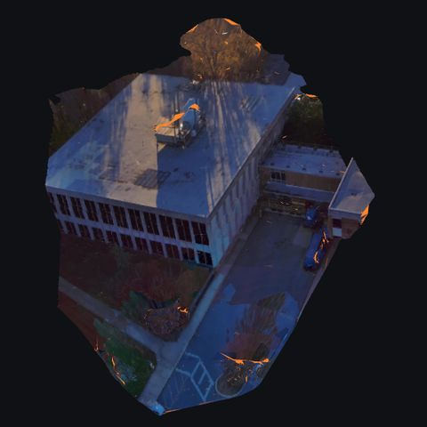 | 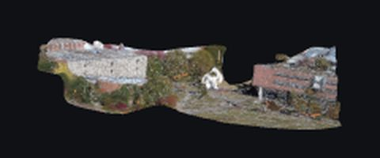 | 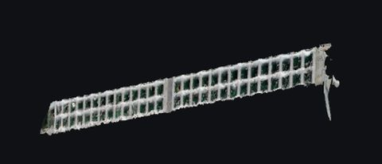 |

## 5. Verdict

- **Demo site: Zabel-Gymnasium, default hybrid** (`scene/zabel-gymnasium`, 1242 s end to end,
  preview after 43 s). It is the only candidate that looks like a building from every angle the
  clip covers, it is metric against a published footprint, and it has the most structure. Show
  the photo mesh and tape measure; show the structure edges only with "Show through mesh" off
  and at a distance, since the floating lines read as noise up close. Credit: *"Haus Schiller –
  Zabelgymnasium Gera – Drohnenflug", zabelgymnasium, CC BY 3.0, via Wikimedia Commons.*
- **Hospital is a backup, not a demo.** It is fast (699 s) and the tall block and the courtyard ring
  read well from above, but the facades are flat and poorly textured, the courtyard is a big
  untextured sheet, no planes survived, and its scale rests on an estimated storey height.
- **Depthfusion is not worth it for buildings yet.** Its mesh is ready 10 minutes sooner, but
  the structure layer makes the publish time the same, and every QA number is lower.
- **Footage matters more than tuning.** A half orbit at mid altitude around one building worked.
  Crane moves (Goddard), flyovers (GT) and facade slides (office) fail in ways the pipeline does
  not flag. For Georgia Tech, we would need to shoot our own orbit.

Packages on the laptop: `scene/zabel-gymnasium` (21 MB) and `scene/hospital-bg` (16 MB), both in
`work/viewer` (`?site=zabel-gymnasium`, `?site=hospital-bg`). hfbox keeps the videos
(`data/buildings/`, 936 MB), the pass-1 and pass-2 packages (`scene/b1/`, 156 MB) and the logs
(`logs/b1/`); all intermediate work dirs (12 GB at peak) have been deleted.

## 6. Not fixed, worth doing

- The preview's last seek on webm (§4.1) and its ignoring `--start` / `--end` (§4.2).
- `--known-height-m` applied early enough to unlock hybrid and structure (§4.3).
- An up-vector check against the mesh's dominant planes (§4.9) and an auto-crop that does not
  assume an orbit (§4.10).
- Structure thresholds scaled with the scene: PxwPlanar's lift and fuse (0 planes on the
  hospital) and S4's size limits and labels. Done in B2, §7.
- `structure._kill_group` waited 18 minutes for SIGKILLed workers stuck in memory reclaim; a
  bounded wait would keep one bad step from holding the run.

## 7. Structure layer on exteriors, B2

Session B2, 2026-09-26. §3 left the exterior structure layer unusable for snapping: a third of
the Zabel lines float in the air, no hospital plane survived, and S4 labels brickwork as drawers.
The cause is one thing: every structure tolerance is a kitchen constant in metres (1 cm RANSAC
and corner gaps, 2 cm cells, 4 cm–1.2 m rectangles), and a drone frame resolves 30–200× coarser.

### 7.1 What changed

- **One scale for every tolerance.** `pipeline/structure.py` measures the scene's ground sample
  distance (GSD, the median SfM point depth over the focal length, in metres per pixel) and sets
  `tol_scale = max(1, GSD / 2 mm)`. The kitchen resolves 0.9 mm/px, so it stays at 1 and keeps
  every constant. Zabel resolves 2.75 cm/px (×13.7) and the hospital 18 cm/px (×90.6).
  - **Plane lift** (`pxw_lift.py`): RANSAC and fuse tolerances, support cells, polygon
    simplification, edge and corner reach scale with it, areas with its square. The lift works in
    MoGe's metres, which are 3.6× off on the hospital, so it takes its GSD from MoGe's frames
    itself; above 1 the tolerances then come out in pixels at the scene's depth whatever MoGe's
    metric says. The published `rms_m` and `area_m2` are restated in the run's own metres.
  - **Line–plane fusion** (attach, margin, extension, corner, merge) and **the rectangle merge**
    (snap, dedupe) scale with it.
  - **LIMAP's own post-processing is left unscaled.** Scaling its collinear merge and minimum
    lengths merged facade lines into fewer, longer ones that drifted off the mesh: 28 % less line
    length within 14 cm of the mesh on Zabel and fewer corners (630 against 804).
    The fusion step recomputes the corners with the scaled tolerances anyway.
- **A mesh-distance filter** after the move to the scene frame: edges whose median distance
  to the published mesh (5 points along each) exceeds `max(5 cm, 5 px × GSD)`, corners farther
  than that, and planes whose polygon interior is mostly farther are dropped (14 cm on Zabel,
  0.9 m on the hospital). `MESH_MAX_PX` is the knob: 10 px on Zabel keeps 1172 lines (median
  0.10 m, p90 0.27 m) against 725 at 5 px.
- **S4 only fits rectangles on the planes that survived the filter**, and on a building
  (`tol_scale ≥ 5`) it runs with `--exterior`: rectangles must be window or door sized (sides
  0.4–4 m, aspect ≤ 4) and set back into the facade (the mesh's median height inside the
  rectangle is behind the plane). On Zabel the window panes sit 10–18 cm back and the brick
  patches LSD also frames stand 5–17 cm proud. Door-sized rectangles within 0.5 m of the plane's
  lowest point are `door`, the rest `window`; there are no drawers, panels or cabinet doors
  outdoors. S4's mesh, crease and relief tolerances scale too.
- Merging coplanar facade planes needed no extra step: with scaled fuse tolerances the lift's own
  cluster fusion merges them (Zabel: median plane 0.08 m² before, 32 m² after). Plane-triplet
  corners come from the scaled fusion and the lift, then pass the same mesh filter.

### 7.2 Method

Both buildings were re-run from scratch with the old code (`--stages full`, same videos and
known-distance JSONs as §2), keeping the work dirs, then re-run on the same work dirs with the new
code. SfM, MVS and the mesh resume, so each site's before and after share one mesh and one set of
LIMAP lines. The metrics follow §3: every edge's midpoint distance to the published mesh, corner
distance, the planes' published `rms_m` and the median distance of each plane's polygon interior
to the mesh. The kitchen check re-runs `StructureJob.finish` (fusion, filter, S4, merge) on the
kitchen pipeline run `s2-e2e-structure` (P2 row 2p) from its saved LIMAP lines and lifted planes,
once with the old code and once with the new, and scores both against the 20-point GT with S1's
scorer.

### 7.3 Results

| | Zabel before | Zabel after | Hospital before | Hospital after |
|---|---|---|---|---|
| GSD, tol_scale, mesh cut | | 2.75 cm/px, ×13.7, 0.14 m | | 18.1 cm/px, ×90.6, 0.91 m |
| LIMAP lines | 2368 | 725 | 1752 | 970 |
| Line midpoint to mesh, median / p90 | 0.28 / 1.34 m | **0.057 / 0.152 m** | 0.69 / 35.8 m | **0.29 / 0.74 m** |
| Lines within 25 cm | 46 % | **95 %** | 26 % | 45 % |
| Creases | 1 | 4 | 0 | 0 |
| Corners, median / p90 to mesh | 78, 0.33 / 1.20 m | **804, 0.057 / 0.117 m** | 5, 0.60 / 20.2 m | **355, 0.40 / 0.78 m** |
| Planes | 195 | 23 | **0** | **8** |
| Plane fit RMS, median / p90 | 9.5 / 11.4 mm (MoGe m) | 63 / 141 mm | – | 256 / 432 mm |
| Plane area, total (median) | 105 m² (0.08 m²) | 950 m² (32 m²) | – | 10 354 m² (504 m²) |
| Plane polygon to mesh, median / p90 | 0.32 / 1.14 m | **0.08 / 0.13 m** | – | 0.45 / 0.75 m |
| S4 objects | 67: 27 drawer, 29 panel, 11 cabinet door | **19 window** | 0 | 0 |
| Dropped by the mesh filter | | 1660 edges, 1576 corners, 118 planes | | 785 edges, 293 corners, 32 planes |

The before columns are this session's re-runs; they reproduce §3 (Zabel 0.28 m, 46 %; hospital
0.69 m). The old planes' 9.5 mm RMS is in MoGe's metres and only looks good: a 1 cm RANSAC band
around a 30 m facade keeps 8 cm² fragments. The new RMS is honest for a mesh-scale surface
(2.3 px on Zabel, 1.4 px on the hospital).

**Kitchen regression** (`s2-e2e-structure`, `tol_scale` 1.0 at 0.88 mm/px):

| | Old code | New code |
|---|---|---|
| R6 snap, aim miss (median / p90) | 3.6 / 11.4 mm | 3.6 / 11.4 mm |
| R6 snap, perfect aim | 3.2 / 7.9 mm | 3.2 / 7.9 mm |
| Tape measurement (aim miss), its error | 1.3 mm, 0.8 mm | 1.3 mm, 0.8 mm |
| Lines, median / p90 to mesh | 367, 2.7 / 14.6 mm | 360, 2.6 / 13.4 mm |
| Creases, p90 to mesh | 42, 44 mm | 38, 20 mm |
| Corners, median / p90 | 481, 3.5 / 17.2 mm | 468, 3.3 / 15.2 mm |
| Planes, polygon to mesh median / p90 | 85, 14 / 96 mm | 72, 10 / 34 mm |
| Plane RMS median | 4.9 mm (MoGe m) | 3.4 mm (scene m, same fit) |
| S4 objects | 16 (10 cabinet door, 3 drawer, 3 panel) | the same 16 |

The kitchen snap and measurement scores are unchanged to the 0.1 mm. The 5 cm floor only drops
kitchen structure more than 5 cm off the mesh (11 edges, 13 corners, 13 planes).

**Timing** (hfbox, 16 cores). LIMAP is unchanged (Zabel 397 s, hospital 185 s, in the
background). The plane lift takes the same time (Zabel 38 s, hospital 20 s). Fusion is a little
slower with more corners (Zabel 80 → 89 s, hospital 45 → 38–40 s, both in the background). After
the mesh, the time the publish waits for goes down on Zabel, because S4 now fuses 7 facades
instead of 100 vertical fragments: filter plus S4 60 s, against 89 s for S4 before (hospital
about 1 s either way). A fresh Zabel run should therefore publish about 30 s sooner than the
1193 s baseline. These numbers come from the resumed runs; the steps are the same as in a fresh
run.

| Zabel, before and after | Hospital, before and after |
|---|---|
| 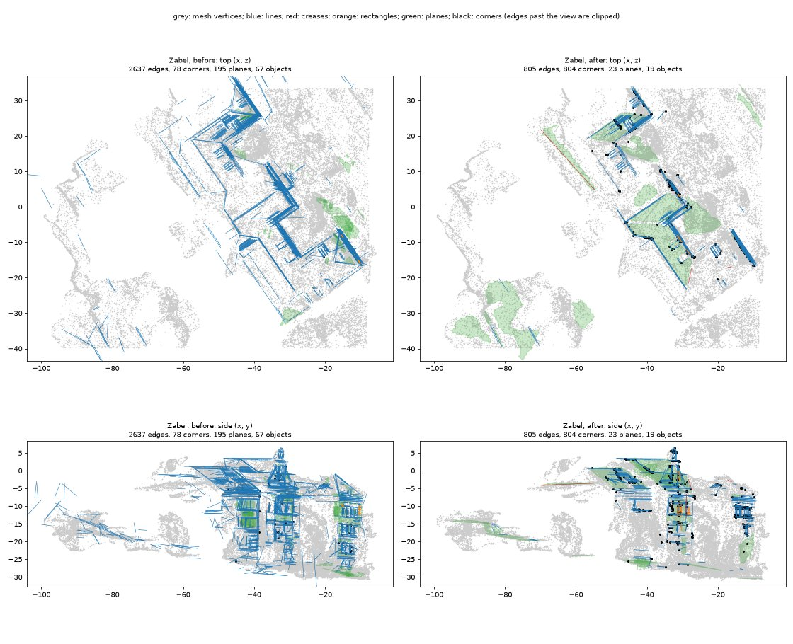 | 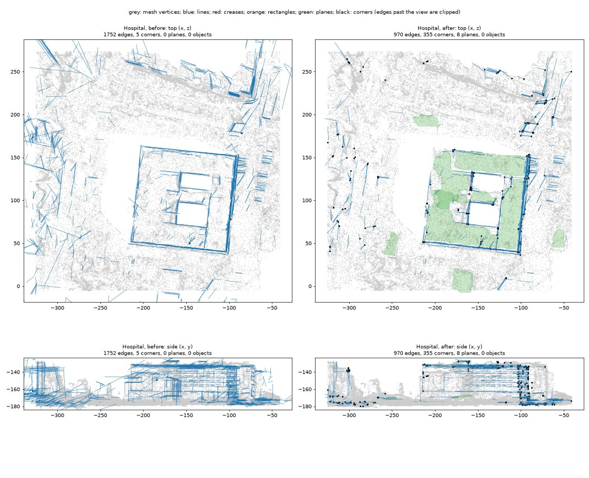 |

Packages: `scene/zabel-gymnasium` and `scene/hospital-bg` are now at revision 3 (the B2 mesh plus
`structure.r3.json`), published with `publish_revision` and passing `validate_package`. Revision
2 is kept, and `work/viewer` points at revision 3. The full stage has no path to re-publish over
its own full revision: re-run on a package whose current revision is `full`, it publishes
revision 1 unaligned. So the B2 package was built in its own directory and published into the
laptop package as revision 3 (`aligned_to_preview: false`, the B2 run's own frame).
hfbox keeps the before and after packages (`scene/b2/`, 55 MB) and the logs (`logs/b2/`); the
work dirs have been deleted.

### 7.4 Still weak

- **Recall on Zabel.** The 5 px cut keeps 31 % of the lines (2400 m of 8070 m), and it removes
  real facade lines where the 200k-triangle mesh is itself 15–30 cm off (the long front, see the
  figure). A finer mesh or RefineMesh would let the cut tighten without losing them. Until then,
  10 px is the other choice (1172 lines, 86 % within 25 cm).
- **The hospital is usable only at metre scale.** At 18 cm/px the lines sit 0.29 m (median) off
  the mesh and the corners 0.40 m. The planes are the roof and ground patches; no facade plane
  survives the filter, so S4 finds nothing. The scale also still rests on an estimated storey
  height.
- **S4 windows are about three quarters right.** 14 of Zabel's 19 are window panes or sashes on
  the main facade. The other five are brick: four brick infill panels set a few centimetres into
  the rendered gable, which the setback test cannot tell from glass, and one 2.2 × 2.4 m bay
  between two windows. No whole
  window frame or door is found: LSD frames the panes, not the stone surrounds.
- LIMAP itself is unchanged: it still takes 6.5 minutes on Zabel and triangulates many
  narrow-baseline lines that only the filter removes.
