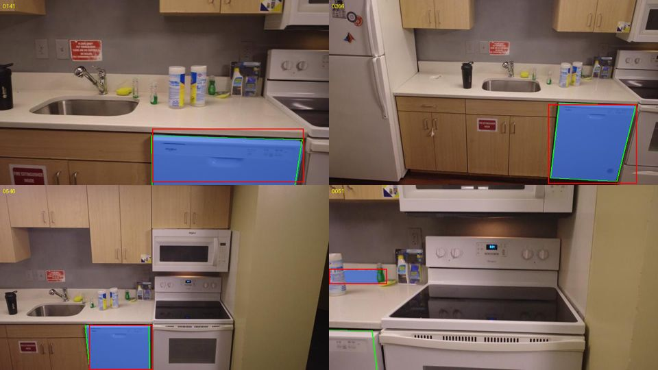
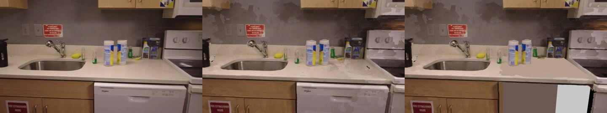
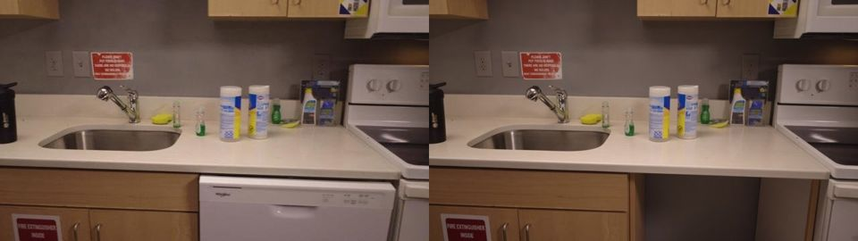
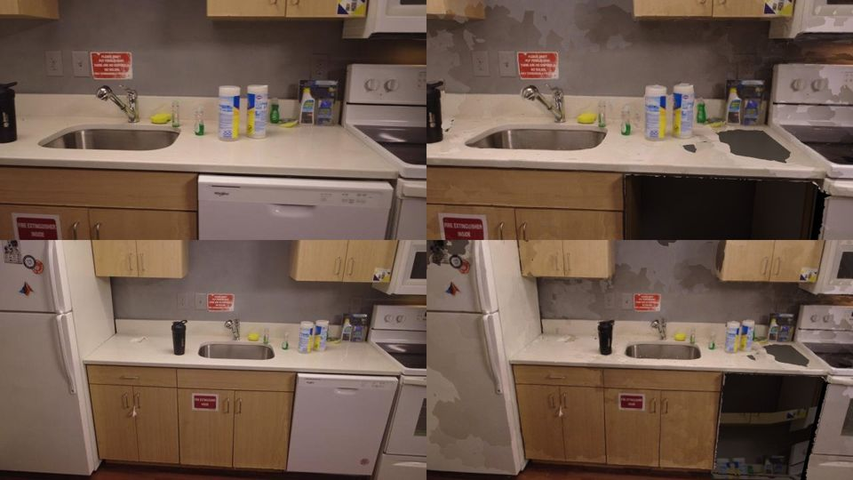

# R1: segment the scene mesh into parts, remove one, measure the cavity

Research session R1, 2026-09-26. The question: how do we break `mesh.r<rev>.glb` into parts so the
user can remove an object (the dishwasher in `scene/kitchen`), leave a clean cavity (floor, back
wall, side faces, counter underside), read its W × H × D, and drop a replacement into it? The
user's starting idea was to run the frames through a VLM, label image regions as components, and
then associate mesh regions with the components. This note refines that idea, backs it with probes
on the kitchen, and proposes a pipeline stage, a schema, and an experiment plan.

All probes ran on the laptop CPU; nothing ran on hfbox. Scripts and outputs are in the session
scratchpad and are not committed. Spend: one xAI image edit, $0.07. Groq: 32 vision calls on the
free tier.

## 0. Summary

- **Recommendation: geometry proposes, the VLM names, SAM draws the pixels, the faces vote, and
  the planes cut.**
  - The structure layer already has the dishwasher's front rectangle (`o32`) and every edge and
    plane that bounds it.
  - A VLM names the components and gives rough boxes. SAM 2 turns each box into a pixel mask.
  - Multi-view voting assigns mesh faces to components.
  - The structure planes, not the mesh, define the cut box, the cavity walls and the W × H × D.
- **The cavity is never observed.** Nobody filmed the floor, back wall or cabinet side behind the
  dishwasher. Its geometry is a model: the surrounding planes, extended into the gap. Its texture is
  either a flat colour or a generated guess. The schema and the UI must say so.
- **The probes worked end to end on CPU:**
  - The VLM named the dishwasher in 12 of 12 frames that show it, with 0 false positives in 4
    frames that don't.
  - SAM 2.1-tiny turned the VLM boxes into masks with a median IoU of 0.97.
  - Voting put 99 % of the labelled faces inside the dishwasher volume (99.8 % within 1 cm).
  - The planes gave a cavity of 0.434 × 0.581 × 0.458 m at the altitude scale, which is about
    1.47× too small, so roughly 0.64 × 0.85 × 0.67 m.
  - The cut, the fill and the render took seconds.
  - Table in §3.
- **Practical:**
  - plane-extension fill with flat colour;
  - a texture patch from the S4 orthophotos;
  - one generative edit of a frontal frame, projected onto the cavity.
- **Research-grade** for a mesh on ROCm:
  - every 3D-inpainting method (SPIn-NeRF, InFusion, GScream, AuraFusion360, Gaussian Grouping and
    others): they are NeRF or 3DGS methods, and the 3DGS ones need a CUDA rasterizer;
  - MaskClustering-style full-scene instance segmentation.
- **Needed from the user:** a tape measurement of the dishwasher opening (§5.3). Until then, every
  absolute number here carries the kitchen's scale error.

## 1. What we have to work with

- **Mesh:** `scene/kitchen/mesh.r1.glb`.
  - 199,997 faces, one 4096 atlas, not watertight.
  - UV seams duplicate vertices, so face connectivity needs a vertex weld first.
- **Cameras:** 165 posed frames (`cameras.r1.json`, OpenCV R/t) and 640 px thumbs.
- **Structure layer:** `structure.r1.json` has 61 planes, 671 edges, 594 corners and 40 objects.
  Around the dishwasher it has:
  - `o32` (label `appliance`): the dishwasher front, 0.416 × 0.527 m on the relief plane `p2r0`;
  - LIMAP edges on both of its sides: `e117`/`e83` on the sink-cabinet end at z ≈ −0.241, and
    `e9`/`e300` on the range side at z ≈ −0.675;
  - the long line `e16`/`e418` under the counter lip (y ≈ −0.585);
  - the floor strip `p7`, the backsplash wall `p4`, the door plane `p2` and the countertop `p5`.
  - The S4 labels are a size heuristic: `o21`, the sink base cabinet block, is also labelled
    `appliance`.
- **Layout:** fridge | sink base cabinets | dishwasher | freestanding range. The dishwasher's right
  neighbour is the range's side panel, not a cabinet. Its left neighbour is the sink cabinet's end
  panel. Neither face is visible in any frame.
- **Error budget from the structure bench** (`p2-structure-bench.md` §5):
  - tape measurements between structure corners are good to 1.3 mm;
  - the plane RMS is 2–5 mm;
  - textureless fronts (dishwasher, microwave) can sit 1–2 cm off;
  - the scale is the caption altitude: `scale_residual_m` 0.05, and about 31 % small (the
    dishwasher front reads 414 mm).

## 2. Ranked approaches

Scored on quality, whether we can build it on our stack in a few hours, and ROCm compatibility.
"✓ probe" means measured on the kitchen in §3.

| # | Approach | Quality (kitchen) | Build in a few hours? | ROCm / CPU | Verdict |
|---|---|---|---|---|---|
| 1 | **Hybrid:** S4 rectangles and VLM boxes as prompts, the VLM names them, SAM 2 box → mask, multi-view face voting, plane-bounded cut and fill | ✓ probe: 12/12 detections, mask IoU 0.97, face purity 0.99 (0.998 within 1 cm), cavity from planes | yes: every piece exists; about 300 lines of glue | SAM 2 is pure PyTorch (its CUDA connected-components kernel is optional, [README](https://github.com/facebookresearch/sam2)); voting and cutting are numpy | **Recommended** |
| 2 | **Pure geometry, user pick:** the user taps an S4 rectangle (or a mesh point), and the stage builds the plane-bounded box around it | measurement as good as #1, because #1 also measures from the planes; the cut is cruder (toe-kick, handles, blobs). No names, and it fails where S4 has no rectangle (the range, AC units, gutters) | yes, the fastest | CPU | **Ship first as the fallback; #1 adds names and clean faces** |
| 3 | **VLM-first, the user's idea:** VLM boxes for all components in every keyframe, then SAM, voting, and merging instances across frames | fine for unique objects (dishwasher, fridge, range); weak for repeated cabinet doors, which need 3D association (MaskClustering-style) | about a day for robust instance merging | CPU/GPU | Fold its naming into #1; get instances from S4 plus 3D overlap |
| 4 | **SAM 3 text prompts** ("dishwasher") with its built-in video tracker ([arXiv 2511.16719](https://arxiv.org/abs/2511.16719); `Sam3Model` in [transformers](https://huggingface.co/docs/transformers/main/en/model_doc/sam3)) | promises detection, masks and consistent IDs in one model. Not measured: `facebook/sam3` returned **403 (gated)** for our HF token | yes, once access is granted | pure PyTorch via transformers | Request access, then A/B it against the #1 mask source |
| 5 | **Grounded-SAM-2** (Grounding DINO + SAM 2, [repo](https://github.com/IDEA-Research/Grounded-SAM-2)), fully local | ✓ probe: box IoU 0.93–0.97 where right, but **3 false positives in 4 frames without a dishwasher** (score 0.92 in 0706, where only the fridge and cabinets are in view), and it missed 2 of 12 | yes | GDINO's deformable-attention CUDA op falls back to PyTorch ([source](https://github.com/IDEA-Research/GroundingDINO/blob/main/groundingdino/models/GroundingDINO/ms_deform_attn.py)) | Offline fallback when there is no VLM; gate it with 3D consistency |
| 6 | **Zero-shot 3D instance segmentation:** MaskClustering ([2401.07745](https://arxiv.org/abs/2401.07745)), Open3DIS ([2312.10671](https://arxiv.org/abs/2312.10671)), SAI3D ([2312.11557](https://arxiv.org/abs/2312.11557)), OVIR-3D ([repo](https://github.com/shiyoung77/OVIR-3D)), SAMPro3D ([2311.17707](https://arxiv.org/abs/2311.17707)), Open-YOLO 3D ([2406.02548](https://arxiv.org/abs/2406.02548)) | ScanNet-grade instance maps for every object. More than we need for a handful of appliances. Point-cloud and RGB-D based; we can render depth from the mesh | no: days to adapt | mixed. OpenMask3D/Open3DIS lean on Mask3D and MinkowskiEngine (CUDA); MaskClustering's clustering is plain Python, but its mask source (CropFormer/detectron2) is CUDA-heavy | Borrow MaskClustering's view-consensus merge rule for #1's instance merging; skip the rest |
| 7 | **Mesh part segmentation:** SAMesh ([2408.13679](https://arxiv.org/abs/2408.13679)), MeshSegmenter ([2407.13675](https://arxiv.org/abs/2407.13675)), PartField ([2504.11451](https://arxiv.org/abs/2504.11451)), SAMPart3D ([2411.07184](https://arxiv.org/abs/2411.07184)) | built for single objects. They render the mesh (normals, SDF), not the real photos, so on a room scan they would split along geometry, not along appliances | – | PartField and SAMPart3D pull custom point-op kernels | No; wrong granularity |
| 8 | **Radiance-field segmentation:** LERF, LangSplat, Gaussian Grouping, SAGA, Feature-3DGS | good on 3DGS scenes | no | the 3DGS ones need `diff-gaussian-rasterization` (CUDA); we have no splats (plan rev 3) | No |

For the cavity:

| # | Fill approach | Quality | Practical? |
|---|---|---|---|
| A | **Plane-extension quads** (floor, back, left, right, top), clipped to the cavity box, flat median colour sampled next to each plane | geometrically clean and measurable; looks like a grey box (§3.4) | **yes**: trimesh, about 5 s |
| B | A + **texture from the S4 plane orthophotos** (S4 already fuses frames into seam-free per-plane orthophotos, `p2-structure-bench.md` row 8): tile a patch of the backsplash wall onto the back quad and of the floor strip onto the floor quad | plausible wall and floor texture; the cabinet side panel and range side still need a flat colour | yes: reuses S4 output; not probed |
| C | A + **one generative edit** of a frontal keyframe (Grok Imagine `images/edits`, $0.07; or LaMa on CPU, [repo](https://github.com/advimman/lama)), projected onto the quads | ✓ probe: the edit is convincing from the key view, and the rest of the photo changes by only 3.3/255 on average. From other views the floor, which the key view never saw, picked up counter texels (§3.5). It needs 2–3 key views, including a low one, a coverage mask and a flat fallback | yes, with a coverage mask; label it "synthesized" |
| D | Multi-view-consistent inpainting: MVInpainter ([repo](https://github.com/ewrfcas/MVInpainter)), NeRFiller's grid trick ([repo](https://github.com/ethanweber/nerfiller)), Instant3dit ([repo](https://github.com/amirbarda/Instant3dit)) | the right idea for texture consistency | research-grade: days, and CUDA-first repos |
| E | 3D object-removal inpainting: SPIn-NeRF ([2211.12254](https://arxiv.org/abs/2211.12254)), InFusion ([2404.11613](https://arxiv.org/abs/2404.11613)), GScream ([repo](https://github.com/W-Ted/GScream)), AuraFusion360 ([repo](https://github.com/kkennethwu/AuraFusion360_official)), Gaussian Grouping removal ([2312.00732](https://arxiv.org/abs/2312.00732)), GaussianEditor ([repo](https://github.com/buaacyw/GaussianEditor)), Inpaint360GS ([repo](https://github.com/dfki-av/Inpaint360GS)), InNeRF360 ([repo](https://github.com/IVRL/InNeRF360)), IMFine ([repo](https://github.com/zhshi0816/IMFine)) | all NeRF or 3DGS. They inpaint appearance, and some geometry, of radiance fields. None of them outputs a measurable planar cavity | no: wrong representation, and the 3DGS ones need a CUDA rasterizer. Use them for ideas only (reference-guided fill) |

Mesh cutting: [manifold3d](https://github.com/elalish/manifold) needs manifold input and errors
otherwise. [trimesh's booleans](https://trimesh.org/trimesh.boolean.html) check the volume. Our
scan mesh is not watertight. So **don't use booleans**: delete faces by label and box
(`Trimesh.update_faces`), then add the cavity as separate geometry. Nothing needs to be stitched,
because the cavity quads meet the cut boundary at the bounding planes. PyMeshLab's
`meshing_close_holes` and PyMeshFix fill holes generically and make smooth blobs, which is wrong
for a rectilinear opening. Keep them only for small leftover holes.

## 3. Probes on `scene/kitchen`

**Ground truth used by the probes.** The structure object `o32` (the dishwasher front) is projected
into every thumb as a polygon. On 4 frames it lands on the dishwasher's edges to within a few
pixels (§3.2 figure). This is a geometric proxy, not a hand label: the structure bench puts
textureless fronts 1–2 cm off, which is about 3–6 px at these distances. §5 P1 replaces it with
hand labels.

The dishwasher is visible in 129 of 165 frames. The VLM and single-image SAM probes used 16 frames:
12 with it in view, spread across the orbit, including 2 partial views (0051, 0606), and 4 without
it.

### 3.1 Can a VLM name and box the dishwasher? (Groq `qwen/qwen3.8-27b`, via `server.llm.extract`)

Prompt: list every appliance, fixture and cabinet unit, each with a label and an `[x0,y0,x1,y1]`
box in 0..1000.

| Run | Detected (12 in view) | False positives (4 without) | Box IoU vs GT, median / mean | Latency per call |
|---|---|---|---|---|
| 640 × 360 thumb as is | 12 | 0 | **0.00** / 0.05 if the boxes are read per axis. Read as normalised by the long side: 0.78 / 0.58. Most calls normalised by the long side, one (0171) per axis, and one (0486) boxed the wrong object | 1.4–51 s (free-tier queueing) |
| **Thumb padded to 640 × 640** (black band below) | **12** | **0** | **0.80 / 0.73**; 10 of 12 ≥ 0.6. Misses: 0051, where the dishwasher is a corner sliver and the VLM boxed a bottle (IoU 0), and 0606, a 15 px sliver (0.42) | 1.4–37 s |

- **Findings:**
  - The VLM is reliable at *which* object and *whether* it is present.
  - Its boxes are prompt-grade, not mask-grade.
  - Its coordinate convention is unstable on non-square images. Pad frames to square before the
    call; this is a one-line fix.
  - It also listed fridge, range, microwave, sink, faucet, countertop, and base and wall cabinets
    in each frame. It labels the cabinets but doesn't tell identical doors apart.

### 3.2 Box → mask on CPU (SAM 2.1 hiera-tiny, Grounding DINO tiny; transformers 5.17, torch 2.14 CPU, 8 threads)

| Prompt | Mask IoU vs GT polygon, median / mean (12 frames) | Notes |
|---|---|---|
| GT box (oracle) | 0.971 / 0.955 | SAM's ceiling here. Part of the gap is GT polygon error |
| **VLM box** | **0.968 / 0.827** | the mean is pulled down by the 2 sliver frames (0.00, 0.39) |
| Grounding DINO box, "a dishwasher." | 0.971 / 0.806 | missed 0051 and 0606; **3 of 4 absent frames gave a confident false box** (0706, only the fridge and cabinets in view: 0.92) |
| **SAM 2 video propagation** from one VLM box (frame 0306) over 40 consecutive thumbs (0306–0501) | **0.982 / 0.981**, min 0.957, 40/40 ≥ 0.9 | consistent IDs across frames for free |

- **CPU cost:**
  - SAM 2.1-tiny: 5.2–5.7 s per image, box mode.
  - Grounding DINO tiny: about 5.4 s per image.
  - Video propagation: 12.7 s per frame. That is fine for 12–24 keyframes and too slow for all 165
    frames on the laptop.
  - The GPU would be much faster, but ROCm is **unmeasured**: hfbox was busy.



### 3.3 Lifting masks to faces (multi-view voting)

- **Method:**
  - For each of the 12 keyframes, project face centroids and vertices and build a splat z-buffer
    (a 3 × 3 min-filter). A face counts as visible if it is within 1 % + 5 mm of the buffer.
  - Tally the views that see each face and the views whose mask covers it.
  - Label = seen ≥ 2 and mask share ≥ 50 %.
  - Keep the largest connected component over the **vertex-welded** mesh. Without the weld the
    atlas seams split the dishwasher into 190-face islands.
- **Reference:** faces inside the dishwasher volume. That is `o32`'s z/y extent plus the 6 cm
  toe-kick below it, from 6 cm behind the front to 3 cm in front.

| Masks | Labelled faces | Purity (count / area) | Purity with a 1 cm tolerance | Recall | Time |
|---|---|---|---|---|---|
| GT polygons (oracle) | 4074 | 0.982 / 0.970 | 0.998 | 0.873 | 3 s |
| **VLM → SAM 2 masks** | **4103** | **0.989 / 0.975** | **0.998** | **0.886** | **2.3 s** |

- The two sliver-frame failures were outvoted: real masks score like the oracle.
- The remaining impurity is boundary bleed of 1 cm or less at the toe-kick and neighbour edges. The
  plane-bounded cut box removes it by construction.
- The recall gap is faces inside the volume that no mask covered: interior blobs and the toe-kick.
  The box cut takes those too (§3.4).
- `pipeline/preview.py`'s numpy rasterizer already does proper z-buffered sampling. Returning a
  face-id buffer from it would replace the splat buffer without adding a dependency.

### 3.4 Plane-bounded cavity, cut and flat fill

The cavity box comes from the structure layer alone, with gravity and Manhattan fixed:

| Side | Source | Value (altitude-scale m) |
|---|---|---|
| floor | `p7` polygon mean y (the fitted plane tilts 4.3°) | y = −1.166 |
| top (counter underside) | line `e16`/`e418` under the counter lip | y = −0.585 |
| left (sink-cabinet end) | edges `e117`, `e83`, `o21e1` | z = −0.241 |
| right (range side) | edges `e9`, `e300` | z = −0.675 |
| back (wall) | `p4` polygon mean x (the fitted plane tilts 6.1°), extended down behind the base run | x = −1.571 |
| front (door plane) | `p2` at the cavity centre | x = −1.113 |

**W 0.434 × H 0.581 × D 0.458** at the altitude scale. At the nominal 1.47× that is about
0.64 × 0.85 × 0.67 m (25.1 × 33.6 × 26.5 in). A standard dishwasher opening is 24 × 34.5 × 24 in.
The scale-free ratios are H/W 1.34 against a standard 1.44, and D/W 1.06 against about 1.0. We
can't say which number is off until we have the tape (§5.3).

**Sensitivity to the plane fits:**
- Extending the fitted `p4` with its 6° tilt instead of vertical gives D 0.357–0.419 instead of
  0.458, **up to 22 % less**.
- The tilted floor changes H by 1–4.5 cm across the depth.
- Unobserved surfaces must therefore be extrapolated only from gravity-snapped planes, and D should
  be reported as a model, not a measurement.

**Cut:** faces inside the box, or voted faces within the counter-lip band. That removed 5443 faces,
3953 of them voted. **The first cut punched a hole in the countertop.** The mesh's counter sags
4–9 cm into the box near the wall (x ≈ −1.49, y ≈ −0.63, random normals): it is a blob behind the
bottles, not the real surface at y = −0.563. The fix used here re-caps the footprint with the
counter plane `p5`. In the pipeline, protect faces that other components claim and re-cap every
neighbour plane that the cut exposes.



Note the flat counter re-cap in the right panel: it hides the blob, which also contained the bases
of the bottles.

### 3.5 Generative texture for the cavity (Grok Imagine `images/edits`, `grok-imagine-image-2.0`, one call, $0.07, 9.5 s)

- **The edit.**
  - Prompt: frame 0141, "remove the dishwasher… show the empty opening: floor, bare back wall, the
    sink cabinet's side panel, the range side, the counter underside; keep everything else".
  - Result: a convincing empty opening, returned at 1280 × 720.
  - Outside the dishwasher (the mask dilated by 12 px) the photo changed by only 3.3/255 on
    average.
- **The projection.** The edit was projected onto the five cavity quads, subdivided 24 × 24 so the
  affine UVs stay close to perspective-correct.
  - From the key view it matches.
  - From 0366, the floor quad, which 0141 never saw, sampled counter and bottle texels.
- **So:** use 2–3 key views, including one low enough to see the floor, project each texel only
  from views that saw it, and fall back to the flat colour.





## 4. Proposed pipeline stage: `pipeline/parts.py` (full stage, after the structure layer)

- **When:** after `structure.r<rev>.json` is written; skipped if the structure layer is missing
  (the fallback is mesh-only voting and no cavity). Precompute every removable component offline,
  so the app only toggles nodes and no request-time compute is needed. This fits the static
  scene-package model.
- **Inputs:** `mesh.r<rev>.glb`, `collision.r<rev>.glb`, `cameras.r<rev>.json`, frames or thumbs,
  `structure.r<rev>.json`.
- **Outputs:** `parts.r<rev>.json`, the mesh split into per-component nodes, `cavity.r<rev>.glb`,
  and a `scene.json` `parts` entry (§5).

Steps:

1. **Keyframes (CPU, < 1 s).** Pick 12–24 frames by greedy face coverage from the visibility pass,
   plus, for each S4 object, its most frontal view.
2. **Name (Groq vision, cached per frame hash).**
   - Send square-padded keyframes and get JSON `{label, box}` items (§3.1).
   - Rate limits: qwen3.8-27b allows 200K tokens/day per key, with rotation. Fall back to Grok
     vision only if Groq is exhausted.
   - About 1–5 min with free-tier queueing.
3. **Proposals.** Match VLM boxes to projected S4 rectangles by IoU:
   - A match gives the rectangle a name. This fixes the size-heuristic labels, e.g. `o21` is not an
     appliance.
   - An unmatched VLM box becomes a non-planar component, such as the range, a microwave or an AC
     unit.
4. **Masks.** SAM 2.1 box → mask per keyframe and proposal (5 s per image on CPU, 16–24 images in
   2 min). Optional SAM 2 video propagation on the GPU for more views.
5. **Lift.**
   - Render face-id buffers (extend `pipeline/preview.render`).
   - Vote per face, then give each face the argmax component with ≥ 2 views and ≥ 50 % agreement.
   - Merge instances across frames by 3D face-set IoU (MaskClustering's view-consensus rule,
     simplified).
   - Keep connected components over the welded mesh.
   - Optionally smooth with a graph cut on welded face adjacency ([PyMaxflow](https://github.com/pmneila/PyMaxflow)).
   - About 5 s.
6. **Bound.** For each removable component (appliance classes; cabinets as boxes):
   - search the structure layer for the floor (a horizontal plane below), the top (the counter lip
     line or underside plane), the left and right sides (the nearest vertical edges or planes of the
     neighbours along the run axis), the back (the wall plane behind) and the front (the door
     plane);
   - snap them to gravity and Manhattan;
   - output the box, W/H/D with σ, and per-face `observed` flags. Under 1 s.
7. **Cut.**
   - The component's faces are its voted faces inside the box (+2 cm), plus any faces inside the box
     that no other component claims.
   - Protect faces claimed by neighbours.
   - Re-cap any neighbour plane the cut exposes (the counter, §3.4).
   - Move the component's faces into their own node. Split the collision mesh the same way, by
     nearest-face label transfer.
8. **Fill.**
   - Cavity geometry: the box's inner faces as subdivided quads.
   - Texture, in order: flat median colour (default); S4 orthophoto tile (plane surfaces); a
     projected generative edit (optional, offline, marked `synthesized`).
9. **Publish.**
   - Write `parts.r<rev>.json`, the split `mesh.r<rev>.glb`, `cavity.r<rev>.glb` and the
     `scene.json` entry. Revision files go first and `scene.json` last, as today.
   - `validate_package` checks node names, ids and frames.

**Expected runtime on the kitchen:**
- 3–6 min on the laptop CPU, dominated by the Groq queue and SAM on CPU;
- about 1–3 min with SAM on the hfbox GPU (estimate).
- Run it in the background like the structure layer, with a timeout, so it never blocks the
  publish.

**App flow:**
1. The user taps the dishwasher, and the app hides node `part/dw1` and its collider.
2. The app shows `cavity/dw1` with W × H × D ± σ. Depth carries an "estimated (not seen)" badge.
3. "Find a replacement that fits" sends the cavity as the `measurement` of `/parts/search`; this is
   the existing P4 flow.
4. The part snaps to the cavity's `insert` pose.
5. Real-estate staging tools label edited photos ("Digitally Enhanced",
   [REimagineHome](https://www.reimaginehome.ai/declutter)), and we should label a synthesized fill
   the same way.

## 5. Schema proposal (backward compatible)

- **Option 1: a separate GLB per component plus a cavity GLB.**
  - Easy toggling.
  - But each GLB either duplicates the 4096 atlas or needs a shared external image, and the main
    mesh must still lose those faces.
- **Option 2: a face-id attribute (a custom `_COMPONENT` vertex attribute) plus a component
  table.**
  - Old readers ignore it.
  - But Unity must split submeshes at runtime, and per-face ids force vertex duplication.
- **Option 3, proposed: split nodes inside the same `mesh.r<rev>.glb`.**
  - The root has a child `base` plus one child `part/<id>` per component.
  - Every node shares the one material and atlas, so the image is embedded once.
  - An old app that instantiates the glTF scene renders exactly the same picture.
  - Removal is `SetActive(false)` on one GameObject.
  - Cavity geometry lives in `cavity.r<rev>.glb`, one node `cavity/<id>` each, hidden until
    removal.
  - `parts.r<rev>.json` holds the table.
  - **P2 must check** that glTFast loads the multi-node GLB and that nothing assumes a single
    MeshFilter.
  - Until then the pipeline can write the split mesh under a new name (`mesh.parts.r<rev>.glb`) and
    leave `mesh.r<rev>.glb` untouched.

`scene.json` gains an optional entry. Old readers ignore unknown keys.

```json
"parts": {"file": "parts.r2.json", "schema": "airtools.parts/1", "components": 7,
          "mesh": "mesh.parts.r2.glb", "cavities": "cavity.r2.glb"}
```

`parts.r<rev>.json`, in the same frame as the mesh and structure (glTF, metres, +Y up):

```jsonc
{
  "schema": "airtools.parts/1", "frame": "scene",
  "method": "s4+vlm+sam2+vote", "cost": {"runtime_s": 180},
  "components": [{
    "id": "dw1",
    "label": "dishwasher",               // VLM name
    "class": "appliance",                // appliance | cabinet | fixture | window | ... (Matterport-style: freestanding vs built-in matters)
    "removable": true,
    "node": "part/dw1", "collision_node": "part/dw1",
    "faces": 5443,
    "obb": {"center": [..], "axes": [[0,0,-1],[0,1,0],[-1,0,0]], "size": [0.434, 0.581, 0.458]},
    "structure_objects": ["o32", "o33", "o34"],   // S4 rectangles on its front
    "evidence": {"frames": ["0141", "0366"], "vlm": "groq:qwen/qwen3.8-27b", "masks": "sam2.1-hiera-tiny",
                 "views_voted": 12, "purity_est": 0.99},
    "cavity": {
      "node": "cavity/dw1",
      "size_m": {"w": 0.434, "h": 0.581, "d": 0.458},
      "sigma_m": {"w": 0.004, "h": 0.006, "d": 0.015},
      "insert": {"p": [..], "axes": [[..],[..],[..]]},   // front-bottom-centre of the opening; +z out of the cavity (align with part.json "mount")
      "bounds": {                                       // what each face was extrapolated from
        "floor": {"plane": "p7", "observed": false},
        "back":  {"plane": "p4", "observed": false},
        "left":  {"edges": ["e117", "e83"], "observed": false},
        "right": {"edges": ["e9", "e300"], "observed": false},
        "top":   {"edges": ["e16", "e418"], "observed": false}
      },
      "fill": "flat"                                    // flat | orthophoto | synthesized
    }
  }]
}
```

- `structure.r<rev>.json` objects gain an optional back-reference `"component": "dw1"`. The scorer
  and P3 ignore unknown fields, so `airtools.structure/1` doesn't change.
- The cavity box's faces are also valid snap targets. The app can add them to the plane list while
  the part is removed, so the tape snaps to the gap exactly.

## 6. Measuring the gap

- **W** is the distance between two *observed* vertical edges: the sink-cabinet end and the range
  side. It behaves like a structure tape measurement, about 1–3 mm (bench: 1.3 mm), plus the 1–2 cm
  risk on textureless fronts if it snaps to the dishwasher's own edges instead.
- **H** runs from the floor plane (a narrow observed strip in front, snapped to gravity) to the
  counter-lip line (observed): about 3–6 mm, if the floor under the dishwasher continues the floor in
  front of it. It can fail with a raised subfloor or a tiled step.
- **D** is extrapolated from the backsplash wall plane 0.5–0.6 m down behind the cabinets. This is a
  model: we assume a flat, vertical wall with no back panel, pipes or recess. Expect about 1 cm, and
  worse if the wall isn't flat. It is flagged `observed: false`.
- **Scale multiplies everything.** At the altitude scale all three are about 31 % small
  (`scale_residual_m` 0.05). One tape reading applied through `--known-distance-json` brings the
  scale to about 0.5 % (the bench measured 0.45 % between structure points). The dishwasher front
  width is the obvious reference.
- **Expected after one tape reading:** W ± 3–5 mm, H ± 5–8 mm, D ± 10–15 mm (1σ, estimated).
- **Replacement fit:** appliance specs give opening minimums. For a dishwasher that is typically
  24 in W × 34 in H × 24 in D. The fit check should compare against the cavity minus σ and warn
  when the margin is under 2σ.
- **Needed from the user,** with a tape, 3 readings each:
  1. opening width at the front (sink-cabinet side to range side);
  2. floor to the underside of the countertop at the front of the opening;
  3. the cabinet door plane to the back wall at floor level. This needs the dishwasher pulled out or
     a hand behind the kick plate. If that isn't possible, give the depth of the countertop from the
     wall to its front edge.
  4. the dishwasher front panel width, for the scale.

## 7. Exteriors

The same stage applies, with different bounding structure and weaker masks:

- **Window unit.**
  - The S4 exterior mode already finds panes as rectangles, and 14 of 19 on Zabel are right
    (`p1-buildings-bench.md` §7). The panes sit 10–18 cm behind the facade.
  - Removal: cut the faces inside the box between the facade plane and the pane plane, over the
    outer rectangle.
  - Cavity: four reveal planes (sill, head, two jambs), extended from the facade rectangle, plus a
    dark back face.
  - Only the rough-opening W × H and the reveal depth are measurable. The wall thickness is never
    seen from outside.
  - Risk: S4 frames the panes, not the stone surrounds, so the rectangle has to grow to the frame
    edge (via LIMAP lines).
- **Gutter segment.**
  - About 12 cm tall. At drone GSD it is a few pixels wide in the frames, so SAM masks will be
    ragged.
  - Use geometry instead: the fascia plane plus the LIMAP eave line pair, and a box swept along the
    eave between two user-picked points.
  - Fill: extend the fascia plane.
  - Measurement: the segment length along the eave line, with the same accuracy as a structure
    tape.
- **AC unit** (window or wall unit, or a ground condenser).
  - A box object that is not flush with the facade: exactly the dishwasher case.
  - VLM + SAM + voting, then fill by extending the facade plane (and the ground plane for a
    condenser).
  - Brick texture via an S4 orthophoto tile (fill B), which is much better than flat colour on
    brick.
- **Exterior caveats.**
  - The meshes are softer (PSNR 15–17 against 21.5 indoors).
  - Tolerances scale with GSD (`tol_scale`).
  - Metric scale rests on OSM or a known dimension.
  - Expect cm-level cavity numbers, not mm.

## 8. Prior art in products

| Product | What removal does | 2D or 3D | Source |
|---|---|---|---|
| **IKEA Kreativ** (Geomagical Labs) | erases furniture from a room capture, then places IKEA items | **2D**: wide-angle or panorama inpainting guided by instance segmentation and room layout, with per-plane inpainting, rectification and texture refinement. That is our fill B/C idea, done in image space | [Layout Aware Inpainting for Automated Furniture Removal (Geomagical, arXiv 2210.15796)](https://arxiv.org/abs/2210.15796); [PanoDR](https://arxiv.org/abs/2106.00446); [Geomagical](https://www.geomagical.com/about.html) |
| **Matterport Defurnish** (Oct 2024) | one-click empty room | **2D + 3D**: semantic segmentation on images and on mesh faces, 2D inpainting, and mesh hole-filling and retexturing. Uses a custom ontology for freestanding vs built-in. Admits remnants and hallucinated rooms | [Matterport blog](https://matterport.com/blog/all-we-want-is-an-empty-room-how-emptying-your-digital-twin-unlocks-design); [An Empty Room is All We Want (arXiv 2405.03682)](https://arxiv.org/abs/2405.03682); [HousingWire](https://www.housingwire.com/articles/matterport-ai-defurnish-photos-property-descriptions/) |
| **Apple RoomPlan** | no removal; objects come as oriented boxes in 16 categories including dishwasher, oven, stove, refrigerator, sink and storage | 3D boxes. 91 % P / 90 % R at 3D IoU 0.3; the refrigerator, stove and sink score over 93 % | [Apple ML research](https://machinelearning.apple.com/research/roomplan) |
| **Meta SceneScript** | scene as structured commands (walls, doors, windows, object boxes); a follow-up adds local "infill" corrections | 3D layout, no texture | [arXiv 2403.13064](https://arxiv.org/abs/2403.13064); [2503.11806](https://arxiv.org/abs/2503.11806) |
| Polycam, Scaniverse, Luma, Kiri, Hover | no automatic object removal found on the product pages. Users crop or lasso-delete in RealityCapture, Blender or MeshLab and leave the hole | – | product pages checked: poly.cam, nianticspatial.com, lumalabs.ai, kiriengine.app, hover.to (the RealityCapture docs are JS-rendered and weren't fetched) |
| Virtual-staging "declutter" (REimagineHome, VirtualStagingAI) | removes furniture from photos | **2D only**, per photo, no cross-view consistency; outputs are labelled "Digitally Enhanced" | [REimagineHome](https://www.reimaginehome.ai/declutter) |
| Digital Kitchen Remodeling (research) | kitchen edits and relighting from one HDR panorama | 2D pano + layout | [arXiv 2504.16086](https://arxiv.org/abs/2504.16086) |

**What users say:**
- Kreativ threads on r/IKEA read as disappointed ("so incredibly disappointed…", "tried the official
  AR app and it was trash"). We only saw search snippets: Reddit blocks fetching, so this is weak
  evidence.
- The Matterport pro-forum complaints are about quotas ("You've run out of defurnished versions"),
  not quality ([We Get Around](https://www.wegetaroundnetwork.com/topic/20313)).

**Lessons:**
- Every shipping product fills in 2D, except Matterport, which also fills the mesh.
- None of them outputs a *measurable* cavity. That is our angle.
- Freestanding vs built-in needs its own ontology.

## 9. Risks

1. **The cavity is a model.** Real openings hide water lines, cords, a raised floor or a back panel.
   Keep `observed: false` in the file and a badge in the UI, and never present D as measured.
2. **Mesh defects around the object.** The countertop blob (§3.4) is typical of textureless
   surfaces next to clutter. Box cuts must protect neighbours and re-cap their planes.
3. **Tilted plane fits.** Extending the wall and floor planes as fitted changes D by up to 22 %.
   Enforce gravity and Manhattan on every extrapolated plane.
4. **Scale:** ±31 % until the tape reading (§6).
5. **VLM coordinate conventions** change between calls: pad frames to square. Groq free-tier
   latency is 1–51 s per call.
6. **Open-vocab false positives on look-alikes** (white boxes: fridge vs dishwasher). Trust the VLM
   for presence and require agreement in ≥ 2 views in 3D.
7. **Repeated instances** (cabinet doors): associate by S4 rectangle and by 3D overlap, not by
   label.
8. **Unity:** a split-node GLB can break a loader that assumes one mesh, and the collider must drop
   with the part. P2 has to check both.
9. **ROCm:** SAM 2 is pure PyTorch, but untested on gfx1201. The SAM 3 weights are gated (403).
10. **Generative fill** is single-view unless we add views, and the projection smears onto surfaces
    the key view didn't see (§3.5). The legal and trust label is "synthesized".
11. **Licences:**
    - SAM 2 and Grounding DINO: Apache-2.0.
    - SAM 3: a custom licence.
    - YOLOE: AGPL.
    - YOLO-World: GPL.
    - FLUX.1 Fill [dev]: non-commercial.

## 10. Experiment plan

| # | Experiment | Setup | Metric | Target / decision |
|---|---|---|---|---|
| P1 | **2D masks** | Hand-label polygons (CVAT or a small click tool) for the dishwasher, fridge, range, sink base and one wall cabinet on 20 frames, 5 of them partial or occluded. Mask sources: VLM + SAM 2.1-tiny, VLM + SAM 2.1-base+, Grounding DINO + SAM 2, SAM 3 text (once access lands), SAM 2 video propagation | mask IoU median / p10 per class; detection P/R including absent frames; s per frame on CPU and on hfbox | median ≥ 0.92, p10 ≥ 0.8, FP ≤ 5 % → pick the mask source |
| P2 | **3D component purity** | Hand-label mesh faces for the same 5 components (Blender face select, or a plane-box preselection corrected by eye). Variants: 6 / 12 / 24 keyframes; splat vs rasterized visibility; with and without graph-cut smoothing | purity and recall by count and by area, raw and with a 1 cm band; cross-component leakage | purity ≥ 0.98 (1 cm band) with ≤ 12 views → default K |
| P3 | **Cavity dimensions** | Tape readings from §6, 3× each. Scale the scene from the front-panel width only (leave-one-out), then predict W/H/D of the opening. Repeat on 2 other openings: the range gap and a base cabinet treated as removable | abs error in mm and %; σ calibration (is the error inside 2σ?) | W ≤ 5 mm, H ≤ 8 mm, D ≤ 15 mm after scale |
| P4 | **Fill render quality** | The real empty cavity can't be filmed (unless the dishwasher can be pulled; ask). Proxy: "remove" a region whose background *was* seen, such as a 40 × 40 cm patch of backsplash and floor, or the bottles on the counter. Fill it with A / B / C and render at held-out real poses | PSNR / SSIM / LPIPS inside the region; ΔE across the seam; a blind A/B preference with 3 people on 10 renders | choose the default fill; ship C only if it beats B in the A/B |
| P5 | **Cut robustness** | All 5 kitchen components: count holes opened in neighbours (the §3.4 counter case) and leftover fragments in the cavity | neighbour-hole area (cm²), fragment faces | 0 holes after re-cap; < 50 fragment faces |
| P6 | **Exterior** | Zabel: one window and one gutter run (and an AC unit if footage has one) | window rough-opening W × H vs OSM or known size; gutter length; purity of the voted faces | cm-level; decide whether exteriors get masks or geometry only |
| P7 | **Unity** | Load the split-node mesh plus `cavity.glb` on the Quest 3S (glTFast), toggle removal, snap the tape to cavity planes | fps before and after, load time, collider correctness | no fps drop; the tape reads the cavity within P3's error |
| P8 | **ROCm speed** (when hfbox is free) | SAM 2.1 image and video modes on gfx1201 | s per frame, peak VRAM | < 0.2 s per frame → run video propagation on all frames |

## 11. Sources

- Masks:
  - [SAM 2](https://arxiv.org/abs/2408.00714) ([repo](https://github.com/facebookresearch/sam2))
  - [SAM 3](https://arxiv.org/abs/2511.16719) ([repo](https://github.com/facebookresearch/sam3), [transformers docs](https://huggingface.co/docs/transformers/main/en/model_doc/sam3))
  - [Grounded-SAM-2](https://github.com/IDEA-Research/Grounded-SAM-2)
  - [Grounding DINO 1.5](https://arxiv.org/abs/2405.10300)
  - [Florence-2](https://arxiv.org/abs/2311.06242)
  - [OWLv2](https://arxiv.org/abs/2306.09683)
  - [YOLO-World](https://github.com/AILab-CVC/YOLO-World)
  - [YOLOE](https://github.com/THU-MIG/yoloe)
  - [EfficientSAM](https://arxiv.org/abs/2312.00863)
  - [MobileSAM](https://arxiv.org/abs/2306.14289)
- 2D → 3D:
  - [MaskClustering](https://arxiv.org/abs/2401.07745) ([repo](https://github.com/PKU-EPIC/MaskClustering))
  - [OpenMask3D](https://arxiv.org/abs/2306.13631)
  - [Open3DIS](https://arxiv.org/abs/2312.10671)
  - [SAI3D](https://arxiv.org/abs/2312.11557)
  - [SAMPro3D](https://arxiv.org/abs/2311.17707)
  - [Segment3D](https://arxiv.org/abs/2312.17232)
  - [Open-YOLO 3D](https://arxiv.org/abs/2406.02548)
  - [OpenIns3D](https://arxiv.org/abs/2309.00616)
  - [Any3DIS](https://arxiv.org/abs/2411.16183)
  - [SAM2Point](https://arxiv.org/abs/2408.16768)
  - [OpenScene](https://github.com/pengsongyou/openscene)
  - [SAMesh](https://arxiv.org/abs/2408.13679)
  - [MeshSegmenter](https://arxiv.org/abs/2407.13675)
  - [PartField](https://arxiv.org/abs/2504.11451)
  - [SAMPart3D](https://arxiv.org/abs/2411.07184)
  - [LERF](https://arxiv.org/abs/2303.09553)
  - [LangSplat](https://arxiv.org/abs/2312.16084)
  - [Gaussian Grouping](https://arxiv.org/abs/2312.00732)
  - [SAGA](https://arxiv.org/abs/2312.00860)
  - [Feature-3DGS](https://arxiv.org/abs/2312.03203)
  - [ScanNet segmentator](https://github.com/ScanNet/ScanNet)
  - [PyMaxflow](https://github.com/pmneila/PyMaxflow)
  - [pyGCO](https://github.com/Borda/pyGCO)
- Cut and fill:
  - [manifold](https://github.com/elalish/manifold)
  - [trimesh boolean](https://trimesh.org/trimesh.boolean.html) and [intersections](https://trimesh.org/trimesh.intersections.html)
  - [PyMeshFix](https://github.com/pyvista/pymeshfix)
  - [PyMeshLab filters](https://pymeshlab.readthedocs.io/en/latest/filter_list.html)
  - [LaMa](https://github.com/advimman/lama)
  - [FLUX.1 Fill](https://huggingface.co/black-forest-labs/FLUX.1-Fill-dev)
  - [FLUX.1 Kontext](https://huggingface.co/black-forest-labs/FLUX.1-Kontext-dev)
  - [xAI models](https://docs.x.ai/docs/models)
  - [SG-NN](https://arxiv.org/abs/1912.00036)
  - [Scan2CAD](https://arxiv.org/abs/1811.11187)
  - [RoomFormer](https://github.com/ywyue/RoomFormer)
  - [PlaneRecTR](https://github.com/SJingjia/PlaneRecTR)
- 3D inpainting:
  - [SPIn-NeRF](https://arxiv.org/abs/2211.12254)
  - [InFusion](https://arxiv.org/abs/2404.11613)
  - [GScream](https://github.com/W-Ted/GScream)
  - [MVInpainter](https://github.com/ewrfcas/MVInpainter)
  - [Instant3dit](https://github.com/amirbarda/Instant3dit)
  - [AuraFusion360](https://github.com/kkennethwu/AuraFusion360_official)
  - [NeRFiller](https://github.com/ethanweber/nerfiller)
  - [GaussianCut](https://github.com/umangi-jain/gaussiancut)
  - [InNeRF360](https://github.com/IVRL/InNeRF360)
  - [RefFusion](https://reffusion.github.io)
  - [IMFine](https://github.com/zhshi0816/IMFine)
  - [Inpaint360GS](https://github.com/dfki-av/Inpaint360GS)
  - [GaussianEditor](https://github.com/buaacyw/GaussianEditor)
  - [Matterport defurnishing code](https://github.com/matterport/automatic-defurnishing-of-indoor-panoramas)
- Products: see §8.
- Not verified:
  - We could not find "MALD-NeRF", "PoVo", "RoomEditor" or a Pointcept "SAM3D" under those names.
  - We did not read the result tables (AP numbers) of the 3D instance-segmentation papers.
  - Hover and EagleView publish no accuracy numbers for window or door detection.
