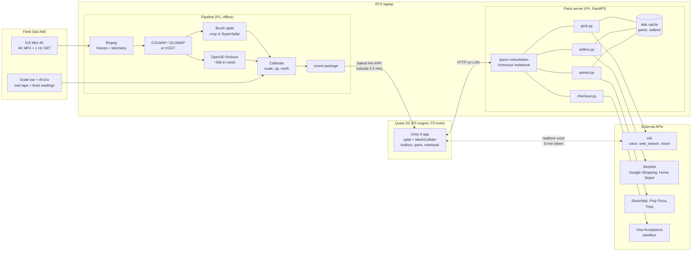
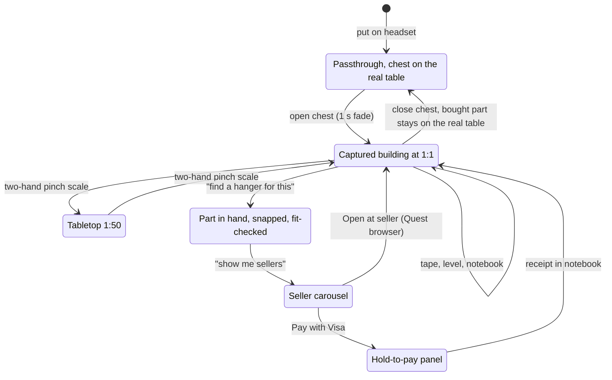
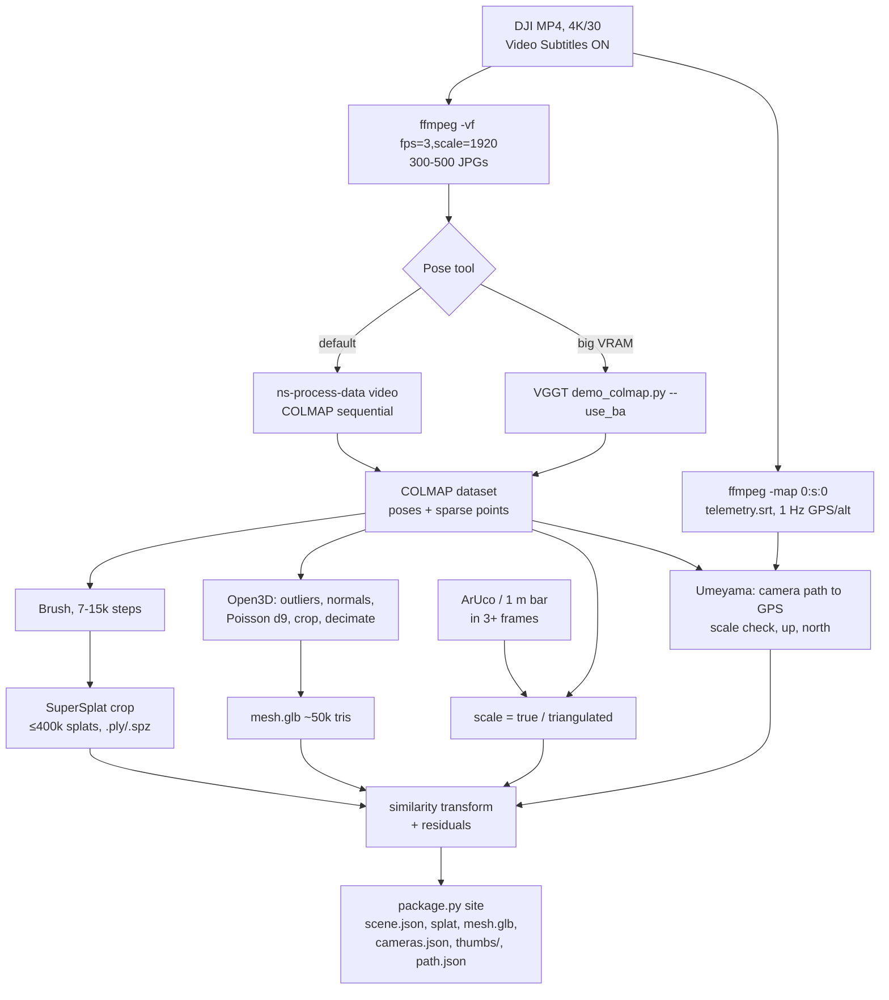
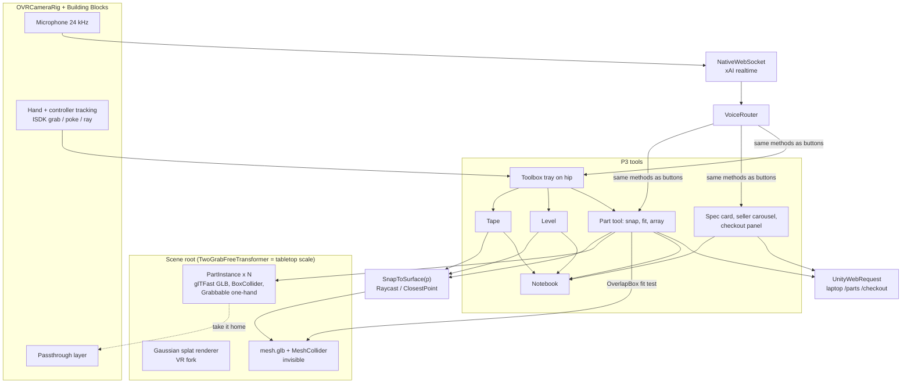
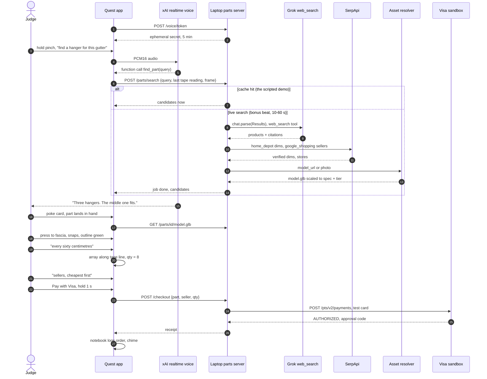
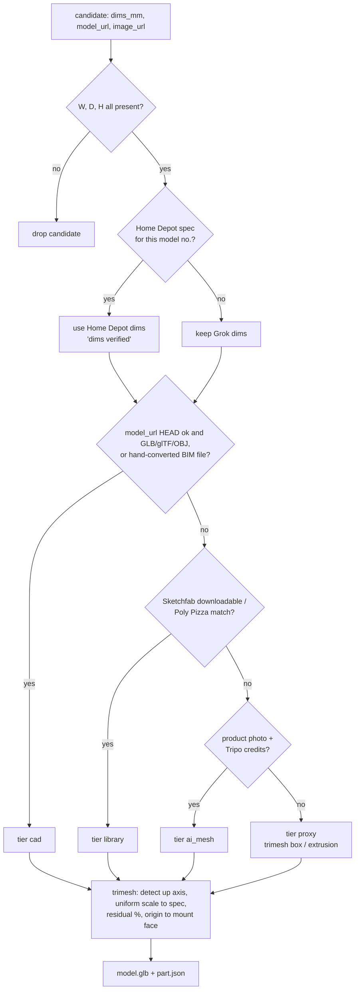
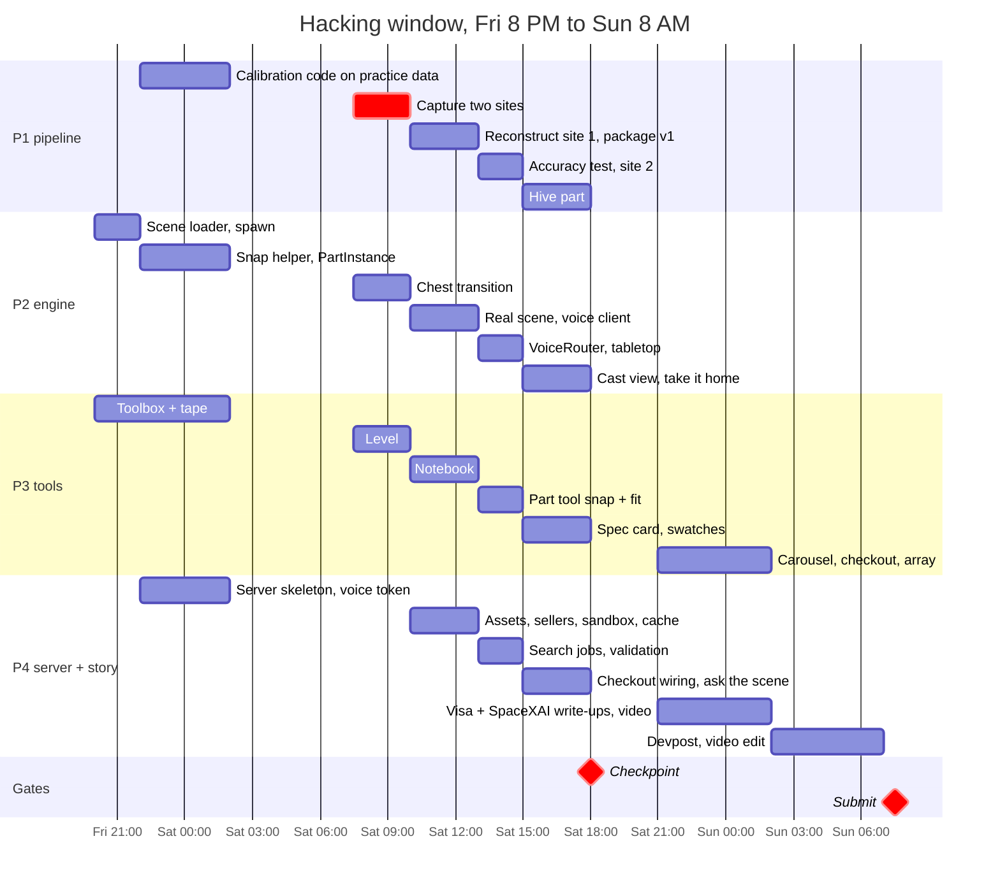

# AirTool — implementation plan for a 4-person team

*Written Thu 2026-09-24. Companion to "HackGT 13 - AirTool final writeup.md". Hacking Fri 8 PM → Sun 8 AM (36 h). Expo Sun 9:00–11:15.*

*Rev 2 (Thu): restores the construction and asset layer, the **parts layer**. You measure a feature, ask Grok by voice for a real part that fits, and the part appears at true size in your hand. You place it on the building, fit-check it, scroll through real sellers, then buy with Visa (sandbox) or open the seller's page. See §4b. Roles and the timeline are rebalanced to pay for it.*

---

## 0. Roles

| | Role | Owns | Must have |
|---|---|---|---|
| **P1** | Pilot + pipeline + ground truth | Flight, capture, ffmpeg → poses → splat + mesh, calibration, scene package. **Accuracy test** (Sat 1–3 PM, while site 2 reconstructs) and the **Hive part** (Sat 3–6 PM) | The drone, TRUST cert, the RTX laptop (or a cloud GPU account), Python, laser-cutter access |
| **P2** | XR engine | Unity app on the Quest 3S: project setup, scene loading, splat + mesh rendering, hands, performance, chest transition, builds. **Runtime part loading** (glTFast from the server), grab/snap physics, **voice client** (mic capture, websocket, audio playback) | Unity, Meta XR SDK, a Quest with dev mode |
| **P3** | Tools + UX | Toolbox, tape, level, notebook, export, snapping math. **Part tool** (place, snap, fit check, array), **spec card**, **seller carousel**, **checkout panel**. Protractor, plumb and area drop to stretch | Unity C#, Interaction SDK, vector math, UI |
| **P4** | Integrator + parts server + story | Repo/CI, local server + hotspot. **The parts server**: Grok search and spec extraction, asset resolver, sellers, Visa sandbox, voice token. Notability, Devpost, video, demo script | Cursor, Python, an xAI key, SerpApi and Cybersource sandbox accounts, camera, writing |

Rules:
- P2 and P3 work in the same Unity project on separate branches and separate scenes/prefabs (scene-file merges are painful). P4 merges every 3 hours.
- P1 is the only one allowed to touch the pipeline; everyone else consumes `scene/` packages.
- P4 is the only one who touches the server and API keys. The APK never contains a key.

## 0b. Architecture at a glance

Three machines, one ownership line each:
- The **drone** is a camera; nothing talks to it at runtime.
- The **RTX laptop** runs the pipeline (P1) and the parts server (P4).
- The **Quest** runs everything the judge touches (P2, P3).



The only runtime link that skips the laptop is the realtime voice websocket. It uses a short-lived token the laptop mints, so the APK never holds a key.

### What the judge moves through



## 1. Contract between pipeline and app (agree on this Friday 8 PM, first thing)

A **scene package** is a folder:

```
scene/<site>/
  scene.json          # metadata, see below
  splat.ply | .splat | .spz   # Gaussian splat, cropped, <= 400k
  mesh.glb            # simplified surface mesh, ~50k tris, same coordinate frame, for snapping
  cameras.json        # per-frame pose {id, R, t, fx, fy, cx, cy, w, h, thumb}
  thumbs/NNNN.jpg     # 640px frame thumbnails (evidence photos)
  path.json           # GPS track, 1 Hz, in scene coords
```

`scene.json`:
```json
{
  "name": "Klaus east window",
  "units": "meters",
  "up": [0,1,0],
  "north": [0,0,-1],
  "scale_method": "scalebar_1m",
  "scale_residual_m": 0.012,
  "gravity_residual_deg": 0.4,
  "origin_gps": [33.777, -84.396, 285.0],
  "recommended_spawn": {"pos":[0,1.6,4], "look":[0,2,0]}
}
```

Everything the app needs is in this folder. P2/P3 develop against a **practice package** made Thursday night; the real one arrives Saturday ~noon.

### 1b. Contract between the parts server and the app (also agreed Friday 8 PM)

Scene packages are baked into the build. **Parts are loaded at runtime** over HTTP from the laptop. A **part package** is served as:

```
parts/<part_id>/
  part.json           # specs, sellers, provenance (below)
  model.glb           # meters, +Y up, origin at the mounting face centre, already scaled to the published dims
  image.jpg           # product photo for the spec card
```

`part.json`:
```json
{
  "id": "amerimax-hidden-hanger-5k",
  "name": "5\" K-style hidden hanger with screw",
  "manufacturer": "…", "model_no": "…",
  "dims_mm": {"w": 127, "d": 38, "h": 45},
  "weight_g": 60,
  "color_hex": "#F2F2F0", "finish": "white", "material": "aluminum",
  "finishes": [{"name": "white", "hex": "#F2F2F0", "part_id": "…"}, {"name": "brown", "hex": "#5A3E2B", "part_id": "…"}],
  "mount": {"face": "-z", "surface": "fascia"},
  "clearance_mm": {"front": 0, "back": 0, "top": 25, "bottom": 0, "left": 0, "right": 0},
  "spacing_mm": 600,
  "asset": {"tier": "cad|library|ai_mesh|proxy", "source_url": "…", "license": "…", "scale_residual_pct": 1.8},
  "spec_url": "…", "citations": ["…"],
  "sellers": [{"name": "…", "price_usd": 4.27, "shipping": "free", "eta": "Tue", "rating": 4.6, "in_stock": true, "url": "…"}],
  "recommended_seller": 0, "recommendation_reason": "cheapest that arrives before Friday",
  "fetched_at": "2026-09-26T14:02:00-04:00", "cached": true
}
```

Server endpoints (laptop, FastAPI, one file per concern):

| Method | Path | Does |
|---|---|---|
| `POST` | `/parts/search` `{query, measurement?, frame_jpg_b64?}` | Starts a search job and returns `{job_id}`. Returns candidates immediately if the query hits the cache |
| `GET` | `/parts/jobs/<job_id>` | `{status, candidates: [part.json summaries]}` |
| `GET` | `/parts/<id>/part.json`, `/parts/<id>/model.glb`, `/parts/<id>/image.jpg` | Static files |
| `POST` | `/voice/token` | An ephemeral xAI realtime client secret (5 min). This is the only credential the headset ever sees |
| `POST` | `/checkout` `{part_id, seller_idx, qty}` | Visa sandbox authorization, returns `{status, approval_code, card_last4, total_usd, receipt_id}` |
| `POST` | `/notebook` | Existing export path; now also carries placements and orders |

## 2. Pipeline (P1)



### 2.1 Capture (Sat 7:30–10 AM, GTPD plan required)
- Target: a brick facade with a window and gutter/flashing, one or two storeys up. Two sites.
- Place the **1 m scale bar** (printed, on foam board) and an **ArUco board** flat on a wall or the ground in view. Hand-measure 3 features (window width, sill height, gutter length) with a real tape; put a real level on the sill and note the reading.
- DJI Fly: 4K/30, Video Subtitles ON, gimbal 30–45° down.
- Passes: (1) wide orbit at ~15 m radius, height 1; (2) same at height 2; (3) close half-orbit of the feature at ~6 m. Slow (1–2 m/s). 2–3 min each. Keep the feature centered. Don't fly over people.
- Back at Klaus: copy MP4s immediately, back up to a second laptop.

### 2.2 Reconstruct (Sat 10 AM–1 PM, target ≤ 60 min per site)
1. `ffmpeg -i in.mp4 -vf "fps=3,scale=1920:-1" frames/%04d.jpg` (300–500 frames). Extract the subtitle track: `ffmpeg -i in.mp4 -map 0:s:0 telemetry.srt`; parse GPS/alt per second.
2. Poses: COLMAP/GLOMAP (sequential matcher, since it's a video) **or** a feed-forward model (see §2.5). Output: camera poses + sparse/dense points.
3. Splat: Brush (or gsplat/splatfacto); Postshot only with a paid Indie tier (free tier can't export). 30k steps is overkill; 7–15k is fine for a demo. Crop to the feature in SuperSplat, export ≤400k splats as `.ply` (UnityGaussianSplatting imports PLY).
4. Mesh: from the dense points (or from the splat centers), Open3D: outlier removal → normals → Poisson (depth 9) → crop to bounding box → decimate to ~50k tris → `mesh.glb`. The mesh only needs to be good enough to snap a tape to; it's never shown.
5. Thumbs + `cameras.json` from the pose output.

### 2.3 Calibrate (the part judges should hear about)
- **Scale:** detect the ArUco board / scale-bar endpoints in 3+ frames, triangulate with the known poses, compute the ratio to the true length. Apply the similarity transform. Cross-check against the GPS baseline (distance between the two furthest camera positions vs. GPS haversine distance) and report both. Write `scale_residual_m`.
- **Up:** fit the GPS altitude track to the camera-center heights (Umeyama similarity on the camera path vs. the GPS track gives scale, rotation and translation in one shot). Refine "up" with the dominant vertical lines in the images (RANSAC on line segments from the facade). Verify: the mesh's window sill should read ~0° on the virtual level if the real level said 0°.
- **North:** from the same GPS fit. Only cosmetic (for the compass), but free.
- Output the residuals; P4 puts them in the accuracy table.

### 2.4 Package and hand over
`python package.py <site>` → `scene/<site>/`. P4 commits it (LFS); P2 imports the PLY through the UnityGaussianSplatting asset creator, the GLB via glTFast, and rebuilds the APK (2–5 min).

### 2.5 Tooling decision (from the repo review, §7)
**Postshot is out as the default:** its free tier imports MP4 and aligns on its own, but does not export PLY/SPZ (Indie tier, €17/mo, does). Use it only if someone buys a month, in which case it is the fastest path on Windows.

Default path (all free, exports PLY): 
1. **Poses:** `ns-process-data video --data clip.mp4 --output-dir out` (nerfstudio wrapper around ffmpeg + COLMAP with sequential matching, 300 frames by default). Windows is "less tested"; WSL2 is safer. Alternative with no COLMAP: **VGGT** `demo_colmap.py --use_ba` writes a COLMAP dataset directly (needs a big-VRAM NVIDIA GPU; Iron World's `vggt_pipeline.py` shows chunking at 60 frames / ≤518 px).
2. **Splat:** **Brush** (Apache-2.0, Windows binary, takes the COLMAP folder, exports `.ply` / SuperSplat-compressed PLY). Or `ns-train splatfacto` + `ns-export gaussian-splat` if nerfstudio is already installed.
3. **Crop/compress:** SuperSplat → `.spz` ≤400k.
4. **Mesh:** Open3D Poisson on the COLMAP dense/sparse points (or the splat centers). 2DGS/SuGaR give better meshes but cost 30+ min and SuGaR needs WSL; skip unless snapping is visibly wrong.

Scale note: Pi3X/VGGT are scale-free or "approximately metric"; our scale bar + GPS fit (§2.3) is required regardless of the pose tool.

Before Friday P1 must run the whole chain once on practice footage and write down the minutes per step.

## 3. XR engine (P2) — Unity

Decision (Thu): **Unity, not WebXR.** Reason: the Meta Interaction SDK gives hand grab/poke/pinch, hand-anchored menus and ray UI for free, and MeshCollider raycasts make snapping trivial. Both matter more for a tool-heavy app than WebXR's no-build-cycle advantage. Quest Link also gives a PC-VR path with far larger splats if standalone is too heavy.



- **Versions:** Unity **6000.x LTS** (Unity 6), URP, Android build support (OpenJDK + SDK/NDK via Hub). **Meta XR All-in-One SDK** (Core + Interaction SDK + Building Blocks) from the Asset Store / Package Manager. Set `Meta > Tools > Project Setup Tool` and let it fix everything. Vulkan, ARM64, IL2CPP, minimum API 32. Pin versions on Thursday and commit `Packages/manifest.json`; nobody upgrades during the event.
- **Splats:** `aras-p/UnityGaussianSplatting` package + the `ninjamode/Unity-VR-Gaussian-Splatting` fork for stereo/VR. Import the `.ply` from Brush through its asset creator (choose a lower quality preset for mobile: "Medium" pos/scale/color). Budget ≤400k splats standalone on the 3S; test on Thursday. If it won't hold 72 fps, run **PC VR over Quest Link** from the RTX laptop: same project, `Build target: Windows`, Meta XR Simulator/Link, splats up to millions. Decide by Friday midnight which target is the demo target; keep the other as fallback.
- **Mesh:** import `mesh.glb` (glTFast or UnityGLTF package), material = invisible (or a faint wireframe for debugging), add a **MeshCollider**. All snapping is `Physics.Raycast` / `Physics.OverlapSphere` against it.
- **Scene loading:** a `ScenePackage` ScriptableObject per site (splat asset, mesh prefab, `cameras.json`, thumbnails folder, `scene.json`). Loader applies `up`/`north` so +Y is up, spawns the player at `recommended_spawn`.
- **Building Blocks to drop in:** Camera Rig, Passthrough, Hand Tracking, Controller Tracking (backup), Spatial Anchor (for the chest), Poke/Grab/Ray Interaction.
- **Passthrough → world:** start in passthrough with the chest on the table (`OVRPassthroughLayer` underlay). "Open chest" = disable the passthrough layer and enable the scene root + an opaque skybox, 1 s fade via a full-screen quad. No scene switch.
- **Scale modes:** 1:1 default; tabletop 1:50. Scale the scene root about the midpoint of a two-hand pinch (Interaction SDK's `TwoGrabFreeTransformer` on the scene root does this without custom code).
- **Interaction API for P3:** Interaction SDK hand `Pinch` events on `HandGrabInteractor` / `PokeInteractor`; expose `OnPinchStart(Hand, Vector3 tipPos)`, `OnPinchMove`, `OnPinchEnd`. A helper `SnapToSurface(Vector3 p, float radius = 0.15f)` returns the nearest MeshCollider hit (raycast from the hand ray, fallback `OverlapSphere` nearest point via `Collider.ClosestPoint`).
- **Performance:** URP, no post-processing, Fixed Foveated Rendering level 2, Application SpacewarpOFF, MSAA 2×. OVR Metrics Tool overlay for fps. Cut splat count first if it drops.
- **Runtime parts:** use `GltfImport.Load(url)` from glTFast against the server, never a build-time import.
  - Wrap each loaded part in a `PartInstance` prefab. It carries a `BoxCollider` sized from `dims_mm`, a `Rigidbody` (kinematic), and a `Grabbable` + `HandGrabInteractable` using the **one-hand transformer only**.
  - Scale stays locked at 1:1 on purpose: true size is the point. Parts scale with the scene root in tabletop mode, like everything else.
  - Tint `color_hex` onto the material for `proxy` tier parts, and when the user switches finish.
  - Keep a small cache so switching between candidates doesn't refetch.
- **Voice client:**
  - Push-to-talk: hold a pinch on the left palm, or hold the controller X button as the backup.
  - `Microphone.Start` captures PCM16 at 24 kHz. Stream it over a websocket (NativeWebSocket package) to `wss://api.x.ai/v1/realtime?model=grok-voice-latest`, authenticated with the ephemeral token from `/voice/token`.
  - Play `response.output_audio.delta` chunks through a streaming `AudioClip` on an `AudioSource` attached to the toolbox, so the voice comes from your hip.
  - Function-call events go to a `VoiceRouter` that calls the same methods the UI buttons call. Voice never has its own code path.
  - **Plan B**, a one-flag switch: record a clip, `POST /v1/stt` via the laptop, then run a Grok chat with the same function tools. Slower, but has no websocket to debug.
- **Cast view:** Meta Quest Developer Hub casting or `scrcpy`-style `adb` screen record for the laptop screen at the expo and for the video.
- **Deliverable Friday 2 AM:** APK on the 3S loads the practice package, hands tracked, snap helper works, 72 fps (or the Link target chosen).

## 4. Tools (P3) — Unity

Each tool is a MonoBehaviour driven by the pinch events plus `SnapToSurface`. Use the Interaction SDK prefabs (`HandGrabInteractable`, `PokeInteractable`, hand-anchored `Canvas` menus) rather than custom UI.

| Tool | Logic | Visual |
|---|---|---|
| **Toolbox** | A hand-anchored tray (Interaction SDK hand menu, palm-up gesture or a fixed hip anchor: `OVRCameraRig` centre-eye position −0.25 m Y, +0.3 m right); poke a tool icon to equip | Tray of 6 icons; the equipped tool is a `HandGrabInteractable` that follows the right hand |
| **Tape** | Pinch A (snapped), drag, pinch B (snapped). `d = Vector3.Distance(A,B)` | `LineRenderer` yellow strip with a tiling tick texture every 10 cm; `TextMeshPro` world-space label in m/cm and ft/in |
| **Level** | Place at pinch point; `RaycastHit.normal` gives the surface normal; tilt = `Vector3.Angle(projected tangent, horizontal)` | A 30 cm level body, bubble driven by tilt; label in degrees |
| **Protractor** | Three snapped pinches (vertex, then two arms); `Vector3.Angle(a−v, b−v)` | Arc mesh with angle label |
| **Plumb** | Pinch a point; `Physics.Raycast(p, Vector3.down)` | Line + bob; label = horizontal offset |
| **Area** | Successive pinches on one face; close by pinching the first point; Newell's method for polygon area | Translucent polygon mesh; m² label |
| **Notebook** | Every completed measurement → `{tool, value, points, timestamp, nearest_camera_id}`; nearest camera = the pose whose frustum contains the points with the smallest view angle; show `thumbs/<id>.jpg` as a `RawImage` | Wrist `Canvas` listing readings; poke a row to teleport to it; "Export" writes CSV + HTML to `persistentDataPath` and copies it via `adb pull` (or a tiny HTTP POST to the laptop). Placed parts and orders are logged here too |
| **Part** | Details in the three rows below this table | Crate, spec card, fit outline, array |
| ↳ Search | Voice ("find a hanger for this gutter"), or the toolbox's crate icon plus a keyboard. The **last tape reading** travels with the query as `measurement` | Candidate cards (photo, name, W×D×H, price) float up out of the chest in a fan; poke one to pick it |
| ↳ Snap | On release within 15 cm of the mesh, `SnapToSurface` gives the hit and normal. Rotate the part so its `mount.face` points into the surface normal, then seat it on the surface | Snap click and a controller haptic tick |
| ↳ Fit check | `Physics.OverlapBox` for the part's box against the scene `MeshCollider` and the other parts, then again with the box inflated by `clearance_mm`. Result is **green** (clear), **amber** (clearance violated) or **red** (intersects) | Outline colour plus W×D×H callouts drawn with the tape's line style. When a tape reading exists: "fits, 38 mm spare" or "too wide by 12 mm" |
| **Array** | Voice ("put them every 60 cm along this"), or poke "Array" on the spec card. Instances go along the **last tape segment** at `spacing_mm`, each one snapped. Quantity = ⌊length / spacing⌋ + 1 | Ghosted instances pop in one by one. The quantity goes to the cart |
| **Spec card** | Floats beside the selected part | Name, dims in mm and in, material, finish swatches (poke to recolour; switches the seller list to that SKU), an **asset-tier badge**, citations, and a "Sellers" button |
| **Seller carousel** | World-space ISDK canvas. Scroll with ray + pinch-drag or poke-drag. Voice can sort it ("cheapest", "arrives by Friday") | Cards: seller, price, shipping, ETA, rating, stock. Grok's recommended card is tagged with its reason. Two buttons per card: **Pay with Visa (sandbox)** and **Open at seller** |
| **Checkout panel** | Shows qty (from the array), unit price, total, and card •••• 1111. **Hold a pinch for 1 s to confirm; voice alone can never pay.** `POST /checkout`, then show the receipt | The ring fills while you hold; a chime and a receipt card with the approval code; the order goes into the notebook. "Open at seller" calls `Application.OpenURL` to open the real page in the Quest browser |

Order of implementation:
1. Toolbox + tape (Fri night)
2. Level (Sat AM)
3. Notebook (Sat midday, before the Hive cut)
4. Part: load, grab, snap, fit, against the cached parts (Sat 1–6 PM)
5. Spec card + seller carousel + checkout (Sat 6–11 PM)
6. Array (Sat night)
7. Stretch: protractor, plumb, area

Units: meters internally; display both m and ft/in (contractors think in inches).

## 4b. Parts: find, fit, buy (P4 server, P2/P3 client)

The parts layer lives in the same ship's chest the toolbox came out of: the chest now also holds parts. It is the construction and asset layer, and the biggest immersion beat: **the thing you just measured gets its real replacement part, at true size, in your hand, on the building.**



### 4b.1 Grok's jobs (one file: `server/grok.py`)

1. **Voice agent.** The realtime endpoint is `wss://api.x.ai/v1/realtime?model=grok-voice-latest`, with PCM16 at 24 kHz and function calling. `session.update` sets:
   - a nautical "quartermaster" persona in `instructions`, two sentences at most, so it stays short
   - `turn_detection` off, because push-to-talk works better in a loud hall (turning it off is unverified for xAI; if it isn't supported, use server VAD with a high threshold)
   - these function tools, and only these, so every reply is fast:
     - `find_part(query)`
     - `select_candidate(index)`
     - `set_finish(name)`
     - `place_array(spacing_mm?)`
     - `show_sellers(sort)`
     - `start_checkout(seller_index)`
     - `equip_tool(tool)`
     - `add_note(text)`

   The router answers each call with `function_call_output` and then `response.create`, so Grok speaks the result: "Three hangers. The middle one fits with 38 millimetres to spare."

   The payload field names (`call_id`, `arguments`) follow OpenAI Realtime; confirm them on Friday with a logging session.
2. **Search + spec extraction.** `xai_sdk` runs `client.chat.create(model="grok-4.7", tools=[web_search()])`, then `chat.parse(Results)`, with the Pydantic schema mirroring `part.json`. Structured outputs and server-side tools are allowed in one call for the Grok 4 family.
   - The prompt carries the query, the measurement ("gutter run 4.20 m, gutter width 127 mm"), and the constraints ("real seller URLs only, null for unknown fields, published dimensions only").
   - Optional: attach the thumbnail of the frame nearest the measurement, so Grok sees the actual gutter profile.
   - Log `response.citations` and `response.cost_usd`; citations go on the spec card.
   - web_search is $5 per 1,000 calls plus tokens. Latency is unmeasured; plan for 10–60 s.
3. **Ask the scene** (already planned). The Grok Vision call on the nearest thumbnails now also answers "what is this part?", and that answer can seed `find_part`.

Grok hallucinates URLs and dimensions sometimes, so guard every candidate:
- Drop it if W, D or H is null.
- `HEAD` every `model_url`, `image_url` and seller URL.
- Where SerpApi's `home_depot` product engine returns a Dimensions spec for the same model number, **SerpApi wins** and the spec card shows "dims verified: Home Depot spec".

### 4b.2 Sellers (`server/sellers.py`)

- **Multi-seller prices:** SerpApi `google_shopping`, then `google_immersive_product` with the page token. That gives 3–13 stores with price, rating and link. Grok's own seller URLs go in too, marked unverified until the HEAD request passes.
- **Dimensions + photo:** SerpApi `home_depot` product engine, where it has the part. Best source for construction parts.
- **Free extra seller:** eBay Browse API.
- Amazon PA-API was retired in May 2026. Skip Amazon.
- **Cache every response to disk.** SerpApi's free tier is 100–250 searches a month. Every query is a file keyed by its normalised text.
- **Recommendation:** one cheap Grok call (`grok-4.20-non-reasoning`, no tools) picks `recommended_seller` from the cached list given the user's sort ("cheapest", "fastest"), and writes a one-line reason.

### 4b.3 Asset resolver (`server/assets.py`), tiered, always honest

All tiers finish the same way:
1. Load with `trimesh`.
2. Detect the up axis.
3. Uniform-scale so the largest extent matches the published dimension.
4. Record the per-axis residual as `scale_residual_pct`.
5. Move the origin to the mounting face.
6. Export `model.glb`.



| Tier | Source | Badge on the spec card |
|---|---|---|
| `cad` | Grok's `model_url` passes HEAD and is GLB/glTF/OBJ, or a manufacturer file. Also 3–5 **BIMobject / manufacturer models downloaded and converted by hand** for the demo parts (Revit/IFC → Blender → GLB) | "Manufacturer model" |
| `library` | Sketchfab Data API v3: `search?downloadable=true`, then `/models/{uid}/download` → glTF (show the CC attribution). Or Poly Pizza | "Library model, scaled to spec" |
| `ai_mesh` | Tripo image-to-3D on the product photo: under 20 s, 300 free credits. Meshy as the backup | "AI mesh — exact size, approximate look" |
| `proxy` | `trimesh.creation.box(extents=…)`, or an extrusion for L-brackets, tinted with `color_hex` in Unity | "Proxy — exact size" |

AI 3D stays **out** of the measuring path. It only dresses a part whose size comes from a published spec, and its badge says exactly that.

### 4b.4 Visa (`server/checkout.py`)

- **Rail:** Visa Acceptance / Cybersource REST **sandbox**, `apitest.cybersource.com`, `POST /pts/v2/payments`, test card `4111 1111 1111 1111`, `capture=false`. Python SDK: `cybersource-rest-client-python`. Sign up **tonight**; the sandbox key comes from the Test Business Center.
- **Agentic flow for the Visa brief** (discovery → decision → personalisation → checkout):
  1. Grok finds the parts.
  2. Measurement plus array set the quantity.
  3. Grok recommends a seller with a reason.
  4. The human confirms with a 1-second physical hold.
  5. The server authorizes.

  Card data never touches the headset; it only ever shows •••• 1111.
- **Honest labels:** sellers, prices and dimensions are real. The payment is a sandbox authorization; no order is placed with that seller. "Open at seller" is the real purchase path today.
- **Production path to name on stage:** Visa Intelligent Commerce agent tokens and Trusted Agent Protocol signed requests. VIC docs are gated, so **ask the Visa table Friday night** whether they hand out VIC sandbox access. Only claim VIC if you actually used it.
- **Optional, 1 h:** a Visa Acceptance Agent Toolkit Pay-by-Link through the same sandbox credentials. It produces a real hosted payment page link that the checkout panel shows as a QR code on the cast screen.

### 4b.5 Demo parts, chosen Friday night to match the capture site

Pick two, cache them fully (search JSON, sellers, verified dims, resolved assets), and rehearse on the cached path:
- **Gutter hanger / bracket**: small. It links to the Hive part, and the array beat sets the quantity.
- **Window AC unit** (or a window awning/box if the window is fixed): big, and it fits into the window you just measured. Its min/max window width is a published spec, so the fit colour means something. This is the Visa commerce story at a real price point.

A **live, uncached search** is a bonus beat, shown only when a judge asks. Say it takes ~30 s and let the voice agent fill the wait ("Searching the supply shops…").

### 4b.6 Other cheap immersion boosters

The first one is core, because it is demo beat 7. The rest come only after the Sat 6 PM checkpoint.

- **Take it home:** after checkout, the "open chest" transition runs in reverse. You are back in passthrough and the purchased part sits on the real expo table, at true size, next to the laser-cut one. It's the track brief's "blur the lines of reality" beat and needs almost no new code, since the part prefab just re-parents to the passthrough rig.
- **Finish swatches that recolour in place:** "show it in brown" against the real brick.
- **Spatial audio and haptics:** snap click, a collision buzz (controllers), the checkout chime, and the quartermaster's voice from your hip.
- **"What else do I need?"** One more Grok call turns the placed parts into a bill of materials: screws, sealant, end caps, each with a seller. They all go into the same cart.

## 5. Integration, accuracy, story (P4)

- **Repo:** one GitHub repo, `pipeline/`, `app/`, `scene/` (git LFS or just zip the packages), `docs/`. Cursor as the editor (SpaceXAI requirement); note it in the README.
- **Network:** the parts layer needs **internet** (xAI, SerpApi, Cybersource) as well as the LAN between the Quest and the laptop.
  - Travel router with a phone-tether uplink, or a laptop hotspot on a wired or phone uplink. The Quest joins the same SSID. Event Wi-Fi with client isolation will break headset ↔ laptop.
  - Everything the demo needs is cached, so a dead uplink costs only the live-search bonus beat and a real sandbox authorization. For that case the checkout has a clearly labelled "offline receipt" mode.
  - Prefer a USB-C Link cable for Link at the expo.
  - Test all of it Friday night.
- **Builds:** P4 owns the build machine profile. Scene packages are imported as assets, so every new site is a rebuild (2–5 min); keep a "practice" and a "real" build on the headset side by side (different `applicationIdentifier`). Commit `ProjectSettings/` and `Packages/manifest.json`; use `.gitignore` for `Library/`. Git LFS for splat assets.
- **Accuracy test (P1, Sat 1–3 PM, while site 2 reconstructs):** for each hand-measured feature, measure it 3× in VR, record mean and error. Table: feature, real, VR, error (cm, %). This is the slide.
- **Hive (P1, Sat 3–6 PM):** check out any Hardware Desk item Friday to qualify. Take the exported bracket dimensions (e.g., a gutter hanger: width, drop, hole spacing), make a 2D profile in Fusion/Onshape or a parametric SVG, laser-cut in 3–6 mm acrylic or plywood. Back by 6:30 PM for the checkpoint.
- **Grok (SpaceXAI).** Grok now does four jobs, all in `server/grok.py` (§4b.1):
  - voice agent
  - web search + spec extraction
  - seller recommendation
  - ask the scene: send the 6 nearest thumbnails and the question to Grok Vision, parse a JSON answer with a frame id and a 2D box, then project the box centre onto the mesh via that frame's camera to drop a pin

  Voice memos are just `add_note` through the same voice agent. Keeping every call in one file makes each fallback a one-line switch: realtime → STT+chat, live search → cache.
- **Keys:** `.env` on the laptop only (xAI, SerpApi, Cybersource, Tripo, Sketchfab). `.gitignore` it before the first commit. The public repo gets `.env.example`.
- **Notability:** planning notes and the accuracy table in Notability Pro; two screenshots for Devpost.
- **Devpost (due Sun 8 AM):** write-up per the skeleton in the writeup, plus a separate **Visa** submission paragraph and a **SpaceXAI** paragraph.
  - The 2-min video runs: 20 s flight, 20 s reconstruction time-lapse, 35 s measuring in the headset (cast), 30 s parts (find → place → fit → sellers → pay), 15 s Hive part, 10 s accuracy table.
  - Tags: Notability; Create-X box.
- **Demo script:** rehearse beats 3, 5, 6 and 7 of the writeup's §3 twice Sunday 7–8 AM. Print the accuracy table. Put these on the table:
  - the drone (props off)
  - both headsets
  - the cut part
  - the real tape and the real level

## 6. Timeline

| Time | P1 pipeline | P2 engine | P3 tools | P4 integration |
|---|---|---|---|---|
| **Thu (today)** | File GTPD plan (late; file anyway, call GTPD). Practice orbit of any brick building; run pipeline end-to-end; produce the **practice package** | Unity 6 + Meta XR SDK project, Building Blocks (passthrough, hands), one APK on the 3S; import a sample splat with the VR fork and read the fps. **Decide standalone vs Link.** Check that glTFast runtime-loads a GLB over HTTP on the 3S | Interaction SDK hand-menu + pinch sample running; `SnapToSurface` against a test MeshCollider | Repo (LFS, manifest pinned), hotspot test, print scale bar + ArUco, buy foam board, pack tape + level + Link cable, install Cursor/Notability. **Accounts, no code:** xAI key, SerpApi, Cybersource sandbox, Tripo, Sketchfab. Hand-download 3–5 BIMobject/Sketchfab models for candidate demo parts |
| **Fri 8–10 PM** | Agree both contracts (§1, §1b); verify practice package loads | Scene loader, up/north handling, spawn | Toolbox tray + tape | Check out a loaner Quest + any item; practice APK on both headsets. Claim Grok credits at the SpaceXAI table; **ask the Visa table about VIC sandbox access** |
| **Fri 10 PM–2 AM** | Calibration code (ArUco triangulation, Umeyama to GPS) on practice data | Snap helper, BVH, perf pass. **`PartInstance` runtime load + grab** against a proxy GLB | Tape labels, units, hysteresis | **Server skeleton:** FastAPI, static `parts/`, the `/voice/token` relay. `grok.py` search + `chat.parse` returns one real candidate. Log one realtime voice session to confirm the event payloads |
| **Sat 7:30–10 AM** | **Capture** two sites; hand measurements | Chest transition | Level | Drives/assists capture; photographs the real measurements *and the real gutter/window* (the demo parts must match them) |
| **Sat 10 AM–1 PM** | Reconstruct site 1 → package v1 (by 12:30) | Load real scene; perf. **Voice client:** push-to-talk, websocket, audio out | Notebook + thumbnails | Asset resolver (all four tiers), `sellers.py` + cache, `checkout.py` sandbox auth works from the command line. **Pick and fully cache the two demo parts** |
| **Sat 1–3 PM** | Site 2 reconstructs in the background; **accuracy test**; residuals; bracket CAD | Comfort (vignette on scale change), tabletop mode. `VoiceRouter` → the same methods as the buttons | **Part tool:** crate fan, snap, fit colours, dimension callouts | `/parts/search` jobs + candidate summaries; recommendation call; HEAD/dims validation |
| **Sat 3–6 PM** | **At the Hive**: cut the part. Package v2 | Polish; cast view for the laptop screen; "take it home" transition | Spec card + finish swatches | `/checkout` wired to the panel; ask-the-scene pins (Grok Vision) |
| **Sat 6–9 PM** | **Checkpoint, all of:** real scene; tape + level + notebook; error < 5%; part in hand; **a cached part found by voice, placed and fit-checked**. Else cut in this order: array → carousel (keep "Open at seller") → voice (keep the crate menu) → the whole parts layer. Tape + notebook are never cut | | | |
| **Sat 9 PM–2 AM** | Freeze pipeline; write the pipeline section | Bug fixes only | **Seller carousel + checkout panel** (hold-to-confirm); then array | Visa + SpaceXAI write-ups; video capture (cast recording) |
| **Sun 2–7 AM** | Sleep in shifts (2 up, 2 down) | | Stretch: protractor, plumb, area, "what else do I need?" | Devpost, video edit, accuracy table, print |
| **Sun 7–8 AM** | Submit by 7:30. Rehearse | | | |
| **Sun 9–11:15** | **Expo** | | | |



## 7. Reuse from prior hackathon repos (audited 2026-09-24)

Net result: **none of the six gives a video → metric splat + mesh pipeline.** Two have borrowable pieces.

| Repo | What it really is | Verdict | Take |
|---|---|---|---|
| **Hoponga/splatting** (= SkySplat, TreeHacks 2024 grand prize) | 44 KB, 5 commits: a Flask hello-world, a Vite starter, an upload script, and a committed GCP key. Zero reconstruction code | **SKIP** | README lesson only: they trained on free GCP T4 credits and burned their time on hyperparameter tuning |
| **Worldly** (TreeHacks 2026) · github.com/vihaanm23/worldly | Wrapper around the World Labs Marble API (`create_world.py` compresses the clip, uploads, polls 5–15 min). Output is a hosted world URL: not metric, no local geometry, no mesh | **BORROW the viewer, SKIP the pipeline** | `teleporter/`: WebXR splat viewer on `@sparkjsdev/spark` + three + `@iwsdk/core` (Meta Immersive Web SDK), Vite + mkcert HTTPS, loads `.spz/.ply/.splat/.ksplat`, thumbstick locomotion. This is P2's starting scaffold. Their lessons: DJI SDK unavailable so they screen-recorded the controller; CORS on remote splat URLs |
| **Firefighter SLAM** (HackPrinceton 2024) | MATLAB point-cloud demos with simulated temperature; a Unity project; COLMAP listed but no scripts | **SKIP** | — |
| **NTR-AR** (VandyHacks XI) | iOS RoomPlan scans → S3 via Terraform. No video, no drone, no splats | **SKIP** | — |
| **Iron World** (Hacktech 2026) · github.com/jiekaitao/ironworld | Uses **VGGT-1B** (not Pi3): `src/recon/vggt_pipeline.py`, stride 2, 60-frame chunks, ≤180 frames, resize ≤518 px; outputs point maps + 4×4 extrinsics + intrinsics as `.npy` + `manifest.json`; three.js point-cloud player; ran on B200 nodes with hardcoded cluster paths | **BORROW the VGGT chunking glue** | Read `vggt_pipeline.py` if P1 goes the feed-forward route; `open3d` + `trimesh` already in its requirements for meshing |
| **VIMA** (Hacktech 2026) | 2D pipeline (YOLO/OWL → Gemini → SAM → Depth Anything); the only 3D is one pre-baked 1,770-point COLMAP cloud | **SKIP** | — |

Tool facts confirmed from official docs:
- **Postshot** (jawset.com): Windows, RTX 2060+, imports MP4 and self-aligns; free tier = no PLY/SPZ export. Indie €17/mo exports.
- **Brush** (ArthurBrussee/brush): Apache-2.0, Windows/Mac/Linux binaries, needs COLMAP/nerfstudio poses, exports PLY, any GPU vendor.
- **nerfstudio**: `ns-process-data video` (ffmpeg + COLMAP sequential, 300 frames default) → `ns-train splatfacto` → `ns-export gaussian-splat`. Windows fragile (VS2022 + CUDA 11.8); gsplat has Windows wheels.
- **VGGT** (facebookresearch/vggt): `demo_colmap.py --use_ba` → COLMAP dataset that Brush/gsplat read directly; weights non-commercial unless you apply for the commercial 1B.
- **Pi3/Pi3X** (yyfz/Pi3): video → points + poses + `.ply`; Pi3X "approximately metric"; weights CC BY-NC.
- **MASt3R-SLAM**: MP4 → keyframe poses + `.ply`, metric checkpoint, tested on a 4090, has a `windows` branch.
- **Mesh:** Open3D Poisson is the fast path; 2DGS (`render.py --unbounded --mesh_res 1024`) and SuGaR (~30 min, WSL only) are the quality paths.

## 7b. Links

**Event**
- Pre-event packet: https://hexlabs.notion.site/HackGT-13-Pre-Event-Packet-cf10438064318246b668017b1b3030e4
- Site / tracks: https://hack.gt/ · Devpost: https://hackgt13.devpost.com/ · Organizers: hello@hexlabs.org
- Discord: https://discord.gg/AE94BjKYNC · Match (team formation): linked from the packet
- Hive makerspace (Sat 3–9 PM): 777 Atlantic Dr NW; https://hive.ece.gatech.edu/
- GTPD emergencies: 404-894-2500

**Drone and flight**
- GT drone policy / flight plan form: https://flyright.police.gatech.edu/
- FAA recreational flyers (TRUST, rules): https://www.faa.gov/uas/recreational_flyers · TRUST test: https://www.faa.gov/uas/recreational_flyers/knowledge_test_updates
- Airspace check: https://b4ufly.aloft.ai/ (or the B4UFLY app)
- Mini 4K has no SDK: https://github.com/dji-sdk/Mobile-SDK-Android-V5/issues/599 · https://forum.flylitchi.com/t/dji-mini-4k-drone-with-4k-and-dji-rc-nc1-controller-and-litchi-compatible/27083
- Embedded subtitle telemetry (turn on "Video Subtitles"): https://github.com/CallMarcus/dji-drone-metadata-embedder/issues/205
- RTMP livestream latency (not used, for reference): https://terasor.com/articles/dji-fly-custom-rtmp-setup

**Reconstruction**
- nerfstudio custom data (`ns-process-data video`): https://docs.nerf.studio/quickstart/custom_dataset.html · splatfacto: https://docs.nerf.studio/nerfology/methods/splat.html
- COLMAP: https://colmap.github.io/ · GLOMAP: https://github.com/colmap/glomap
- Brush (splat trainer, exports PLY): https://github.com/ArthurBrussee/brush
- gsplat (Windows wheels): https://github.com/nerfstudio-project/gsplat
- Postshot (Indie tier needed for export): https://www.jawset.com/
- VGGT (`demo_colmap.py --use_ba`): https://github.com/facebookresearch/vggt
- Pi3 / Pi3X: https://github.com/yyfz/Pi3
- MASt3R-SLAM (`windows` branch): https://github.com/rmurai0610/MASt3R-SLAM
- SuperSplat (crop, compress to .spz): https://superspl.at/editor · https://github.com/playcanvas/supersplat
- Open3D Poisson meshing: https://www.open3d.org/docs/latest/tutorial/Advanced/surface_reconstruction.html
- 2DGS mesh export: https://github.com/hbb1/2d-gaussian-splatting · SuGaR: https://github.com/Anttwo/SuGaR
- ArUco (OpenCV) for the scale board: https://docs.opencv.org/4.x/d5/dae/tutorial_aruco_detection.html · board generator: https://chev.me/arucogen/
- Umeyama similarity fit (scale/rotation/translation of camera path to GPS): `scipy.spatial.transform.Rotation.align_vectors` or https://github.com/clayflannigan/icp (reference impl); paper: https://web.stanford.edu/class/cs273/refs/umeyama.pdf
- Iron World's VGGT glue (reference only): https://github.com/jiekaitao/ironworld (`src/recon/vggt_pipeline.py`)

**Quest / Unity**
- Meta XR All-in-One SDK (Unity): https://developers.meta.com/horizon/documentation/unity/unity-package-manager/ · Project Setup Tool: https://developers.meta.com/horizon/documentation/unity/unity-project-setup-tool/
- Building Blocks (passthrough, hands, anchors in clicks): https://developers.meta.com/horizon/documentation/unity/bb-overview/
- Interaction SDK (hand grab/poke/ray, hand menus): https://developers.meta.com/horizon/documentation/unity/unity-isdk-interaction-sdk-overview/ · samples: https://developers.meta.com/horizon/documentation/unity/unity-isdk-samples/
- Passthrough in Unity: https://developers.meta.com/horizon/documentation/unity/unity-passthrough/ · Hand tracking: https://developers.meta.com/horizon/documentation/unity/unity-handtracking-overview/
- Gaussian splats in Unity: https://github.com/aras-p/UnityGaussianSplatting · VR/stereo fork: https://github.com/ninjamode/Unity-VR-Gaussian-Splatting
- glTF import: https://github.com/atteneder/glTFast (or UnityGLTF)
- Quest developer mode + ADB: https://developers.meta.com/horizon/documentation/native/android/mobile-device-setup/ · Meta Quest Developer Hub (deploy, cast, logs): https://developers.meta.com/horizon/documentation/unity/ts-mqdh/
- Quest Link / Air Link setup (PC VR fallback): https://www.meta.com/help/quest/articles/headsets-and-accessories/oculus-link/
- OVR Metrics Tool (fps overlay): https://developers.meta.com/horizon/documentation/unity/ts-ovrmetricstool/
- Unity Quest performance guide (FFR, Vulkan, MSAA): https://developers.meta.com/horizon/documentation/unity/unity-perf/
- WebXR alternative, kept for reference: Spark https://sparkjs.dev/ · Worldly's viewer https://github.com/vihaanm23/worldly (`teleporter/`)

**Sponsor challenges**
- xAI API (Grok Vision / Voice): https://docs.x.ai/ · Cursor: https://cursor.com/
  - Models + pricing: https://docs.x.ai/docs/models
  - Voice agent (realtime, function calling, `/v1/realtime/client_secrets`): https://docs.x.ai/developers/model-capabilities/audio/voice
  - Server-side tools (`web_search`, `x_search`): https://docs.x.ai/docs/guides/tools/overview
  - Structured outputs (with tools on Grok 4): https://docs.x.ai/docs/guides/structured-outputs
  - Python SDK: `pip install xai-sdk` · https://github.com/xai-org/xai-sdk-python
- Notability Pro: https://notability.com/
- Visa:
  - Developer portal: https://developer.visa.com/
  - Cybersource / Visa Acceptance sandbox signup: https://developer.cybersource.com/hello-world/sandbox.html
  - Python samples: https://github.com/CyberSource/cybersource-rest-samples-python
  - Visa Intelligent Commerce (gated; ask at the table): https://developer.visa.com/capabilities/visa-intelligent-commerce
  - Trusted Agent Protocol spec: https://developer.visa.com/capabilities/trusted-agent-protocol/trusted-agent-protocol-specifications
  - VIC reference agent: https://github.com/visa/vic-reference-agent
  - Agent Toolkit (Pay-by-Link): https://developer.visaacceptance.com/docs/vas/en-us/agent-toolkit/quick-start/all/na/agent-toolkit/agent-toolkit-options/agent-toolkit-mcp.html

**Parts, sellers, 3D assets**
- SerpApi Google Shopping → immersive product (multi-seller): https://serpapi.com/google-immersive-product-api
- SerpApi Home Depot (specs incl. dimensions): https://serpapi.com/blog/using-the-home-depot-product-api-from-serpapi/
- eBay Browse API: https://developer.ebay.com/api-docs/buy/browse/resources/item_summary/methods/search
- Sketchfab download API: https://sketchfab.com/developers/download-api/downloading-models
- Poly Pizza: https://poly.pizza/
- BIMobject (manual download): https://www.bimobject.com/
- Tripo image-to-3D: https://developers.tripo3d.ai/ · Meshy: https://docs.meshy.ai/en/api/image-to-3d
- trimesh (box/extrusion proxies, GLB export, rescale): https://trimesh.org/
- glTFast runtime loading: https://docs.unity3d.com/Packages/com.unity.cloud.gltfast@latest
- NativeWebSocket for Unity: https://github.com/endel/NativeWebSocket
- Create-X Startup Launch: https://create-x.gatech.edu/startup-launch

**Prior art to name on stage**
- SkySplat (TreeHacks 2024): https://devpost.com/software/skysplat · Keryx (TreeHacks 2026): https://devpost.com/software/keryx-k49dta · Worldly: https://devpost.com/software/worldly-0tm3bl · Dispatch (HackGT 12 Immersive 1st): https://devpost.com/software/dispatch-u7fwrv · Hall of Us (2nd): https://devpost.com/software/hall-of-us
- Commercial 2D roof reports (the thing AirTool is not): https://www.eagleview.com/ · https://hover.to/

## 8. Fallback ladder (decide at the Sat 6 PM checkpoint)

1. Full: splat + mesh, all tools, part cut, the whole parts layer (voice → place → fit → array → sellers → Visa sandbox → take it home).
2. Parts layer without voice or checkout: the crate menu finds the cached parts, place and fit-check them, and "Open at seller" goes to the real page. Still the biggest immersion beat.
3. Splat + mesh, tape + level + notebook only.
4. Mesh only (no splat) with the frame thumbnails as texture hints: tools still work, visuals worse. 
5. Practice-package scene (Thursday's building) with honest disclosure that Saturday's capture failed. Still measurable, still immersive, and the parts layer still works on it.
6. Handheld video of a ground-level feature run through the same pipeline.

## 9. Things that will go wrong, pre-decided

| Failure | Decision |
|---|---|
| COLMAP fails to register frames | Drop to 2 fps, use sequential matcher, mask the sky; if still failing, use the close half-orbit only |
| Splat is noisy / floaters | Crop hard in SuperSplat; it only needs to look good near the feature |
| Scale bar not visible in enough frames | Fall back to the door height / GPS baseline; report the larger residual honestly |
| 3S drops below 60 fps | Halve splats (re-import at lower quality); FFR level 3; raycast only on pinch; last resort: switch the demo to Quest Link from the RTX laptop |
| Hands flaky under Klaus lighting | Controllers as backup (Interaction SDK controller interactors map to the same events); say so |
| Unity build breaks at 3 AM | Never upgrade packages; keep the last good APK on the headset; `git bisect` the scene, not the packages |
| Hive queue too long | 3D-print at the Hive or laser-cut a 2D profile only; a paper template is the last resort |
| Wi-Fi | Hotspot; USB Link cable for PC VR; `adb` over USB for pulling exports |
| Grok search slow or returns junk | Demo runs on the cache. The live search is a bonus beat only. Junk candidates are dropped by the dims/HEAD validation; if none survive, the voice agent says so and offers the cached parts |
| Grok invents a `model_url` or dimensions | HEAD fails, so the part falls to the next asset tier. SerpApi Home Depot dims override Grok's. The badge always shows the tier |
| Realtime voice websocket won't work on the Quest | Flip to Plan B (record → `/v1/stt` → chat with the same tools). If that also fails: crate menu and poke. Say it out loud; don't fake voice |
| Voice misfires in the loud hall | Push-to-talk only. Hold the controller close. Show the recognised command as text on the wrist before it runs; payment can never be triggered by voice |
| No asset found for a part | `proxy` tier: exact-size box/extrusion in the right colour. Label it. Fit-check is just as valid |
| Tripo mesh wrong orientation / wrong up axis | Resolver tries the up axis whose extents best match the published W/D/H order; worst case, hand-fix the two demo parts in Blender Saturday |
| Cybersource sandbox signup not approved in time | "Open at seller" + a labelled "offline receipt" mode. Pitch the Visa flow as designed; don't claim an authorization that didn't happen |
| SerpApi quota exhausted | Everything is cached to disk from the first call; eBay Browse as the live fallback |
